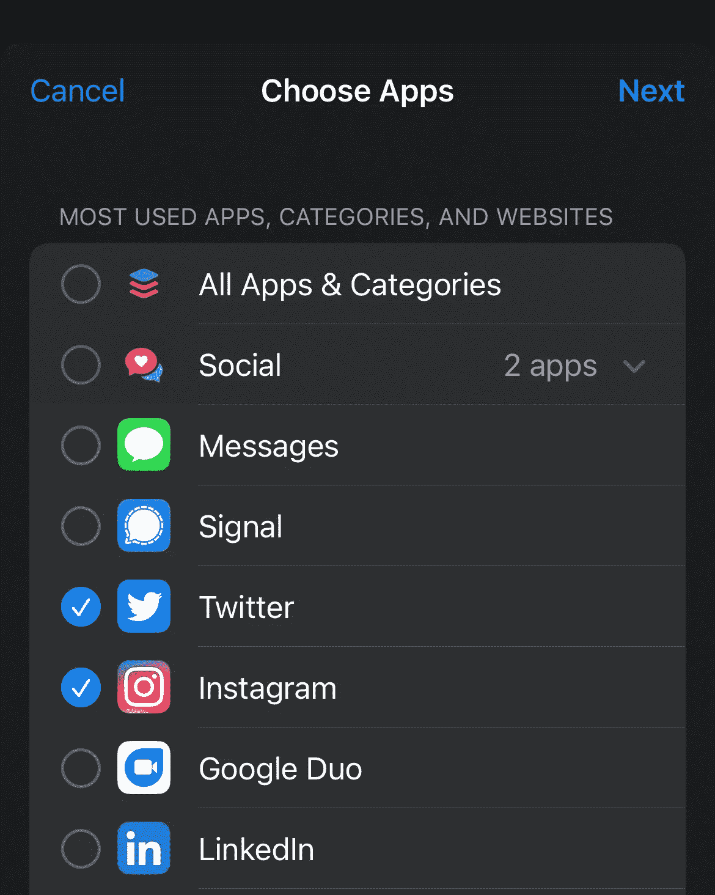

# 限制你在 iOS 上日常社交媒体消费的简单方法

> 原文：<https://levelup.gitconnected.com/a-simple-way-to-limit-your-daily-social-media-consumption-on-ios-a5aa3627d3e9>

这是一种简单易行的方法，可以限制你在 iOS 上的社交媒体消费(或任何你发现自己放弃了太多时间的应用/游戏)，而不必使用聚焦模式，这往往超出了你的需要。虽然这仍然需要一些自律，但使用 iOS 功能来限制你在某些应用上花费的时间将有助于训练你谨慎使用它们。您可以选择限制“所有社交”等应用的类型，或者选择在指定时间后想要静音的特定应用。

如何在 iOS 中设置每日应用使用的时间限制:

1.  转到**设置>屏幕时间**

2.转到**应用限制**

3.启用**应用程序限制**，然后选择**添加限制** (您可以在示例中看到，如果您想要调整应用程序的时间限制，您可以管理您选择的应用程序)

选择要限制的应用程序后，您可以选择单独的时间上限。

一旦你达到了每日限额…瞧！你可以通过点击“忽略”来超越这个限制，但至少你会意识到你已经在这个应用上花了至少 X 的时间。限制截距至少会让你停下来，考虑坚持你的目标，限制你在生活中太普遍的应用程序上的时间。

感谢您的阅读！如果你喜欢这个，你可能也会喜欢我从 Setapp 中发现的一些有用的应用。

 [## Setapp 的五款“日常使用”Mac 应用

### 我要给大家省去一篇过于冗长的文章来解释为什么这些应用程序都很棒的麻烦。相反，我是…

ryanhouk.medium.com](https://ryanhouk.medium.com/five-daily-use-mac-apps-from-setapp-2322b2792261)