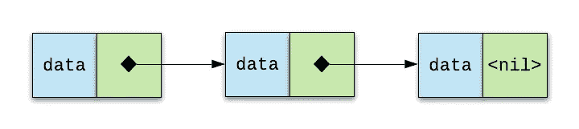
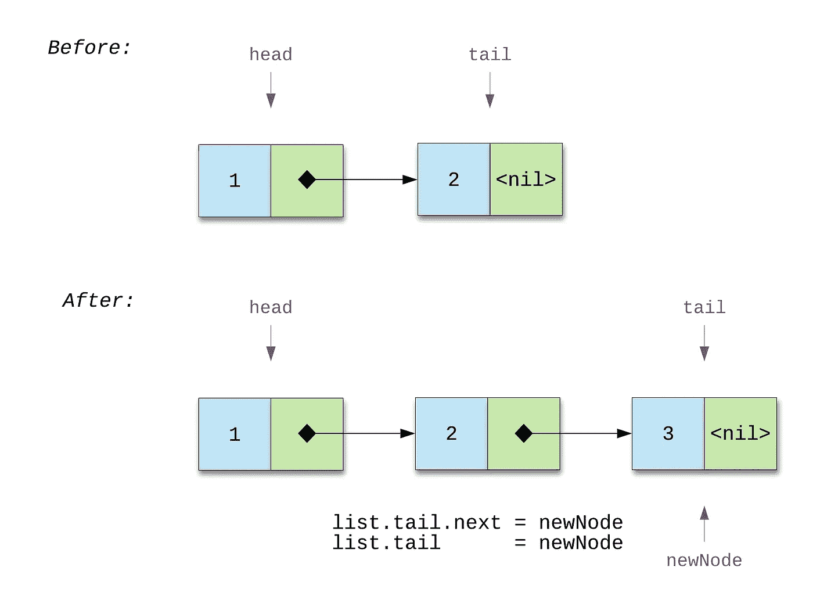
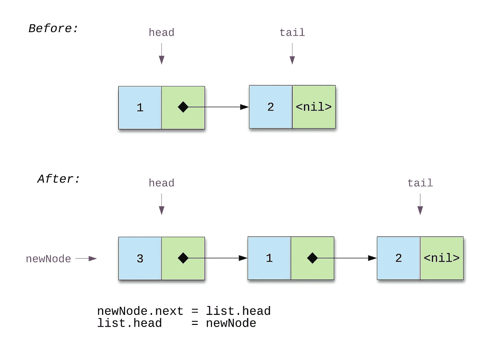
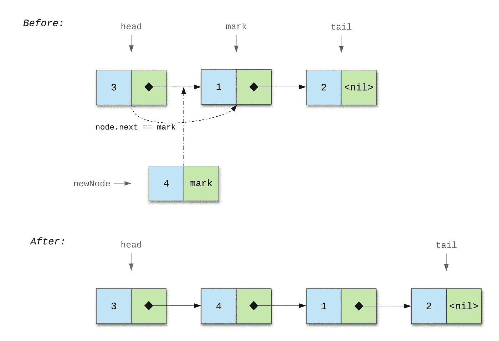
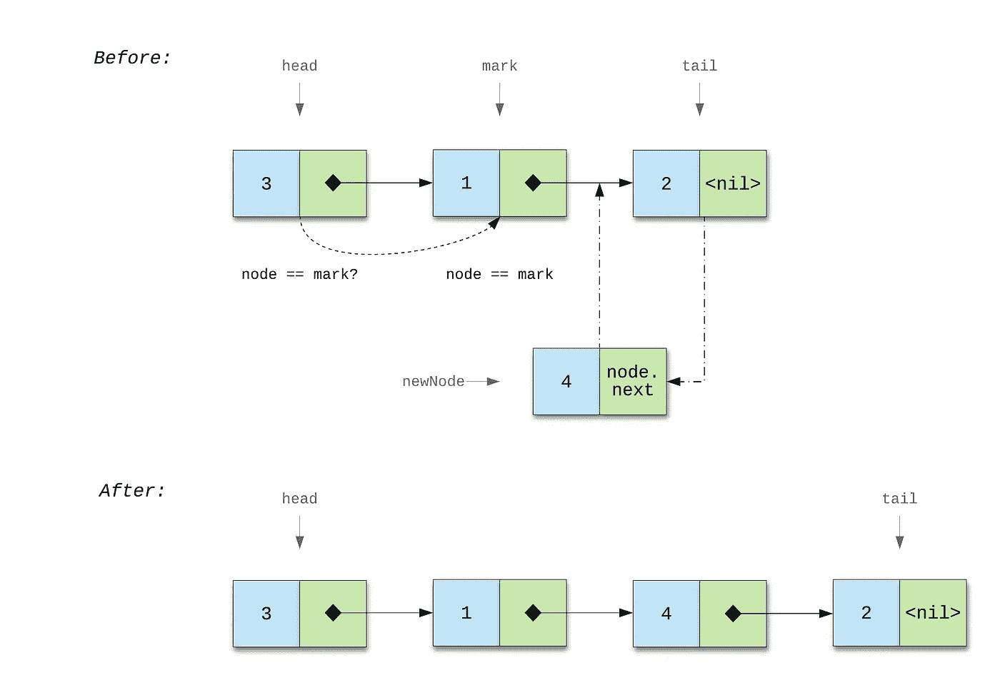
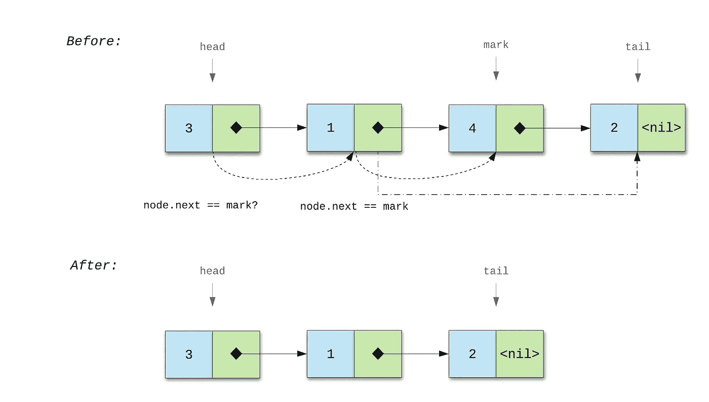

# 新地鼠的链表教程

> 原文：<https://levelup.gitconnected.com/a-singly-linked-list-tutorial-for-new-go-programmers-921445c270e3>

## 本文讨论了线性链表的概念及其在 Go 中的实现。

# 什么是单链表

单链表是一种线性的、动态的数据结构，其中每个元素都是一个独立的对象。它们一起代表一个序列。节点的基本形式是数据和指向下一个节点的指针。

图一。单向链表

第一个节点叫做*头*，最后一个节点叫做*尾*。 *Head* 给出了对整个链表的访问， *tail* 给出了对最后一个节点的访问。最后一个节点的下一个字段是 *nil* ，表示链表的结束。

**优点:**

*   链表的大小是动态的，这意味着它们可以根据需要增长和收缩。
*   链表具有高效的内存利用率。您不需要在声明期间指定元素的数量。当您需要插入一个节点时分配内存，当删除一个节点时释放内存。

**缺点:**

*   因为有一个指针存储地址，所以链表会占用更多的空间。
*   由于遍历，搜索节点可能很耗时。我们不能随机访问一个索引为 N 的节点，相反，我们迭代链表来找到这个节点。

# 链表类型

在编写代码之前，我们需要声明两种数据类型:

*   一个*列表*类型将封装所有与指针相关的复杂性。*列表*类型由指向第一个节点的头和指向最后一个节点的尾组成。

*   一个*节点*类型是一个具有*数据*字段和对同一类型节点的引用的结构。数据有一个类型接口{}，所以我们可以在链表中插入任何类型的值。下一个字段是指向下一个节点的指针。由于一个节点包含一个指向同类型节点的指针，所以这个节点叫做*自引用*。

# 链表方法

本节讨论链表(或 *list* )方法的实现及其图例。

在这些代码示例中，我们使用了一个*标记*节点，它与*节点*类型具有相同的结构。*标记*是一个特定的节点，在我们插入一个新的节点之前/之后，或者我们需要删除，或者我们使用得到的前一个节点。

我们不按数据字段比较节点，因为不清楚节点有什么类型的数据。例如字符串、整数、浮点等。所以，我们只比较节点。

## 列表。InsertLast(数值数据)*节点

此方法在列表末尾插入一个新节点，并返回插入的节点。

在插入节点之前，我们需要考虑两种情况:

*   列表是空的，
*   列表非空。

在第一种情况下，我们使用 **list.head == nil** 进行检查。我们在列表中插入一个新的节点作为头和尾(列表中只有一个节点)。

第二种情况如图 2 所示。这里我们有一个由几个节点组成的列表:1→ 2→ *nil* 。新的节点是**节点{数据:3，下一个:零}** 。因为我们可以访问尾部，所以不需要遍历列表。我们在 **list.tail.next** 中插入新节点，并用新节点 **list.tail = newNode** 替换旧节点。

图 2\. InsertLast()方法

## 列表。InsertFront(数值数据)*节点

此方法在列表的开头插入一个新节点，并返回插入的节点。

这里，我们检查与 InsertLast()方法中相同的情况。

如果一个列表是空的，我们创建一个头和一个尾。我们将代码为 **list.head = newNode** 和 **list.tail = newNode** 的新节点分别分配给头部和尾部。

在图片#3 中，我们在非空列表中插入**节点{data:3，next:nil}** 。为了将 *newNode* 连接到列表中的第一个节点，我们使用 **newNode.next = list.head** ，因为当前的头是 **Node{data:1，next: next node}** ，然后用 **list.head = newNode** 更改列表中的头。

图 3\. InsertFront()方法

## 列表。InsertBefore(数值数据，标记*节点)*节点

该方法在列表中的*标记*之前插入一个新节点，并返回插入的节点。

第一步是检查那个**标记！=零**。如果*标志*为 *nil* ，该方法停止执行，因为我们不能在链表中插入一个 *nil* 节点。Nil 节点既不包含数据也不包含到下一个节点的链接。

然后我们检查头部是否等于*标记*。如果相等，我们将当前头分配给*新节点*并返回*新节点*。如果不相等，我们遍历列表找到**节点。**

在下图中，我们展示了如何在一个完整的列表中找到*标记*，这个列表有一个头、一个中间节点和一个尾。这里我们有一个列表 3→ 1→ 2→ *零*。我们需要在*标记*之前插入**节点{data:4，next: mark}** 。*标记*为**节点{data:1，next: next node}** 。从头开始，我们迭代列表并检查条件 **node.next == mark** 。如果为真，我们用下面的语句 **node.next = newNode** 将 *newNode* 赋值给 **node.next** 。因此，新节点现在位于*标记*之前。

如果该方法返回 *nil* ，则*标记*在列表中不存在。

图 4\. InsertBefore()方法

## 列表。InsertAfter(数值数据，标记*节点)*节点

该方法在列表中的*标记*后插入一个新节点，并返回插入的节点。

检查*标记*等于 InsertBefore()方法。

如果*标记*不是*零*，我们迭代列表找到等于*标记*的节点。在图片 5 中，你可以看到该方法是如何工作的。最初，我们有一个包含几个节点 3 → 1 → 2→ *nil* 的列表。如果我们需要在*标记*之后插入 *newNode* ，我们将遍历列表并搜索 **node == mark。**如果找到，我们将*新节点*分配给**节点。下一个**。所以，现在 *newNode* 跟着 *mark* 走。

如果没有找到*标记*，则*标记*在列表中不存在。

图 5\. InsertAfter()方法

还有，*标记*可以等于尾部。在这种情况下，我们只要用下面的表达式 **list.tail = newNode** 将 *newNode* 赋给尾部即可。

InsertBefore()和 InsertAfter()方法都不检查 **head == nil** ，因为假定列表必须为非空才能在现有节点之前或/和之后插入新节点。

## 节点。下一个()*节点

此方法返回下一个节点。

因为我们有一个到下一个节点的链接，我们可以用 **return node.next** 代码返回这个节点。该方法的接收者是一个节点，而不是一个列表。

## 列表。前一个(标记*节点)*节点

该方法返回*标记*之前的节点。

在线性链表中，我们不能访问前一个节点。在这种情况下，我们遍历列表并将 **node.next** 与*标记*进行比较。如果它们相等，我们返回当前节点。如果不相等，*标记*不存在。

## 列表。删除(标记*节点)错误

该方法从列表中删除*标记*。

在删除*标记*之前，有两种情况需要检查:

*   mark 可以是 head，
*   马克可以在头后。

使用以下表达式检查第一种情况:

换句话说，如果第一个节点等于*标记*，我们将下一个节点(在第一个节点之后)分配给头部。并且如果在这种情况下*标记*也等于 tail(当列表中有一个节点时会发生这种情况)，那么 **list.tail == nil** 。

第二种情况用下面的语句检查:

在图片#6 中，你可以看到我们如何实现前面的 *if* 条件。

图 6\. Delete()方法

我们有一个由几个节点 3→ 1→ 4→ 2→ *nil* 组成的列表。*标记*为**节点{data:4，next: next node}** 。在第二次迭代中，我们得到了 **node.next == mark** 。然后，该迭代中的当前节点连接到**标记。下一个**。因此，*标记*从列表中删除。

在这种情况下，我们检查最后一个节点是否也等于*标记*。如果*为真*，我们改变 **list.tail = node** 。

如果*标记*不存在，该方法返回错误。

## 列表。Size() int

这个方法返回列表的大小。

如果 **head == nil** ，我们返回 0。如果列表非空，我们遍历它并增加大小变量，直到列表结束。

# 开源代码库

带测试的源代码你可以在这里看到。