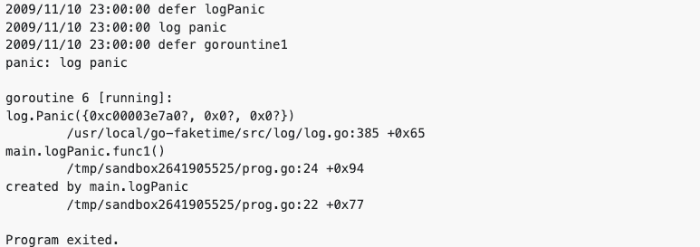
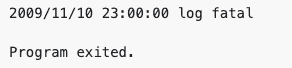
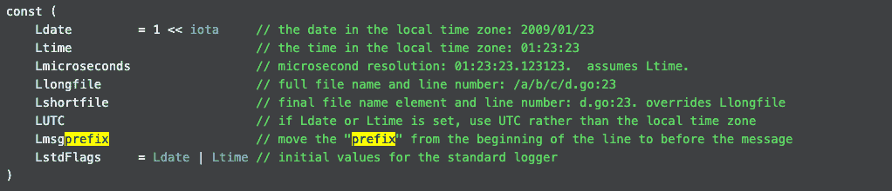
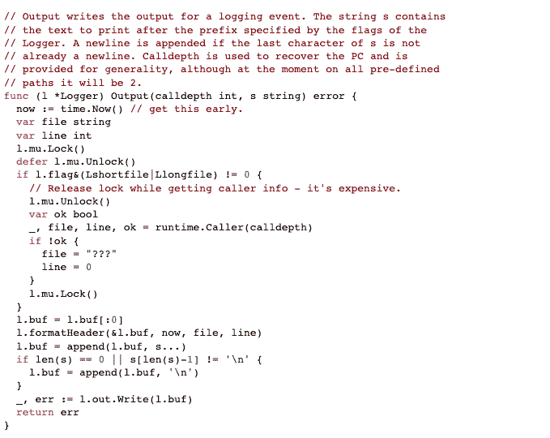
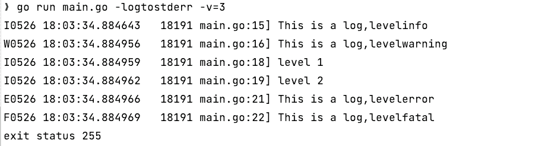
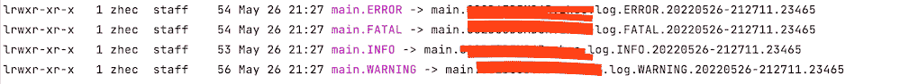
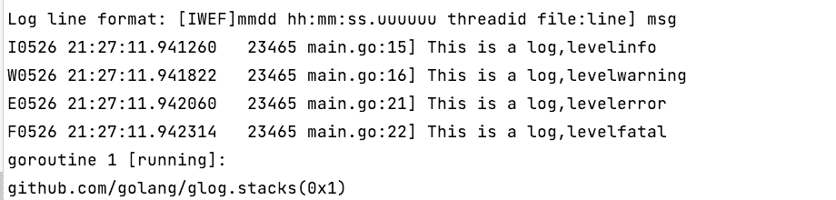
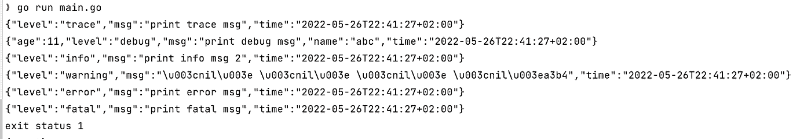
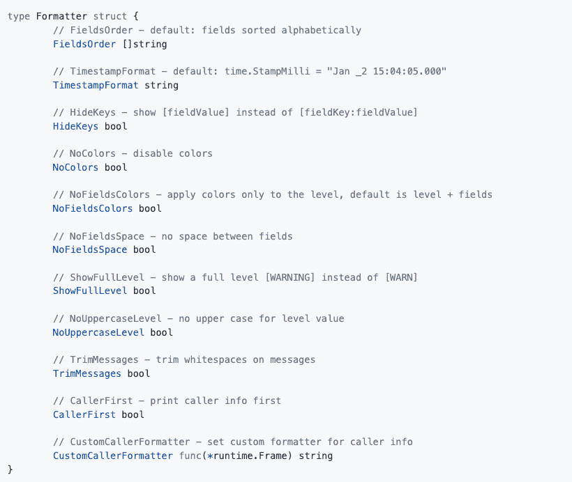
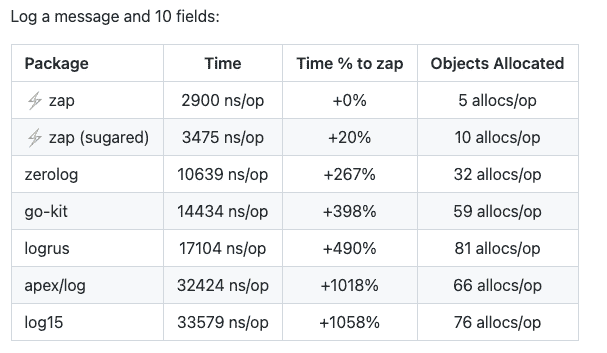

# 一口围棋日志

> 原文：<https://levelup.gitconnected.com/a-sip-of-go-log-94b968071ed8>

## 揭示关于 Go log 包和流行的开源选择的细节

> 记录很重要。
> 伐木很辛苦。
> —来自戴夫·陈西


来自 unsplash，[@ hope _ house _ press _ leather _ diary _ studio](https://unsplash.com/photos/PJzc7LOt2Ig)

日志记录在任何代码中都是不可或缺的，我们在调试和统计中都需要它的支持。然而，一个填充了打印各种消息的`fmt.Println/fmt.Printf`的包永远不能被认为是一个可被读取的包，它可以通过一个简单的改变来优化，使用 Golang 的原生[日志包](https://pkg.go.dev/log)来将信息打印到标准输出或一个文件。

那么，如何应用日志包呢？有什么限制吗？如果有，可以寻求开源包吗？让我们一起来寻找答案。

# 戈朗日志

```
package main

import "log"

func main() {
   log.Println("Log println") *// Fatalln, Panicln* log.Print("Log print")     *// Fatal, Panic* str := "Log Printf"
   log.Printf("%s", str) *// Fatalf, Panicf* }
```

该代码基本涵盖了所有的日志打印用法，对应于`fmt`使用模式，包括`Print/Fatal/Panic`、`Printf/Fatalf/Panicf,`、`Println/Fatalln/Panicln`9 种方法。

组`Fatal`和`Panic`在完成打印后是不同的。

*   `Fatal`调用`os.Exist(1)`退出。
*   `Panic`调用`panic`方法退出。

所以最核心的区别就是`defer`函数是否被调用:`Panic`会逐层返回，在每一层调用`defer`函数；而，`os.Exist`直接退出。

`log.Panic`会在上述情况下触发`defer`函数的调用。



但是使用`logFatal`方法时，只显示一行日志，没有堆栈跟踪。[此处测试](https://go.dev/play/p/6bOb5ABtbA2)。



## 用户化

*   设置前缀。

> func(l *[Logger](https://pkg.go.dev/log#Logger)SetPrefix(前缀[字符串](https://pkg.go.dev/builtin#string))
> 
> SetPrefix 设置记录器的输出前缀。

这是在启动一个方法时添加一些需要的一般信息的常用方法，比如添加方法名、参数等。

*   SetFlags

> func (l * [记录器](https://pkg.go.dev/log#Logger) ) SetFlags(flag [int](https://pkg.go.dev/builtin#int) )
> 
> SetFlags 设置记录器的输出标志。标志位为 Ldate、Ltime 等。

`log`软件包提供以下可配置标志。



常见的应用有:

`log.SetFlags(log.Ldate|log.Lshortfile)`，输出日期+行号；

`log.SetFlags(log.Ldate|log.Ltime |log.LUTC)`，输出日期+ UTC 时间；

`log.SetFlags(log.LstdFlags)`，输出日期+时间，等于`log.Ldate`和`log.Ltime`的总和。

*   设置输出

> 功能设置输出(带 [io](https://pkg.go.dev/io) )。[作家](https://pkg.go.dev/io#Writer)
> 
> SetOutput 为标准记录器设置输出目的地。

它可用于将日志重定向到文件。

```
file, err := os.OpenFile("logs.txt", os.O_APPEND|os.O_CREATE|os.O_WRONLY, 0666)
if err != nil {
  log.Fatal(err)
}
log.SetOutput(file)
```

## 内部日志

现在来看日志实现。`log`库定义了一个默认的`Logger` `[std](https://cs.opensource.google/go/go/+/refs/tags/go1.18.2:src/log/log.go;l=87)`，标准日志，当我们直接调用日志库的方法时，会在内部调用其对应的方法。

而`[Output](https://cs.opensource.google/go/go/+/refs/tags/go1.18.2:src/log/log.go;l=172)`功能就在 Logger 的内核中。



正如所见，日志是线程安全的，因为在整个过程中，除了在获取`Caller`信息时释放锁之外，它都处于互斥锁的保护之下。

`buf`的部分是我们可以借鉴的，它通过日志中定义的`[]byte`组装日志，然后写入 writer，从而减少 io。

## 缺点

我们不喜欢谈论缺点，但我们必须这样做。

*   不平整-原木支持。[让我们来谈谈日志|戴夫·切尼](https://dave.cheney.net/2015/11/05/lets-talk-about-logging)指出这是`log`一揽子计划的最大缺点。

即`Info`、`Error`、`Debug`等分级日志的信息无法打印，导致所有日志都输出到同一个地方，不利于后续的日志分析和监控。

*   对格式的支持不足。在我们既需要文本格式的日志，又需要`key=value`格式的 JSON 日志来进行未来的日志分析和统计的场景中，这并不友好。

# 开源日志包

`log`包在大多数情况下已经足够了，但是在那些复杂的系统中，它的局限性是显而易见的。因此，我们应该求助于各种开源日志包，其中一些我想带您浏览一下。

## 格洛格

[glog](https://github.com/golang/glog/blob/master/glog.go) 最初是 Google 内部使用的 go log 框架。它最大的特点是分级——原木支撑，四级分别是`Info`、`Warning`、`Error`、`Fatal`。

```
func main() {
   flag.Parse()
   defer glog.Flush()
   glog.Info("This is a log,", "level", "info")
   glog.Warning("This is a log,", "level", "warning")
   glog.Error("This is a log,", "level", "error")
   glog.Fatal("This is a log,", "level", "fatal")
}
```

同时，`glog`还支持`Infof`等格式化输出，以及`Infoln`等换行符输出。

`glog`的独特之处在于`V`设置和过滤调试级日志，这极大地方便了大型系统的开发。在它之前，我没有看到类似的实现。

```
glog.V(1).Infoln("level 1")glog.V(2).Infoln("level 2")
```

`// -v=0 // Enable V-leveled logging at the specified level`，V 的默认值为`0`。

通过将这两行添加到上面的示例中，我们可以看到下面的输出。



如果`-v =1`被传入，则`level 2`行将不会显示。

此外，`glog`还支持根据级别将日志写入多级。运行`go run main.go -log_dir=.`在本地生成多个日志文件。



日志内容向上兼容:`main.INFO`包含`ERROR`、`WARNING`和`FATAL`级别的日志，而`main.FATAL`只有`FATAL`级别的日志。



此外，一旦日志文件大小超过 [Maxsize](https://github.com/golang/glog/blob/9ef845f417d839250ceabbc25c1b26101e772dd7/glog.go#L815) ，`glog`会自动[创建](https://github.com/golang/glog/blob/9ef845f417d839250ceabbc25c1b26101e772dd7/glog.go#L835)一个新的日志文件。

```
func (sb *syncBuffer) Write(p []byte) (n int, err error) {
   if sb.nbytes+uint64(len(p)) >= MaxSize {
      if err := sb.rotateFile(time.Now()); err != nil {
         sb.logger.exit(err)
      }
   }
   *//...* }

*// rotateFile closes the syncBuffer's file and starts a new one.* func (sb *syncBuffer) rotateFile(now time.Time) error {
   *// ...* sb.file, _, err = create(severityName[sb.sev], now)
   sb.nbytes = 0
   if err != nil {
      return err
   }
   *// ...* }
```

`glog`可以看作是原生日志的升级版，它们有一个共同的特点:**开发人员需要将每个字段传入类似** `**Printf/Errorf/Fatalf**` **这样的 API 中，形成一个非结构化的日志，有助于搜索和分析，但无助于机器排序和收集度量。**

## logrus

`logrus`是另一个最火的日志框架，其 [github 页面](https://github.com/sirupsen/logrus)上有 20.5k 的明星和 90k 的用户。它能够直接输出`key=value`格式的 JSON 日志，这使它有别于`glog`。当然，它也支持文本格式。

`logrus`支持`Trace`、`Debug`、`Info`、`Warn`、`Error`、`Fatal`、`Panic`七级调试日志，但不支持`V`级调试日志。

对于日志打印，`logrus`不仅支持常规的`Info`、`Infof`、`Infoln`三种方式，还支持`LogFunction func() []interface{}`，提高了效率。对于大消息，它只在级别匹配时生成日志；否则，跳过。

`WithFields`函数可以将日志打印的参数作为单独的键和值传入，以便进一步分析。

`logrus.SetFormatter(&logrus.JSONFormatter{})`启用 JSON 格式日志的打印。

取消上述代码的注释并重新运行它，您将得到下面的 JSON 日志。



除了默认的`TextFormatter`和`JSONFormatter`，还支持可以插入第三方的`Formatters`，比如[nested-logrus-formatter](https://github.com/antonfisher/nested-logrus-formatter)提供了一组额外的标志来控制输出格式。



使用`TimestampFormat: time.RFC3339`，您可以打印`2022–05–26T15:40:07+02:00`格式的日志。

使用日志钩子，我们可以设置钩子来响应我们感兴趣的日志级别，操作日志内容，添加和修改日志的特定键值参数等。可以试试那些第三方实现的`Loghook`，比如用 [logrus-redis-hook](https://github.com/rogierlommers/logrus-redis-hook) 把日志转发到 redis。

显然，`logrus`比上面列出的所有函数更具可伸缩性。但是它的日志级别设置并不像`glog’s` `V` log 那样简洁，以至于戴夫·切尼甚至认为“没人需要警告日志级别。”

## 活力

zap 最初是为优步内部使用而引入的，之后才被贡献给社区。与`glog`和`logrus`相比，它的最大目标是在提供结构化和分级日志时“更快”。

它提供了两种不同类型的记录器，`Logger`和`SugaredLogger`。

*   在具有高性能要求和内存限制的场景中使用`Logger`。与`SugaredLogger`相比，它的性能更快，内存分配更少，但是它只支持强类型结构化日志记录。
*   当性能要求较低时，使用`SugaredLogger`。它支持结构化和 printf 风格的日志记录，同时在内存开销和速度方面仍然胜过其他日志包。

下面展示其在 Github 上相对于其他框架的[优势](https://github.com/uber-go/zap#performance)。



zap logger 支持三种创建方式，`NewProduction`、`NewDevelopment`、`NewExample`，分别对应不同的输出格式。

*   `NewProduction`和`NewExample`支持 JSON 输出。
*   `NewDevelopment`支持文字。
*   `NewExample`可以打印各级日志，但不显示日期、文件、行号等。
*   `NewDevelopment`打印 warn 级别及以上的日志，结果包括日期、时间戳、文件、行号和一个 JSON 格式的参数列表(如果存在的话)。
*   `NewProduction`打印信息级别及以上的日志，显示日期、时间戳以及紧急和错误日志的跟踪堆栈信息。

`zap`还支持“写入文件”，但不支持日志旋转，只有像[伐木工](https://github.com/natefinch/lumberjack)这样的第三方日志程序才能实现。zap FAQ 提供了一个[答案](https://github.com/uber-go/zap/blob/master/FAQ.md#does-zap-support-log-rotation)。

# 包裹

日志在开发中起着重要的作用。何时记录日志以及遵循哪个框架是一件大事，最近的 Java log4j 进一步强化了这一信念。

Go native log 包提供了所需的大部分功能，但是使用那些第三方日志框架，如`logrus`、`glog`和`zap`，我们可以通过更好的日志体验实现更多功能。

本文只是日志包的一小部分，还有更多具有各种功能的日志包。如果有兴趣，可以尝试探索更多，比如研究 Kubernetes 控制器-运行时[日志包](https://github.com/kubernetes-sigs/controller-runtime/tree/master/pkg/log)或者定制自己的日志器。

感谢阅读！