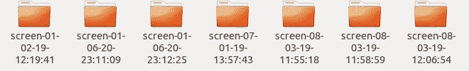

# 一个基于计算机视觉和 Python 图像库的小型 GUI 应用程序，使用 OpenCV 和 Tkinter

> 原文：<https://levelup.gitconnected.com/a-small-gui-application-based-on-computer-vision-and-python-imaging-libraries-using-opencv-e07b3f8c06c1>

最近，我们讨论了计算机视觉及其应用。安全系统已经成为计算机视觉的一个主要应用领域。它已经在基于人脸识别的智能锁系统等技术中得到应用，并被用于在用户不在时保护某些系统的安全。

在这篇文章中，我们将设计一个小的 GUI 应用程序来实现一个小规模的安全系统，以保证我们的系统安全，并在我们不在的时候监控它。我们将为我们的目的实现面部和眼睛检测机制。人脸检测已经成为计算机视觉应用领域中一个非常热门的问题。因此，已经设计了几种现成的方法来处理这个问题。其中之一是使用哈尔级联。我们将实现这个方法。对于应用程序的开发，我们将使用 PILLOW 和 OpenCV 等 Python 库。

对于 GUI 部分，我们将使用 Python Tkinter 库。

在讨论应用程序之前，让我们先来探索一下 OpenCV 和 Haar Cascades。OpenCV 是一个计算机视觉和机器学习软件库，旨在为计算机视觉应用提供一个公共基础设施，并加速机器感知在商业产品中的使用。这是一个开源库，它的代码很容易获得，并且可以根据用途进行修改。现在，让我们把注意力集中在哈尔喀斯喀特。这将是我们要做的应用程序的核心。

使用基于 Haar 特征的级联分类器的目标检测是由 Paul Viola 和 Michael Jones 在 2001 年的论文“使用简单特征的增强级联的快速目标检测”中提出的一种有效的目标检测方法。这是一种基于机器学习的方法，其中在使用大量正面和负面图像对分类器进行训练之后，使用分类器来检测某些对象。正图像表示包含我们希望分类器分类的对象图像的图像，负图像表示不包含的图像。在我们的例子中，我们希望我们的分类器能够预测和检测人脸和眼睛。

哈尔级联被表示为分类器的级联。最终分类器是弱分类器的加权和。这些弱分类器不能单独对一幅图像进行分类，而是共同组成一个强分类器。我们知道，在卷积的情况下，核是在训练期间设计的，但这里它们有一组固定的哈尔特征或滤波器，应用于训练图像以从中提取特征。

这些不同大小的过滤器或内核在图像上通过，并从图像中提取大量用于对目标对象进行分类的特征。OpenCV 有一个训练器和一个探测器，可以使用哈尔级联。[此处的链接](https://github.com/opencv/opencv/tree/master/data/haarcascades)可用于下载包含所有哈尔瀑布的主分支。对于我们的应用程序，我们需要[Haar scade _ frontalcatface . XML](https://github.com/opencv/opencv/blob/master/data/haarcascades/haarcascade_frontalcatface.xml)和[Haar scade _ eye . XML](https://github.com/opencv/opencv/blob/master/data/haarcascades/haarcascade_eye.xml)Haar scade 文件。

## 我们的应用

现在，让我们跳到我们的应用程序。正如我们已经看到的，它是一种安全应用程序。比方说，你在办公室、图书馆或公共场所工作，你去了某个地方，让你的设备在短时间内无人看管，我说的设备是指笔记本电脑或台式机。现在，如果有人试图在你的设备上做一些改变，或者试图窥探你正在做的事情，你可能需要知道。这就是我们的应用程序的切入点。它旨在捕捉您不在时对您的设备进行的任何移动或更改。

现在，问题是它是如何工作的？好了，我们开始吧。它在一个计时器上工作，这个计时器是你在启动应用程序时设置的。比方说，我们将计时器设置为 10 秒。因此，该应用程序被设计为每 10 秒捕捉一张图像并检查一张脸。如果发现人脸，它会尝试寻找眼睛。这是因为侧面人脸经常被捕获和分类，但我们不想要这些。所以，在找到脸和眼睛之前，它会一直拒绝这个图像。如果它被发现，它开始点击屏幕截图，每次它检测到眼睛。如果截图反映了任何变化，它也开始保存截图。它在每个图像的角落提供时间细节以保持跟踪。它维护一个定时器文件，帮助它比较两个截图。您还可以集成一个警报系统，如果截图中有变化，该系统将使用 SMTP 实现或 python 中的消息服务通知所有者。这是我们的基本想法。这只是展示计算机视觉的这一方面如何在我们的日常生活中实现的一种方式。

让我们来看看所需的库。

可以运行这段代码来安装所需的库。我为 Ubuntu 创建了一个安装函数。也可以查看需求，单独安装。

现在，我们转到基本的图像库和 OpenCV 函数，它们用于为我们的应用程序检测人脸和屏幕截图的差异。

该功能用于读取图像并检查面部和眼睛的检测。“面孔”列表和“眼睛”列表存储有关检测到的面孔和眼睛的信息。因此，我们分别在第 15 行和第 25 行检查它们的长度，以检查是否有东西被检测到。如果不是，则返回的长度为零，因此该函数返回-1，即它未能检测到人脸或眼睛，否则它返回 1。

如果我们显示图像，这种检测到的图像将被显示

此功能用于捕捉屏幕截图，并记录截图的计时器和计数器，即截图拍摄的时间和指示一种索引的计数器。第 31 行到第 35 行致力于在截图中加入日期和时间戳。

如果我们聚焦在图像的右角，我们会看到时间标记。让我放大一下。

是的，我们可以看到时间戳。我们可以通过修改参数来改变文本的字体和位置。我们可以在第 51 行看到 compare_image 函数。这个函数用于比较两个截图，并决定是否发生了任何变化。

compare_images 函数使用两个不同的函数来确定两个图像是否相同。其中一个函数是均方误差。它是两幅图像之间像素差异的平方。另一个是 Sk-learn 影像库的结构相似度函数。所得的 **SSIM** 指数是一个介于-1 和 1 之间的十进制值，并且值 1 仅在两组相同的数据的情况下可达到，因此表示完美的结构相似性。0.9 的值是在反复试验的基础上设计的，因为该函数过于敏感，并且由于不同光源的干涉所引起的微小干扰而经常区分两幅图像。因此，如果两幅图像相似，它将返回 1 else -1。Inline 52 我们可以看到，如果返回值是-1，图像被保存，否则删除。

正如我们所看到的，我们的应用程序创建了名为“帧”的文件夹，用于存储入侵者面部的相机图像，还创建了相应的“屏幕”文件夹，用于存储截屏图像。每个文件夹都有日期和时间戳，以备记录。

这就是 screens 文件夹如何以索引的方式存储截图，我们可以看到所有的截图都是不同的。

现在，让我们转到 GUI 部分。

这段代码用于创建一个基本的启动窗口。我在这里创建了一个非常基本的 GUI。

这有一个注册选项，可以进入注册页面。

这是一个非常基本的使用 Tkinter 的注册框代码。在这里，我实现了后端 MySQL 插入和查询代码以及一些错误检查。它将检查电子邮件是错误的还是用户已经存在。我在这里用过 Xampp MySQL 服务器。

现在，我们将转到下一个屏幕，在设置定时器之前，启动 cam 选项将保持非活动状态，在设置定时器之后，它将变为活动状态。

上面的代码可以用来创建窗口。当我们启动 cam 时，test_capture.py 函数被调用，它用于运行我们的网络摄像头，并开始真正的后端工作。

有一件事需要注意。我使用 python 2.7 只是为了运行 Tkinter 代码，因为在 Python 3 中它显然有问题。没问题，但是我们可以使用 call()方法从 python 2 调用 python 3，反之亦然

这是我们的捕获功能，根据计时器启动网络摄像头并捕获图像帧。我们可以在第 48 行看到，使用了我们之前定义的 read_image 函数，如果它检测到面部和眼睛，则返回 1，因此，它使用内联的 take_screen()方法触发屏幕捕获方法 50。

停止摄像机后，我们被送到最后一个屏幕。显示框架和显示屏选项将分别引导我们到相应的文件夹。

这样，我们可以创建一个桌面快捷方式来启动应用程序。

## 结论

这就是我们如何使用 Opencv、Python 和图像库创建一个小规模的应用程序。

实际代码可在[这里](https://github.com/abr-98/security_cam)获得。