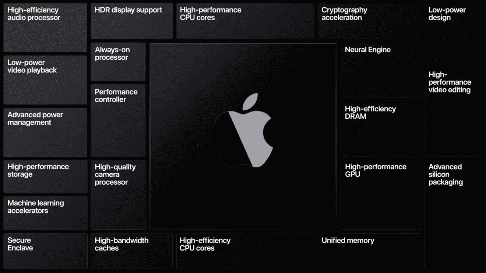
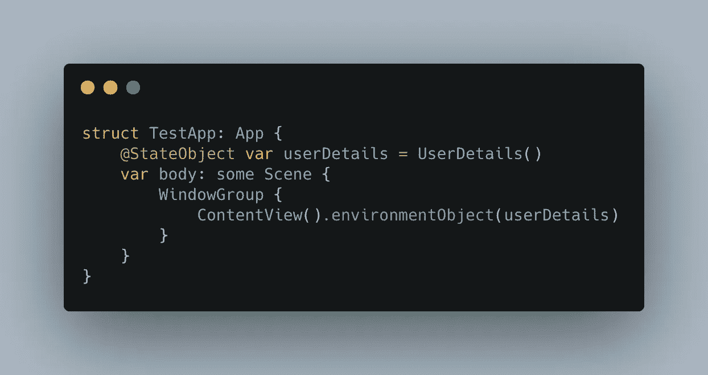
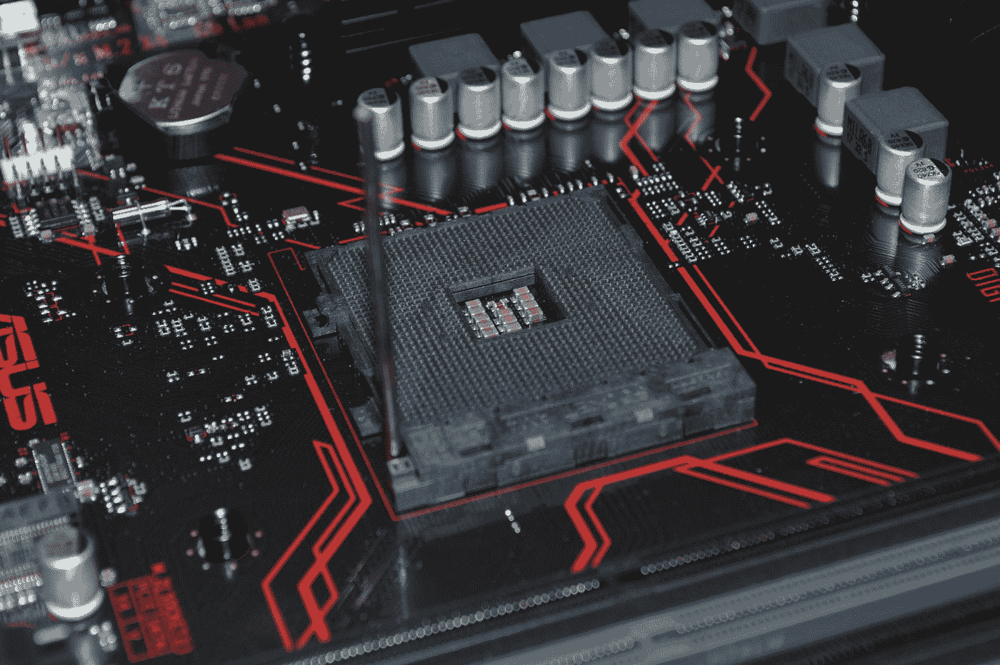
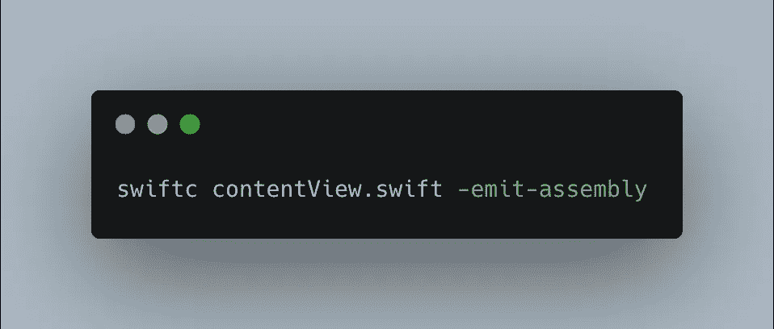
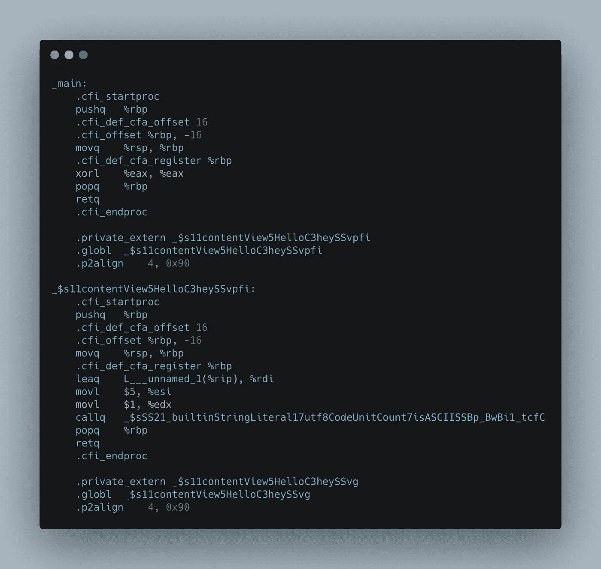
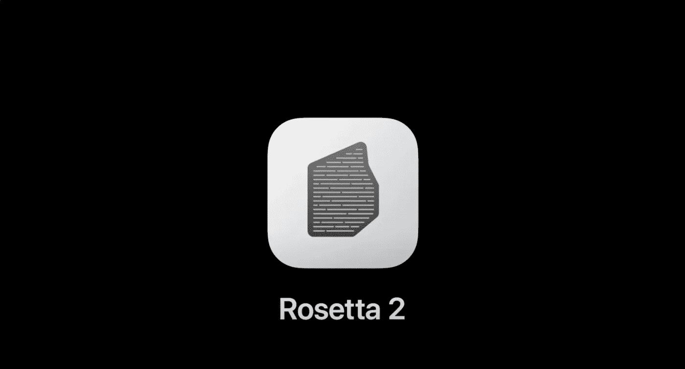
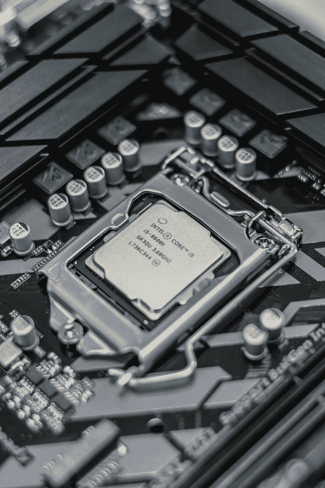

# 一名软件工程师解释了苹果为何转向自己的芯片

> 原文：<https://levelup.gitconnected.com/a-software-engineer-explains-why-apple-moving-to-its-own-silicon-acf1c141ebd9>

苹果芯片——它自己定制的片上系统

苹果的全球开发者大会于 6 月底开幕，为其所有设备带来了一系列软件变化。我们终于可以在 iPads 和 iPhones 的主屏幕上看到小工具了，macOS 也迎来了自 macOS Yosemite 以来最大的视觉更新。但是，最重要的宣布留到了主题演讲的最后，首席执行官蒂姆·库克宣布，在未来两年内，他们的 Mac 产品系列将从英特尔过渡到他们自己的苹果芯片。

我们来分解一下这是什么意思。

下面我来解释一下为什么苹果采取了这一举措，转向他们自己的芯片

作为一名获得了 4 年计算机科学学位的软件工程师，我想我应该试着解释一下这种变化到底意味着什么，以及为什么我认为苹果决定走这条路。

让我从解释软件构建时会发生什么开始。你手机上的每一个应用程序，你电脑上的网站或程序都有代码支持。这段代码准确地描述了屏幕上的一切是如何显示的，以及当你点击一个按钮或点击一个图像时会发生什么。即使当你使用 Wix 或 Squarespace 这样的工具来创建你的网站时，即使你不需要写任何代码，它们也在后台为你生成代码，因为这是网络浏览器显示网站所需要的。

用于生成应用程序的代码示例

而且，这些程序、网站或应用程序中的每一个都需要被你电脑中的硬件所理解。CPU 或处理器、显卡和内存都需要被告知要做什么，以便显示和运行您刚刚下载的应用程序。但是，这个硬件不能直接理解软件开发人员编写的代码。事实上，开发人员正在编写的代码通常与你的电脑或手机中的处理器运行程序的方式相去甚远。

电脑硬件——托马斯·詹森在 [Unsplash](https://unsplash.com?utm_source=medium&utm_medium=referral) 上拍摄的照片

最好的解释方式是通过一个比喻。想象一下，你需要 5 个基本的机器人来给你烤一个蛋糕。这些机器人只知道几个基本的单词——上下移动他们的手臂，握紧他们的手，然后松开他们的手。基本上，他们有烤蛋糕的运动技能，但他们不知道如何打开一包巧克力片，也不知道鸡蛋需要与面粉混合。

所以，你可以做的是花很多时间仔细地告诉他们过程中的每一步:

1.  抓住那包巧克力片
2.  举起你的手臂
3.  保持一只手臂不动
4.  向相反方向移动另一只手臂等。

但是，这个过程很繁琐，如果你必须在机器人开始烤蛋糕之前写下来并交给他们，并且你不能在他们烤蛋糕的时候修改它，你可能会发现他们会犯很多错误，因为你错过了一些步骤。

这与编程或编写程序是一样的。处理器就是机器人，处理器只能理解非常基本的命令——尽管它可以一次执行很多命令。所以，如果你想写一个简单的程序把两个数相乘，你需要指定大量的步骤来让它把两个数相乘，比如从内存中取出第一个数，从内存中取出第二个数，把两个数相乘，然后把乘积放回内存。这很繁琐，而且软件开发人员很容易出错。

所以，一些聪明人发明了编译编程语言的概念。这个想法是，你可以写一些代码，一个程序编译，或者把代码转换成处理器可以理解的更简单的命令。

编译 Swift 文件的命令

回到我们的机器人比喻，想法是你可以写一个蛋糕的食谱，有更多的一般步骤。例如，你可以写:将鸡蛋和面粉混合，然后倒入蛋糕盘中，而不是必须指定机器人需要采取的准确的身体动作。然后，编译器会接受这些指令，它知道将鸡蛋和面粉混合需要手臂的某些动作以及手的开合，并将你的食谱转换成更加具体的命令。

现在，我解释什么是编译器以及代码如何转换成处理器可以理解的命令的原因是，这是目前制造的英特尔 MAC 和新的苹果硅 MAC 之间的根本区别。

如果开发人员要为 iPhone 或 Mac 开发一个新的应用程序，他们会用一种叫做 Swift 的编程语言来编写。这使得开发人员可以指定按钮在屏幕上的位置，以及当您单击这些按钮时会发生什么。例如，在 Mac 和 iPhone 上的计算器应用程序中，Swift 被用来在屏幕上显示数字，在顶部显示文本输入。Swift 代码描述了当输入一个数字，单击加号按钮，输入另一个数字，然后单击等号按钮时应该发生的情况。

MacOS 上的计算器应用程序

但是，开发者仅仅写代码是不够的——他们如何将应用提供给你？当你从 app store 下载一个新应用时，你不知道也不关心代码是什么——你想使用这个应用。我们如何将代码转换成你可以实际使用的东西？嗯，我们需要把它从 Swift 代码编译成你的计算机硬件能理解的东西。

但是，MAC 和 iOS 设备使用完全不同的硬件。你的 Mac 使用英特尔的 CPU，而你的 iPhone 或 iPad 使用苹果定制设计的基于 ARM 架构的 CPU。不要太担心名字，只需要知道 MAC 和其他 iOS 设备的硬件有很大的不同。

因为这个硬件不一样，CPU 理解的命令也不一样。回到我的机器人例子，考虑英特尔机器人和手臂机器人理解不同的命令。英特尔机器人可能理解张开和合拢他们的手，但手臂机器人只理解命令，如将肩膀上的电机旋转 30 度。我们的手臂机器人理解的命令甚至比给我们的英特尔机器人的命令更基本。

我们的蛋糕制作机器人——照片由[摇滚猴子](https://unsplash.com/@rocknrollmonkey?utm_source=medium&utm_medium=referral)在 [Unsplash](https://unsplash.com?utm_source=medium&utm_medium=referral) 上拍摄

所以，当我写好 Swift 代码后，我希望它能在我的 Mac 和手机上运行。但是，我的 Mac 中的英特尔 CPU 和我的 iPhone 中的定制苹果芯片都理解不同类型的命令。我手机中的苹果芯片理解的命令比我 Mac 中的英特尔 CPU 理解的命令简单得多，而且这些命令彼此之间根本不兼容。

幸运的是，我们没有直接编写命令——我们正在编写更通用的 Swift 代码。我们有一个编译器。作为软件开发人员，我们不关心让我们的软件运行需要什么 CPU 级别的命令，我们只知道当我们单击某个按钮时，我们希望发生一些事情。

进入编译器。一旦我编写了 Swift 代码，描述了在我点击计算器应用程序中的等号按钮后，我想要将两个数字加在一起，我需要编译我的应用程序，这样我们就可以实际使用它了。

选择我们希望应用运行的平台

因此，目前，在我编写完计算器应用程序后，我想在我的 Mac 和手机上运行它，我选择这两个设备作为“目标”，或者我想在其上运行我的应用程序的平台，然后我点击编译。Swift 编译器生成两个文件。一个文件有英特尔 CPU 能理解的特定命令，另一个文件是苹果芯片或 ARM 能理解的。然后，我可以运行它为英特尔 CPU 生成的文件，以便在我的 Mac 上使用计算器，我也可以运行它为苹果芯片生成的文件，以便在我的 iPhone 或 iPad 上使用计算器。

在我们的计算机硬件看来，我们编译的代码是什么样的

这是目前一些应用程序的构建方式。例如，你会注意到，与 Mac 相比，iPad 上的许多默认应用程序，如计算器、新闻、股票或提醒，看起来非常相似。这是因为它们共享相同的 Swift 代码，尽管运行在不同类型的 CPU 上。

苹果电脑上的新闻应用

iOS 上的新闻应用。请注意，它看起来非常类似于 Mac 应用程序。

但现在，苹果公司宣布 MAC 电脑正在转向苹果硅——或目前在你的 iPhone，iPad，Apple Watch，Apple TV 甚至 HomePod 中发现的相同类型的 CPU，并从英特尔转移。对于现在用 Swift 编写的应用程序来说，这实际上是一个非常容易的改变。开发者需要做的只是打开 XCode，这是苹果公司提供的制作应用程序的软件，然后勾选一个复选框，表示他们希望为运行苹果芯片的 MAC 电脑编译该应用程序。这将创建该应用程序的两个独立的机器代码版本，当用户运行该应用程序时，他们的计算机将根据运行它的 Mac 类型来决定是运行英特尔版本还是苹果硅版本。

对于一些没有维护或尚未让开发人员勾选复选框的应用程序，苹果将提供一款名为 Rosetta 2 的软件，该软件允许为英特尔 CPU 开发的软件在苹果芯片上运行。本质上，这是将所有为英特尔 CPU 设计的机器代码转换成苹果芯片可以理解的机器代码。

因此，在为苹果芯片编译现有应用的便利性和允许为英特尔 CPU 开发的软件在苹果芯片上运行的 Rosetta 2 仿真软件之间，大多数应用将能够在采用苹果芯片的新 MAC 上运行。

Rosetta 2 模拟器将允许旧的编译应用在苹果芯片上运行

然而，值得注意的是，有几个应用程序无法与苹果芯片兼容。一般来说，Mac 的应用程序是用 Swift 或者更老的 Objective-C 编程语言编写的。然而，有许多应用程序不是用这些语言编写的，因此不能使用 XCode 简单地将它们编译成苹果硅机器码。这就是 Rosetta 2 的用武之地，因为它可以将 Intel 机器代码转换成 Apple Silicon 机器代码。但是，在一些情况下，Rosetta 2 无法将英特尔机器代码转换为苹果芯片。

这些应用程序直接与内核交互，内核是计算机中直接与硬件打交道的部分。这类应用可能包括鼠标或钢琴键盘等 USB 设备的软件。

一些硬件设备不能直接与苹果芯片一起工作——照片由 [Unsplash](https://unsplash.com?utm_source=medium&utm_medium=referral) 上的 [Tamas Pap](https://unsplash.com/@tamasp?utm_source=medium&utm_medium=referral) 拍摄

另一类无法转换的应用是虚拟化为英特尔 CPU 设计的操作系统的应用。这包括类似 Parallels 和其他虚拟机软件的应用程序。因此，Windows 作为一个为英特尔 CPU 设计的操作系统，将无法作为虚拟机在 Mac 上作为应用程序运行。不幸的是，这一完全相同的限制也将阻止 Boot Camp 未来在苹果硅 MAC 上工作。唯一的解决办法是，如果微软推出一个基于 ARM 处理器的 Windows 版本，就像新的苹果硅 Macs 一样。

目前的 Windows 10 将无法在苹果的苹果电脑上运行——图片由 [Unsplash](https://unsplash.com?utm_source=medium&utm_medium=referral) 上的 [Panos Sakalakis](https://unsplash.com/@meymigrou?utm_source=medium&utm_medium=referral) 拍摄

## 那么，我认为苹果为什么要做出这样的改变呢？

主要的根本区别在于给 CPU 的指令。就像我之前解释的机器人一样，与基于英特尔的 CPU 相比，基于 ARM 的架构需要更简单的命令。实际上，还有另一个复杂的缩写来解释这一点。基于 ARM 的 CPU 运行所谓的精简指令集架构，或 RISC。这与英特尔 CPU 运行的复杂指令计算机体系结构形成对比。顾名思义，ARM CPUs 运行更简单的命令，如 robots 示例中所述，而 Intel CPUs 执行更复杂的命令。

英特尔 CPU——照片由[亚历山大鲁-波格丹一世·吉塔](https://unsplash.com/@bogzilla?utm_source=medium&utm_medium=referral)在 [Unsplash](https://unsplash.com?utm_source=medium&utm_medium=referral) 上拍摄

这意味着使用 RISC 的 ARM CPUs 需要更多的机器代码来运行相同的程序。因为 CISC 有更复杂的命令，一个命令可以做多项工作，而在 RISC 中这些工作通常会被分成几个命令。这意味着 ARM CPU 不必承担如此复杂的任务，因此可以优化它来做好简单的任务。

另一方面，CISC 架构的 CPU，如英特尔构建的 CPU，在 CPU 内承担更多的责任，这使它能够使用更少的代码行。但是，因为自从第一个微处理器制造出来后，计算机的内存变得更便宜了，使用 RISC 的更多代码不再像以前那样是一个大问题——它使 CPU 能够更好地完成给定的任务。

我认为苹果做出这一改变的第二个原因是利用其片上系统设计，或者你可能听说过的 SOC。英特尔的 CPU 通常有两个主要职责。第一个是处理，第二个是板载显卡——本质上是 CPU 中的一个微型显卡，用于支持视频输出，而无需计算机中单独的硬件来实现这一功能。

苹果芯片上的单任务模块阵列

另一方面，苹果的芯片有许多内置在处理器中的模块。有些你可能听说过，包括安全飞地，这是他们存储敏感信息的地方，如你的指纹或 Face ID 的面部结构，以及神经引擎，旨在加快机器学习和人工智能任务。这些模块是专门为这些任务设计的，而不仅仅是一个通用处理器。其他你可能没有听说过的模块包括音频处理、电源管理、视频播放和相机图像处理。基本上，这些是处理器上有特定焦点的微小部件，使它们能够非常非常擅长这些任务。

在苹果基于英特尔的 MAC 电脑上，其中一些功能已经成为独立的组件——例如，Secure Enclave 支持带有指纹读取器的 MAC 电脑。但在大多数情况下，大多数任务发生在英特尔 CPU 内的通用处理器中。通过将苹果设计的定制片上系统引入 Mac，Mac 将能够利用所有这些模块，这可能有助于实现更高级的图形，提高机器学习任务的速度，甚至可能将 iPhone 的一些伟大的相机图像处理引入 Mac。

我认为苹果做出这种改变的最后一个原因是热量和电力。苹果芯片在物理上比英特尔的同类产品小得多，尽管承担了上述所有额外的责任。此外，它们每瓦特用电量的输出性能要高得多。这不仅意味着我们可以使用更少的瓦特获得更长的电池寿命，而且在苹果芯片上完成同样的任务比在英特尔 CPU 上完成同样的任务产生的热量更少。我们从一台计算机硬件中获得的最高性能完全取决于在它变得过热之前我们可以完成多少任务。当您的计算机变慢时，这是因为您的计算机限制了处理器可以执行的任务数量，因为它太热了，任何更多的热量都会导致处理器损坏。因此，如果一项任务需要更少的功率，它就会变得不那么热，我们可以进一步推动 CPU，获得额外的性能。

iPads 没有任何风扇，也没有主动冷却，但它们的性能即使不比主动冷却的苹果电脑更好，也仍然很好——照片由[熊燕](https://unsplash.com/@slothxbear?utm_source=medium&utm_medium=referral)在 [Unsplash](https://unsplash.com?utm_source=medium&utm_medium=referral) 上拍摄

因此，通过改用苹果芯片，苹果应该能够在完全相同的外形尺寸下获得更高的性能。就像，如果我们把 Macbook Air 的英特尔处理器换成苹果芯片，它应该能够在执行相同任务时运行得更少，这意味着我们可以更快地完成这些任务，或者同时完成更多任务。

而且，我们已经看到 iPad Pros 比 MacBook Airs 获得了更好的性能。Geekbench 是一个可以测试 CPU 性能的软件，给出一个数字让你比较两个不同的 CPU。对于 2020 年的 11 英寸 iPad Pro，Geekbench 给出了 4654 分，而 13 英寸的 MacBook 与 iPad Pro 不同，它有风扇来冷却处理器，只得了 2989 分。想象一下，如果把 iPad Pro 的 CPU 放入 MacBook Air，它会得到多少分，MacBook Air 有风扇和更大的表面积来冷却处理器！

最后一个好处是，我们现在可以直接在 Mac 上运行 iPad 和 iPhone 应用程序。虽然这在目前实际上是可能的，因为应用程序已经编译成英特尔机器代码，以便开发人员在模拟器中运行它们，但这实际上只适用于您自己开发的应用程序。我猜苹果会喜欢现在能够说他们有数百万的应用程序可用于 Mac，尽管其中大多数是为移动设备设计的。我还怀疑，考虑到这些应用程序是为多点触控设备设计的，所以它们中的许多应用程序在使用单个鼠标指针时不会工作得很好。

总而言之，苹果做出这种改变是因为他们相信他们可以从 CPU 中获得更高的效率。通过从英特尔 CPU 的 CISC 架构转移到他们自己的苹果芯片的 RISC 架构，结合他们自己的片上系统设计，他们希望在相同的功耗和热量输出下获得更高的性能。

公平地说，我们还没有看到任何真正的基准测试。在主基调中有许多演示，以及在苹果芯片上运行的两个应用程序的联合平台状态，以及通过其仿真软件 Rosetta 2 运行的其他基于英特尔 CPU 的应用程序。除了运行应用程序的工作已经完成，开发人员可以开始测试他们自己的应用程序之外，这些演示都没有真正展示出任何特别突破性的性能。

我很有兴趣看到一些真实世界的性能演示——我们将实际上能够看到这种转换是否值得苹果和应用程序开发人员花费时间和精力。苹果公司表示，到今年年底，将会有基于苹果芯片的 MAC 可供消费者使用，并且苹果公司已经从本周开始向开发者提供了价值 500 美元的开发者过渡套件。

总的来说，我认为这是一个非常合乎逻辑的下一步，鉴于此，传言已久的苹果将 MAC 电脑转移到自己的芯片上，因为其余的设备都运行在自己的芯片系列上。我怀疑这将意味着 MAC 电脑在性能方面的一个相当大的飞跃，因为他们不仅可以获得自己芯片多年发展的所有好处，而且未来还将继续从中受益。可以很有把握地假设，鉴于 iOS 设备为苹果公司带来的收入与其电脑产品线相比，他们将有更多的工程师致力于优化自己的芯片，而不是改进基于英特尔的 MAC 电脑，因此我们可以继续看到未来 MAC 电脑的性能大幅跃升和改进。

这就是我作为软件开发人员的观点。我没有所有的答案，所以我很想知道我是否错过了什么，或者如果你在下面的评论中有任何问题。