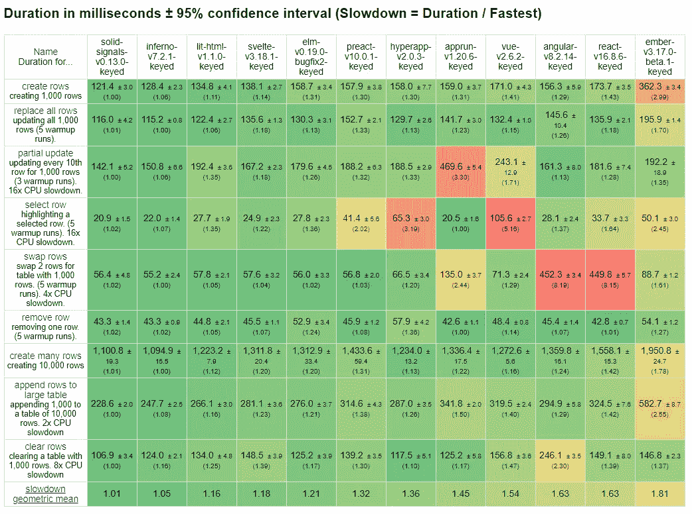
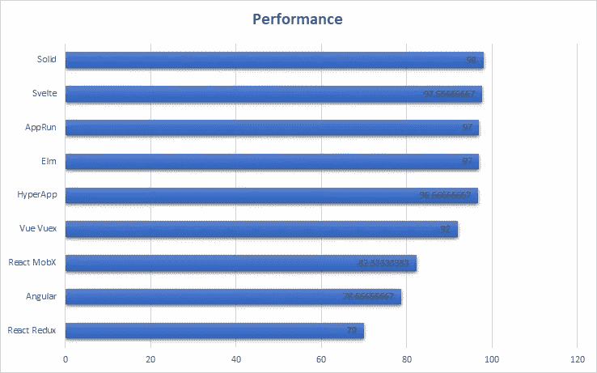
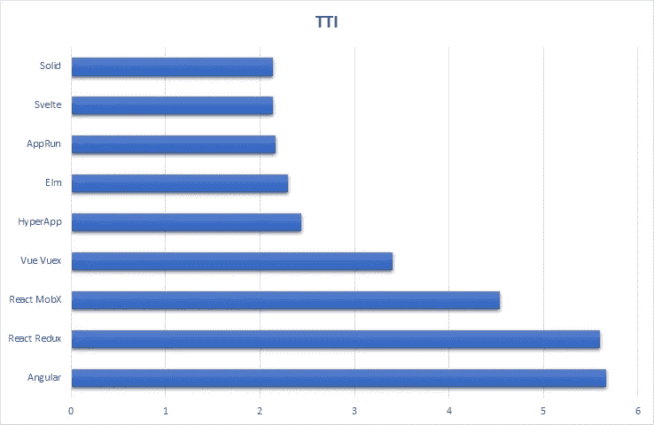
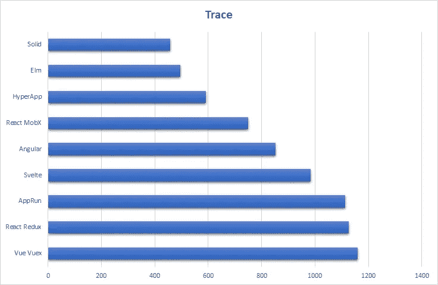
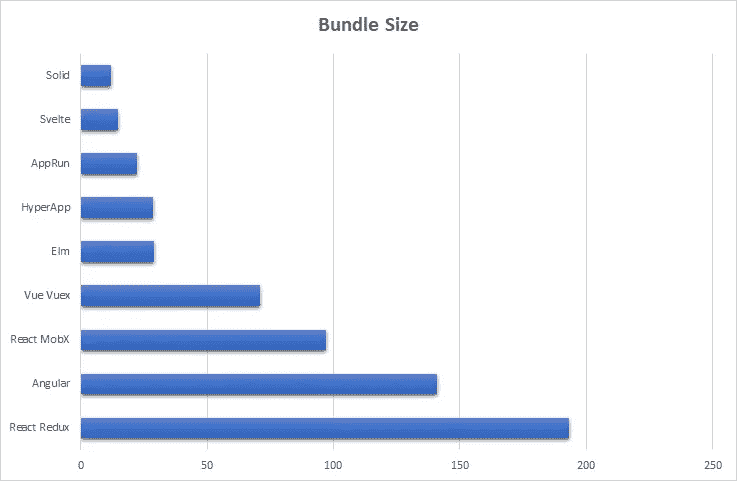
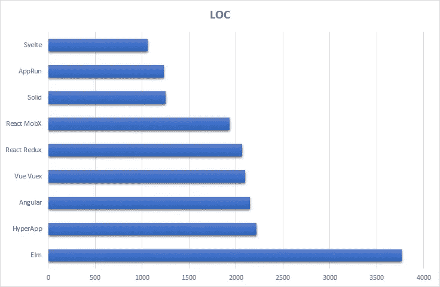
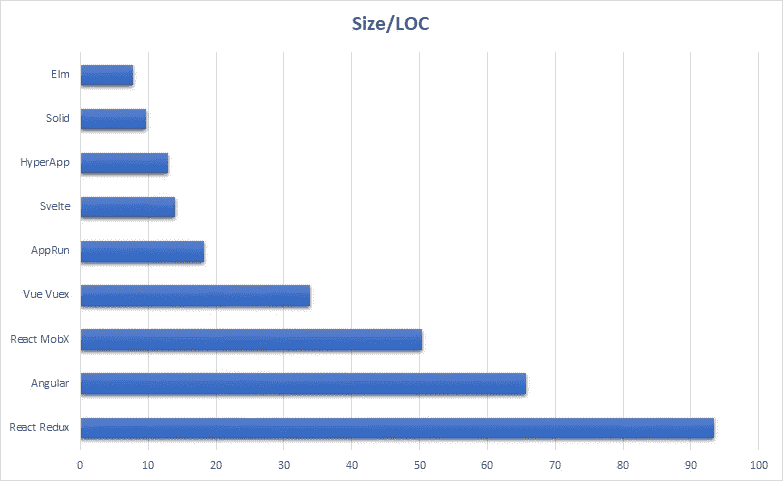

# JavaScript 框架性能的真实演示比较

> 原文：<https://levelup.gitconnected.com/a-solid-realworld-demo-comparison-8c3363448fd8>

## SolidJS 作为现实世界演示中的最新挑战者进入拳击场。让我们看看它是如何堆积起来的。

关于我，你应该知道的第一件事是，我对性能基准非常着迷。我开始着手编写反应式 JavaScript UI 库，并试图证明一些东西。这种方法的某些本质上吸引了我，在证明它优于虚拟 DOM 之前，我不会罢休。对我来说，这始于表现。但那是 5 年前，他们花了 4 年时间才达到那个目标。

所以没错，我说的是 [SolidJS](https://github.com/ryansolid/solid) ，一个现代的全功能反应式 JavaScript UI 库。它检查所有带有 JSX 组件的盒子，类似钩子的 API，上下文，门户，片段，悬念，Web 组件支持，SSR，你能想到的。它可能是你见过的最具性能的库(见下文)，但这不是我们今天关注的重点。我们不再深究渲染性能，而是更全面地审视应用程序性能。

JS 框架基准测试结果 Chrome 80(2020 年 2 月)

# 真实世界演示

 [## 哥特斯特/现实世界

### 虽然大多数“待办事项”演示提供了一个框架功能的极好的粗略浏览，但它们通常不会传达…

github.com](https://github.com/gothinkster/realworld) 

RealWorld 演示是一个大型的社区支持的开源项目，它通过构建一个示例应用程序来展示所有的 web 框架客户端或服务器端，这个示例应用程序比典型的 TodoMVC 玩具演示或基准测试中的剥离场景要丰富得多。作为 Conduit，一种中等的克隆，您的应用程序必须处理诸如身份验证、路由和异步数据加载等实际问题。它有一个标准化的规范，使它成为购买下一个库或框架的更好的地方。

当然，这并没有把我们这些性能迷拒之门外。我们不再关注在一个表中呈现 10000 个旋转的立方体或行，而是着眼于加载优化、代码大小以及用户和开发人员的体验。因此，雄心勃勃的任务似乎很简单。做出最小和最快的实现，每个人都会看到并希望在他们的项目中使用。对于 Solid 来说，这意味着突出它的优势，同时测试纯客户端渲染的单页面应用程序的极限。在这个过程中，Solid 将不得不使用 SSR 与包括 Svelte 在内的其他库竞争。所以我想验证一个假设。

我在低性能设备上见证过，尤其是高性能和低性能库之间的渲染性能差距越来越大。如果像 Solid 这样的库在渲染大量节点时已经快了几百毫秒，那么使用 SSR 得到的更早的第一个有意义的内容时间在哪些方面不会产生有意义的影响呢？

# 测试

所以我马上要说，这里的测试方法很难说是决定性的。我只是简单地将每个实现运行 10 次，然后取前 3 个结果的平均值。我基于他们每年做的比较。关于 2019 年版，请参见:

 [## 前端框架与基准测试的真实对比(2019 年更新)

### 作者亚采克·沙也有以下版本:土耳其语-感谢@额尔德尼兹，波图格斯-感谢@菲利佩菲亚略第三次…

www.freecodecamp.org](https://www.freecodecamp.org/news/a-realworld-comparison-of-front-end-frameworks-with-benchmarks-2019-update-4be0d3c78075/) 

这种比较测试了 3 个指标:性能、大小和 LOC。我从我的运行中收集了一些其他指标，以提供更好的洞察力，但这本质上是相同的测试。性能通过 Chrome Inspectors Lighthouse 审计。Size 是为呈现初始登录页面而发送的 JavaScript 的总大小(kb)。最后，使用 [cloc](https://github.com/kentcdodds/cloc) 测量 loc，将 src 文件夹中的 JS、CSS 和 HTML 的总行数相加(即不包括库代码)。

这绝不是官方的比较。 [Solid 目前正在等待合并](https://github.com/gothinkster/realworld/issues/471)，所以我想借此机会看看它的进展如何。我从 2019 年的 comparison +热门库 React、Angular 和 Vue 中挑选了表现最好的库，并进行了测试。你可以试试 Solid 的应用程序:

 [## 水管

### 可靠的真实世界示例应用程序

ryansolid.github.io](https://ryansolid.github.io/solid-realworld/) 

# **表演**

灯塔绩效得分(越高越好)

考虑到这里库的分布，这个基准比大多数基准要接近得多。Lighthouse 审计基本上根据初始加载指标对每个库打分(满分为 100 分)，比如到达第一个字节的时间、第一次内容丰富的绘制、交互时间、最大输入延迟。所有库都在 CPU 和网络节流下运行，以模拟低端设备和恶劣的网络条件。这里有一半的图书馆仍然得分近乎完美。流行的库有点慢，Vue 领先，现在过时的 React Redux 落后。

在分数上没有真正的区别。那么让我们来看一个更夸张的分数时间互动(TTI)。这是页面准备好接收用户输入的时候。

灯塔到交互的时间(以秒为单位，越短越好)

尽管如此，排名前五的图书馆离这里很近。在酷热中苗条而结实。如果有什么不同的话，这只是举例说明了 Angular 和 React Redux 花费超过 5.5 秒进行交互时，性能下降对流行库的实际影响。

在这一点上，我查看了一些其他的存储库，看看是否有其他真实的例子有更好的性能数字。在尝试了十几个其他的回购后，我只找到了一个:微软 Blazor。Blazor 是一个 Web 程序集库，允许实现者用 C#编写他们的应用程序，并在浏览器中运行它们。它得了 99 分。令人印象深刻。

…如果它不是我见过的最慢的图书馆的话，那就是了。如此之慢，以至于 Chrome 认为它已经在加载屏幕上完成了加载，所以它给了它很高的分数，因为它加载加载屏幕很快。所以我开始查看 Chrome 的性能时间表，我发现了一个非常不同的故事。在看到它们之间的区别后，我决定看看这些库是如何堆叠的。

Chrome Inspector Trace(毫秒——越低越好)

现在，从 Inspector 时间线加载资源的总时间线并不能清楚地表明页面的加载速度，因为有 JavaScript 加载和运行以及 DOM 节点呈现。与 TTI 相反，这些数字大约是 1 秒。这里唯一有趣的事情是，除了 Solid (Svelte，AppRun)之外，使用代码分割的库相对于它们的大小来说要慢一些。像 Elm 和 HyperApp 这样的中等大小的代码捆绑在一个文件中，加载速度要快得多。

一个区别是，固体应用程序只分为 3 块，而苗条和 AppRun 有大约 8 块。考虑到浏览器对并发连接数的限制，初始资源加载可能会因过多的代码分割而出现瓶颈。Solid 还使用了一个“随取随渲染”实现，在加载路由代码之前进行 API 调用，这也可能有助于加快资源加载时间。

**结论:**对于这种测试来说，性能最好的库的性能过于接近，难以区分。为此，我们必须继续使用合成基准。Solid 的客户端渲染应用程序在所有测试中都名列前茅，因此没有投诉。

# 大小

初始页面 JS 大小(kb——越小越好)

在过去，人们只关注初始代码块，以不同的方式衡量这个测试。我认为有必要查看加载第一页所需的所有 JS。Solid 的 12.1kb 超过了之前的领跑者 Svelte 的 14.8kb。这是有史以来第一次测试 Solid 更小。苗条的通常小 50%。之前的比较显示，当所有 JS 加载所有页面时，Svelte 的代码大小实际上比 Elm 的大，这表明 Svelte 在大小上可能不如组件。大多数基准测试鼓励您在单个组件中完成所有工作。从那以后，整个应用程序的 AppRun 大约为 18kb，使它成为非代码分割库的赢家。

*2020 年 3 月 24 日编辑:自从这篇文章发表以来，Solid 已经将另一个 kb 缩减到 11.1 kb。*

**结论:**所有被考虑的事情都在朝着正确的方向发展。React Redux 一度让 Angular 看起来很庞大，现在像 Solid 这样的库的实现几乎小了 20 倍。

# 代码行

代码行(越少越好)

苗条无疑保持了它在这里的声誉。也许令人惊讶的是，接下来的 4 个库都使用 JSX，接着是 Vue 和 Angular 的字符串模板，然后是一个 JSX 库，最后是 Elm。Elm 是代码行上的庞然大物。它几乎是其他一切的两倍。但是快速看一下源代码就知道为什么了，因为它写得更垂直。固体也具有与其尺寸相比更高 LOC 量。我决定用图表示它(见下文)，但不确定它有什么意义。我想我应该怪漂亮的人。

**结论:**仍然不清楚这个 LOC 实际上是否意味着什么。

大小/位置(kb/位置*1000)

# 一个“真实世界”的演示？？

算是吧。Solid 在演示中遵循了极简主义的悠久传统。没有使用第三方 AJAX 党库。几十行写的路由器。没有全球状态管理系统。没有表单验证库。

尽管如此，这里仍有很多东西可以展示。该应用程序很好地利用了商店中 Solid 的原语和上下文 API，创建了一些你可能会在外部库中找到的东西。该应用程序充分利用了懒惰组件和数据抓取的悬念。特别是，在提取时渲染技术中，数据提取是在解析主块中的路径时初始化的，并且数据和代码是同时提取的。如果代码首先加载，它开始在屏幕外呈现，只有在数据到达时暂停完成。

我会写一篇后续文章解释代码和过程。但目前就这样了。查看 Solid，并确保亲自查看演示应用程序。直到下次。

 [## 瑞安索利德/固体-现实世界

### Solid.js 代码库包含符合现实世界的真实示例(CRUD、auth、高级模式等)。

github.com](https://github.com/ryansolid/solid-realworld)  [## 瑞安固体/固体

### 一个用于构建用户界面的声明式、高效且灵活的 JavaScript 库。-瑞安固体/固体

github.com](https://github.com/ryansolid/solid)  [## 呈现 DOM 的最快方法

### 虚拟 DOM、带标签的模板文字还是细粒度的可观察对象速度最快？

medium.com](https://medium.com/better-programming/the-fastest-way-to-render-the-dom-e3b226b15ca3)