# 一种排序算法

> 原文：<https://levelup.gitconnected.com/a-sort-of-all-sorting-algorithms-506cbc76d47>

## 用 Python 实现的所有常见排序算法概述

在我之前关于[算法复杂性和大 O](https://medium.com/@scbronder12/algorithm-complexity-and-the-big-o-cb703e093faa) 的博客中，有一个常见的例子可以帮助解释这个概念，那就是编程中存在的不同种类的排序算法。

首先，可能很难从概念上理解如何以不同的方式处理排序问题。然而，自从计算开始以来，随着不同语言的发展或创造，排序算法已经获得了很多关注。随着它质疑解决一个简单而熟悉的问题的复杂性和效率，这种趋势可能会继续下去。因此，我将尝试描述一些比较流行的排序方法，并强调它们的优点和缺点。

https://www.toptal.com/developers/sorting-algorithms

对于这些例子中每一个，我都会尽可能多地加入视觉效果。每个人学习的方式都不一样，有几种不同的方式让我头脑中的灯泡熄灭，最终理解一个概念，希望这些也能让你受益。

# 插入排序

*   大 O:最好= O(N)，最差= O(N)

插入的工作方式是从列表中一个接一个地取出元素，并把它们插入到新的排序列表中正确的位置。在数组中，新的列表和剩余的元素可以共享数组的空间，但是插入的开销很大，需要将后面的所有元素移动一位。

一个快速的分步示例。我们将已排序的部分涂成红色，未排序的部分涂成黑色。我们从未排序的部分中取出一个元素，并将其与排序的部分中的元素进行比较，从右向左移动。

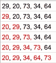

如果我们计算插入排序的最大复杂度，最昂贵的部分是两个元素的比较。我们将计算 N 个元素的数组的比较次数:

> *我们需要 0 个比较来插入第一个元素
> 我们需要 1 个比较来插入第二个元素
> 我们需要 2 个比较来插入第三个元素
> ……
> 我们需要(最多)N-1 个比较来插入最后一个元素*

总计…

> *1 + 2 + 3 + … + (N-1) = O(n2)*

换句话说，从左边 1 个元素和右边 N-1 个未排序项目的排序列表开始，取第一个未排序项目(元素#2)并将其插入到排序列表中，必要时移动元素。我们现在有一个大小为 2 的排序列表和 N -2 个未排序的元素。对所有元素重复此过程。

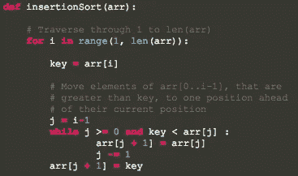

[https://www.geeksforgeeks.org/insertion-sort/](https://www.geeksforgeeks.org/insertion-sort/)

> python 中的一个例子

一个令人难以置信和有趣的例子

# 选择排序

*   大 O:最好/最差= O(N)

选择排序是比较容易直观理解的算法之一。它的工作方式如下:你在整个数组中寻找最小的元素，一旦你找到它，你就把它(最小的元素)和数组的第一个元素交换。然后在剩下的数组(没有第一个元素的数组)中寻找最小的元素，并与第二个元素交换。然后在剩下的数组(没有第一个和第二个元素的数组)中寻找最小的元素，并与第三个元素交换，依此类推。下面是一个例子，红色数字被标识为最小的数字，粗体数字是与之比较的元素。

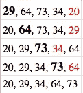

选择排序在大型列表上是低效的，并且通常比相似的插入排序执行得更差。在某些情况下，它比更复杂的算法具有性能优势。它只进行了 *n* 次交换，因此在交换非常昂贵的情况下非常有用。

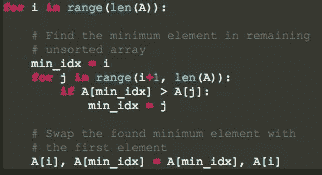

[https://www . geeks forgeeks . org/python-program-for-selection-sort/](https://www.geeksforgeeks.org/python-program-for-selection-sort/)

> python 中的一个例子

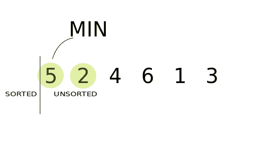

又一个通过舞蹈的例子！

# 合并排序

*   大 O: O(N log N)

合并排序是一个分而治之算法的完美例子。它简单地使用了这种算法的两个主要步骤:

1.  *划分*未排序的列表，直到你有 N 个子列表。每个子列表有 1 个未排序的元素，N 是原始数组中元素的数量
2.  *征服*(合并)一次两个子列表，产生一个新的排序子列表，直到它包含一个排序数组中的所有元素

该算法可以很好地扩展到非常大的列表，因为它的最坏情况运行时间是 O( *n* log *n* )。它也很容易应用于列表，而不仅仅是数组，因为它只需要顺序访问，而不是随机访问。然而，它具有额外的 O( *n* )空间复杂度，并且在简单实现中涉及大量副本。

那么我们如何合并两个排序的子数组呢？我们在每个数组的前面定义了三个引用。

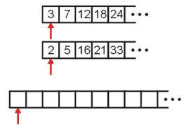

我们不断挑选最小的元素，并将其移动到一个临时数组中，增加相应的索引。

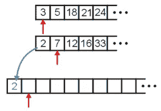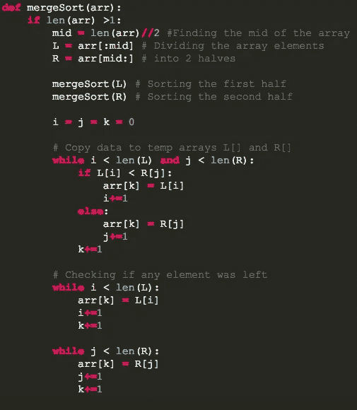

[https://www.geeksforgeeks.org/merge-sort/](https://www.geeksforgeeks.org/merge-sort/)

> python 中的一个例子

别担心，我没有忘记我们跳舞的例子

# 堆排序

*   大 O: O(N log N)

这类似于选择排序，但有一个更好的方法来获得最大的元素。它不是扫描所有的条目来寻找最大值，而是从一个堆中取出最大值。堆具有允许堆排序就地工作的属性，而无需额外的内存

堆排序的工作原理是确定列表中最大(或最小)的元素，并相应地将其放在列表的末尾(或开头)。重复这个过程，直到完成原始列表。一旦新列表被放入堆中，根节点肯定是最大(或最小)的元素。当它被移除并放在列表的末尾时，堆被重新排列，因此剩余的最大元素移到了根。使用堆，查找下一个最大的元素需要 O(log N)时间，而不是像简单选择排序那样线性扫描需要 O(N)时间。这允许堆排序在 O(N log N)时间内运行，这也是最坏情况的复杂度。

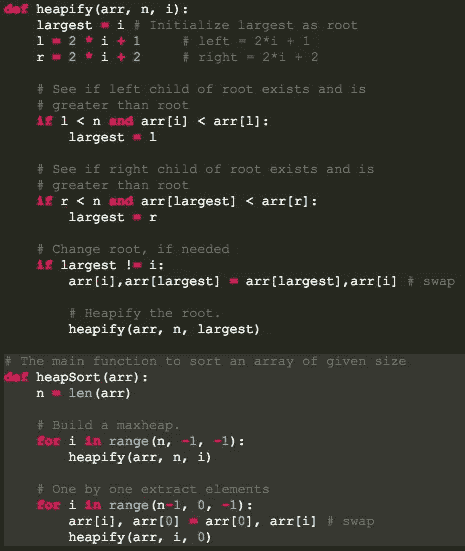

[https://www.geeksforgeeks.org/heap-sort/](https://www.geeksforgeeks.org/heap-sort/)

> python 中的一个例子

我并不特别喜欢这支舞的音乐，尽管这支舞使用了 max-heap 的概念，但仍然很好地诠释了舞台上的舞蹈理念

# 快速排序

*   大 O:最好= O(N log N)，最差 O(N)

快速排序和合并排序一样，也是一种分治算法。尽管有点复杂，但它通常比合并排序快得多，并且很少达到最坏情况下的 O(n)复杂度。它有 3 个基本步骤:

1.  从数组中选择一个被指定为*枢轴*的元素
2.  将较小的元素移动到枢轴的左侧，将较大的元素移动到枢轴的右侧
3.  使用递归将步骤 1 和 2 应用于后续子数组

关于快速排序的重要警告是，当选择第一个或最后一个元素作为支点时，它的最坏情况性能是 O(N)。因此，快速排序中最重要的问题是选择一个好的枢纽元素。这个问题已经或多或少地通过使用[三中值](https://stackoverflow.com/questions/7559608/median-of-three-values-strategy)策略得到了解决，该策略将性能导向 O(N log N)复杂度。

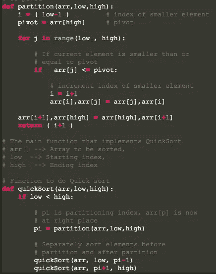

[https://www.geeksforgeeks.org/quick-sort/](https://www.geeksforgeeks.org/quick-sort/)

> python 中的一个例子

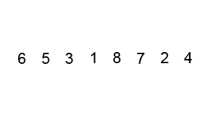

一个真正的踢踏舞者！

# 冒泡排序

*   大 O:最好= O(N)，最差= O(N)

冒泡排序清楚而简单地演示了排序的概念，因此经常被用作教学工具。然而，由于它的大，在学术界之外并不经常使用。

该算法的工作原理是将列表中的每个项目与其旁边的项目进行比较，并在需要时交换它们。换句话说，最大的元素冒泡到数组的顶部。该算法重复这一过程，直到它遍历列表，而不交换任何项目。因为冒泡排序重复通过列表中未排序的部分，所以它的最坏情况复杂度为 O(N)。

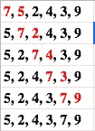

在这个例子中，最大的元件(7)被鼓泡到顶部。然后重复该过程，直到不能再进行进一步的改变。

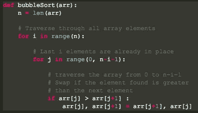

[https://www . geeks forgeeks . org/python-program-for-bubble-sort/](https://www.geeksforgeeks.org/python-program-for-bubble-sort/)

> python 中的一个例子

最后但同样重要的是！

好的，我希望上面的解释和图片(和视频)能帮助你理解不同种类排序算法的区别和用途。我相信理解这些差异对于成长为一名数据科学家并能够尽最大能力编码是非常重要的！我会给你留下一些关于以上内容的图片总结，以及一些令人着迷的图片供你思考！

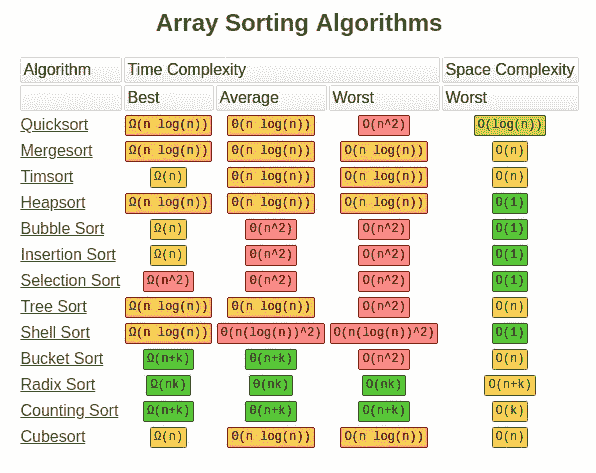

# 来源

 [## 快速排序——最好的排序算法？

### 在最好的情况下，快速排序的时间复杂度为 O(n log n ),在一般情况下为 O(n log n ),在最差情况下为 O(n^2

medium.com](https://medium.com/human-in-a-machine-world/quicksort-the-best-sorting-algorithm-6ab461b5a9d0)  [## 排序算法-维基百科

### 在计算机科学中，排序算法是将列表中的元素按一定顺序排列的算法。最…

en.wikipedia.org](https://en.wikipedia.org/wiki/Sorting_algorithm)  [## 使用 Python 代码浏览 5 大排序算法

### 排序是每个软件工程师和开发人员都需要了解的技能。不仅要通过编码…

medium.com](https://medium.com/@george.seif94/a-tour-of-the-top-5-sorting-algorithms-with-python-code-43ea9aa02889)  [## 整理

### 排序是对一系列对象进行排序。我们可以区分两种类型的排序。如果对象的数量很少…

www.cs.cmu.edu](https://www.cs.cmu.edu/~adamchik/15-121/lectures/Sorting%20Algorithms/sorting.html)  [## 排序算法

### (仍在进行中；我想用直观的解释和扑克牌的例子来重温)排序是…

betterexplained.com](https://betterexplained.com/articles/sorting-algorithms/)  [## 为什么我们需要这么多排序算法？

### 我们有一些最好的排序方法，如快速排序，合并排序等。，那么为什么我们需要其他排序方法…

cs.stackexchange.com](https://cs.stackexchange.com/questions/86628/why-do-we-need-so-many-sorting-algorithms)  [## 为什么我们需要这么多排序算法？

### 回答(15 个中的第 1 个):1)我们所知道的排序算法并不是都是同时开发出来的。有时我们学习…

www.quora.com](https://www.quora.com/Why-do-we-need-so-many-sorting-algorithms) 

https://www.computerhope.com/jargon/s/sort.htm

 [## 学习 Python -最佳 Python 教程(2019) | gitconnected

### 50 大 Python 教程-免费学习 Python。课程由开发人员提交并投票，使您能够…

gitconnected.com](https://gitconnected.com/learn/python)