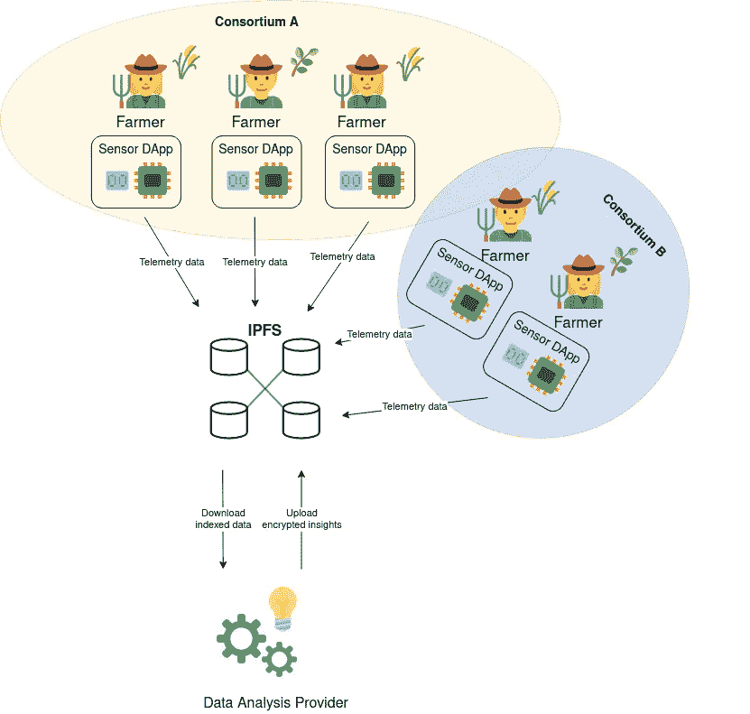

# 与 IPFS 和古怪的农民进行太空行走

> 原文：<https://levelup.gitconnected.com/a-spacewalk-with-ipfs-and-geeky-farmers-ab6a2ee14906>

为分布式 Web 设计简单的 AgTech 应用程序


[卡斯登·沃思(➡️@卡斯登.伍尔特)](https://unsplash.com/@karsten_wuerth?utm_source=medium&utm_medium=referral)在 [Unsplash](https://unsplash.com?utm_source=medium&utm_medium=referral) 上的照片

作为一名智能合约开发人员，最有趣的事情之一是意识到在集中式编程环境中，一些琐碎的决策是如何迅速变成头等大事的。例如，我应该在哪里存储我的文件，以便任何相关方可以看到它们并验证它们的完整性？如何确保没有人能够扣留我感兴趣的重要文件？

对于许多应用程序来说，这类问题通常是无意义的。然而，这个问题曾经让我在构建 DApps 时感到尴尬。在过去，我试图完全避免参考文件的需要，或者只是在分类账上存储一个散列，并在网络参与者之间吐露亲属关系。这两种方法显然都不令人满意，所以我最终决定探索新技术，结束我的沮丧。

## 介绍 IPFS

当我开始涉足 IPFS 时，我就处于这种状态，我意识到它有很大的潜力。那么什么是 IPFS，它能有什么帮助呢？首先，IPFS 古怪的全名是行星间文件系统。它是一种开源的对等文件存储技术，旨在取代分布式 Web 中的 HTTP。IPFS 本质上是一个由合作的对等节点组成的网络，这些节点共享上传数据的所有权，因此任何文件都可以被分发到任何节点，并且以后可以方便地被全世界访问，不管原始作者发生了什么。在 IPFS 上，文件 CID 扮演着核心角色，这是一个唯一的标识符，允许识别和查询任何内容，顺便提一下，它是由文件的散列组成的，因此它也用作完整性检查。

首先，我浏览了快速入门教程，通过 docker 镜像运行了一个 IPFS 节点，并开始使用它的 HTTPS API 查询它。现在，每个节点都附带了一个有用的教程目录，通过向 */api/v0/lis* t 端点提交 POST 请求(请注意:您必须将查询参数 *arg* 设置为所需的 CID ),可以像浏览常规 UNIX 目录一样浏览该目录。对于快速入门目录，它将是`QmYwAPJzv5CZsnA625s3Xf2nemtYgPpHdWEz79ojWnPbdG`。操作的结果如下:

每个链接代表存储在 IPFS 上的某些内容的唯一标识符。type 属性表示值为 *1* 的目录，并将 *2* 用于文件。因此，如果我们试图列出一个文件，我们不会像预期的那样找到任何内部链接:

## (分散的)机器的兴起

一旦对自己的成就感到满意，我决定是时候通过开始一个简单的项目来提升我的学习曲线了。

然而，找到一个合适的 IPFS 创意对我来说是一个巨大的第一世界问题。我目前专注于用 SpringBoot 在 Kotlin 中编写微服务，这种集中式模式在 Web3 和胖 JS 客户端中受到了不好的评价。如今，人们可以使用功能极其丰富和强大的设备，将智能手机上可以做的事情委托给模糊的第三方服务器是不合理的。然而，这并不适用于可以在 *DWeb* 中运行的所有代理:由浏览器或移动应用程序提供给我们人类的 UI 对冰冷的机器来说并不真正有用。

对你们中的一些人来说，这可能听起来很奇怪，但我曾经读过的一句话让我记忆犹新:

**“最好的 UX 就是完全没有 UI**”

仔细想想，这是完全有道理的。如今，很多业务流程和操作都实现了自动化，自动化的根本目的是在没有真人干预的情况下创造价值。任何一个经理都可以证实，最好的员工是自我管理的员工。同样，一个正确自动化的过程不需要人工干预，排除关键决策点和错误出现的时候(我们都希望很少)。

那会是什么样的应用？

## 土壤、作物和传感器

假设我们的用户是某个地区的农民，他们收集精确的天气数据、耗水量或肥料生产率的信息。数据可以上传到 IPFS，相关参与者可以得到活动通知并浏览报告，而无需依赖任何特定的第三方。最重要的是，IPFS 提供了天生的重复数据删除功能，这对典型的传感器数据非常有帮助(更详细的解释可以在这篇[文章](http://blog.klaehn.org/2018/06/10/efficient-telemetry-storage-on-ipfs/)中找到)，并在挣扎中的网络和农民可用的最少传感器软件上蓬勃发展。



IPFS 应用程序的基本解决方案概述

这甚至变得更好，因为任何人现在都可以提供新的顶层服务:例如，农民可以集体向以太坊上的提供商支付费用，以运行天气数据预报、预测水资源短缺和计划活动。

然后，提供商的应用程序需要下载原始传感器数据，理解这些数据，并与 IPFS 分享合理的预测，这样农民就可以根据新获得的知识采取行动。

## 起草一个快速解决方案

让我们为我们的用户起草一份必要的 MVP 特性的简短列表:

1.  上传 IPFS 的传感器数据
2.  要求提供商在特定时间间隔内开始分析数据
3.  私下上传一些数据与某些用户分享

使用 IPFS API 可以轻松实现第一点。然而，我最初尝试将所有用户数据放在一个目录中，存储 CID，然后列出并下载其中的文件。通过使用/ls 和/cat API，这看起来是可行的。天真的我本能的觉得“*太棒了！用户可以随心所欲地创建任意多的目录，添加文件，删除文件，所有这些都由 IPFS 本地软件完成！我会立刻完成我的原型！*”。

然而，以这种方式在 IPFS 航行是一种误导。它不能像类 UNIX 文件系统那样工作，因为它是不可变的。从文档中可以看出，每个文件的散列都是从其自身的内容中计算出来的，同样，每个目录的散列也是以自下而上的方式从其条目散列中计算出来的。假设我们需要向 IPFS 添加一个目录，其结构如下:

```
foo/
├── bar
│  └── baz
└── baz
```

然后我们可以通过运行`$ ipfs add -r foo`将它提交给 IPFS:

您是否注意到条目是从最里面的元素开始记录的？这不是巧合，这是 IPFS 用来创建这些条目的必要顺序。

这种机制的逻辑结论是不可能更改目录条目，因为这将使以前的 CID 计算无效并生成新的散列。本质上，我们会有一个全新的目录。当 IPFS 试图防止文件篡改时，这种固有的版本控制系统是一个很好的副作用。尽管如此，它在理解您的文件并根据特定领域的分组来组织它们时会产生一些问题。没问题，这只是意味着我们的高科技农民将依靠一种不同的机制。我想到了两个选择:

*   使用 IPNS:一个基于 IPFS 的域名解析系统。它可以为某个键创建一个 IPFS 目录的命名引用，然后编辑它的内容
*   只是创建一个内容的索引，并将其存储在数据库中

我觉得第一种方法对我来说是不必要的，而且有点麻烦，特别是当用户随着时间的推移会产生大量不间断的原始数据流时。理论上，可以将索引存储在某种分布式数据库甚至区块链中，但是由于索引主要是一个供私人使用的实用工具，所以我选择将其存储在一些不错的老式本地存储技术上。

其次，应该以某种方式通知提供者有关分析任务的信息，并接收要分析的文件的索引列表。匹配农民和数据专家不应该是一项特别困难的任务，并且可以在分散的或传统的平台上发生:所以我只是假设，在被选择之后，服务提供商通过 REST API 接收包含时间序列数据的 CID 块列表。

最后，所执行的数据分析可能具有一定的价值，并且是有偿的，因此考虑周到的做法是将其视为保留事项:提供者只需使用上一步中收到的农民公钥对洞察进行加密，然后将其上传回 IPFS。因此，通过在 IPFS 中添加一个简单的安全层，就有可能在保护可访问性的同时保护数据隐私。

## 虽然不多，但这是诚实的工作

通过找出一个可能的用例来更多地了解 IPFS 很有趣，但我花了相当多的时间来设计一个远程有用的应用程序:想象分布式 Web 的解决方案仍然是一个未知的领域，至少对我来说是这样，但我相信这是一条非常有益的道路。

如果你也对 Web3 和 AgTech 感兴趣，请分享你的想法，我很想学习更多关于这些主题的知识！

[加入我的时事通讯，了解更多类似的故事](https://blog.lorisocchipinti.com)

## 来源

*   仓库:【https://github.com/Ipanov7/spacebox 
*   星际遥测压缩:[http://blog . klaehn . org/2018/06/10/efficient-telemetry-storage-on-ipfs/](http://blog.klaehn.org/2018/06/10/efficient-telemetry-storage-on-ipfs/)
*   智能农业传感器:[https://www . mouser . it/applications/smart-agriculture-sensors/](https://www.mouser.it/applications/smart-agriculture-sensors/)