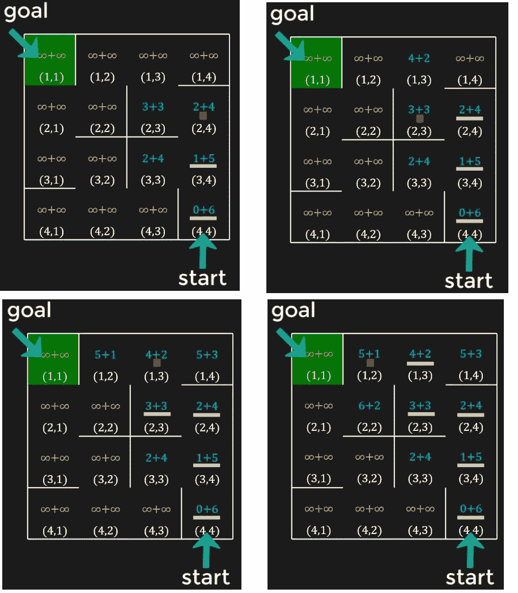

# 使用 Python 解决迷宫的 A-Star (A*)搜索(带可视化)

> 原文：<https://levelup.gitconnected.com/a-star-a-search-for-solving-a-maze-using-python-with-visualization-b0cae1c3ba92>


**A-Star (A*)** 搜索算法是解决一个图问题的智能算法。与**深度优先搜索(DFS)** 和**广度优先搜索(BFS)** 相反，A*是一种**通知**搜索算法，这意味着它在搜索时考虑了目标的位置/地点，因此它搜索相当多的节点以到达目标。

我们将在 **Python** 中开发 A*算法来解决**迷宫问题。**这是我们将要开发的代码的一个示例输出:

# **a*搜索算法的理论背景:**

我们将在下面的迷宫中讨论 A*搜索算法的逻辑:


A*的工作方式是，它为迷宫的每个单元分配一个**成本**，算法选择具有最小成本的路径。单元的成本 **(n)** 有两个部分，定义为:

**f(n) = g(n)+h(n)**

其中 **f(n)** 是到达单元 **n** 和 **g(n)** 和 **h(n)** 的总成本定义为:

**g(n) →** 从**开始**单元格到达 **n** 单元格的**实际成本**。

**h(n) →** 从小区 **n** 到达**目标**小区是**启发式代价**。从单元格 **n** 到达目标单元格的**估计成本**。

为了更好地理解 **g(n)** 和 **h(n)** ，让我们看看下面的单元格(3，3)的情况:


单元格(3，3)的 **g(n)** 成本是 2，因为从起始单元格开始，我们可以分两步到达单元格(3，3)。那么 **h(n)** 就是从小区(3，3)到达目标小区(1，1)的估计代价。我们不知道到达目标单元的成本，所以我们将简单地估计它。可以有两个函数来估计该成本:

**1-欧几里德距离:**

它是单元格和目标单元格之间的直线距离，如下所示:


**2-曼哈顿距离:**

第二个选项可以是单元格和目标单元格之间的**曼哈顿距离**，它是两个单元格之间的水平加垂直距离。


启发式成本只是对成本的估计，合理选择启发式函数是 A*算法的一个关键参数。我们将使用曼哈顿距离作为启发式函数。

像元(3，3)和目标像元之间的曼哈顿距离为 4，因此像元(3，3)的总成本为:

**f(n)=g(n)+h(n)=2+4=6**

> 与 BFS 或 DFS 相比，A*算法中包含的**启发式成本**使其更有效，因为该算法选择具有最小成本(实际成本+估计成本)的单元，因此它将更快地接近目标。

现在让我们看看 A*算法如何从起始单元格扩展到目标单元格。

这是迷宫的起始位置，红色方块表示我们当前所在的单元格，也就是起始单元格。


从起始信元开始，起始信元的 **g(n)** 为 0，因为从起始信元到达起始信元的成本明显为零。并且起始单元的 **h(n)** 是 6，这是起始单元和目标单元之间的曼哈顿距离。

对于其他细胞，我们不知道成本； **g(n)** 和 **h(n)** 两者，因此我们将假设它们为无穷大。这是整个迷宫的成本值，其中每个单元的成本显示为两个值 **g(n)+h(n)** :


现在我们将探索当前小区的相邻小区。当前小区只有一个相邻小区(3，4 ),我们将计算该小区的成本。单元格(3，4)的 **g(n)** 将为 1，因为我们从起始单元格到单元格(3，4)需要一步，而 **h(n)** 为 5。


我们还在开始通话。现在，A*算法将选择具有最小成本的单元，用于下一次移动，在这种情况下是单元(3，4)，因此它将移动到那里。


像元(3，4)有 3 个邻居，它们的成本计算如下:


单元(4，4)的新成本是 8，高于旧成本 6，因此我们不会更新它。

> 它只是意味着我们不希望从单元格(4，4)移动到单元格(3，4)，然后从单元格(3，4)返回到单元格(4，4)。其他两个单元(2，4)和(3，3)的成本优于无穷大，因此我们将更新它们的成本，而不会更新单元(4，4)的成本。


我们在单元(3，4)上，下一个单元将被选择为具有最小成本的单元。我们将不考虑单元(4，4 ),因为它已经被访问过，并且它的成本在那之后没有更新。在单元格内显示为黄色条。

在其他单元中，两个单元(3，3)和(2，4)的成本最低，为 6。**现在选择哪一个？**在这种情况下，我们应该倾向于选择具有较低**启发式成本**的单元，因为这表明该单元更接近目标单元。在本例中，两个单元都具有相同的启发式成本 4，因此我们可以选择两个单元中的任何一个，假设我们选择单元(2，4)。我们将移动到那里，这将是迷宫的更新状态。


计算相邻单元的成本，然后选择具有最小成本的单元的过程将继续，直到我们到达目标单元。下图显示了接下来的步骤:



一旦我们到达目标单元格，有一种方法可以让我们只选择高亮显示的路径，这是从起始单元格到目标单元格的最短路径。


# **a*算法的伪代码:**

现在让我们看看 A*搜索的伪代码是什么。

由于我们必须选择成本最小的单元，所以我们将使用数据结构**优先级队列**来实现 A*算法。与按照 **FIFO** (先进先出)原理工作的**队列**不同，优先级队列中的元素是根据优先级取出的。优先级可以是元素的值(最高或最低)。在 Python 中，我们在模块**队列**中有可用的优先级队列，优先级是最低值，因此最适合实现 A*。

**这是 A*搜索的伪代码:**


> 在上面的伪代码中需要注意的重要一点是我们在优先级队列中存储开销和信元信息的方式。它被存储为一个元组`(f_score(start), h(start), start)`。元组基于它们内部的第一个元素进行比较，如果相同，则基于下一个元素进行比较，依此类推。因此，存储的第一个值是单元的成本，第二个值是单元的启发式成本，这样，如果两个或更多单元的成本相同，将对启发式成本进行比较。第三是细胞本身的价值。

# **用 Python 实现:**

为了用 Python 实现这个算法，我们将使用 [pyamaze](https://github.com/MAN1986/pyamaze) 模块。关于这个模块的使用，有一个详细的[帖子](https://towardsdatascience.com/a-python-module-for-maze-search-algorithms-64e7d1297c96)和一个[视频](https://youtu.be/McMU-WuJwG0)，但是没有那个细节你也可以继续。

这里提供了完整的代码，然后是对它的逐步讨论:

要创建任意大小的迷宫，例如 5x5 的迷宫，我们可以使用如下所示的模块。

上面的代码将生成一个随机的 5x5 迷宫。下面是一个例子:


你需要知道的迷宫论证是:

1- **rows →** m.rows 将返回迷宫的行数。上面的例子是 5 英镑。

2- **cols →** m.cols 将返回迷宫的列数。上面的例子是 5 英镑。

3- **grid →** m.grid 将返回迷宫中所有单元格的列表。在上面的例子中，它是一个包含 25 个单元格的列表，从(1，1)到(5，5)。

4- **maze_map →** m.maze_map 会将迷宫打开和关闭的墙壁信息作为字典返回。键将是单元格，值将是另一个字典，其中包含东、西、北、南四个方向的四面墙的信息。对于上述情况，这将是输出:

```
{(1, 1): {'E': 0, 'W': 0, 'N': 0, 'S': 1}, (2, 1): {'E': 0, 'W': 0, 'N': 1, 'S': 1}, (3, 1): {'E': 1, 'W': 0, 'N': 1, 'S': 0}, (4, 1): {'E': 1, 'W': 0, 'N': 0, 'S': 1}, (5, 1): {'E': 1, 'W': 0, 'N': 1, 'S': 0}, (1, 2): {'E': 1, 'W': 0, 'N': 0, 'S': 1}, (2, 2): {'E': 1, 'W': 0, 'N': 1, 'S': 0}, (3, 2): {'E': 0, 'W': 1, 'N': 0, 'S': 1}, (4, 2): {'E': 0, 'W': 1, 'N': 1, 'S': 0}, (5, 2): {'E': 1, 'W': 1, 'N': 0, 'S': 0}, (1, 3): {'E': 1, 'W': 1, 'N': 0, 'S': 0}, (2, 3): {'E': 1, 'W': 1, 'N': 0, 'S': 1}, (3, 3): {'E': 0, 'W': 0, 'N': 1, 'S': 1}, (4, 3): {'E': 1, 'W': 0, 'N': 1, 'S': 0}, (5, 3): {'E': 1, 'W': 1, 'N': 0, 'S': 0}, (1, 4): {'E': 1, 'W': 1, 'N': 0, 'S': 0}, (2, 4): {'E': 1, 'W': 1, 'N': 0, 'S': 0}, (3, 4): {'E': 0, 'W': 0, 'N': 0, 'S': 1}, (4, 4): {'E': 0, 'W': 1, 'N': 1, 'S': 0}, (5, 4): {'E': 1, 'W': 1, 'N': 0, 'S': 0}, (1, 5): {'E': 0, 'W': 1, 'N': 0, 'S': 0}, (2, 5): {'E': 0, 'W': 1, 'N': 0, 'S': 1}, (3, 5): {'E': 0, 'W': 0, 'N': 1, 'S': 1}, (4, 5): {'E': 0, 'W': 0, 'N': 1, 'S': 1}, (5, 5): {'E': 0, 'W': 1, 'N': 1, 'S': 0}}
```

使用上面给出的伪代码，该算法可以实现为:


在上面的代码中，我们刚刚打印了 **g(n)** 和 **h(n)** 的值，但是我们需要从起始单元格到目标单元格的路径信息。我们可以将这些信息存储为字典。一个显而易见的方法是在每次选择新的单元时存储信息。在我们之前考虑过的迷宫中，字典的前三个键值对如下所示:


但是在字典中，我们不能有一个键的重复值，所以在上面的例子中，我们不能存储两对，(3，4):(2，4)和(3，4):(3，3)。解决方案是以相反的顺序保存路径，因为我们可以在字典中有重复的值。所以这条路径是反向路径，然后我们可以反过来得到正向路径。

此外，`agent`类用于创建一个代理，然后使用迷宫类的`tracePath`方法，代理将跟踪由 A*算法计算的路径。

你可以观看详细的[视频](https://youtu.be/W9zSr9jnoqY)进一步澄清。此外，还有另一个[代码](https://github.com/MAN1986/pyamaze/blob/main/Demos/A-Star/aStarDemo.py)，它对算法进行了更多的可视化处理，模拟了不同迷宫单元的搜索。

创建模块 **pyamaze** 是为了通过简单的代码来促进迷宫生成，然后可以用于编码任何搜索算法，如**广度优先搜索、深度优先搜索、A*、Dijkstra 或一些遗传或强化学习**搜索算法。你可以观看这个[播放列表](https://www.youtube.com/playlist?list=PLWF9TXck7O_zsqnufs62t26_LJnLo4VRA)，用 pyamaze 模块实现不同的搜索算法。

谢谢！