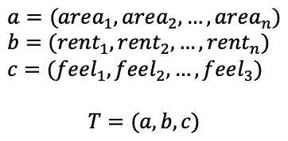
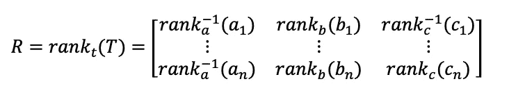
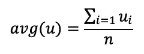
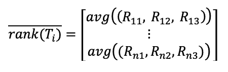
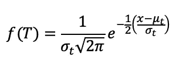
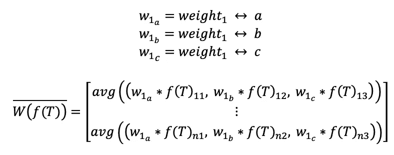
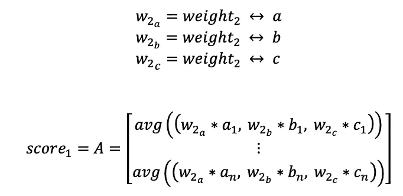
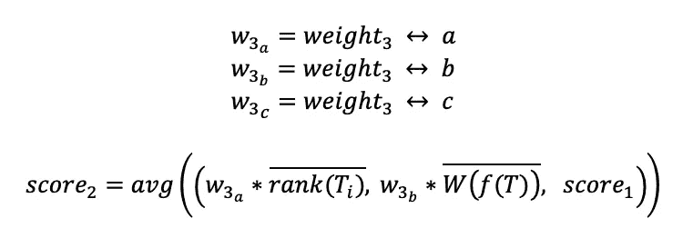
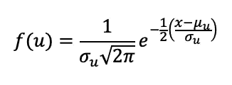
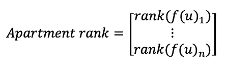

# 寻找最佳公寓的统计方法

> 原文：<https://levelup.gitconnected.com/a-statistical-approach-to-finding-your-optimal-apartment-75b2ddc40c66>

布兰登·格里戈斯在 [Unsplash](https://unsplash.com?utm_source=medium&utm_medium=referral) 上的照片

你有没有在找房子的时候，有一个很大的，很全面的房子清单？这可能会让人不知所措——通常很难决定你的最佳选择是什么，因为你对清单上的大多数公寓(如果不是全部的话)感到矛盾(在湾区尤其如此)。

我在搜索中遇到了这个问题，这就是为什么我创建了一个有点非传统的方法来帮助你在决定一个地方时指向正确的方向。

## 这种方法假设如下:

*   你有一个通过在平台上搜索找到的地方的列表，比如 Apartments.com 的、[、](https://www.apartments.com/) [Zillow](https://www.zillow.com/) 等。
*   您有这些地方的以下数据:
    -月租金(可选择任何额外费用，如水电费)
    -单位建筑面积(平方。ft)
    -用 1 至 5 分制对您对该物理单元的总体感觉*(不包括建筑面积)*进行评分*

> *在评价每套公寓时，考虑以下因素:你对安全、管理、邻居、建筑质量等的感觉。所有的因素都应该考虑进去。这个评级是主观的，这是一个数量限制。然而，你对居住地的决定也是主观的。这种方法旨在减少决策量。

# 方法

用于定量测量最佳公寓的方法涉及相当多的标准化、加权和排序。我在 Google Sheets 中做了所有的计算，但我将在这里遍历算法。

让我们定义向量 *a* (建筑面积) *b* (租金) *c* (你的评级) *T* 如下:

*a、b、*和 *c* 中包含的每个组件都是与您列出的每个公寓/地点相对应的参数。T 仅仅是这些向量的集合。

让我们对由 *R:* 定义的 *T* 中的向量内的分量进行排序

您会注意到 rank 用于指数为-1 的列。这不是-1 指数，而是对应于倒数。在我们的排名情况下，逆排名对应于按*降序的排名。对某些参数使用降序允许我们实际排列这些参数。如果 b 的“更好”值在逻辑上更高，那么 a 和 c 的“更好”值应该更低。*

用任意向量 *u，*我们把*的平均函数定义为:*

n 是 u 中分量的个数

并使用 average 函数计算 *R、*中的行向量的平均值

从而为我们提供一个单独的列，包含每个公寓的平均面积、租金和个人评级排名。

接下来，我们使用函数 *f(T)* 根据正态分布对 *a* 、 *b、*和 *c* 中的值进行归一化，其中 *t* 是 *T 的每个分量。*也就是说， *t* 表示包含各个公寓数据的值的每个向量。

使用归一化数据和离散权重，我们可以计算每个公寓的加权归一化值的平均值。您应该根据各个数据的重要程度为这些权重赋值。例如，如果公寓的楼层面积不太重要，您可以将权重 1 设置为 a = 0.5。此外，不管你给租金分配多少权重，租金应该总是负的。这是因为更高的租金并不意味着更好，除非出于某种原因，你想在公寓上花更多的钱。如果是后一种情况，分配给你的权重应该小一些。

注意:a 的权重 1 是对应于 a 的离散权重值，它适用于 b 的权重 1，依此类推。f(T)在技术上是一个矩阵，所以我们可以直接引用它的元素。

还应特别注意的是，您的重量值应尽可能接近相同的小数位。例如，如果你的 *b* 的所有值都是千，而你的 *a* 的值都是十，要么将 *b* 的权重设置为 0.01，要么将 *a* 的权重设置为 100。同样的话也适用于 *c.* 再次重申，每个“列”都应该包含彼此接近或在相同小数位数内的值。如果你不这样做，你的标准化值将会难以置信地倾斜，因此任何平均值也会倾斜。

我们如下定义衡量标准 *score1* ，上面的加权规则也适用于此:

有关加权归一化值平均值定义下的权重，请参见注释。

现在，使用前面的推导，我们可以计算一个向量，从所有三个原始参数(面积、租金和个人评级)中得到一个分数。同样，我们需要使用前面提到的相同的加权规则。

然后，使用导出的分数，我们再次使用之前的函数 *f* 对向量中的分量进行归一化，这次是根据单个任意向量 *u* 。

最后，我们使用 *score2* 的归一化值来导出包含公寓最终排名的向量:

# 结论

由此得出的排名应该让你很好地了解哪些公寓应该优先考虑，不管那可能是什么。也许是挑选要亲自参观的公寓，或者是选择哪些公寓足够重要，可以每天查看可用的房源。如何使用这些排名是你的选择，但请记住，这些排名是基于你分配的权重，因此参数面积，租金和个人评级有多重要。

希望你喜欢这篇漂亮的数学文章，并且可以利用它！让我知道你的想法，如果你有任何问题，请随时联系我。

# 分级编码

感谢您成为我们社区的一员！更多内容请参见[升级编码出版物](https://levelup.gitconnected.com/)。
跟随:[推特](https://twitter.com/gitconnected)，[领英](https://www.linkedin.com/company/gitconnected)，[通迅](https://newsletter.levelup.dev/)
**升一级正在改造理工大招聘➡️** [**加入我们的人才集体**](https://jobs.levelup.dev/talent/welcome?referral=true)