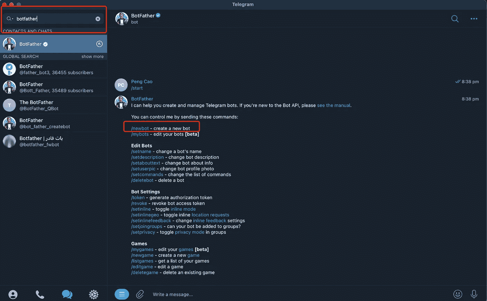

# 从电报机器人构建被动收入流的分步指南

> 原文：<https://levelup.gitconnected.com/a-step-by-step-guide-on-building-a-passive-income-stream-from-telegram-bot-69f3e85e14f7>

在用这个故事建造一个机器人之前，要看一个类似的完整的运行机器人，请查看这里:
[人工智能机器人生成论文给定主题](https://t.me/essay_gen_bot)。
[一个将数字转换成文字的工具](https://t.me/num_to_words_bot)。

被动收入是帮助你或你的家人过上更舒适生活的好方法。无论你的目标是财务自由还是每月获得一些额外的零花钱，在这篇文章中，我将一步一步地向你展示，并向你解释如何建立一个电报机器人。它将提供一个琐碎的回显服务，它可以发送发票收取付款。无论你是技术人员还是非技术人员，都很容易理解。**底部有一个惊喜的行动号召！**

说够了，让我们开始吧！

# **概述**

我们将使用 Replit 作为我们的后端，因为它最容易设置、运行和测试。

我们将使用 Nodejs 作为后端语言，因为它被广泛使用。

我们将整合 Stripe 作为我们的支付提供商，因为它被广泛使用，也更容易设置。

# 第一章

从电报机器人设置和条纹支付连接开始。

**第一步**

获取应用程序，并在 telegram 官方网站上为自己注册一个帐户

[](https://telegram.org/) [## 电报——信息传递的新时代

### 很快。安全。强大。

telegram.org](https://telegram.org/) 

**第二步**

搜索机器人父亲并选择/newbot，然后给你的新机器人一个名字和用户名。

我将有我的机器人名称“回声机器人”和用户名“我们的回声机器人”



注意:bot 用户名必须是唯一的，BotFather 将确保您在与 bot API 令牌共享您之前选择一个唯一的用户名，这是我们稍后需要的。

Bot API 令牌将类似于

<numbers>:</numbers>

**第三步**

为了验证 bot 是否已经创建，它应该在您搜索时显示出来。虽然在这一点上，它不会做任何事情，当你与它聊天。


**第四步**

如果您还没有帐户，请访问官方 stripe 网站并设置帐户。下一步将需要它

[](https://stripe.com/au) [## 互联网企业的在线支付处理— Stripe

### 互联网业务的在线支付处理。Stripe 是一套支付 API，支持在线商务…

stripe.com](https://stripe.com/au) 

第五步

通过点击或回复“/mybots”与 BotFather 对话，然后选择您创建的 bot。在我的情况下，它是“我们的回声机器人”。

然后点击支付，选择“条纹”，大概是单子上的第一条，至少在写的时候是这样的。


然后，让我们连接并授权用于开发目的的 Stripe 测试帐户。您将收到一个条带测试令牌，供以后使用。条带令牌看起来类似于

<numbers>:测试:</numbers>

# 第二章

让我们的 replit 后端运行，所以机器人实际上正在做的事情。

**第一步**

如果您还没有帐户，请访问 replit 为自己注册一个帐户。

[](https://replit.com/) [## 基于协同浏览器的集成开发环境

### 跳转到内容使用我们免费的、协作式的浏览器内 IDE，用 50 多种语言编写代码-无需花费一秒钟在…

replit.com](https://replit.com/) 

**第二步**

创建一个 nodejs repl(他们称之为编码/托管云)，并给它起一个你喜欢的名字。我会把我的叫做“回声机器人”。


**第三步**

通过左边的 shell 命令安装依赖项:

```
npm i node-telegram-bot-api [@replit/database](http://twitter.com/replit/database)
```


**第四步**

将从 BotFather 收到的电报令牌添加到 Secrets(环境变量)中。


**第五步**

添加主要的业务逻辑，在我的例子中是回显消息。

```
const TelegramBot = require("node-telegram-bot-api");
const YOUR_TELEGRAM_BOT_TOKEN = process.env["YOUR_TELEGRAM_BOT_TOKEN"];const bot = new TelegramBot(YOUR_TELEGRAM_BOT_TOKEN, { polling: true });// special message we reserved for other purpose
const MESSAGES_TO_SKIP = ["/start", "pay", "/pay"]; // greeting the user on first start
bot.onText(/\/start/, async (msg) => {
  const uniqueId = msg.chat.id;
  const displayUserName = msg.from.first_name + " " + msg.from.last_name;
  bot.sendMessage(
    uniqueId,
    `Welcome, ${displayUserName}!`
  );
});// Listen for any kind of message. There are different kinds of messages.
bot.on("message", async (msg) => { // unique id from each user
  const chatId = msg.chat.id || msg.from.id;
  const messageText = msg.text; // echo message
  if (!MESSAGES_TO_SKIP.includes(messageText)) {
    bot.sendMessage(chatId, messageText);
  }
});// for error handling to see logs on replit console on the left
bot.on("polling_error", console.log);
bot.on("error", console.log);
```

**第六步**

点击“运行”按钮，等待几秒钟，你应该能够与机器人聊天，并看到它的工作，回应我的情况下的信息。


# 第三章

建立数据库，以跟踪用户的使用，付款和设置机器人发票功能

**第一步**

类似于我们如何添加 YOUR_TELEGRAM_BOT_TOKEN，我们现在将来自 BotFather 的 STRIPE_TEST_TOKEN 添加到 replit Secrets(环境变量)。

添加数据库支持和一些支付配置，所以最上面的几行如下所示

```
const TelegramBot = require("node-telegram-bot-api");
const Database = require("@replit/database");
const db = new Database();
const YOUR_TELEGRAM_BOT_TOKEN = process.env["YOUR_TELEGRAM_BOT_TOKEN"];
const STRIPE_TOKEN = process.env["STRIPE_TEST_TOKEN"];
const PAYMENT_OPTIONS = [
  {text: "$2",callback_data: "pay:2.00"},
  {text: "$3",callback_data: "pay:3.00"},
  {text: "$5",callback_data: "pay:5.00"},
  {text: "$8",callback_data: "pay:8.00"},
  {text: "$13",callback_data: "pay:13.00"}
];
const MESSAGES_TO_SKIP = ["/start", "pay", "/pay"];
```

**第二步**

保存新用户到数据库，因为他们第一次开始与我们的机器人聊天

```
// greeting the user on first start
bot.onText(/\/start/, async (msg) => {
  const uniqueId = msg.chat.id;
  const displayUserName = msg.from.first_name + " " + msg.from.last_name;
  bot.sendMessage(
    uniqueId,
    `Welcome, ${displayUserName}!`
  ); // welcome new user, register in db with free freeQuota=10 
  const userData = await db.get(uniqueId); 
  if (!userData) { 
    // new user with name 
    await db.set(uniqueId, displayUserName); 
    // number of free api usages 
    await db.set(uniqueId + "freeQuota", 10); 
    // amount paid to us 
    await db.set(uniqueId + "amount", 0); 
    // number of usageCount 
    await db.set(uniqueId + "usageCount", 0); }
});
```

**第三步**

添加“付费”监听器。当用户向我们发送包含“支付”的文本消息时，我们会用一些支付选项来回复他们。

```
// listen for user's intention to pay
bot.onText(/pay/i, function (message) {
  bot.sendMessage(message.chat.id, "Select an amount to pay", {
    parse_mode: "HTML",
    disable_web_page_preview: true,
    reply_markup: {
    inline_keyboard: [PAYMENT_OPTIONS],
    },
  });
});
```

第四步

添加`callback_query`块来处理用户点击任何支付选项后的事件，发送适当的发票。

```
bot.on("callback_query", function (message) {
  const text = message.data;
  const func = text.split(":")[0];
  const amount = text.split(":")[1];
  if (func == "pay") {
    // you can use your own payload
    const payload = Date.now() + amount;
    const prices = [
      {
        label: "Bot Upgrade Donation",
        amount: parseInt(amount.replace(".", "")),
      },
    ];
    try {
      // send invoice button to user
      bot.sendInvoice(
        message.from.id,
        "Bot Upgrade Donation",
        "Thank you for the bot upgrade donation of $" + amount,
        payload,
        STRIPE_TOKEN,
        "pay",
        "AUD",
        prices
      );
    } catch (error) {
      console.log(error);
    }
  }
});
```

**第五步**

添加`pre_checkout_query`块，以便在用户按下最终支付按钮之前确认支付。

```
bot.on("pre_checkout_query", function (payload) {
  const { id } = payload;
  bot.answerPreCheckoutQuery(id, true);
});
```

**第六步**

更新消息块以处理付款成功，更新使用数据。

```
// Listen for any kind of message. There are different kinds of messages.
bot.on("message", async (msg) => {
  if (msg.successful_payment) {
    const uniqueId = msg.from.id;
    const existingAmount = db.get(uniqueId + "amount");
    db.set(
      uniqueId + "amount",
      existingAmount + msg.successful_payment.total_amount
    );

    // payment successful
    bot.sendMessage(msg.chat.id, "Payment complete!");
    return;
  }

  // unique id from each user
  const chatId = msg.chat.id || msg.from.id;
  const messageText = msg.text;

  // check their free usage before processing
  const freeQuota = await db.get(chatId + "freeQuota");
  const amountPaid = await db.get(chatId + "amount");
  const usageCount = await db.get(chatId + "usageCount");
  const isUnpaidUser = amountPaid <= 0;

  // unpaid user with no free usage, send reminder to pay
  if (freeQuota <= 0 && isUnpaidUser) {
    bot.sendMessage(message.chat.id, "Select an amount to pay", {
      parse_mode: "HTML",
      disable_web_page_preview: true,
      reply_markup: {
        inline_keyboard: [PAYMENT_OPTIONS],
      },
    });
    return;
  }

  // echo message
  if (!MESSAGES_TO_SKIP.includes(messageText)) {
    bot.sendMessage(chatId, messageText);
  }
  await db.set(chatId + "usageCount", usageCount + 1);

  // reduce the free usage by 1 for unpaid user
  if (isUnpaidUser) {
    await db.set(chatId + "freeQuota", freeQuota - 1);
    bot.sendMessage(chatId, `${freeQuota - 1} free usage left`);
  }
});
```

**第七步**

点击运行按钮，让我们回去和我们的机器人聊天。


使用[条纹文档中描述的测试卡付款](https://stripe.com/docs/testing)


哦是的，我们刚刚收到一些钱，在测试模式:)。

**第 8 步**

在确认我们的机器人正常工作后，我们可以继续用 live stripe 令牌更新机器人，并开始为我们构建的出色服务向用户收费。

# **结论**

由于你的机器人现在已经准备好赚钱，如果你能推广它，让更多的人开始谈论和使用你的机器人服务，它会做得更好！

我发现自己在开发过程中做的一件事就是检查和重置用户数据。如果需要帮忙，请留下评论和喜欢。我会尝试在 Replit 中分享一些方便的脚本来实现这一点。

另一个问题是，如果你不选择将你的帐户升级到黑客层，这将启用“永远在线”模式，该机器人依赖于 Replit 选项卡来打开和运行。要解决这种依赖性，可以使用 Severless + Webhooks 技术。一个小提示:本文的第二部分就要开始了！

如果你想看到一个类似的完全运行的机器人，带有 Severless + Webhooks，你可以看看我的[文章生成机器人](https://t.me/essay_gen_bot)或[数字转换机器人](https://t.me/num_to_words_bot)。

**延伸阅读:**

*   [利用闲置的互联网带宽赚钱——3 分钟内建立另一项被动收入指南](https://medium.com/@caopengau/make-money-with-unused-internet-bandwidth-a-guide-to-setup-another-passive-income-in-3-minutes-298217d388b7)

**行动呼吁**

如果你觉得这个指南有帮助，请鼓掌并跟我来。通过[链接](https://medium.com/@caopengau/membership)加入 medium，获取我和所有其他优秀作家在 medium 上发表的所有优质文章。

# 分级编码

感谢您成为我们社区的一员！在你离开之前:

*   👏为故事鼓掌，跟着作者走👉
*   📰查看[升级编码出版物](https://levelup.gitconnected.com/?utm_source=pub&utm_medium=post)中的更多内容
*   🔔关注我们:[Twitter](https://twitter.com/gitconnected)|[LinkedIn](https://www.linkedin.com/company/gitconnected)|[时事通讯](https://newsletter.levelup.dev)

🚀👉 [**加入人才集体，找到一份令人惊喜的工作**](https://jobs.levelup.dev/talent/welcome?referral=true)