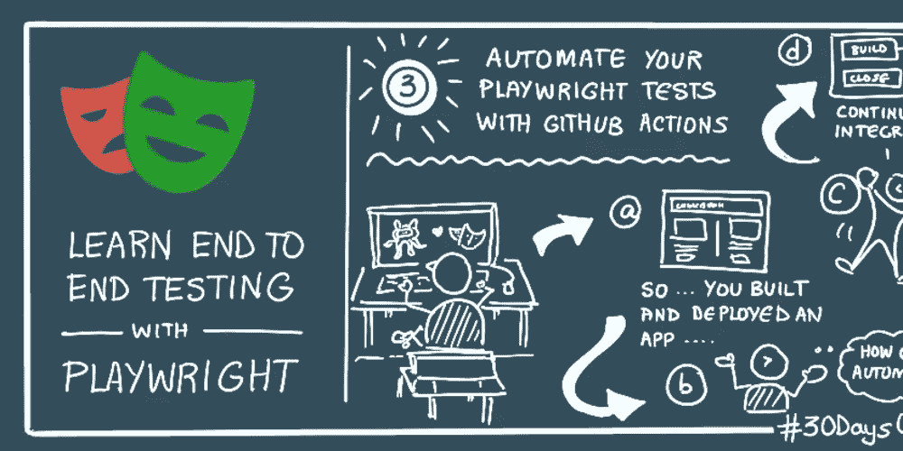
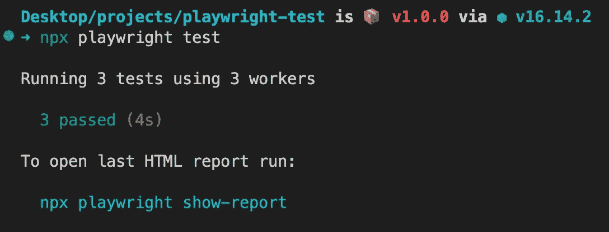
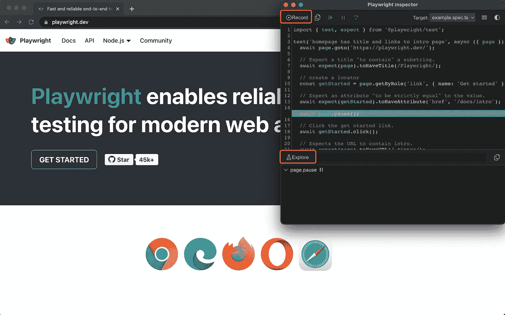

# 一步一步指导剧作家增加测试自动化

> 原文：<https://levelup.gitconnected.com/a-step-by-step-guide-on-playwright-to-increase-testing-automation-f11db3c32508>

本文旨在指导您一步一步地为用户 e2e 测试设置和运行剧作家。它完全有能力取代你的 web 应用程序的任何手工测试过程。



# 进入项目文件夹并安装依赖项

```
mkdir playwright-test && cd playwright-test
npm init playwright@latest
```

# 在默认设置下运行测试

```
npx playwright test
```

测试将在所有 3 个浏览器上运行，chromium、firefox 和 webkit 使用 3 个工人。在默认的 headless 模式下，运行测试时不会打开任何浏览器。测试结果和测试日志将显示在终端中。



# 要查看浏览器的运行情况，请运行

```
npx playwright test --project=chromium --headed
```

# 与测试浏览器交互

把`await page.pause();`加到你想停下来的地方。然后，剧作家检查员将弹出和执行期间暂停的步骤。



# 在检查器中

有两个很棒的按钮/特性，你真的想知道，以避免盯着 HTML 元素和写样板文件

*   **记录**(记录你的行为并翻译成代码行)
*   **探索**(允许你将鼠标悬停在页面上寻找元素)

欲了解更多信息和具体例子，请随意访问[官方文件在这里](https://playwright.dev/docs/intro)

**呼吁行动**

如果你觉得这个指南有帮助，请鼓掌并跟我来。通过[链接](https://medium.com/@caopengau/membership)加入 medium，在 medium 上访问我和所有其他优秀作家的所有优质文章。

# 分级编码

感谢您成为我们社区的一员！在你离开之前:

*   👏为故事鼓掌，跟着作者走👉
*   📰查看[升级编码出版物](https://levelup.gitconnected.com/?utm_source=pub&utm_medium=post)中的更多内容
*   🔔关注我们:[Twitter](https://twitter.com/gitconnected)|[LinkedIn](https://www.linkedin.com/company/gitconnected)|[时事通讯](https://newsletter.levelup.dev)

🚀👉 [**加入升级人才集体，找到一份神奇的工作**](https://jobs.levelup.dev/talent/welcome?referral=true)