# 在 Neovim 中为 Next.js (React)、TypeScript 和 TailWindCSS 中的编码配置 LSP 的分步指南

> 原文：<https://levelup.gitconnected.com/a-step-by-step-guide-to-configuring-lsp-in-neovim-for-coding-in-next-js-a052f500da2>

## 智能代码完成、漂亮的诊断、自动格式化等。

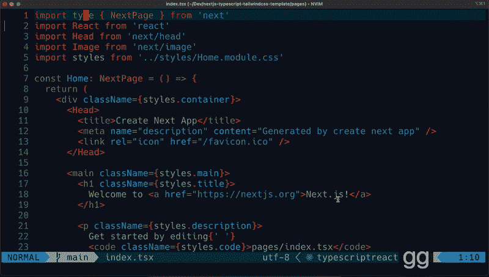

LSP 驱动的 vim 编辑器:使用。Next.js 项目中的 tsx 文件。GIF 作者[创建一个新的 Next.js 项目](https://medium.com/u/9f2dc23bfffa#cd27)*   [使用 nvim-lspconfig 的 LSP 配置](#429b)*   [为 Lua 设置语言服务器](#5a4b)*   [为 TypeScript 设置语言服务器](#5f44)*   [更好地管理 LSP 语言服务器— Mason.nvim](#fbd0)*   [LSP config-问题&解决方案](#8a1b)的根目录*   [为 TailwindCSS 设置语言服务器](#0915)*   [启用使用 Null-ls 和更漂亮的代码格式化](#502a)*   启用[美观易读的在线诊断](#5f0e)*   [使用 Lspsaga 插件改进 LSP UI](#a999)*   [总结](#7bd5)

# 创建新的 Next.js 项目

**启动 Next.js 项目:**


启动一个 next js(next js+TypeScript+TailwindCSS)项目。GIF 由[$ yarn add -D tailwindcss postcss autoprefixer
$ npx tailwindcss init -p

现在打开一个文件来测试`typescript`或`typescriptreact`是否在 Neovim 中被识别。

```
nvim pages/index.tsx
```](https://medium.com/u/9f2dc23bfffa# Install tailwindcss</span><span id=) [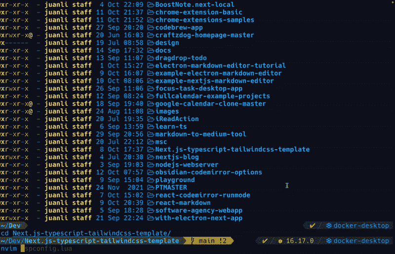](https://medium.com/u/9f2dc23bfffa# Install tailwindcss</span><span id=)

[使用**类型脚本操作** ( **)。tsx** )没有 **tsserver** 设置和自动完成。GIF 由](https://medium.com/u/9f2dc23bfffa# Install tailwindcss</span><span id=)[mason-LSP config . nvim 的可用 LSP 服务器](https://medium.com/u/9f2dc23bfffa#available-lsp-servers)

您可以在其 GitHub 页面上找到 mason-lspconfig.nvim 的详细文档:

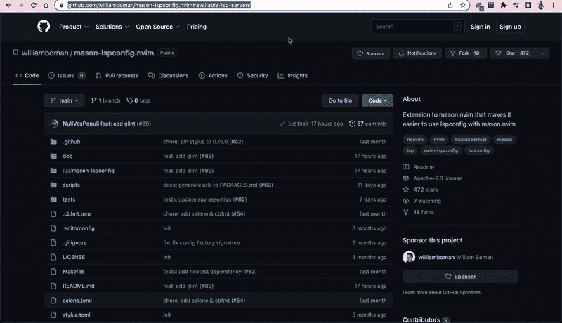

`Check out the [mason-lspconfig.nvim](https://github.com/williamboman/mason-lspconfig.nvim#available-lsp-servers) documentation. GIF` 作者 [pyright](https://medium.com/u/9f2dc23bfffa#pyright) ，这是任何包含“.git "、" setup.py "、" setup.cfg "、" pyproject.toml "或" requirements.txt ")。语言服务器要求每个项目都有一个`*root*`,以便完成和搜索当前文件中没有定义的符号，并避免每次启动时都必须索引整个文件系统。

[-存档:Neovim-nvim-lspconfig 2021-07-03](https://archive.org/details/github.com-neovim-nvim-lspconfig_-_2021-07-03_00-02-55)

这是我们到目前为止对`tsserver`的`lspconfig`:

```
require'lspconfig'.tsserver.setup{
  filetypes = { "javascript",", "typescript", "typescriptreact", "typescript.tsx" }
}
```

如果我们试图在一个没有`package.json`、`tsconfig.json`、`jsconfig.json`和`.git`的项目目录下处理一个 JavaScript 文件，当从当前缓冲区运行`:LspInfo`时，会弹出一条错误消息。

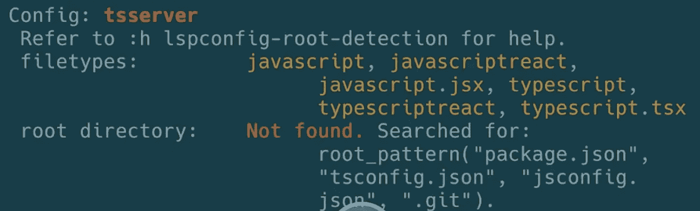

您将看不到智能代码功能:

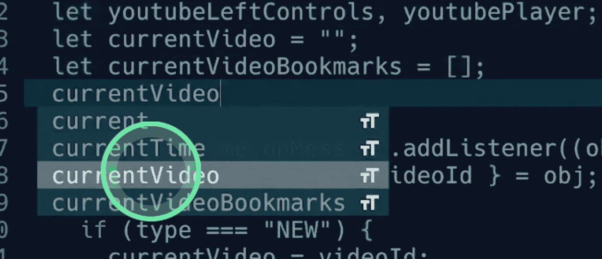

## 解决问题的两种方法:

1.  任何一个丢失的文件添加到您的项目目录中
2.  通过将粗体代码添加到`lspconfig`，允许 Lsp for JavaScript 在任何目录中运行:

```
require'lspconfig'.tsserver.setup{
  filetypes = { "javascript", "typescript", "typescriptreact", "typescript.tsx" },
  **root_dir = function() return vim.loop.cwd() end ** 
}
```

## 结果—类型脚本语言服务器最终附加到当前缓冲区

Run ':LspInfo '显示当前缓冲区(一个 JavaScript 文件)的附加客户端。我们注意到`tsserver`支持我们之前通过`lspconfig`定义的几种文件类型— `javascript`、`javascriptreact`、`javascript.jsx`、`typescript`、`typescriptreact`和`typescript.tsx`。


Run ':LspInfo '显示当前缓冲区(一个 JavaScript 文件)的附加客户端。命令:' Mason '显示已安装的服务器。brew install fsouza/prettierd/prettierd

## 示例配置

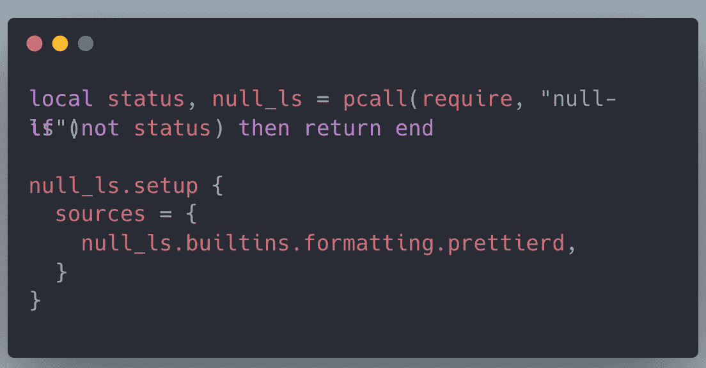

Null-ls 配置

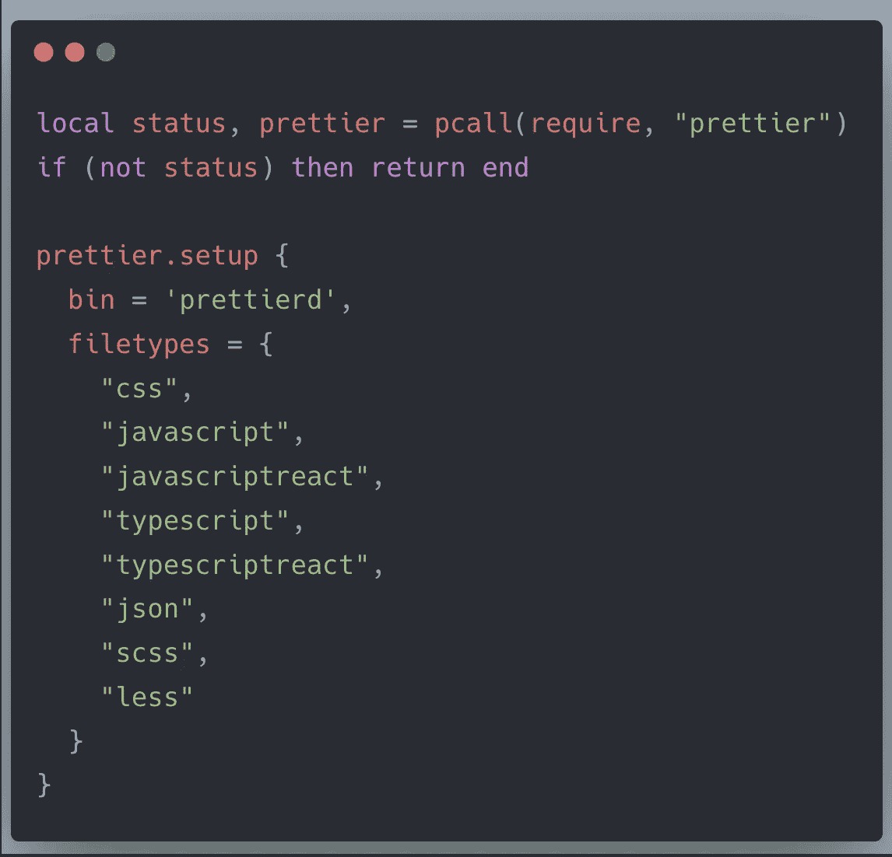

更漂亮的配置

# 实现美观易读的在线诊断

## 当前在线诊断的问题是

在我们之前通过 LSP 配置设置语言服务器后，会自动启用在线诊断，例如，语法错误或警告会在缓冲区中进行注释。

然而，在线诊断很容易脱离屏幕。我们必须缩小屏幕才能看到整个信息，这使得阅读很困难。

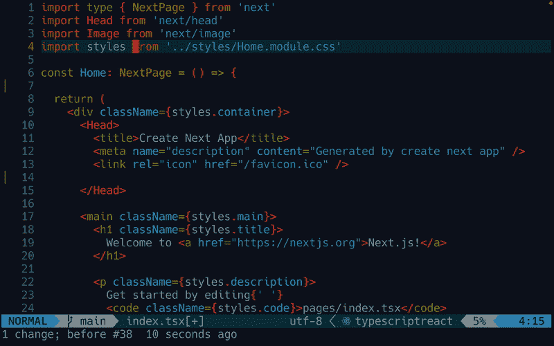

在线诊断在`.tsx`文件中启用，但对用户不友好。GIF 作者[在悬停窗口中自动显示在线诊断](https://medium.com/u/9f2dc23bfffa#show-line-diagnostics-automatically-in-hover-window)

## 演示自动显示在悬停窗口中的在线诊断


将光标移动到中的目标行时，在悬停窗口中自动显示在线诊断。tsx 文件。GIF 作者[李冠仪](https://medium.com/u/9f2dc23bfffa?source=post_page-----a052f500da2--------------------------------)

## 通过在符号列中添加诊断符号，进一步改进在线诊断

以下是当前诊断符号在符号列中的样子:

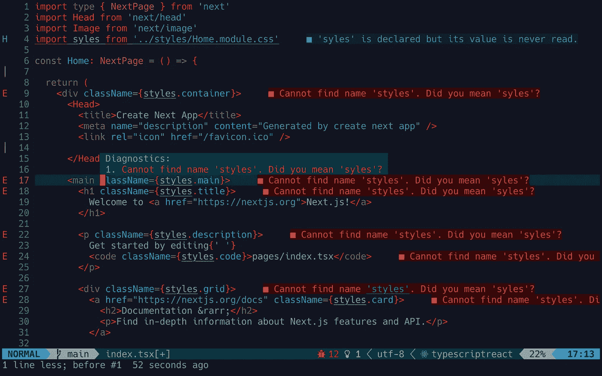

符号栏中不显示诊断符号。[李冠仪](https://medium.com/u/9f2dc23bfffa?source=post_page-----a052f500da2--------------------------------)截图

让我们添加四种诊断符号— `Error`、`Warn`、`Hint`和`Info`。

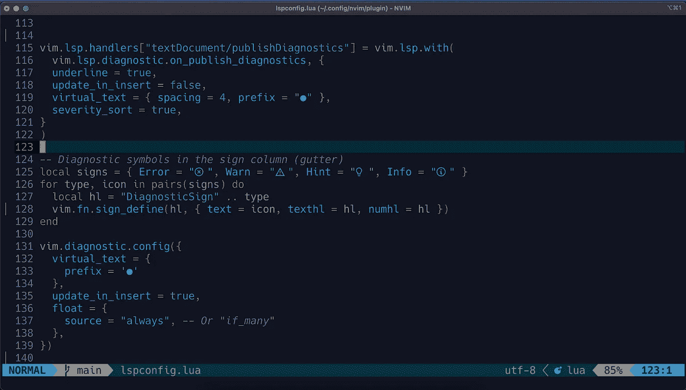

诊断的 LSP 配置。截图由[李冠仪](https://medium.com/u/9f2dc23bfffa?source=post_page-----a052f500da2--------------------------------)

诊断符号显示在左侧的符号栏中:

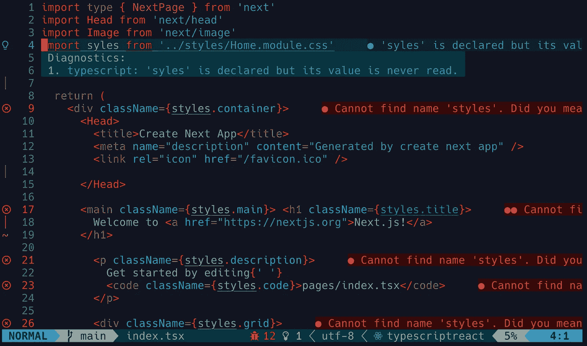

在符号列中显示内嵌诊断符号。[李冠仪](https://medium.com/u/9f2dc23bfffa?source=post_page-----a052f500da2--------------------------------)截图

# 使用 Lspsaga 插件改进 LSP UI

> Lspsaga 是一个轻量级 LSP 插件，基于 neovim 的内置 LSP，具有高性能的 UI。(来源: [glepnir/lspsaga.nvim](https://github.com/glepnir/lspsaga.nvim) )

Lspsaga 为 LSP 相关的特性提供了一系列高性能的用户界面，包括悬停文档、查看定义、在预览中重命名等等。

## 使用打包程序安装 Lspsaga 插件

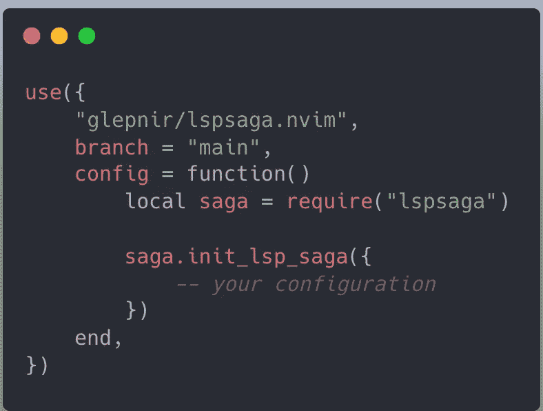

## Lspsaga 配置

你可以在它的 GitHub 文档中找到一些[详细的配置示例。](https://github.com/glepnir/lspsaga.nvim)

*示例配置:*

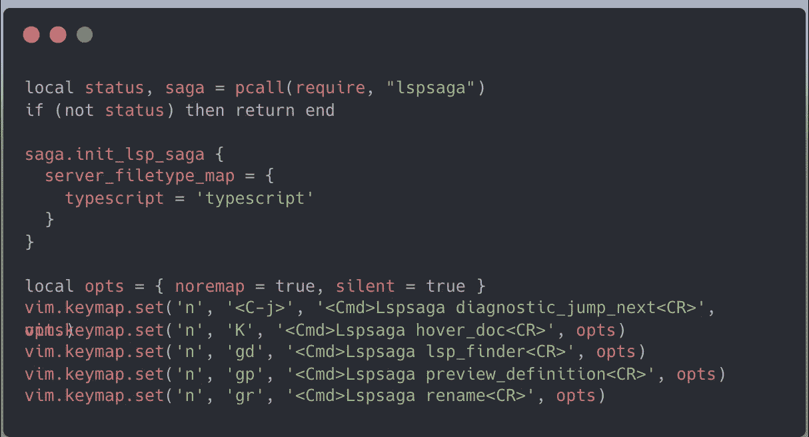

## 演示 LSP 的高性能用户界面

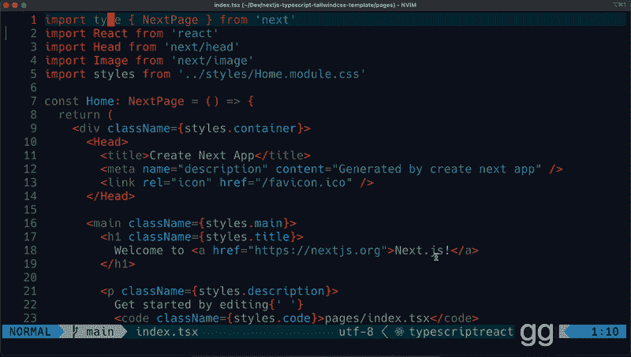

演示 LSP 插件为 LSP 提供的高性能用户界面。GIF 作者[李冠仪](https://medium.com/u/9f2dc23bfffa?source=post_page-----a052f500da2--------------------------------)

# 包裹

对于 Neovim 内置 LSP 支持的这些有用插件，我们已经深入讨论过了:[**nvim-LSP config**](https://github.com/neovim/nvim-lspconfig)、[**null-ls** 、](https://github.com/jose-elias-alvarez/null-ls.nvim) [**lspsaga**](https://github.com/glepnir/lspsaga.nvim) 、以及[**nvim-CMP**](https://github.com/hrsh7th/nvim-cmp)**。**通过适当的配置，我们可以实现智能代码完成、用户友好的在线诊断等。在 Neovim 很容易。

感谢阅读。我希望这篇文章对使用基于 Neovim 的文本编辑器的 Next.js 项目有所帮助。

关于 Lua 中 nvim 的配置，请查看我的 GitHub Repo。

[](https://medium.com/@amy-juan-li/membership) [## 通过我的推荐链接-李冠仪加入媒体

### 阅读李冠仪的每一个故事(以及媒体上成千上万的其他作家)。你的会员费直接支持李冠仪…

medium.com](https://medium.com/@amy-juan-li/membership) 

[*如果你想在 Medium 上阅读来自*](https://medium.com/@amy-juan-li/membership) [*【李冠仪】*](https://medium.com/u/9f2dc23bfffa?source=post_page-----a052f500da2--------------------------------) *以及成千上万其他作家的每一个故事，考虑成为 Medium 会员* *。每月 5 美元，你可以无限制地访问媒体内容。如果你通过我的链接* *注册，我会得到一点佣金。*

# 进一步阅读

[](https://blog.devgenius.io/set-up-a-next-js-application-workflow-using-neovim-typescript-tailwind-23621a34ed38) [## 使用 Neovim、TypeScript 和 TailwindCSS 设置 Next.js 应用程序工作流

### 为新的 Next.js 应用程序设置高效的工作流。

blog.devgenius.io](https://blog.devgenius.io/set-up-a-next-js-application-workflow-using-neovim-typescript-tailwind-23621a34ed38) [](https://amy-juan-li.medium.com/how-i-learned-to-love-vim-9b7fe53a4615) [## 我是如何学会爱上 Vim 并在一个月内从 VS 代码过渡到 Vim 终端的

### 快速过渡到基于 Vim 的文本编辑器是正确的选择！

amy-juan-li.medium.com](https://amy-juan-li.medium.com/how-i-learned-to-love-vim-9b7fe53a4615)