# 在 VirtualBox Ubuntu 20.04 映像中设置 Kubernetes 集群的分步指南

> 原文：<https://levelup.gitconnected.com/a-step-by-step-guide-to-setup-kubernetes-cluster-in-virtualbox-ubuntu-20-04-image-91d4510bbf1c>

## 只是为了学习建立 Kubernetes

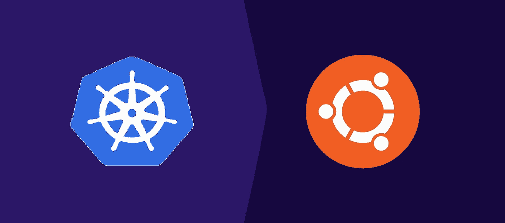

# 1) Ubuntu 映像准备

**从 Ubuntu** 下载图片在这个例子中，我使用的是[Ubuntu-20 . 04 . 4-live-server-amd64 . iso](https://releases.ubuntu.com/20.04/ubuntu-20.04.4-live-server-amd64.iso)

**1.1)在 Oracle VirtualBox 中设置 Ubuntu 镜像**
本例中使用的需求:
- RAM: 8Gb
- CPU: 2
-其余为默认

网络设置:
适配器 1:创建一个 NAT 网络，这样 k8s 节点就可以通过这个网络在虚拟机(VM)内部进行通信。

*   要创建 NAT 网络，请转到文件->首选项->网络

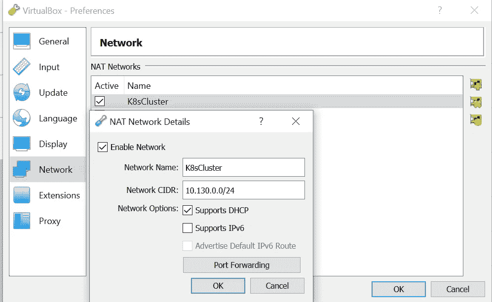

*   要选择网络，请右键单击虚拟机->设置->网络

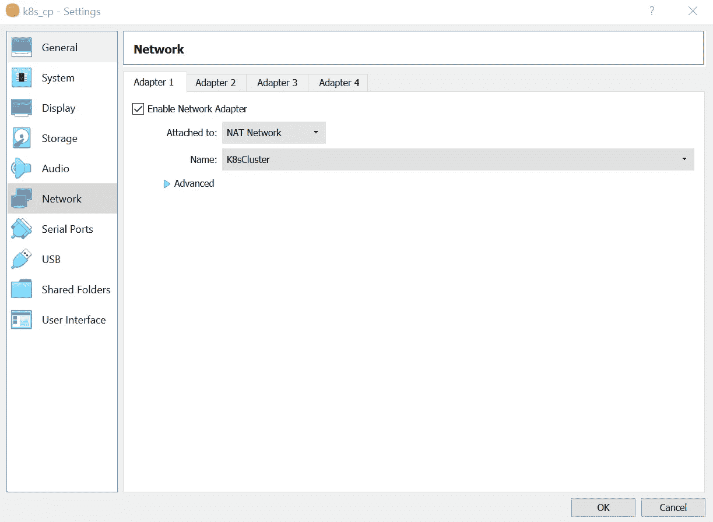

**1.2)安装 Ubuntu 镜像**

首先选择之前下载的 iso 镜像。
选择光盘，右键- >设置- >存储- >光盘选择

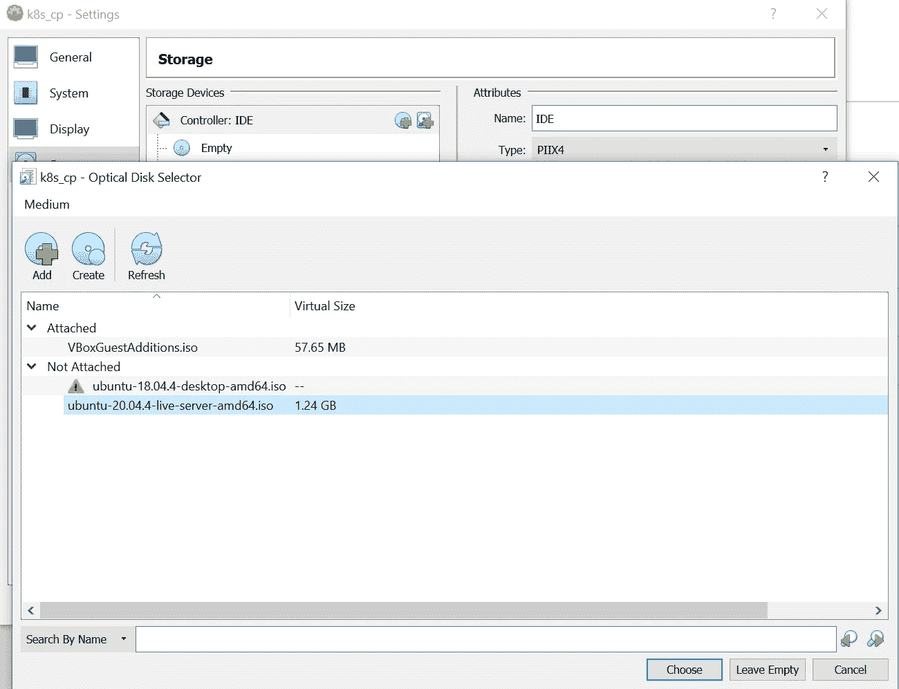

遵循安装步骤(坚持默认设置)直到配置文件设置步骤。
对于你的第一个 k8s 节点，应该是控制平面节点，所以命名如下:
-你的名字:k8scp
-你的服务器名字:k8scp
-挑一个用户名:k8s
-选择一个密码:<你自己的密码>
-确认你的密码:<你自己的密码>

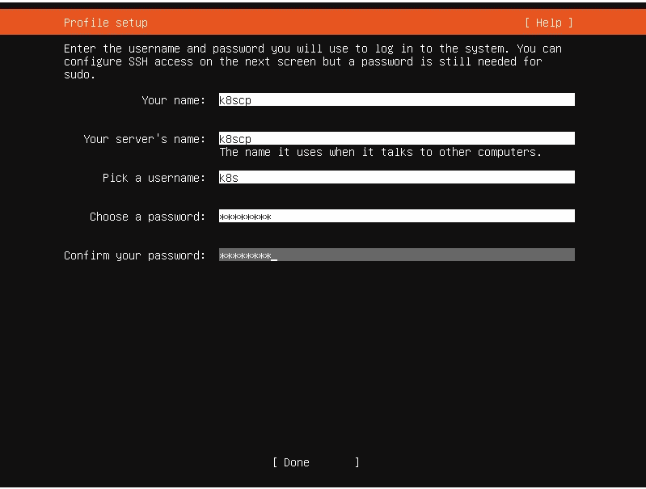

接下来，在 SSH 设置步骤之前，如果需要通过 SSH 访问节点，请选择 Install OpenSSH server。

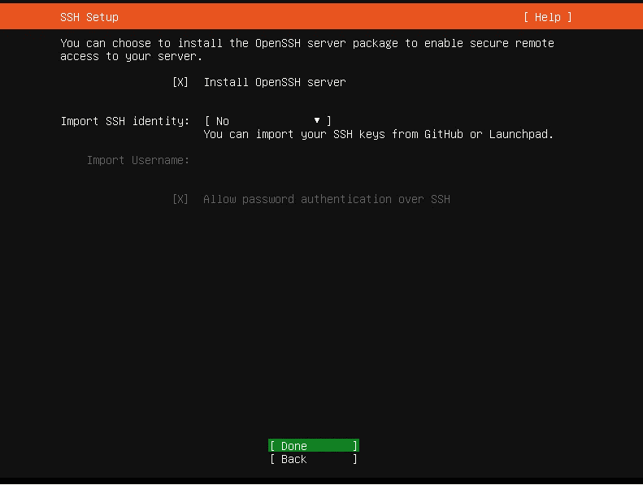

瞧，Ubuntu 安装完成了。

# 2)在 Ubuntu 中安装 Kubernetes

**2.1)工具安装**

我们将安装 Vim 之类的工具，稍后在设置 Kubernetes 时会用到这些工具。

```
sudo -i
apt-get update && apt-get upgrade -y
apt-get install -y vim
```

**2.2)容器运行时接口安装**

Kubernetes 是一个容器编排平台，CRI 是一个与不同容器运行时交互的 Kubernetes API。因此，在安装 Kubernetes 之前，我们需要安装一个容器运行时。

这个例子使用 CRI-O，但是我们也可以安装其他容器运行时，比如使用 containerd 的 Docker。

```
modprobe overlay
modprobe br_netfilter
vim /etc/sysctl.d/k8s.conf
   -> Add the following content into k8s.conf
      net.bridge.bridge-nf-call-iptables = 1 
      net.ipv4.ip_forward = 1 
      net.bridge.bridge-nf-call-ip6tables = 1
sysctl --systemexport OS=xUbuntu_20.04
export VER=1.22
export WEBSITE=http://download.opensuse.orgecho "deb $WEBSITE/repositories/devel:/kubic:/libcontainers:/stable:/cri-o:/$VER/$OS/ /" | tee -a /etc/apt/sources.list.d/cri-0.listcurl -L $WEBSITE/repositories/devel:/kubic:/libcontainers:/stable:/cri-o:/$VER/$OS/Release.key | apt-key add -echo "deb $WEBSITE/repositories/devel:/kubic:/libcontainers:/stable/$OS/ /" | tee -a /etc/apt/sources.list.d/libcontainers.listcurl -L $WEBSITE/repositories/devel:/kubic:/libcontainers:/stable/$OS/Release.key | apt-key add -apt-get update
apt-get install -y cri-o cri-o-runcsystemctl daemon-reload
systemctl enable crio
systemctl start crio
systemctl status crio
```

**2.3) Kubernetes 安装**

在安装 Kubernetes 集群节点时，您将需要`kubeadm` *、*、`kubelet`和`kubectl`。`kubeadm`是我们将用来`init`控制平面节点和`join`工作者节点的工具。`kubelet`是运行每个节点的主节点代理。`kubectl`是一个命令行工具，可以对集群运行命令。

```
vim /etc/apt/sources.list.d/kubernetes.list
   -> Add the following content into kubernetes.list
      deb http://apt.kubernetes.io/ kubernetes-xenial maincurl -s [https://packages.cloud.google.com/apt/doc/apt-key.gpg](https://packages.cloud.google.com/apt/doc/apt-key.gpg) | apt-key add -apt-get updateapt-get install -y kubeadm=1.22.1-00 kubelet=1.22.1-00 kubectl=1.22.1-00apt-mark hold kubelet kubeadm kubectl
```

**2.4)设置网络**

设置网络，以便以后更容易使用主机名而不是 IP 地址。

```
ip addr show
  -> You will see output with 10.130.0.x 
     that will be the NAT Network IpAddressvim /etc/hosts
  -> Add the following content 
     10.130.0.5 k8scp
```

**2.5)创建控制平面节点**

运行`kubeadm init`将创建一个控制平面节点

```
kubeadm init --upload-certs | tee kubeadm-init.out
```

**2.6)设置 Kubernetes 配置**

我们需要设置一个 Kube 配置来访问 Kubernetes 集群。对于本例，我们使用集群管理权限设置 Kube 配置。

```
# Exit from the root account
mkdir -p $HOME/.kube
sudo cp -i /etc/kubernetes/admin.conf $HOME/.kube/config
sudo chown $(id -u):$(id -g) $HOME/.kube/config 
```

**2.7)设置容器网络接口**

实现 Kubernetes 网络模型需要 CNI 插件。对于这个例子，我们使用印花棉布。

```
wget [https://docs.projectcalico.org/manifests/calico.yaml](https://docs.projectcalico.org/manifests/calico.yaml)
kubectl apply -f calico.yaml
```

**2.8)利用控制平面节点**

这是一个可选步骤。在本例中，出于实践的目的，我们将通过删除污点 NoSchedule 来利用控制平面。

```
kubectl describe node | grep -i taint
  -> Default control plane will be set as NoSchedule
     To utilize it we have to remove the taint(For practice purpose)kubectl taint nodes --all node-role.kubernetes.io/master-
```

# 3)添加工人节点

**3.1)重复整个步骤 1 (Ubuntu 映像准备)**
对于您的第二个 k8s 节点，它应该是 worker 节点，因此将其命名如下:
-您的姓名:k8swoker01
-您的服务器的姓名:k8swoker01
-选择用户名:k8s
-选择密码:<您自己的密码>
-确认您自己的密码:<您自己的

**3.2)重复步骤 2 的一部分(在 Ubuntu 中安装 Kubernetes)**
-工具安装
-容器运行时接口安装
- Kubernetes 安装
-设置网络(注意:根据控制平面节点设置 IP 地址和主机名)

**3.3)创建工人节点**

将工作节点与控制平面节点连接起来。我们必须用`kubeadm join`创建一个令牌，并从**控制平面节点**生成一个安全密钥(注意:不是当前的工作节点)。然后用**工作者节点**中的令牌和密钥将`kubeadm join`加入集群。

```
# Go to CP node, it will output the token
sudo kubeadm token create
 -> output
    gexp9v.w1oe77h0yyuls5nh# Still at CP node, it will output a secure key
openssl x509 -pubkey -in /etc/kubernetes/pki/ca.crt | openssl rsa -pubin -outform der 2>/dev/null | openssl dgst -sha256 -hex | sed 's/ˆ.* //'
  -> output 
    6e7f23199360bba5fb80a98992913b417310b97718bb2fbf9ab99bd00b00e9b0# Go to Worker node
kubeadm join --token gexp9v.w1oe77h0yyuls5nh k8scp:6443 --discovery-token-ca-cert-hash sha256:6e7f23199360bba5fb80a98992913b417310b97718bb2fbf9ab99bd00b00e9b0
```

瞧，你已经配置了一个 Kubernetes 集群。

**感谢您的阅读！！**

# 访问集群的可选工具

我经常使用的访问服务器的可选工具是 MobaXterm。因此，这里有一些额外的技巧来帮助轻松访问集群。

为了 SSH 到您的 Ubuntu 服务器，我们必须安装 OpenSSH 并设置主机适配器。

如果我们在安装过程中没有安装 OpenSSH，请安装它。我们可以登录虚拟机来执行`apt install openssh-server`。

```
sudo -i
apt-get update && apt-get upgrade -y
apt install openssh-server
```

为了使它可以从主机访问，我们可以按照设置。我们可以转到 VirtualBox，右键单击虚拟机->设置->网络

适配器 2:使用主机专用适配器，以便主机能够访问虚拟机。

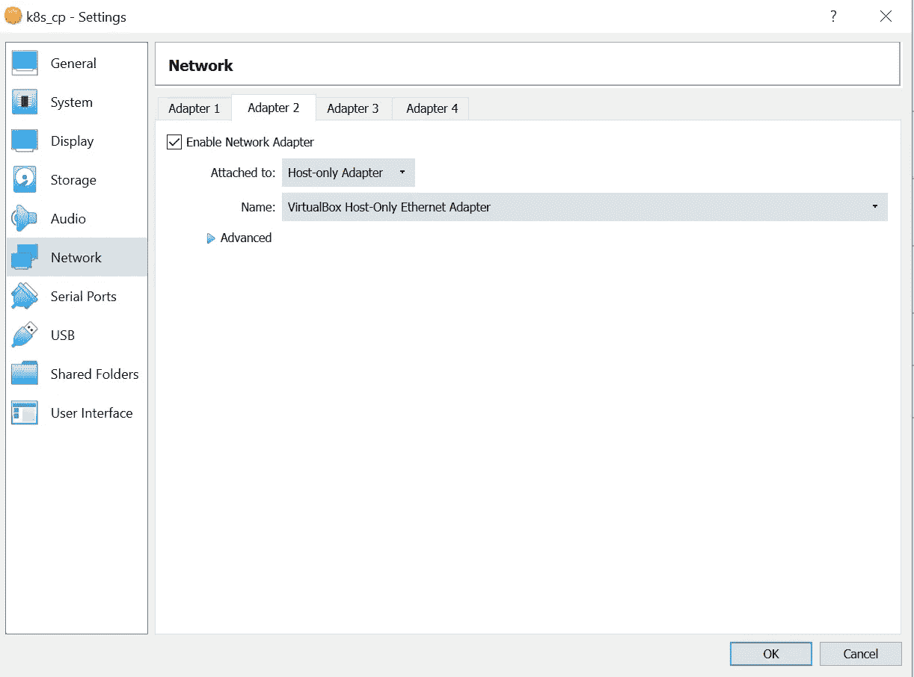

在 Oracle VirtualBox 中，以可拆卸模式启动服务器
要以可拆卸模式启动，右键 VM- >设置- >启动- >可拆卸启动。

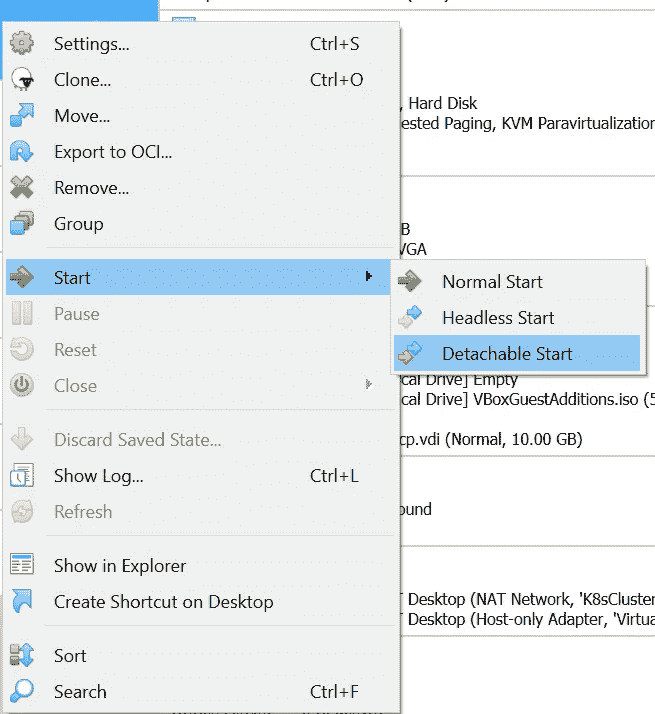

我们将使用下面的命令获取由主机专用适配器分配的 IP 地址。对于这个例子，我的 IP 地址是 192.168.56.105，所以我将使用这个地址通过 MobaXterm 进行 SSH。

```
ip addr show
```

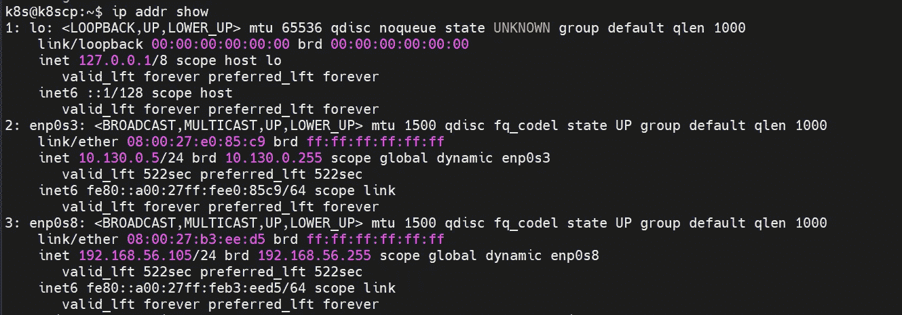

我们可以在服务器启动后关闭虚拟盒子窗口，继续在后台运行。

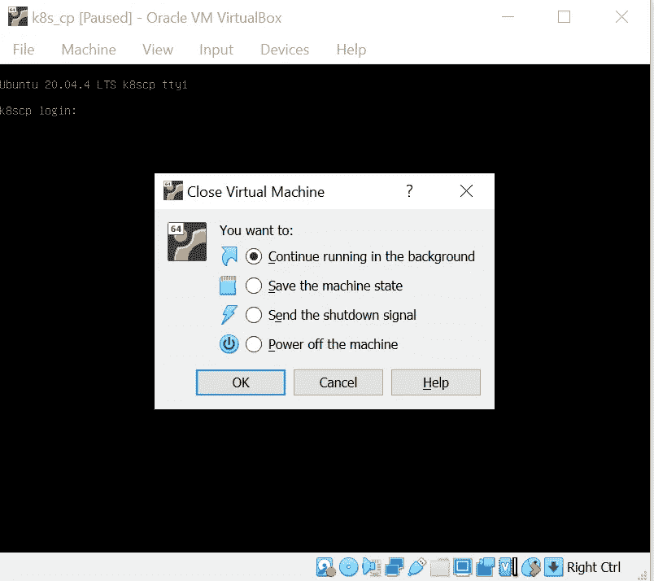

为了设置 MobaXterm 会话，我们将提供远程主机中的 IP 地址和以前用于设置 Ubuntu 服务器的用户名。

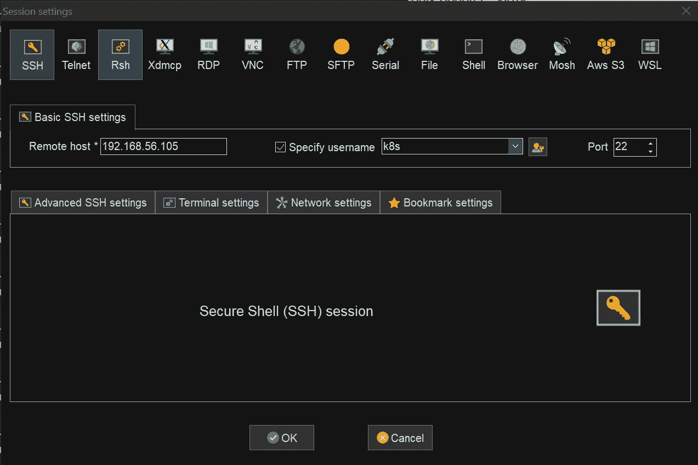

在会话设置之后，我们现在可以通过 MobaXterm 连接到服务器。

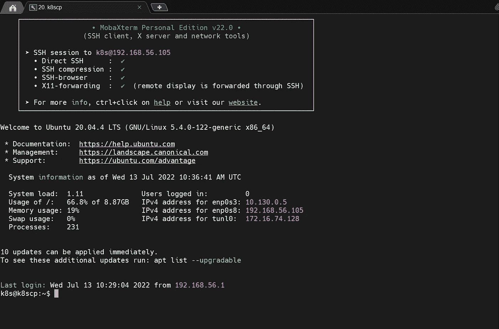

# 分级编码

感谢您成为我们社区的一员！在你离开之前:

*   👏为故事鼓掌，跟着作者走👉
*   📰查看[级编码出版物](https://levelup.gitconnected.com/?utm_source=pub&utm_medium=post)中的更多内容
*   🔔关注我们:[推特](https://twitter.com/gitconnected) | [LinkedIn](https://www.linkedin.com/company/gitconnected) | [时事通讯](https://newsletter.levelup.dev)

🚀👉 [**软件工程师的顶级工作**](https://jobs.levelup.dev/jobs?utm_source=pub&utm_medium=post)