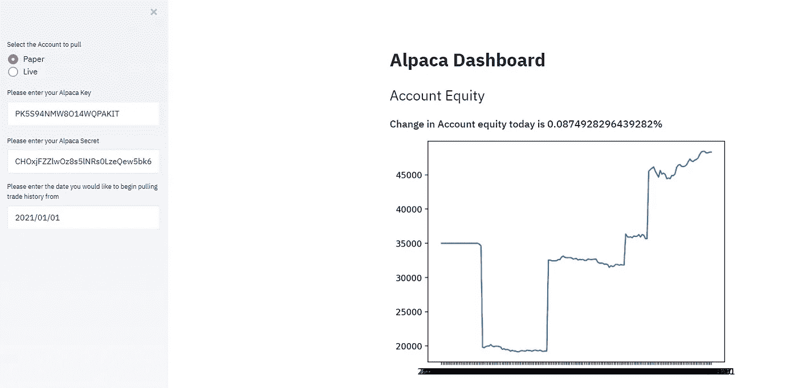
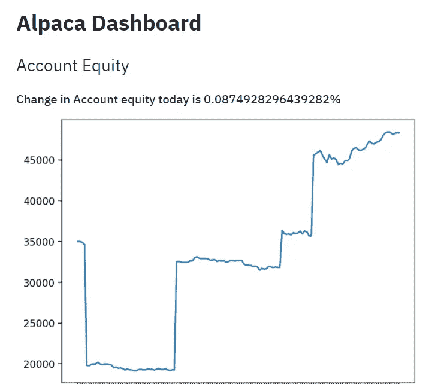
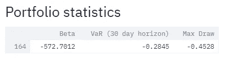
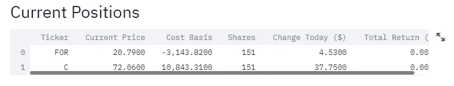
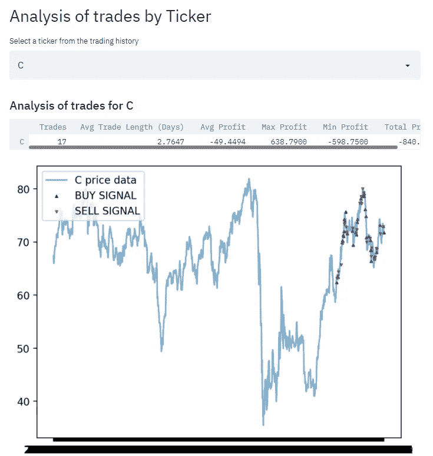
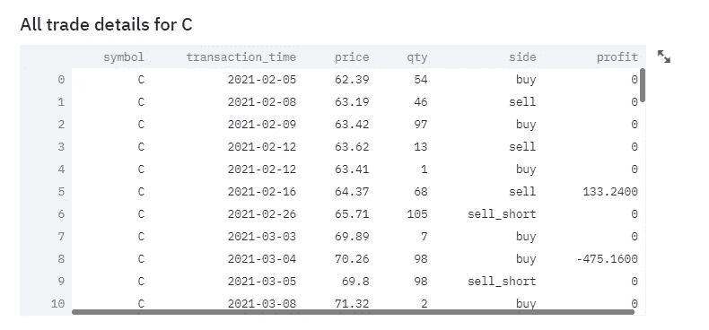

# 羊驼 API Algo 交易平台的简化仪表板

> 原文：<https://levelup.gitconnected.com/a-streamlit-dashboard-for-the-alpaca-api-algo-trading-platform-9a7194aa7844>

## 如何使用羊驼 API、Python 和 Streamlit 来收集您的交易数据，并提供一些简单的金融统计数据

## 与 [Orders](https://medium.com/u/d7a7f01c81e3#get-a-list-of-existing-orders) API 的 list_orders()函数。需要注意的一些重要的[参数](https://alpaca.markets/docs/api-documentation/api-v2/orders/#get-a-list-of-orders)是*状态*和*极限*。*状态*参数默认为“未平仓”,但您的大部分交易将会完成，因此您需要输入“已平仓”或“全部”。*限制*参数是指响应中的最大订单数(默认 50，最大 500)。

该函数将返回羊驼订单对象的列表。每个对象的属性，如股票代码、订单日期、股票数量等。，这些可以通过点符号来访问。这些也可以转换成字典和数据框架。除非你已经执行了大量的交易，500 个订单的限制应该足够了。来自羊驼论坛的一个[主题](https://forum.alpaca.markets/t/easy-way-to-calculate-profit-per-trade-in-python/1708/6)以这种方式给出了一些拉动订单历史的示例代码。如果你的历史记录中有超过 500 笔交易，你需要用另一种方法来收集这些数据。要使用订单 API，您需要进行几次 API 调用，并利用后的*或*直到*的参数来获取所有订单。*

这也可以通过[账户活动 API](https://alpaca.markets/docs/api-documentation/api-v2/account-activities/) 来完成。get_activities()函数也是有限的(100 项)，但是使用这个函数比使用 list_orders()更容易迭代。此函数的 *page_token* 参数允许您使用订单 id(调用返回的数据中的 ID)过滤活动。*方向*参数与 *page_token* 协同工作——将其设置为“desc”将在您输入订单 ID 后为您提供多达 100 个活动，而“asc”将为您提供 100 个之前的活动。下面是一些代码，用于遍历您的历史记录并提取所有订单。它还会计算每笔交易的利润。

除了收集单个订单的数据，您还可以利用[投资组合历史 API](https://alpaca.markets/docs/api-documentation/api-v2/portfolio-history/) 。这将为您提供帐户价值的汇总视图。*周期*参数允许用户以数字和单位的形式设置数据的持续时间。单位可以是 D 代表天，W 代表周，M 代表月，A 代表年，默认值为 1M(该数字决定了有多少个单位将构成提取数据的时间段)。*时间范围*参数设置感兴趣时间段的分辨率，可以设置为 1 分钟、5 分钟、15 分钟、1H 或 1D。例如，如果您将*周期*设置为 3M，将*时间段*设置为 1D，API 调用将为过去 3 个月的每个交易日返回一行。数据中的列将是 Timestamp、profit_loss(以美元为单位的每日利润或损失)、profit_loss_pct(该期间的累计百分比回报)和 equity(帐户值)。

也很容易得到你目前的位置。函数的作用是:返回一个包含许多属性的位置对象列表。羊驼 UI 中缺少的是当天的盈利或亏损——只显示头寸的总盈利或亏损。

## 简化应用程序

对于这个例子，我们只设置了一个羊驼账户，但该应用程序确实包括一个侧边栏，可以选择纸张还是直播，并在下面添加 API 键。我们正在努力能够添加多个纸质账户，并一次分析多个策略。



图片来自 streamlit 应用

一旦你有了数据，你就可以开始分析你以前的交易和现在的投资组合。首先，账户价值与最近一天的收益或损失一起绘制出来。



图片来自 streamlit 应用

Streamlit 应用程序还显示以下指标来评估投资组合的表现:Beta、风险价值和最大提款。



图片来自 streamlit 应用

[Adrian J. Mayer](https://medium.com/u/c1538b8c2e50?source=post_page-----9a7194aa7844--------------------------------) 写了一篇[文章](https://python.plainenglish.io/measure-stock-volatility-using-betas-in-python-d6411612e7bd)很好的描述了 Beta，并举例说明了如何计算。本质上，这个指标是股票回报(或你的投资组合回报)和更广泛的股票市场之间的相关性。这是对投资组合/股票风险的一种衡量。

下一个衡量风险的指标是风险价值(VaR)。此指标估计在给定的置信水平下，您的投资组合在一段时间内可能损失的最大价值。更详细的描述，请看[科斯塔斯·安德里欧](https://medium.com/u/15d64a735e3e?source=post_page-----9a7194aa7844--------------------------------)的这篇[文章](https://medium.com/financeexplained/learn-to-calculate-your-portfolios-value-at-risk-e1e2c5c68456)。请注意，VaR 假设历史收益代表未来收益，但这一假设并不总是成立。因此，尽管 VaR 仍然是一个有用的指标，但还是应该有所保留。

最后,“最大提款”衡量的是投资组合价值从峰值开始的最高降幅。最大压降通常用于策略回溯测试，但在部署后了解策略的风险也很有用。保护你的交易资本是很重要的，所以你要密切关注投资组合价值的下跌，即使损失最终被收回。最大提存有助于捕捉这种波动性，如果你只是看时间周期结束时的整体回报，这种波动性可能会被隐藏。

包括了当前持有的头寸和当前的损益情况。以及该特定位置的一些基本统计数据。



图片来自 streamlit 应用

Streamlit 应用程序还提供每个已交易符号的信息。从下拉列表中选择一个股票代码，会显示股票价格和交易情况。除了图表之外，还提供了交易盈利能力的摘要。



图片来自 Streamlit 应用

最后，最后提供了一个由 ticker 进行的所有交易的数据框架。



## 把所有的放在一起

下面是运行 streamlit 应用程序的 GitHub 代码要点。目前，我们正在分享它，这样你就可以在本地运行它，并按照你的意愿进行定制。

如果这是你的第一个 streamlit 应用程序，它只需要几秒钟就可以运行。

首先，使用 pip 安装 streamlit

```
pip install streamlit
```

其次，在保存 alpaca_dashboard.py 文件或您命名的任何文件的位置，在相同的路径中，使用您的命令提示符，编写以下提示。

```
streamlit run alpaca_dashboard.py
```

然后，它将使用您的本地主机启动仪表板。它有一些默认值，所以你可以看到一个例子。

Streamlit 应用程序的 GitHub 要点

## 结论

Streamlit 是一个方便的工具，可以帮助您更好地了解各种羊驼毛 API 纸质和实时投资组合的情况。羊驼为用户提供的前端在跟踪您当前的持有量方面做得很好，但是如果您正在寻找更深入的分析，您可以利用各种 API 对象和一些 python 来构建它。Streamlit 只是实现这一目标的一个备选方案，我们希望您能够在我们已经完成的工作的基础上继续努力。

一如既往，幸福楼！