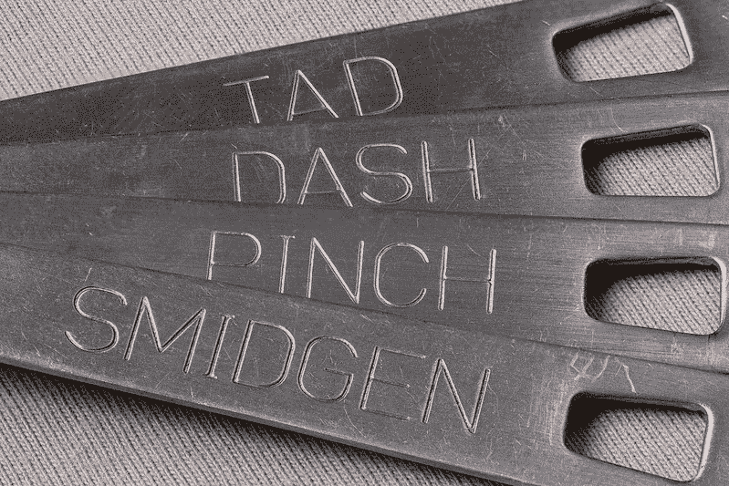

# 利用 Flyway 管理 Spring Boot 数据变更的建议

> 原文：<https://levelup.gitconnected.com/a-suggestion-on-managing-data-changes-in-spring-boot-using-flyway-b87cf87f8e88>


foter.com 上的照片

## 如何使用 Flyway 的版本化和可重复迁移应用全局模式更改和特定于环境的数据更改？

# 介绍

数据库迁移对于应用程序的开发以任何有意义的方式进行和扩展都是必不可少的。

除此之外，迁移保持对数据库的变更*在版本控制中记录*，*自动化，有状态*，也许最重要的是，*可再现*。

> [1]:我不确定 stateful 是不是这个的通用术语。对我来说，有状态迁移意味着查看任何数据库，您都可以知道数据库处于什么“状态”；也就是说，到目前为止应用了哪些迁移。Flyway 通过创建历史表来记录所有尝试的迁移来实现这一点。

# 问题


Arthur Yeti 在 [Unsplash](https://unsplash.com/s/photos/respect?utm_source=unsplash&utm_medium=referral&utm_content=creditCopyText) 上拍摄的照片

虽然*模式*的变化被开发人员“尊重”到足以进行迁移，但是*数据*的变化通常没有那么幸运；数据更改更有可能在个别环境中临时执行。

本质上，这种方法的缺点与迁移方法的优点相反；这些数据变更[经常]没有提交到版本控制中，不是自动化部署管道的一部分，无状态，并且难以跟踪和重现。

当这种数据变更涉及到通常被称为*主数据*的数据时，这些缺点尤其明显；也就是说，应用程序假定、依赖并且可能没有适当的方式来处理它们的缺失的记录。这些数据可能包括用户类型(用户、管理员等)、内容类别或与本地化相关的记录等等。

> 数据更改对最终结果的重要性不亚于应用程序代码或模式的更改，因此应该同等对待。

> [2]:从某种意义上说，查看迁移的历史表，无法判断是否应用了某些数据更改。

# 我们能做什么

一个快速的解决方法是将通过 SQL 完成的任何数据更改提交到代码库中的一个专用位置，并手动应用它们。

虽然这并不完全是有状态的或可自动再现的，但它确实有助于将这样的更改纳入版本控制，并可能使跟踪和再现它们变得更易于管理。

但是我们能做得更好吗？

# 这个建议

一种更干净的方法是将数据更改视为类似于模式更改；一流的数据库迁移。毕竟，数据更改与应用程序代码或模式更改一样对最终结果至关重要，因此应该同等对待。

在 *Flyway* 的上下文中，这转化为将数据更改与其他迁移一起放入 SQL 文件中，无论是*版本化*还是*可重复*。


照片由[威廉·劳斯](https://unsplash.com/@williamrouse?utm_source=unsplash&utm_medium=referral&utm_content=creditCopyText)在 [Unsplash](https://unsplash.com/s/photos/crash?utm_source=unsplash&utm_medium=referral&utm_content=creditCopyText) 拍摄

## 飞行路线迁移速成班

在 Flyway 中，*版本化的*迁移是这样的:1-以 V 开头，2-应用一次，3-应用后不能修改。这种类型是最常见的，通常用于模式迁移。

另一方面，*可重复*迁移是这样的，1-以 R 开始，2-可以应用多次，3-在应用后可以修改。这种类型不太为人所知，建议用于创建视图、过程、函数等。

可重复迁移的挑战是编写 SQL 代码。这种迁移中的代码应该可以安全地多次重新运行，而不会产生意外的副作用，如出错或复制记录。

## 共享数据迁移的选择

对于跨所有环境的共享数据迁移，选择在很大程度上是实际的和个人的。

编写*版本化的*迁移意味着您的主数据可能会被分割到多个文件中，而模式迁移文件位于它们之间。但是，它确实将您从编写可重复的代码中解放出来。

另一方面，编写*可重复的*迁移意味着您的主数据可以全部放在一个文件或多个数据文件中。这也意味着数据更改不会妨碍模式更改，并且与模式更改有很大的区别。然而，它确实需要你编写可重复的代码(这对于 insert 语句来说是很容易管理的，至少我们将在后面看到对于 *MySQL* 。

## 特定于环境的数据迁移选择

对于只应用于特定环境的数据迁移(考虑测试环境的测试数据或开发的虚拟登录凭证)，版本化和可重复迁移之间的权衡同样适用。然而，在这种情况下，版本化迁移还有一个缺点；除了接收版本化迁移的环境之外，其他环境似乎已经“跳过”了一些版本。


foter.com[上的照片](https://foter.com)

## 我的建议

如果我还没有放弃的话，我更喜欢对所有数据变更进行*可重复的*迁移，以保持它们明显不同，在所有环境中保持模式变更的连续版本控制，并保持共享和特定于环境的数据迁移的一致性。

# 细节

关于如何在三种环境中准确地实现这一建议的细节； *Spring Boot 2.x* 中的`dev`、`staging`、`prod`可以概括为:

1-创建以下*属性*文件:
** application . properties
* application-non-prod . properties
* application-dev . properties
* application-staging . properties
* application-prod . properties*

2-在类路径中创建下面的*目录*。在 Spring Boot，您可能知道，`/src/main/resources`下的任何内容都被添加到类路径中:
** db/migration/shared
* db/migration/non-prod
* db/migration/dev
* db/migration/staging
* db/migration/prod*

3-在每个环境的*属性*文件中，覆盖`spring.flyway.locations`属性，该属性接受逗号分隔的位置列表。在 Spring Boot，默认位置是`db/migration`。

我们希望以这样的方式修改迁移位置:
`dev`从*共享*、*非生产*和*开发*目录中读取迁移。
`staging`从*共享*、*非生产*和*暂存*目录中读取迁移。
`prod`仅从*共享*和*生产*目录中读取迁移。

这可以通过如下设置 locations 属性来实现:

*在`application-dev.properties`中，设置:

```
spring.flyway.locations=classpath:/db/migration/shared,classpath:/db/migration/non-prod,classpath:/db/migration/dev
```

*在`application-staging.properties`中，设置:

```
spring.flyway.locations=classpath:/db/migration/shared,classpath:/db/migration/non-prod,classpath:/db/migration/staging
```

*在`application-prod.properties`中，设置:

```
spring.flyway.locations=classpath:/db/migration/shared,classpath:/db/migration/prod
```

4-对于任何数据库更改，遵循以下约定:
*是模式更改吗？在*共享*目录中创建一个*版本化的*迁移。
*是主数据变更吗？在*共享*目录中创建一个*可重复*迁移或更新一个现有的迁移。
*这是一种不应该进入生产环境但在其他环境中却可以的数据更改吗？在*非生产*目录中创建一个*可重复*迁移或更新一个现有的迁移。
*是特定于`dev`、`staging`还是`prod`环境的数据变更？分别在 *dev* 、 *staging* 或 *prod* 目录中创建一个*可重复*迁移或更新一个现有的迁移。



foter.com[上的照片](https://foter.com)

# 一个示例实现

为了创建一个最小的应用程序来测试这个设置，我们可以从一个空的 Spring Boot 项目开始，这个项目至少包含以下依赖项:`spring-boot-starter-web`、`spring-boot-starter-data-jpa`、`flyway-core`和`mysql-connector-java`，并完成以下步骤:

1-确保您有一个在默认端口 *3306* 上本地运行的 *MySQL* 服务器，用户名为 *root* ，没有密码，或者根据您的个人设置在本教程中更改值。

1.1-访问 *MySQL* 服务器:

```
mysql -u root
```

1.2-然后使用以下内容创建`dev`、`staging`和`prod`数据库:

```
CREATE DATABASE managing_flyway_migrations_dev;
CREATE DATABASE managing_flyway_migrations_staging;
CREATE DATABASE managing_flyway_migrations_prod;
```

2-在`/src/main/resources`下创建*属性*文件。
2.1-创建一个名为`application.properties`的文件，内容如下:

```
spring.jpa.open-in-view=false# Change this value to 1.2 for the Third Run or remove all together
spring.flyway.target=1.1
```

2.2-创建一个名为`application-non-prod.properties`的空文件。

2.3-创建一个名为`application-dev.properties`的文件，内容如下:

```
spring.profiles.include=non-prodserver.port=8081spring.datasource.url=jdbc:mysql://localhost:3306
spring.datasource.username=root
spring.datasource.password=
spring.datasource.name=managing_flyway_migrations_devspring.flyway.locations=classpath:/db/migration/shared,classpath:/db/migration/non-prod,classpath:/db/migration/dev
spring.flyway.schemas=${spring.datasource.name}
```

2.4-创建一个名为`application-staging.properties`的文件，内容如下:

```
spring.profiles.include=non-prodserver.port=8082spring.datasource.url=jdbc:mysql://localhost:3306
spring.datasource.username=root
spring.datasource.password=
spring.datasource.name=managing_flyway_migrations_stagingspring.flyway.locations=classpath:/db/migration/shared,classpath:/db/migration/non-prod,classpath:/db/migration/staging
spring.flyway.schemas=${spring.datasource.name}
```

2.5-创建一个名为`application-prod.properties`的文件，内容如下:

```
server.port=8083spring.datasource.url=jdbc:mysql://localhost:3306
spring.datasource.username=root
spring.datasource.password=
spring.datasource.name=managing_flyway_migrations_prodspring.flyway.locations=classpath:/db/migration/shared,classpath:/db/migration/prod
spring.flyway.schemas=${spring.datasource.name}
```

3-在`src/main/resources/db/migration`下创建迁移文件。
3.1-在`shared`下，创建一个名为`V1_1__Initial_Schema.sql`的文件，内容如下:

```
CREATE TABLE roles (
    id   BIGINT NOT NULL AUTO_INCREMENT,
    name VARCHAR(100),PRIMARY KEY (id)
);CREATE TABLE users (
    id   BIGINT NOT NULL AUTO_INCREMENT,
    name VARCHAR(255),
    role_id BIGINT NOT NULL,PRIMARY KEY (id),FOREIGN KEY (role_id) REFERENCES roles (id)
);CREATE TABLE content_categories (
    id BIGINT NOT NULL,
    name VARCHAR(255) NOT NULL,PRIMARY KEY (id)
);CREATE TABLE content (
    id BIGINT NOT NULL AUTO_INCREMENT,
    name VARCHAR(255),
    category_id BIGINT NOT NULL,PRIMARY KEY (id),FOREIGN KEY (category_id) REFERENCES content_categories(id)
);
```

3.2-在`shared`下，创建一个名为`V1_2__Add_content_topic.sql`的文件，内容如下:

```
CREATE TABLE content_topics (
    id BIGINT NOT NULL,
    name VARCHAR(255) NOT NULL,PRIMARY KEY (id)
);ALTER TABLE content
    ADD COLUMN topic_id BIGINT,
    ADD CONSTRAINT FOREIGN KEY (topic_id) REFERENCES content_topics(id);
```

3.3-在`shared`下，创建一个名为`R__1_Master_Data.sql`的文件，内容如下:

```
INSERT INTO
    roles (id, name)
    VALUES (1, 'System'), (2, 'Admin'), (3, 'User')
    ON DUPLICATE KEY UPDATE id=id, name=*VALUES*(`name`);INSERT INTO
    content_categories (id, name)
    VALUES (1, 'Category 1'), (2, 'Category 2')
    ON DUPLICATE KEY UPDATE id=id, name=*VALUES*(`name`);# INSERT statements for the First Run
# Comment out for the Third Run
####################################################################
INSERT INTO
    content (id, name, category_id)
VALUES (1, 'Content 1.1', 1), (2, 'Content 1.2', 1),
       (3, 'Content 2.1', 2), (4, 'Content 2.2', 2)
ON DUPLICATE KEY UPDATE id=id, name=*VALUES*(`id`), category_id=*VALUES*(`category_id`);
##################################################################### INSERT statements for the Third Run
# Uncomment for the Third Run
####################################################################
# INSERT INTO
#     content_topics (id, name)
#     VALUES (1, 'Topic 1'), (2, 'Topic 2')
#     ON DUPLICATE KEY UPDATE id=id, name=VALUES(`name`);
#
# INSERT INTO
#     content (id, name, category_id, topic_id)
# VALUES (1, 'Content 1.1', 1, 1), (2, 'Content 1.2', 1, 2),
#        (3, 'Content 2.1', 2, 2), (4, 'Content 2.2', 2, 1)
# ON DUPLICATE KEY UPDATE id=id, name=VALUES(`name`), category_id=VALUES(`category_id`), topic_id=VALUES(`topic_id`);
####################################################################
```

**注意**:注意这个迁移是以`R.`开始的，这就是为什么它是一个*可重复的*迁移。

**注 2** :注意，迁移名称中的数字既不必要，也不表示特定的版本。我在数据迁移的*描述*中使用数字只是为了对它们的执行进行排序。 *Flyway* 首先根据版本执行*版本化*迁移，然后根据*描述*按字母顺序执行*可重复*迁移。

3.4-在`non-prod`下，创建一个名为`R__2_Non_prod_login.sql`的文件，内容如下:

```
INSERT INTO
    users (id, name, role_id)
    VALUES (201, 'SuperAdmin', 1)
    ON DUPLICATE KEY UPDATE id=id, name=*VALUES*(`name`), role_id=*VALUES*(`role_id`);
```

3.5-在`dev`下，创建一个名为`R__3_Dev_login.sql`的文件，内容如下:

```
INSERT INTO
    users (id, name, role_id)
    VALUES (301, 'Developer 1', 2), (302, 'Developer 2', 2)
    ON DUPLICATE KEY UPDATE id=id, name=*VALUES*(`name`), role_id=*VALUES*(`role_id`);
```

3.6-在`staging`下，创建一个名为`R__3_Staging_login.sql`的文件，内容如下:

```
INSERT INTO
    users (id, name, role_id)
    VALUES (301, 'QA 1', 3), (302, 'QA 2', 3)
    ON DUPLICATE KEY UPDATE id=id, name=*VALUES*(`name`), role_id=*VALUES*(`role_id`);
```

到目前为止，我们已经拥有了第一次运行所需的所有代码和配置。


照片由[法比奥·康帕雷利](https://unsplash.com/@intothefab?utm_source=unsplash&utm_medium=referral&utm_content=creditCopyText)在 [Unsplash](https://unsplash.com/s/photos/run?utm_source=unsplash&utm_medium=referral&utm_content=creditCopyText) 上拍摄

# 首轮放映

在第一次运行中，我们将执行`1.1` *版本化的*迁移以及其他*重复的*迁移，以模拟具有初始数据库模式和数据的部署。

在这些测试中区分*运行*的两个重要位置是`application.properties`中的*飞行路线*目标和`R__1_Master_Data.sql`中的*插入*语句。如果你使用附带的 [*GitHub*](https://github.com/sayadi/managing-flyway-migrations-spring-boot) 库，确保你在`first-run`分支上。

## 测试“开发”概况

在`dev`配置文件激活的情况下运行应用程序:

```
mvn spring-boot:run -Dspring.profiles.active=dev
```

到目前为止，我们期待一些事情:
*应用了*版本化的*迁移`V1_1__Initial_Schema.sql`。
*未应用*版本化的*迁移`V1_2__Add_content_topic.sql`(因为我们将目标设置为`1.1`)。
*共享*重复*迁移`R__1_Master_Data.sql`被应用。
*非生产*重复*迁移`R__2_Non_prod_login.sql`被应用。
* dev*重复*迁移`R__3_Dev_login.sql`被应用。

***使用开发数据库***

```
USE  managing_flyway_migrations_dev;
```

***查看历史表***

为了验证这一点，我们检查了 Flyway 通过在我们的数据库服务器中运行以下命令而创建的`flyway_schema_history`:

```
SELECT installed_rank, version, description, success FROM flyway_schema_history;
```

上面的*选择*语句的输出应该如下所示:

```
+----------------+---------+------------------+---------+
| installed_rank | version | description      | success |
+----------------+---------+------------------+---------+
|              1 | 1.1     | Initial Schema   |       1 |
|              2 | NULL    | 1 Master Data    |       1 |
|              3 | NULL    | 2 Non prod login |       1 |
|              4 | NULL    | 3 Dev login      |       1 |
+----------------+---------+------------------+---------+
```

***检查内容表***

*内容*表应包含我们插入*主数据*中的记录，如下所示:

```
SELECT * FROM content;
```

这应该会输出:

```
+----+-------------+-------------+
| id | name        | category_id |
+----+-------------+-------------+
|  1 | Content 1.1 |           1 |
|  2 | Content 1.2 |           1 |
|  3 | Content 2.1 |           2 |
|  4 | Content 2.2 |           2 |
+----+-------------+-------------+
```

***查看用户表***

在*用户*表中，我们应该看到来自我们定义的*非生产登录*(超级管理员)以及*开发登录*迁移的记录。运行命令:

```
SELECT * FROM users;
```

这应该会输出:

```
+-----+-------------+---------+
| id  | name        | role_id |
+-----+-------------+---------+
| 201 | SuperAdmin  |       1 |
| 301 | Developer 1 |       2 |
| 302 | Developer 2 |       2 |
+-----+-------------+---------+
```

我将测试`staging`概要文件的工作留给读者，因为它与本节中描述的测试几乎相同。

现在，让我们继续测试生产！

## 测试“`prod`”配置文件

在`prod`配置文件激活的情况下运行应用程序:

```
mvn spring-boot:run -Dspring.profiles.active=prod
```

到目前为止，我们期望一些事情:
*应用了*版本化的*迁移`V1_1__Initial_Schema.sql`。
*未应用*版本化的*迁移`V1_2__Add_content_topic.sql`。
*共享*重复*迁移`R__1_Master_Data.sql`被应用。

***使用 Prod 数据库***

```
USE  managing_flyway_migrations_prod;
```

***查看历史表***

为了验证这一点，我们检查了 Flyway 通过在我们的数据库服务器中运行以下代码创建的`flyway_schema_history`:

```
SELECT installed_rank, version, description, success FROM flyway_schema_history;
```

上面的 *SELECT* 语句的输出应该如下所示:

```
+----------------+---------+----------------+---------+
| installed_rank | version | description    | success |
+----------------+---------+----------------+---------+
|              1 | 1.1     | Initial Schema |       1 |
|              2 | NULL    | 1 Master Data  |       1 |
+----------------+---------+----------------+---------+
```

请注意，在生产中，我们没有在非生产、开发或试运行中定义任何测试凭证。

***检查内容表***

*内容*表应包含我们在*主数据*中插入的记录，类似于我们在`dev`中看到的:

```
SELECT * FROM content;
```

这应该会输出:

```
+----+-------------+-------------+
| id | name        | category_id |
+----+-------------+-------------+
|  1 | Content 1.1 |           1 |
|  2 | Content 1.2 |           1 |
|  3 | Content 2.1 |           2 |
|  4 | Content 2.2 |           2 |
+----+-------------+-------------+
```

***查看用户表***

*用户*表应该为空:

```
SELECT * FROM users;
```

这应该会输出:

```
Empty set (0.00 sec)
```


[钱德尔 R](https://unsplash.com/@chanderr?utm_source=unsplash&utm_medium=referral&utm_content=creditCopyText) 在 [Unsplash](https://unsplash.com/s/photos/run?utm_source=unsplash&utm_medium=referral&utm_content=creditCopyText) 上拍照

# 二轮放映

在这次运行中，我们模拟应用程序重启或不包含迁移更改的部署。在这里，我们真正测试的是 *Flyway 的*行为。

## 测试“开发”概况

停止并重新运行`dev`应用程序:

```
mvn spring-boot:run -Dspring.profiles.active=dev
```

## 测试“T2”的档案

停止并重新运行`prod`应用程序:

```
mvn spring-boot:run -Dspring.profiles.active=prod
```

## 结果

在 Spring 每次运行时生成的日志流中，查找包含以下内容的行:

```
Schema `managing_flyway_migrations_dev` is up to date. No migration necessary.
```

这告诉我们 *Flyway* 检测到没有对迁移进行更改，因此它没有采取任何行动。请注意，即使是*可重复的*迁移也被 *Flyway* 重新应用；这是因为文件及其校验和没有改变。

重启后，在继续进行*第三次运行*之前，随意浏览表中的记录，以验证实际上没有任何变化。


[安德鲁·唐劳](https://unsplash.com/@andrewtanglao?utm_source=unsplash&utm_medium=referral&utm_content=creditCopyText)在 [Unsplash](https://unsplash.com/s/photos/run?utm_source=unsplash&utm_medium=referral&utm_content=creditCopyText) 上的照片

# 第三轮

现在，让我们模拟一个对*版本化*和*可重复*迁移都进行了更改的部署。

在`application.properties`文件中，将`spring.flyway.target`属性改为`1.2`或将其全部删除。这将导致 *Flyway* 应用我们拥有的第二个*版本化的*迁移；`V1_2__Add_content_topic.sql`。

在`R__1_Master_Data.sql`中，注释掉第一次运行*、*的程序块，并取消注释第三次运行*、*的程序块。请注意，在实际的应用程序中，您实际上是在修改现有的代码，而不是注释内容。

如果您使用的是 *GitHub* 库，只需*签出*分支`third-run`即可。

## 测试“开发”概况

与前面的步骤类似，停止并重新运行`dev`应用程序:

```
mvn spring-boot:run -Dspring.profiles.active=dev
```

到目前为止，我们预计会发生很多事情:
*版本化的*迁移`V1_1__Initial_Schema.sql`没有被**重新应用。
*应用了*版本化*迁移`V1_2__Add_content_topic.sql`。
*共享*重复*迁移`R__1_Master_Data.sql`被重新应用(因为它被更改)。
*非生产*重复*迁移`R__2_Non_prod_login.sql`被**未**重新应用(因为它未被更改)。
* dev*重复*迁移`R__3_Dev_login.sql`被**未**重新应用。***

***使用 Dev 数据库***

```
USE  managing_flyway_migrations_dev;
```

***查看历史表***

与前面的测试类似，运行:

```
SELECT installed_rank, version, description, success FROM flyway_schema_history;
```

上面的*选择*语句的输出应该如下所示:

```
+----------------+---------+-------------------+---------+
| installed_rank | version | description       | success |
+----------------+---------+-------------------+---------+
|              1 | 1.1     | Initial Schema    |       1 |
|              2 | NULL    | 1 Master Data     |       1 |
|              3 | NULL    | 2 Non prod login  |       1 |
|              4 | NULL    | 3 Dev login       |       1 |
|              5 | 1.2     | Add content topic |       1 |
|              6 | NULL    | 1 Master Data     |       1 |
+----------------+---------+-------------------+---------+
```

请注意等级为`5`的`1.2` *版本化*迁移，以及修改后的*主* *数据*迁移在`6`的重新应用。

***检查内容表***

*内容*表应包含我们在修改后的*主数据中插入的记录，*包括新迁移引入的新 *topic_id* 列:

```
SELECT * FROM content;
```

这应该会输出:

```
+----+-------------+-------------+----------+
| id | name        | category_id | topic_id |
+----+-------------+-------------+----------+
|  1 | Content 1.1 |           1 |        1 |
|  2 | Content 1.2 |           1 |        2 |
|  3 | Content 2.1 |           2 |        2 |
|  4 | Content 2.2 |           2 |        1 |
+----+-------------+-------------+----------+
```

***查看用户表***

自上次运行以来，*用户*表不会发生变化:

```
SELECT * FROM users;
```

这应该会输出:

```
+-----+-------------+---------+
| id  | name        | role_id |
+-----+-------------+---------+
| 201 | SuperAdmin  |       1 |
| 301 | Developer 1 |       2 |
| 302 | Developer 2 |       2 |
+-----+-------------+---------+
```

## 测试“`prod`”配置文件

同样，停止并重新运行`prod`应用程序:

```
mvn spring-boot:run -Dspring.profiles.active=prod
```

到目前为止，我们预期如下:
*版本化的*迁移`V1_1__Initial_Schema.sql`未被**重新应用。
*应用了*版本化的*迁移`V1_2__Add_content_topic.sql`。
*共享*重复*迁移`R__1_Master_Data.sql`被重新申请。***

***使用 Prod 数据库***

```
USE  managing_flyway_migrations_prod;
```

***查看历史表***

两个新记录应该显示在`flyway_schema_history`表中:

```
SELECT installed_rank, version, description, success FROM flyway_schema_history;
```

上面的*选择*语句的输出应该如下所示:

```
+----------------+---------+-------------------+---------+
| installed_rank | version | description       | success |
+----------------+---------+-------------------+---------+
|              1 | 1.1     | Initial Schema    |       1 |
|              2 | NULL    | 1 Master Data     |       1 |
|              3 | 1.2     | Add content topic |       1 |
|              4 | NULL    | 1 Master Data     |       1 |
+----------------+---------+-------------------+---------+
```

***检查内容表***

与`dev`类似，*内容*记录应该包含新的`topic_id`列:

```
SELECT * FROM content;
```

这应该会输出:

```
+----+-------------+-------------+----------+
| id | name        | category_id | topic_id |
+----+-------------+-------------+----------+
|  1 | Content 1.1 |           1 |        1 |
|  2 | Content 1.2 |           1 |        2 |
|  3 | Content 2.1 |           2 |        2 |
|  4 | Content 2.2 |           2 |        1 |
+----+-------------+-------------+----------+
```

***查看用户表***

*用户*表应该仍然是空的:

```
SELECT * FROM users;
```

这应该会输出:

```
Empty set (0.00 sec)
```


照片由 [Aw 创意](https://unsplash.com/@awcreativeut?utm_source=unsplash&utm_medium=referral&utm_content=creditCopyText)在 [Unsplash](https://unsplash.com/s/photos/finish-line?utm_source=unsplash&utm_medium=referral&utm_content=creditCopyText) 上拍摄

# 干净运行

最后，让我们在这个阶段模拟应用程序的全新安装。这模拟了在一个新的环境中，在一个空的数据库中，或者在一个新的*本地*开发机器上刚刚建立项目时，迁移是如何工作的。

让我们改变一下这里的`staging`环境。我们将假设我们刚刚用当前代码和一个新数据库设置了`staging`:

```
DROP DATABASE managing_flyway_migrations_staging;
CREATE DATABASE managing_flyway_migrations_staging;
```

现在运行`staging`应用程序:

```
mvn spring-boot:run -Dspring.profiles.active=staging
```

由此，我们期望如下:
*应用了*版本化的*迁移`V1_1__Initial_Schema.sql`。
*应用了*版本化的*迁移`V1_2__Add_content_topic.sql`。
*应用了*共享* *重复*迁移`R__1_Master_Data.sql`。
*应用了*非生产* *重复*迁移`R__2_Non_prod_login.sql`。
*应用了*暂存* *重复*迁移`R__3_Staging_login.sql`。

***使用暂存数据库***

```
USE  managing_flyway_migrations_staging;
```

**查历史表*查历史表***

*两个新记录应该显示在`flyway_schema_history`表中:*

```
*SELECT installed_rank, version, description, success FROM flyway_schema_history;*
```

*上面的 *SELECT* 语句的输出应该如下所示:*

```
*+----------------+---------+-------------------+---------+
| installed_rank | version | description       | success |
+----------------+---------+-------------------+---------+
|              1 | 1.1     | Initial Schema    |       1 |
|              2 | 1.2     | Add content topic |       1 |
|              3 | NULL    | 1 Master Data     |       1 |
|              4 | NULL    | 2 Non prod login  |       1 |
|              5 | NULL    | 3 Staging login   |       1 |
+----------------+---------+-------------------+---------+*
```

***注意** *:* 注意*主数据*迁移应用一次。此外，请注意，这工作得很好，因为*重复的*迁移总是在 **应用了所有** *版本化的*迁移之后**运行。***

****检查内容表****

**内容*表应该已经有了所有的修改，包括`topic_id`列:*

```
*SELECT * FROM content;*
```

*这应该会输出:*

```
*+----+-------------+-------------+----------+
| id | name        | category_id | topic_id |
+----+-------------+-------------+----------+
|  1 | Content 1.1 |           1 |        1 |
|  2 | Content 1.2 |           1 |        2 |
|  3 | Content 2.1 |           2 |        2 |
|  4 | Content 2.2 |           2 |        1 |
+----+-------------+-------------+----------+*
```

****检查用户表****

**用户*表应包含来自*非生产登录*和*临时登录*迁移的记录:*

```
*SELECT * FROM users;*
```

*这应该会输出:*

```
*+-----+------------+---------+
| id  | name       | role_id |
+-----+------------+---------+
| 201 | SuperAdmin |       1 |
| 301 | QA 1       |       3 |
| 302 | QA 2       |       3 |
+-----+------------+---------+*
```

# *代码*

*如果你想轻松地进行测试，我已经在 GitHub 上准备了相同的设置:[https://GitHub . com/saya di/managing-fly way-migrations-spring-boot](https://github.com/sayadi/managing-flyway-migrations-spring-boot/branches)。*

# *最后一句话*

*虽然这种设置有效，但它是我为这篇文章构思的，作为我看到的一个重复问题的解决方案。然而，我们还没有机会在生产应用程序上测试这一点。*

*如果你最终在实际设置中使用它，请在下面的评论中让我知道哪些对你有效，哪些无效，以及你可能需要做哪些改变。感谢阅读！*