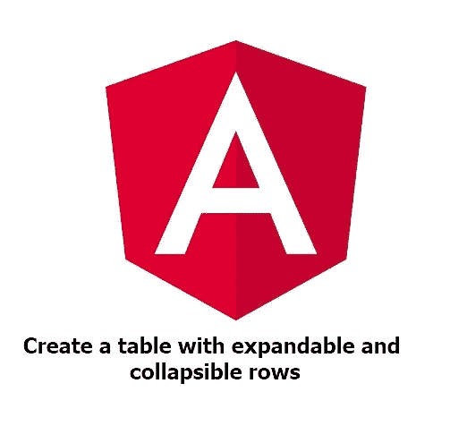
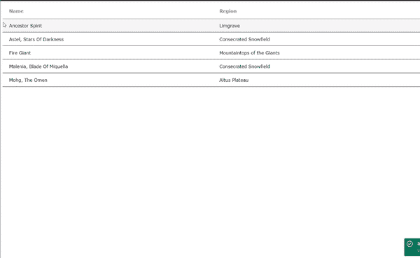

# 具有可展开和可折叠行的表格，使用角

> 原文：<https://levelup.gitconnected.com/a-table-with-expandable-and-collapsible-rows-using-angular-59af3bdd8fd1>



在本文中，我将向您介绍如何在 Angular 中创建了一个具有可展开和可折叠行的表。我写这篇文章的动机是基于我在尝试为一个项目创建这样一个表时的个人经历。我在 Angular 文档中找到了一些代码示例，但是没有很多关于事情如何工作的解释。因此，我发现自己在看这个例子时有点困惑，不确定如何将这些信息应用到我的用例中。

经过大量的实验、反复试验以及我能找到的其他一些例子，我找到了一个符合我需要的解决方案。我希望这篇文章能够很好地解释如何在 Angular 中构建一个包含可展开和可折叠行的表。

希望使用具有可扩展行的表的一个原因是，如果您想显示大量数据，但又不想一次显示所有数据而让人不知所措。表格行的外部可以作为标题，而可扩展部分在单击时可以作为包含您想要有条件显示的附加详细信息的部分。

对于这个演示，我决定使用开源的 fan 制造的 Elden Ring API 来填充我们将在示例中看到的表格([https://eldenring.fanapis.com/](https://eldenring.fanapis.com/))。这个例子的存储库可以在[这里](https://github.com/mwiginton/angular-table-expand-collapse-example)找到。现在让我们看看如何创建这样一个例子，以及它是如何工作的。

## 新项目设置

你要做的第一件事是创建一个新的角度项目。您可以通过运行下面的命令`ng new angular-expand-collapse-example`来做到这一点。你可以给你的项目起任何你喜欢的名字。在我们的例子中，我们的项目名为`angular-table-expand-collapse-example`

一旦您的项目被创建，通过执行命令`cd angular-expand-collapse-example`导航到您的项目目录。在此目录中，您将需要安装 Angular material 和 Angular animations 依赖项，因为我们需要这两者来创建我们的表格以及用于展开和折叠行的动画。

```
npm install --save @angular/material
npm install --save @angular/animations
```

一旦成功安装了这些依赖项，您就可以将`BrowserAnimationModule`导入到您的`app.module.ts`文件中。我们稍后将把`MatTableModule`导入到我们将要创建的一个单独的模块中。

```
import {BrowserAnimationsModule} from '@angular/platform-browser/animations';@NgModule({
...
  imports: [BrowserAnimationsModule],
...
})
export class AppModule { }
```

## 设置我们的组件和模块

我们项目的下一步将是创建组件，我们将在其中创建我们的表。我在子目录`pages`中创建了我的组件，但是它可以创建在最适合你的任何结构中。我们通过执行下面的命令`ng generate component pages/table-expand-collapse`生成一个组件

创建组件后，我们将为该组件创建一个新模块。在这种情况下，模块名的标题是`table-expand-collapse.module.ts`，它和组件一起位于我们的`table-expand-collapse`目录中。在这个模块中我们还可以导入我们的`MatTableModule`。新创建的模块将如下所示

## 设置基本路由

现在我们已经为组件创建了一个模块，让我们来设置基本的路由功能。在我们的`app`目录中，我们可以创建我们的`app-routing.module.ts`文件，如下例所示。

然后我们的`AppRoutingModule`需要被导入到我们的`app.module.ts`中

```
import { AppRoutingModule } from './app-routing.module';@NgModule({
...
  imports: [AppRoutingModule],
...
})
export class AppModule { }
```

我们的下一步是为我们的`TableExpandCollapseComponent`创建路由模块。本例中的文件名为`table-expand-collapse-routing.module.ts`，如下所示

配置路由的最后步骤是将我们的`TableExpandCollapseRoutingModule`导入到我们的`TableExpandCollapseModule`中，如下所示

```
import { TableExpandCollapseRoutingModule } from './table-expand-collapse-routing.module';@NgModule({
...
  imports: [TableExpandCollapseRoutingModule],
...
})
export class TableExpandCollapseModule{ }
```

最后，在我们的`app.component.html`文件中，删除所有的样板文件内容，只包含下面的`<router-outlet></router-outlet>`

## 创建我们的服务类

在开始设置我们的表之前，我们需要执行的最后一步是创建我们的服务类。我们的服务类是我们消费 API 的地方，API 最终获取我们将用来填充表的数据。我们在这种情况下使用的 API 是前面提到的 fan 制造的开源 Elden Ring API，我们将使用它来检索 Elden Ring 中的 bosses 列表，以显示在我们的表中。在我们的例子中，我们的服务类创建在子目录`services`中。我们可以通过执行下面的命令`ng generate service services/table`来生成一个新服务

在我们的`TableService`类中，我们可以创建我们的函数`getBosses()`，它将使用我们的 API 来检索 Elden Ring bosses 的列表。我们演示中的服务将如下所示

您会注意到，为了发出 http 请求，我们需要在服务文件中导入`HttpClient`。我们还需要在我们的`AppModule`中导入`HttpClientModule`

```
import { HttpClientModule } from '@angular/common/http';@NgModule({
...
  imports: [HttpClientModule],
...
})
export class AppModule { }
```

## 创建我们的表

现在我们已经有了一个包含路由、组件和服务的基本项目，我们现在可以处理逻辑来创建我们的表。在我们的`table-expand-collapse.component.html`文件中，我们可以看到负责在网页上呈现和显示表格的 html 代码。在文件的最上面，我们的表是用`mat-table`定义的，让我们知道这是一个有角度的材料表。接下来我们可以看到我们的`dataSource`，它包含了用来填充我们的表的数据。您将在我们的表定义顶部看到的最后一个关键字是`multiTemplateDataRows`。这让我们知道，我们的表中将有一个可扩展行部分。全表定义:`<table mat-table [dataSource]=”bossesDataSource” multiTemplateDataRows></table>`

接下来让我们看看这个`table table-expand-collapse-component.ts`的组件文件。在我们文件的第 10 行，我们定义了一个包含触发器定义`detailExpand`的`animations`属性。这个触发器负责跟踪一个元素是否被展开。

```
animations: [
   trigger('detailExpand', [
   state('collapsed', style({height: '0px', minHeight: '0'})),
   state('expanded', style({height: '*'})),
   transition('expanded <=> collapsed', animate('225ms cubic
     bezier(0.4, 0.0, 0.2, 1)')),
   ]),
]
```

从这个文件的第 20 行开始，我们声明了一个数组`bossColumns`。这是一个数组，包含我们的表的列定义。在我们的例子中，我们的表将有两列:一个`name`列和一个`region`列。接下来我们声明一个数组`bosses`，它将负责存储 API 响应，我们将使用它来显示我们的表数据。我们最后的声明是我们的`bossesDataSource`。这将负责存储我们的`bosses`数组的内容，然后使这些信息在我们的表中可见。

现在让我们看看我们的`ngOnInit()`方法，一旦页面加载，这个方法就会被调用。你可以看到在这个函数中，我们调用了函数`getBosses()`。这个函数负责调用我们的 API，将我们的 API 调用的响应存储到我们的 bosses 数组中，然后初始化我们的`bossesDataSource`以包含这个数组的内容。您会注意到，在我们的示例中，我们的 API 返回了 106 个结果，但是为了保持简单，我们只是过滤了我们的 API 响应，以包括 5 个适当名称的 bosses。一旦我们有了包含 5 个元素的 bosses 数组，我们就可以使用`map`函数为数组中的每个元素添加一个`isExpanded`属性。这将用于跟踪一个元素是否被展开。

既然我们已经检查完了我们的组件，让我们跳回到我们的 html 文件，看看表中的其余内容。您将看到，在定义了我们的表之后，我们接下来根据组件中定义的列名的字符串数组来定义表中的每一列。列定义的一个例子如下:

```
<ng-container matColumnDef="name">
   <th mat-header-cell *matHeaderCellDef>Name</th>
   <td mat-cell *matCellDef="let boss">
      <span>{{ boss.name }}</span>
   </td>
</ng-container>
```

在我们声明了每个表行之后，我们接着声明由`expandedDetail`定义的扩展列。单击并展开该行后，将显示附加信息。您还会注意到，这是我们引用组件中定义的`detailExpand`触发器的地方。

既然我们已经定义了列以及它们将包含的所有数据，现在我们可以定义将显示列标题的行:

```
<tr mat-header-row *matHeaderRowDef="bossColumns"></tr>
```

然后我们可以定义显示所有实际数据的行。这还将包含我们的`(click)`事件，该事件将根据当前状态展开或折叠行:

```
<tr mat-row *matRowDef="let boss; columns: bossColumns;"
   class="example-element-row"
   [class.example-expanded-row]="boss.isExpanded"
   (click)="boss.isExpanded = !boss.isExpanded">
</tr>
```

最后一个行定义将负责在我们的`expandedDetail`中显示信息:

```
<tr mat-row *matRowDef="let row; columns: ['expandedDetail']" class="example-detail-row"></tr>
```

## 包扎

在本例中，创建包含可展开和可折叠行的表所需的步骤到此结束。页面第一次加载时，最终产品将如下所示:



带有可展开和可折叠行的表格的现场演示

我希望这个例子对任何在类似问题上需要帮助的人有所帮助。欢迎分享任何关于如何改进该示例的反馈。原始文件:[https://material.angular.io/components/table/examples](https://material.angular.io/components/table/examples)

*如果你喜欢阅读这篇文章，请考虑使用* [*我的推荐链接*](https://medium.com/@michelle.wiginton00/membership) *注册 Medium。这种订阅保证了可以无限制地访问我的文章以及其他许多学科的数千名天才作家的文章。*