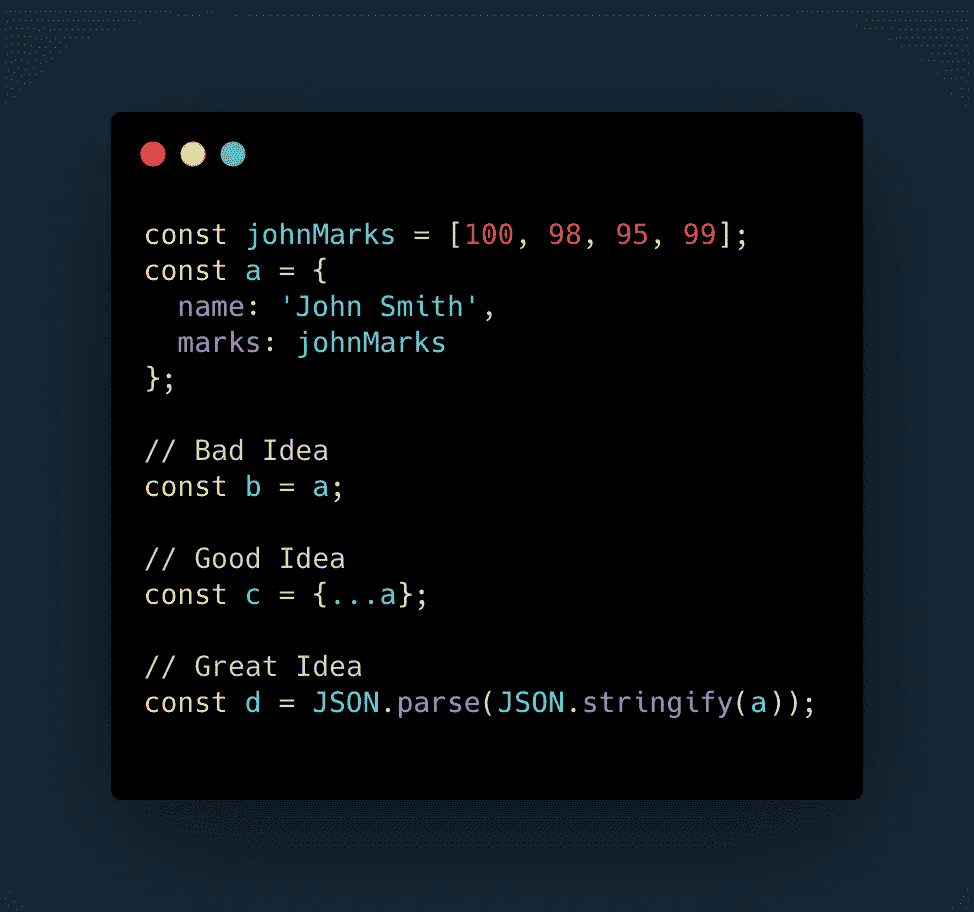

# 两份拷贝的故事

> 原文：<https://levelup.gitconnected.com/a-tale-of-two-copies-bb4f8ab64c1a>

让我们面对现实吧——至少可以说，Javascript 是一种有趣的语言。互联网上充斥着阐述这一点的文章。但它简单、强大且无处不在，学习一两个技巧不会出错。在本文中，我们将讨论 Javascript 中的一个棘手问题——复制。

考虑两个变量 **a** 和 **b** 。您在 **a** 中存储了一个值，您希望将其复制到 **b** 中。这可以按如下方式完成

现在你可能想知道展示这些有什么意义，因为这是显而易见的。请原谅我。只要 **a** 和 **b** 是原始数据类型——字符串、数字、布尔等，这个方法就成立。上述代码将把存储在 **a** 中的值复制到 **b** 中，然后，其中一个的变化不会影响另一个。同样，显而易见。

让我们向前迈出这一步。如果 **a** 是一个数组呢？“是啊，那又怎么样？”，我听到你问。从逻辑上来说，这不会有任何影响。 **a** 中的数组可以以完全相同的方式复制到 **b** 中，对 **a** 的更改不会影响 **b** ，反之亦然。

惊讶吗？我相信至少有几个读到这篇文章的人会。请随意尝试，亲自体验。

# 那么，那里发生了什么？

这种行为是 Javascript 工作方式的结果。在 JS 中，数组、对象和函数(让我们统称它们为对象，因为 JS 就是这样看待这三者的)，与字符串、数字、布尔、空和未定义(原语)的处理方式不同。原语是通过值传递的，而对象是通过引用传递的。

这实质上意味着，当我们将一个原始变量赋给另一个原始变量时，就像在我们的简单复制情况中一样，存储在一个变量中的值被复制到另一个变量中，在这种复制之后，它们彼此独立。另一方面，在对象的情况下，当您将一个对象变量赋给另一个对象变量时，这两个变量实际上是指内存中的同一个对象，就像 Christiano Ronaldo 和 CR7 指的是同一个个体一样。

正是由于对象的这种通过引用传递的性质，我们看到了上面代码片段中的数组的行为方式。当我们在 **a** 或 **b** 上工作时，我们实际上是在同一个数组上工作，通过使用不同的名称来引用。

还值得注意的是，JS 在这种行为上并不是唯一的——Typescript(本质上是 JS 的超集)也显示了相同的行为。Python 也是。

# 有什么解决办法？

一次又一次，当你需要复制一个对象类型的变量，而在处理副本时没有改变源变量，反之亦然。

# 输入跨页…

ECMAScript 6(ES6)中引入的扩展操作符( **…)** 解决了这个问题。使用 spread 语法，您可以提取一个对象的值，该值随后可以复制到另一个变量中。

从上面的代码片段可以看出，一旦我们使用 spread 语法来复制对象，一个变量中的变化不会影响存储在另一个变量中的值，反之亦然。这里实际发生的是，通过提取并复制 **a** 到 **b** 的值，我们确保了 **a** 和 **b** 都没有引用内存中的同一个对象。

# 耶！我们被分类了——没那么快

就复制对象而言，spread 操作符是一个救命稻草，但这是一个大问题。考虑下面这段代码

看来我们还是有问题。

正如您所看到的，尽管使用了 spread 操作符将 **a** 的值复制到 **b** ，对 **johnMarks** 的更改影响了 **a** 和 **b** 的 **marks** 字段。发生这种情况是因为通过扩展操作符完成的复制是所谓的“浅层复制”。

**浅拷贝**是在拷贝一个对象时，我们拷贝主对象的值，但将其中对象的引用传递给拷贝。因此，在我们的例子中， **a** 和 **b** 都存储了对同一个 **johnMarks** 对象的引用。在这种情况下，我们需要的是“深层拷贝”。

在**深度复制**中，对象的值以及其中对象的值都被复制出来，这意味着如果我们将 **a** 深度复制到 **b** ，则**标记**字段将保存**约翰标记**的值，而不是对它的引用。

# 如何进行深度复制？

虽然有各种方法可以在 Javascript 中执行深度复制，包括创建一个自定义函数，该函数可以递归地执行浅层复制来模拟深度复制，但我通常会使用一种简单而有效的方法。我们所需要的是两种现成的方法。

现在你有了它——通过组合 **JSON.parse()** 和 **JSON.stringify()** 方法执行的一个整洁的深度复制。这里发生的事情是，首先从源对象构造一个字符串，然后用它来创建一个新对象，这个新对象存储在第二个变量中。

注意，在使用这种方法进行深度复制时，要确保所涉及的对象符合 [JSON 约定](https://developer.mozilla.org/en-US/docs/Web/JavaScript/Reference/Global_Objects/JSON)，以避免意外错误。如果没有，您可能需要考虑其他方法，比如自定义函数，就像前面提到的那样。

那就这样吧。在本文中，我们研究了在 Javascript 中进行复制的需求，两种不同的复制风格和一种实现复制风格的方法。图示和/或提到的方法绝不是一个详尽的列表，而只是我个人喜欢的方法。

> 有兴趣和我就这个故事或 Angular、Typescript 和 Javascript 进行一对一的交谈吗？前往[聘请作者](https://www.hiretheauthor.com/ashwinSathian)，让我们连线！