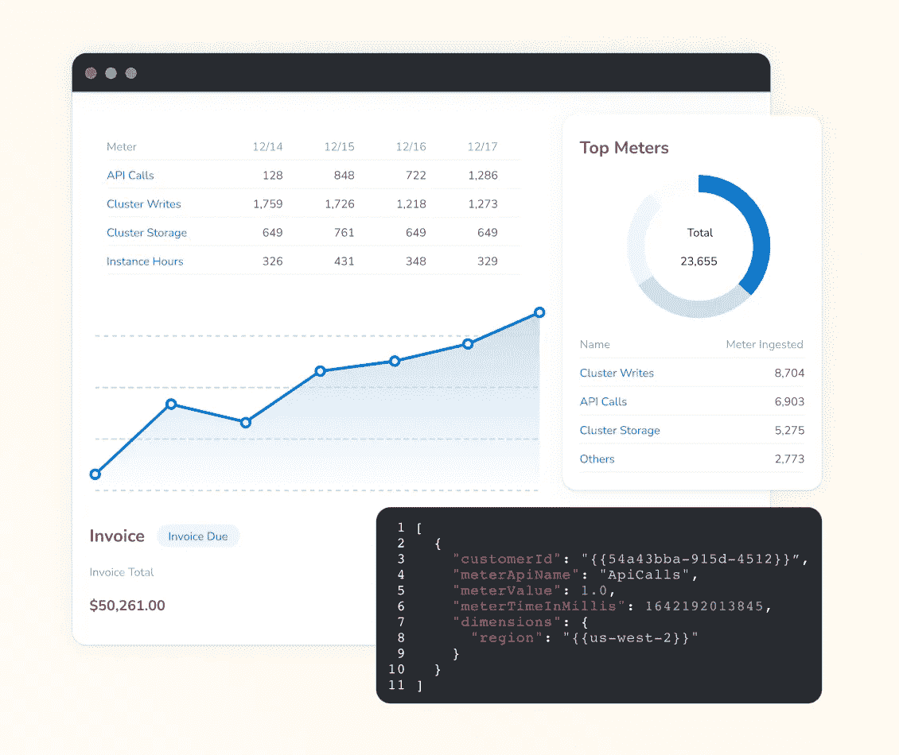
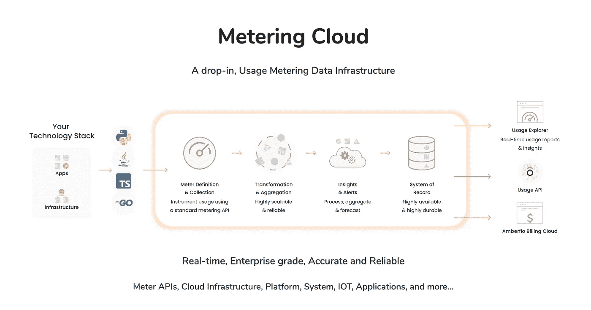
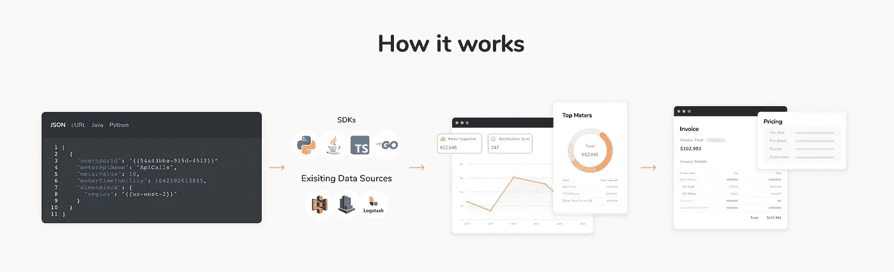

# 在 Amberflo.io 从技术角度探讨我们如何在云计量产品中处理数十亿个事件

> 原文：<https://levelup.gitconnected.com/a-technical-dive-into-how-we-process-billions-of-events-in-our-cloud-metering-product-at-amberflo-io-9bf5b6054735>

## 对 Amberflo.io 首席技术官兼联合创始人 Lior Mechlovich 的采访

[Amberflo.io](https://www.amberflo.io/) 的首席技术官和联合创始人 Lior ( [Lior Mechlovich](https://medium.com/u/6f6873b9b143?source=post_page-----9bf5b6054735--------------------------------) )分享了他们如何处理数十亿个事件，以提供基于计量的定价服务。Amberflo.io 使用 Lambda 函数进行无限扩展，并提供具有粒度数据的高功能产品。

> “将 0 扩展至无穷大对我们来说非常重要，因为我们正在为拥有数十亿次仪表事件的高吞吐量公司提供服务”

> >想让你的公司接受高级编码面试吗？[填写这张表格](https://forms.gle/zRs7Uhidtd7WTyCy8)
> >你是一个正在寻找一份令人惊叹的工作的开发者吗？[访问升级招聘平台](https://jobs.levelup.dev/talent/welcome?referral=true)

[Lior Mechlovich，Informatica | Sumo Logic Illuminate 2019](https://www.youtube.com/watch?v=vyD2i7MW26g)

# 你的公司是做什么的？是什么吸引了你的想法？

两年前，我们创建了 amberflo.io，作为一名首席技术官，我的职责包括管理一个工程团队，并且一如既往地在一家年轻的初创公司中，做一些事情。

Amberflo.io 是一个云计量和基于使用的计费平台。我们帮助公司衡量并准确地根据使用情况向客户收费。

我和我的联合创始人普内特·古普塔(Puneet Gupta)在 AWS 和其他领先公司花费了大量时间，构建和扩展基于使用情况的云服务，实现按需计量定价、开具发票和计费。我们亲眼见证了基于使用的商业模式的巨大优势。

# 你能解释一下云计量和你的产品是如何工作的吗？

我们来自 AWS，在那里我们可以看到基于使用的定价是如何工作的。这可能是计算能力或 API 请求。这一切都是关于可以计费的高度准确的数据——多少和多长时间。

我们以服务的形式提供计量，因此这是一个 B2B 解决方案。我们帮助客户计量客户，然后使用 Stripe 向他们收费。因此，与 AWS 向其客户收费的方式相同，我们向我们的客户提供相同的收费功能作为服务，用于他们公司的使用情形以及他们的客户如何与他们的产品交互。

# 能否举例说明一下你的客户是如何使用 Amberflo.io 的？

我们在整个行业都有客户，尤其是基础架构— API、存储、网络等。我们甚至可以更细化，比如 Kafka 集群，您可以提供云提供商、实例区域和大小。

一个例子是 API 货币化——它运行了多长时间或记录处理了多长时间。

另一个非常有趣的案例是一家人工智能 B2C 公司，它将它作为一个基于钱包的系统，通过动作货币化。摄取的推文或其他人工智能动作。

# 服务是如何交付的 SDK？

有一个 API 和 SDK 允许我们的客户使用 Amberflo。我们也可以通过其他方式连接，如 Cloudwatch 摄取。

# 您使用什么技术堆栈，为什么选择这种堆栈？

我们使用带有 NodeJS 和 Java 的无服务器(AWS Lambda)作为后端基础设施。由于创始团队拥有丰富的 AWS 经验，我们在 AWS 之上进行构建是很自然的事情。我们相信无服务器最符合我们客户的实际使用情况以及我们支持他们的成本。将 0 扩展至无穷大对我们来说非常重要，因为我们正在为拥有数十亿次仪表事件的高吞吐量公司提供服务。我们的系统是事件驱动的，围绕幂等性(处理一次且仅一次)的设计原则来实现高精度。

NodeJS 用于平台和元数据，与网站和用户管理一起工作。

Java 是用来做更繁重的工作的，比如管道和计费。Java 冷启动是 Lambda 函数中的一个问题。数据管道很好，因为它是后台。对于被动的 web 应用程序性能来说，这可能很糟糕。

价格和无限扩展的代价是巨大的，所以这种代价对于冷启动来说是值得的。我们处理数十亿个事件，这只有通过 Lambda 才能实现。我们给客户开账单的方式与 Lambda 函数给我们开账单的方式完全一样(基于使用量)，所以这种方式非常一致。

# 对你来说，典型的一天是什么样的？

*   与后端和前端团队的日常会议。
*   客户会议。
*   与首席工程师召开设计/架构会议
*   面试候选人
*   Metetring 数据审查(amberflo 系统接收了多少事件，创建了多少新的仪表)
*   运营指标(延迟、错误、事故)

**团队:** 13 名员工。这些天我主要做会议和组织工作。

# 公司是怎么起家的？

我和我的联合创始人普内特·古普塔(Puneet Gupta)在 AWS 和其他领先公司花费了大量时间，构建和扩展基于使用情况的云服务，实现按需计量定价、开具发票和计费。我们亲眼见证了基于使用的商业模式的巨大优势。

转向基于使用量的精确计量并非易事，需要付出巨大努力。我们看到不同规模的团队(10-70 名工程师)在 Twillio、Databricks 和 Snowflake 等领先公司管理计费/计量服务。

我们知道计量计费有多难。比你最初想象的要难多了。我们看到多家公司构建了这种计量和计费基础设施，但并不总是成功，我们知道我们可以帮助他们更轻松、更快速地率先推出基于使用的定价。

# 是什么让你的公司与众不同？

我们从一开始就非常清楚我们创始团队的价值观[https://www.amberflo.io/about.](https://www.amberflo.io/about.)我们完全远离，保持我们最初的文化对我们来说非常重要。我们致力于解决对客户有重大影响的高度复杂的问题，标准很高。

# 你正在解决的最有趣的问题是什么？

[https://medium . com/@ lior _ mechlovich/why-it-hard-to-build-a-metering-pipeline-for-use-based-applications-eed 2 DC D5 e 48 a](https://medium.com/@lior_mechlovich/why-is-it-hard-to-build-a-metering-pipeline-for-usage-based-applications-eed2dcd5e48a)

它从计量**客户使用量开始，精确地，规模化**。

幂等和重复数据删除—只处理一次:确保您的客户没有被多收费(或少收费)。

在分布式环境中，防止重复记录不是一件容易的事情。您希望使用情况计量服务忽略重复的记录，即使客户端重试相同的记录。这使得使用计量服务幂等

扩展到各种工作负载是很棘手的。使用模式可能会有波动，记录不能被丢弃

以经济高效的方式扩展到数百万和数十亿个事件，例如 API 调用计量。计算过去 6 个月的 API 调用总数，然后按前 10 名客户进行细分。

# 一旦你的公司实现了愿景，世界会变成什么样子？

计量客户使用情况将像今天的监控服务器一样成为一个复选框。

今天，当你开始创业，你需要一个数据狗或弹性搜索。所有的数据都必须放在某个地方。计量也是如此。“谁在使用什么，使用多长时间”。您希望关联每一个操作—所有客户使用的仓库。它将这些数据推送到不同的应用程序。计量成为一个完整的配置文件。从业务角度来说，您仍然想知道客户的使用情况发生了哪些变化，而使用 amberflo，您可以获得更高的粒度。

如今你不能轻易做到这一点。Amplitude 和 Mixpanel 只接受网络和移动分析——听起来是一样的，但事实并非如此。你无法全面了解客户的行为。您只需定义您的漏斗并获得输出，但它实际上只是像 web 点击这样的事情，而不是 API 调用和实际使用。没有人将计量或客户使用建立在他们的振幅上。产品很棒，但这不是他们的重点。

比如一家为 AI 模型做推理的 AI 公司。他们正在创建如此多的模型和实例，他们更加关注计量和后端。你需要足够的精力和能力来真正关注所有采取的行动。

# 你最初是如何进入软件开发的？

我想这是从我 14 岁时开始的，当时我上了编程课，并立刻爱上了它。在以色列国防军情报核心部门任职期间，这已不仅仅是一种爱好。我总是喜欢建造东西，并为自己建造的东西感到自豪。

# 你现在正在尝试的技术或工具中有没有让你感到兴奋的？

目前我觉得有两件事非常有趣:

1.  为无服务器跟踪打开遥测。管道是您跟踪所有处理数据的函数的方式。这是一个高度技术性和普遍的挑战。我们还想在计量中找到对等物。
2.  在 ARM 实例上运行 AWS Lambda 以降低成本。

# 描述您的计算机硬件设置

MacBook pro M1，16GB

# 描述您的计算机软件设置

Visual Studio 代码，Slack，Github 桌面，AWS CLI

# 你在招人吗？什么职位？

开发人员，SRE/开发人员，产品设计师，产品经理。

联系 jobs@amberflo.io

# 我们可以去哪里了解更多？

[https://www.amberflo.io/](https://www.amberflo.io/)

# 分级编码

[Level Up](https://levelup.gitconnected.com/) 是月活 300 万开发者的社区([了解更多关注](https://levelup.gitconnected.com/)或[阅读更多访谈](https://levelup.gitconnected.com/interviews/home))。我们还与最好的初创公司和最具创新性的科技公司合作🔥

*   **你是开发者吗？**有最优秀的公司向你伸出援手
    ➡️ [**加入人才集体**](https://jobs.levelup.dev/talent/welcome?referral=true)
*   ➡️ [**聘请顶尖工程师**](https://jobs.levelup.dev/talent/welcome)
*   ➡️ [**面试申请表**](https://forms.gle/oWT83qtGdydfi7yL8) 对贵公司进行面试

我们还为开发者提供免费的职业成长工具: [**编码面试课程**](https://skilled.dev/) 、 [**自动简历构建器**](https://gitconnected.com/resume-builder) r、 [**portfolio API**](https://gitconnected.com/portfolio-api)

在推特和 T2【LinkedIn】上关注我们