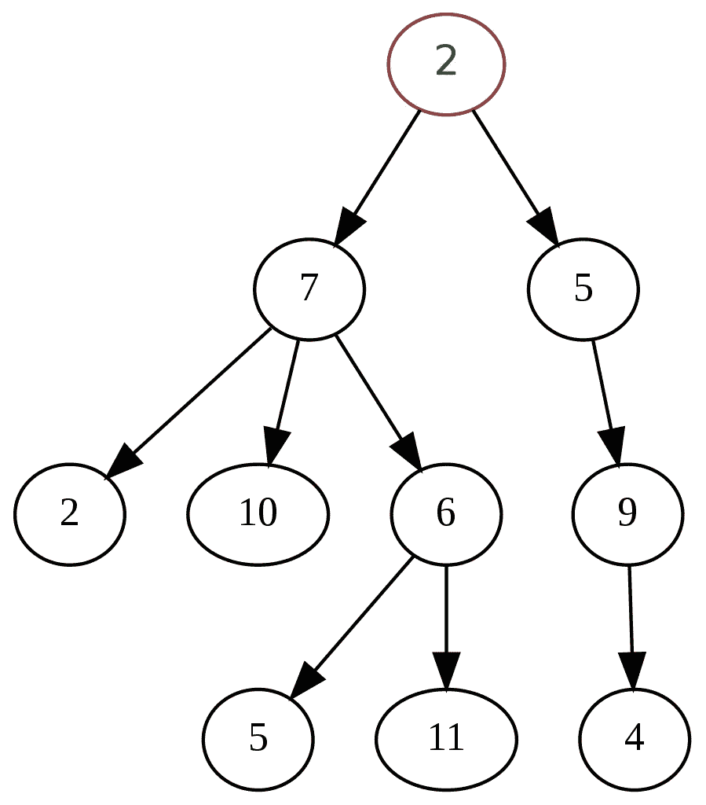

# C++中的一个模板树类

> 原文：<https://levelup.gitconnected.com/a-template-tree-class-in-c-7be9b4834e09>

## 任意类型的树形数据结构

一个树形数据结构，树形图由 [SUNIL PATEL](https://www.pexels.com/de-de/@sunil-patel-191908?utm_content=attributionCopyText&utm_medium=referral&utm_source=pexels) 放在 [Pexels](https://www.pexels.com/de-de/foto/nackter-baum-auf-grasfeld-599708/?utm_content=attributionCopyText&utm_medium=referral&utm_source=pexels) 上。

计算机科学和编程中最常见的数据结构之一是树。树是各种层次数据的抽象数据类型，如文件系统、解析树、域对象模型(HTML、XML)、二分搜索法树等等。

然而，在 C++标准库中没有树类型。

幸运的是，自己创建一个树形数据结构并不困难。这些年来，在为几个项目创建了许多不同的树之后，我终于实现了一个带有模板的适当的树类，使它可以处理任意类型的树。

# 树形数据结构

树的基本概念非常简单。它是分层结构中节点的集合。然而，与森林中的树不同，计算机科学树是自上而下生长的。

它从顶部的根节点开始，可以有任意数量的子节点。每个子节点可以有自己的子节点，它的子节点又可以有子节点，以此类推，直到底部只有没有任何子节点的节点。没有任何子节点的节点也称为叶节点。

除了孩子的列表，每个节点也有一个值。这是数据存储的地方。这些值可以是任何数据类型，如整数、字符串，也可以是自定义类型，如人、车或棋步。

具有值和子节点列表的节点是树的最普通的定义。然而，树有许多不同的形状和大小，其中一些可能需要数据结构的附加条件或限制。例如，一个常见的用例是二分搜索法树，它是搜索大量数据的有效方法。二叉树每个节点最多只允许两个子节点。当树平衡时，它们也工作得最好，这意味着到叶节点的所有路径长度大致相等，所以当插入新节点时，您可能必须重新平衡树。

还可能有其他特定于实现的细节。例如，您可能希望存储对父节点的引用，或者您可能希望防止多个子节点具有相同的值。

一个通用的树形数据结构，顶部有一个根节点，每个节点有不同数量的子节点，图片来自 wikipedia.org。

# C++为什么没有树型？

我一直想知道为什么 C++标准库中没有树类型。有列表、队列、映射和集合可用，但没有单一的树状数据结构。

原因似乎是有太多不同类型的树和实现树的方式。不可能创建一个适用于多种用例的单一树形数据结构。这总是取决于哪种类型的树工作得最好，并且有许多特定于实现的细节和优化。

尽管在标准库中有些类型的树是可用的。如果您正在寻找一个二叉查找树，std::map 和 std::set 通常被实现为红黑树(一个自平衡的二叉查找树),这样它们可以实现高效的搜索。

然而，当我们需要一个具有层次结构的更通用的树时，我们必须自己实现它。

# 履行

如上所述，最简单的树是节点的集合，每个节点都有一个值和一个子节点列表，这也是一个简单实现所需要的。然而，我们希望我们的树数据结构能够处理任意的数据类型。这可以通过 C++中的模板来实现。模板基本上是占位符，编译器会在编译程序时自动创建实现细节，因此我们不必手动为许多不同的类型创建完全相同的函数或类。

带有模板的树类，由作者编码。

最初，我有一个带有父指针的版本，但我意识到在大多数情况下我可能不需要它。它需要一个重载的复制构造函数和复制赋值操作符来确保指针总是指向正确的父对象。这里是带有父指针的[实现。](https://gist.github.com/pingpoli/eb564d6767e03243ea029ee479f914a3)

# 使用

下面是一个简单的用法示例。它使用整数，但是由于模板类，你也可以将它用于任何其他类型。

tree 类的一个简单用法示例，由作者编写。

使用示例的输出，按作者排序的图像。

如果你经常编程，你会遇到很多树有用的情况。然而，并不是每种编程语言都提供内置的树类型，因为这通常取决于哪种类型的树最有效。

幸运的是，实现自己的树形数据结构相当容易。在 C++中，您可以为处理任意数据类型的泛型树创建一个模板化的类。对于一些性能至关重要的用例，您可能需要实现优化的树，但是当您只需要某处的随机树时，有一个通用的模板化树类是很好的。

你喜欢这样的内容吗？通过加入 Medium ，可以无限制地访问所有故事，并支持我和其他作者。*如果你通过这个链接注册，你的一部分会员费将会转给我。*