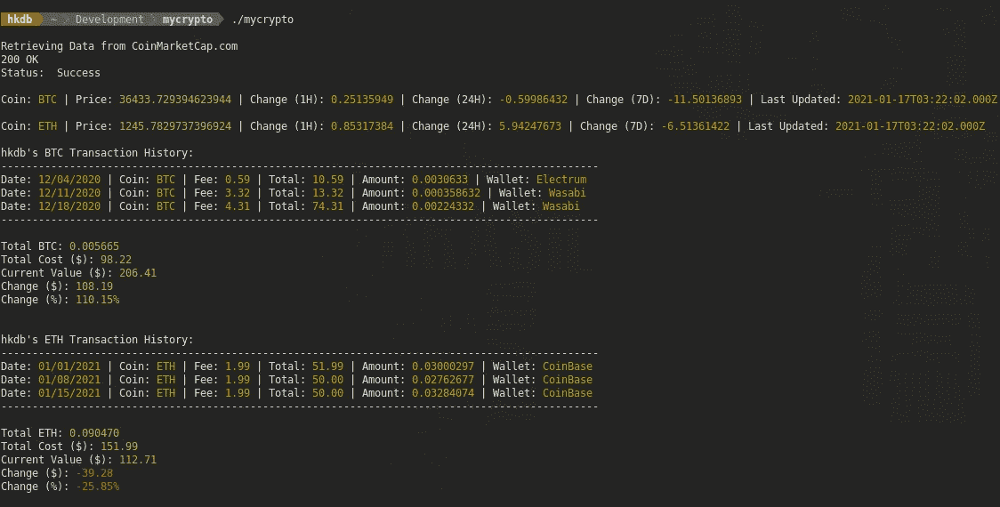

# 基于终端的 BTC/联邦理工学院投资组合跟踪模板

> 原文：<https://levelup.gitconnected.com/a-terminal-based-btc-eth-portfolio-tracker-template-6931b45656ea>

## 用 GoLang 和 CoinMarketCap.com API 建造

这张截图是基于随机生成的虚假样本数据，这些数据可能不合理，但它成功地证明了积极的投资组合变化保持绿色，而消极的变化变成红色

我从早期就开始关注区块链技术，但直到最近，我主要关注与货币无关的用例，所以当谈到加密货币时，我几乎是一个 n00b，就像最近终于加入列车的其他人一样。

## 为什么是现在？

就我个人而言，有许多特定的原因让我决定不在早期涉足比特币，直到今天，我仍然不后悔，即使 BTC 已经证明了自己让许多人在一夜之间成为百万富翁。然而，鉴于加密货币目前的状态，这些个人原因大多已经消失，现在任何人都很难忽视这样一个事实，即至少 BTC 和瑞士联邦理工学院最有可能留在这里。事实上，鉴于我们当前的全球经济，加密货币正成为越来越有吸引力的投资选择。因此，我首先开始更多地了解它，这样我至少会有足够的知识和工具来考虑从现在到未来将它作为一种替代投资选择。

根据我的研究，我决定只关注市场上的两大公司，即 BTC 和瑞士联邦理工学院。考虑到这个细化的焦点，我开始着手研究现有的可用工具。很自然地，我被开源技术所吸引，并开始在该领域尝试不同的钱包，当然，我也尝试了一些更受欢迎的基于云的平台，如比特币基地。

我现在测试了所有不同的钱包和平台，我开始思考我可以用什么来整体跟踪我的投资组合，而不是打开一堆应用程序和网站来手动跟踪它们。也许我只是没有足够努力地寻找，或者只是没有花足够的时间来审查那里的一切，但我迄今为止无法找到一个开源和非基于云的投资组合跟踪器，将我所有的加密资产聚集到一个有用的基本统计数据的单一视图中，可以接近 TD Ameritrade 在简化股票投资组合跟踪方面所做的出色工作。所以我开始尝试建立我自己的工具。

## 用户需求

我的要求也许不是主流，但可以很容易地归纳为如下几项:

*   **基于终端的** —我已经在终端呆了很多次了，我不喜欢任何耗费资源的东西来延长我笔记本电脑的电池寿命。我也不需要在后台持续运行的东西，而是当我想检查事情时就可以访问的东西。
*   **开源并在本地运行** —基于云的很好，但我更喜欢少读一份隐私政策，尽可能少担心评估网站的合法性和安全性
*   **单一视图** —我只想要简单的东西，一次就能说出我想知道的所有事情，比如 BTC 和瑞士联邦理工学院的美元现值、我资产的原始成本以及我投资的收益。

基于上述要求，我能找到的最接近满足它们的唯一“解决方案”是被放弃的 Github 项目，这些项目可能比把它们修改成我喜欢和需要的更麻烦。

## 功能要求

正如“单一视图”要求中所解释的，以下是我有兴趣了解的三件事，详细内容如下:

*   BTC 和 ETH 的当前价值(以美元计)以及相关趋势统计数据
*   我过去的交易及其成本和费用
*   每种硬币所拥有的硬币总数
*   每种硬币类型的总成本根据其各自的美元现值计算，以美元和百分比表示

当然，这些不是复杂的统计数据，这里使用的术语可能让我听起来像一个 n00b，但作为一个潜在的业余加密投资者，这些是我关心的简单事情。

## 数据来源

那么数据来源呢？我如何将所有这些数据放在同一个地方，以便可以相互计算？

嗯，对于实时的 BTC 和瑞士联邦理工学院的价值和趋势数据，在快速浏览后，我决定选择 CoinMarketCap.com 的，因为他们是众所周知的，并提供一个包括每天 333 个免费 API 调用的基本帐户，这对于我所需要的来说绰绰有余。也许让他们更有吸引力的是他们的文档做得非常好，甚至包括一些 Go 的样例代码。

至于我的投资组合，因为我仍处于测试阶段，而且很少进行小额交易，我发现很难证明连续花费几个小时来找出如何整合和自动整合来自所有不同钱包和平台的数据是合理的。所以我决定使用好的旧 CSV，而不是每次手工输入我的交易细节。

## 最终结果

基于以上所述，我构建了一个超级简单的基于终端的 cyrpto portfolio tracker 模板，通过一个命令就可以产生我想要看到的所有基本数据，如本文开头的截图所示。它主要做的是通过 CoinMarketCap.com API 提取价格和趋势数据，将 JSON 响应读入结构，并以我喜欢的格式打印输出。然后，它读入我手动准备的所有 CSV 文件，打印出交易和总额，根据两组数据计算您的头寸，然后输出结果。您可以在以下位置找到所有开源代码和安装说明:

 [## hkdb/mycrypto

### 维护者:hkdb@3df.io 这是一个基于终端的加密货币(目前仅适用于 BTC 和瑞士联邦理工学院)投资组合跟踪系统…

github.com](https://github.com/hkdb/mycrypto) 

这当然不是最终产品，但我觉得这是一个很好的基础模板开始，如果你喜欢布局，也想跳过基本的东西，并开始建立自己的本地运行的基于终端的加密组合跟踪。以我为例，我已经有了一个修改为支持多个投资组合的私有 fork，因为我有另一个投资组合，与其他人有一个小的组合资金池，甚至可能计划在未来添加对其他货币或 BTC 和 ETH 价格趋势图形的支持。我想，当交易量随着时间的推移增加到一个很长的列表而无法滚动时，我还必须弄清楚如何有效地显示交易历史。

## 更新(2021 年 1 月 29 日)—更多更新已发布在:

 [## MyCrypto 模板改进

### 更好的逻辑分离&使投资组合显示可选

hkdb.medium.com](https://hkdb.medium.com/mycrypto-template-improvements-3645b4e16c95) 

## 更新(2021 年 12 月 27 日)—一个更加完善的版本:

 [## MyCrypto v0.1.0 改进

### 使其成为相对更完整的解决方案

hkdb.medium.com](https://hkdb.medium.com/mycrypto-v0-1-0-improvements-c251dcfc4cfc)