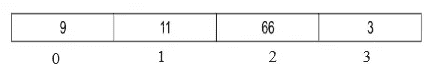
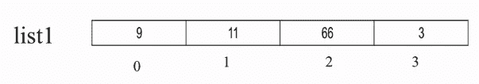
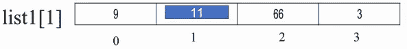
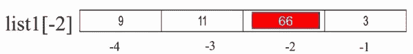
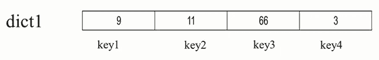
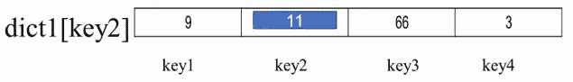
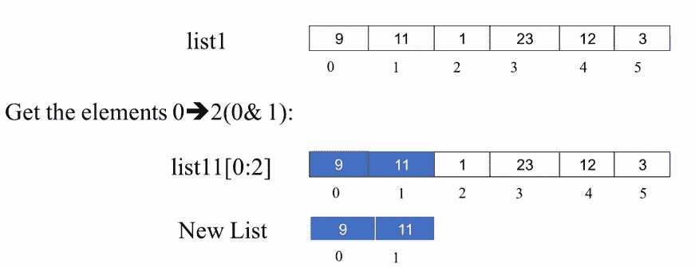
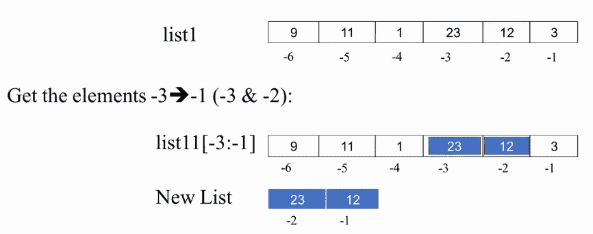
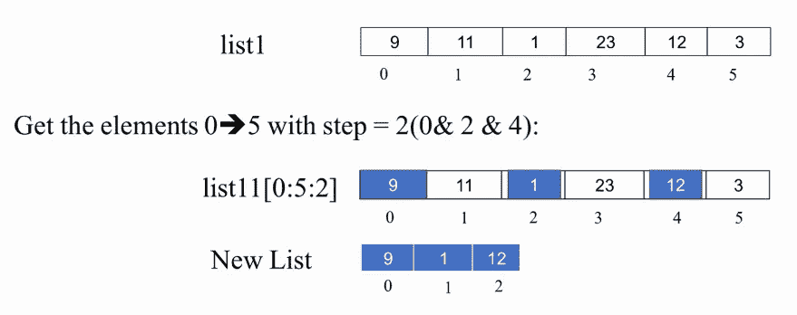
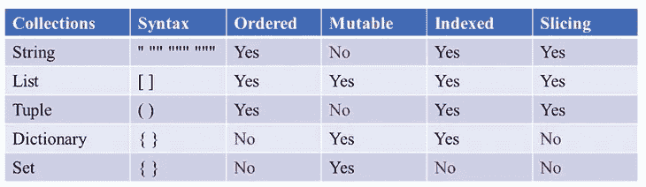

# Python 中数据集合的全面介绍:Python 完整教程—第 20 部分

> 原文：<https://levelup.gitconnected.com/a-thorough-introduction-to-the-data-collections-in-python-python-complete-course-part-20-90a2769de494>

## 了解 Python 中的主要数据集合是什么，以及如何区分它们。

照片由[🇸🇮·扬科·菲利](https://unsplash.com/@itfeelslikefilm)在 [Unsplash](https://unsplash.com/s/photos/collections) 上拍摄

在我们开始之前，让我告诉你:

*   这篇文章是 Python 完全初学者到专家课程
    的一部分，你可以在这里找到它[。](https://medium.com/@samersallam92/python-complete-beginner-to-expert-course-f7626916df30)

## 介绍

在您学习了 Python 中的数字之后，现在是时候学习第二种类型的数据结构，即集合。集合是用于存储一个或多个项目的多项目数据结构。

**目录**

1.  [Python 集合定义](#ec43)
2.  [数据收集的一些重要方面](#e5b3)
3.  [数据收集的顺序](#3a6d)
4.  [数据集合的可变性](#ddd9)
5.  [数据收集中的索引](#3874)
6.  [数据集合中的切片](#00c5)

## 1.Python 集合定义

集合是被定义为具有一个或多个项目的数据结构。所以，你必须知道，集合不同于只能存储一个项目的数字。

集合中的项可以是一个数字，也可以是另一个集合，这取决于集合本身。在 Python 中，有以下集合:

*   线
*   目录
*   元组
*   词典
*   一组

这些集合中的每一个都有其特性，随着时间的推移，您将获得所需的经验，知道您必须在哪个上下文中使用这些集合中的每一个。

现在，让我们谈谈您必须了解的每一个系列的方方面面。

## 2.数据收集的一些重要方面

*   **语法**

关于集合你必须知道的第一件事是**语法**，这意味着你将如何定义一个集合。例如，如果你想定义一个列表，你必须使用方括号`**[ ]**`，而如果你想定义一个字典，你必须使用花括号`**{}**`等等。

*   **一些通常用于收藏的有用功能**

对于每种类型的集合，都有一组内置的函数，当您使用集合时，这些函数将为您节省大量时间。

*   **属性**

此外，对于这些集合中的每一个，都有一些属性。您必须学习它们，以了解这些集合中的每一个在哪个上下文中使用。这些属性如下:

— **订单:**已订购—未订购。

— **可变性:**可变—不可变。

— **索引**:已索引—未索引。

— **切片:**支持切片—不支持切片。

现在，让我们详细解释这些属性中的每一个。

## 3.数据集合中的顺序

如果一个集合有一个项目序列，其中每个项目在该序列中都有自己已知的固定位置，则可以说该集合是有序的，例如:

假设您有以下列表。参考图 1。

图 1:虚拟列表(图片由作者提供)。

对于这些数字中的每一个，你都有一个索引`[0, 1, 2, 3]`。这些项目中的每一个都有其自己的已知和固定的位置。因此，如果集合支持这些固定位置，这意味着它是一个有序集合。

## 4.数据集合的可变性

如果集合在创建后可以更新，那么它就是可变的。

因此，如果您想知道集合是否是可变的，只需问问自己，在我创建集合之后，我能够更改它的内容吗？如果答案是**是**，那么这个集合是可变的。

通常，您可以使用不同的方式更新集合:

*   **向该收藏添加一个新项目。**
*   从收藏中删除一个项目。
*   **改变收藏品中一件物品的价值。**

如果一个数据结构或集合支持这些操作中的任何一个，你可以说它是**可变的**。

## 5.数据集合中的索引

这是一种访问集合中单个元素的方法，通常使用索引需要使用方括号**【index】**。

因此，如果您可以访问集合中的单个项目，它支持索引。

**注:**

*   Python 中的索引从 **0** 开始。因此，第一个项目在位置号 **0** 中，第二个项目在位置号 **1** 中，以此类推…
*   而且 Python 支持负索引，在这种情况下， **-1** 代表最后一项， **-2** 代表最后一项之前的项，以此类推…
*   此外，还有一种称为**字典**的数据结构，如果您不想使用数字作为索引，可以在其中定义自己的索引集。

**例 1:**

假设您有下面的列表及其名称`list1`。参考图 2。

图 2: list1(图片由作者提供)。

要得到第二个项目，你可以写`list1[1]`，你将得到 **11** 。请参考图 3。

图 3: list1[1](图片由作者提供)。

而要在使用负索引的同时得到第三个元素，你可以写`list1[-2]`，你会得到 **66** ，因为对应的负索引列表是[-4，-3，-2，-1]。请参考图 4。

图 4: list1[-2](图片由作者提供)。

**例二**:

假设你有一本字典`dict1`。请注意，索引不再是数字。请参考图 5。

图 5: dict1 词典(图片由作者提供)。

正如你所看到的，这里没有顺序的意思，所以你不能说 9 是第一项，或者 11 是第二项。

如果你想得到一个元素，比如说 **11** ，你可以写`dict1[key2]`，这会给你 **11** 。参考图 6。

图 6: dict1[key2](图片由作者提供)。

现在，让我们继续讨论索引，它与索引有点关系。

## 6.数据集合中的切片

这是提取切片的一种方法。换句话说，从集合中提取项目的子集。

通常，当您想要使用切片时，您必须使用方括号运算符，然后传递两个数字来定义切片的开始位置和结束位置。你应该在它们之间加一个冒号**【开始:结束】**。

**例如:**

假设你有下面的列表`list1`。如果你想得到从位置 0 到位置 2 的元素，你可以写`list1[0:2]`，这样你将得到【9，11】。请参考图 7。

图 7: list1[0:2](图片由作者提供)。

因为在 Python 中，它从**开始**到**结束-1 获取元素。**输出是一个新的列表，其中包含切片产生的元素。

**负切片示例:**

让我们使用相同的列表，但是现在使用负索引。假设您想要提取位置 **-3** 和 **-2** 中的项目，您可以键入`list1[-3: -1]`，这将给出一个新的列表【23，12】。这里起点是 **-3** ，终点是**-1****-1**=**-2**。请参考图 8。

图 8: list1[-3: -1](图片由作者提供)。

有时，您希望在切片时跳过某些项目，因此在这种情况下，您可以确定切片中包含元素的间隔(步长)。你会用下面的方式输入**【开始:结束:步骤】**。

**例如**:

对于同一个`list1`，如果你想从位置 0 到位置 5 得到一个步长= 2 的元素，你可以写`list1[0:5:2]`，这将给出一个新的列表= [9，1，12]。请参考图 9。

图 9: list1[0:5:2](图片由作者提供)。

> **注意:**切片只对**有序**的数据结构有效，所以如果任何一个数据结构支持索引但它是无序的，你就不能对它使用切片。

在我们看到属性及其含义之后，请参考下表(表 1 ),该表为您提供了 Python 集合语法和细节的快速总结。

表 1: Python 集合的语法和属性(图片由作者提供)。

**注意**:如果这张表格让你不知所措，也不要担心，因为在接下来的课程中，你将详细了解每一个系列。

[***关于作者***](https://medium.com/@samersallam92/about)

现在，让我们总结一下我们在这篇文章中学到了什么。

照片由[安 H](https://www.pexels.com/@ann-h-45017/) 在[像素](https://www.pexels.com/)上拍摄

*   **集合:**是存储一个或多个项目的数据结构。
*   **集合细节:**语法、属性(顺序、可变性、索引和切片)以及与之一起使用的有用函数。
*   如果一个集合有一个项目序列，其中每个项目在该序列中有其自己的已知和固定的位置，则该集合是**有序的**。
*   如果一个集合在创建后可以更新，那么它就是**可变的** ( **可变的**)。
*   **索引**是一种通过使用方括号`[index]`来访问集合中单个元素的方法。第一个索引是 **0，**Python 支持负索引**。**
*   **切片**是一种从集合中提取项目子集的方法，您可以确定切片的开始和结束位置以及步长`[start: end: step].`记住，最后一个项目不包括在切片中。

***附言*** *:万分感谢您花时间阅读我的故事。在你离开之前，让我快速提两点:*

*   *首先，要直接在您的收件箱中获得我的帖子，请在这里订阅**，*并且您可以在这里关注我***。***
*   ***第二，作家在媒介上制造了数千个****$****。为了无限制地访问媒体故事并开始赚钱，* [***现在就注册成为媒体会员***](https://medium.com/@samersallam92/membership)**，其中* *每月只需花费 5 美元。通过此链接* [***报名***](https://medium.com/@samersallam92/membership) *，可以直接支持我，不需要你额外付费。****

**

萨梅尔·萨拉姆** 

## **Python 初学者到专家的完整课程**

**[View list](https://medium.com/@samersallam92/list/python-complete-beginner-to-expert-course-32d3a941c05e?source=post_page-----90a2769de494--------------------------------)****21 stories****************

[萨梅尔·萨拉姆](https://medium.com/@samersallam92?source=post_page-----90a2769de494--------------------------------)** 

## **Python 面向对象编程的完整教程**

**[View list](https://medium.com/@samersallam92/list/the-complete-course-in-objectoriented-programming-in-python-7b54126a7f4e?source=post_page-----90a2769de494--------------------------------)****24 stories**************

**要回到上一篇文章，您可以使用以下链接:**

**[第 19 部分:随机模块的快速概述](https://blog.devgenius.io/a-quick-overview-of-random-module-python-complete-course-part-19-24b5acba4bb2)**

**要阅读下一篇文章，您可以使用以下链接:**

**(下一篇文章发表后，该链接将可用)**