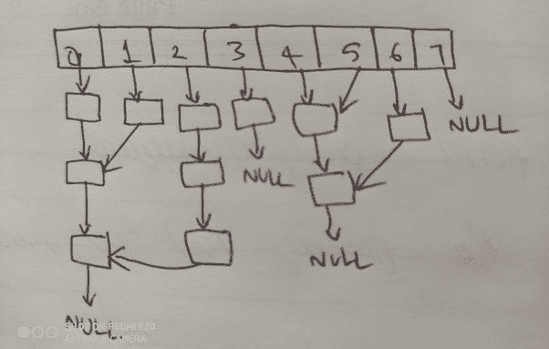
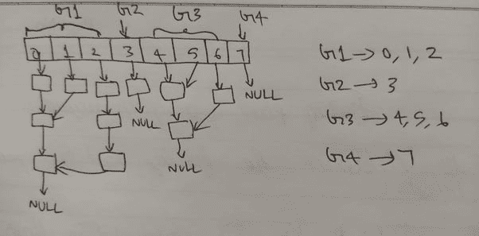
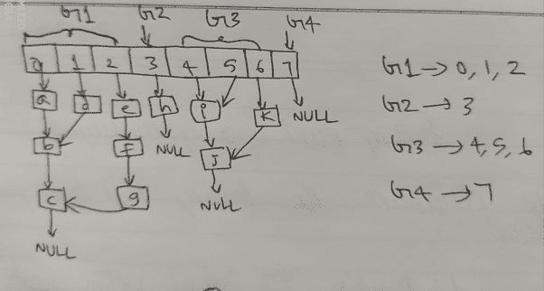
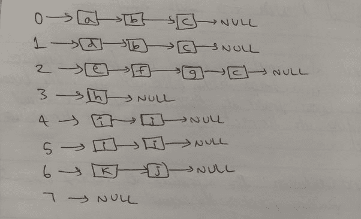
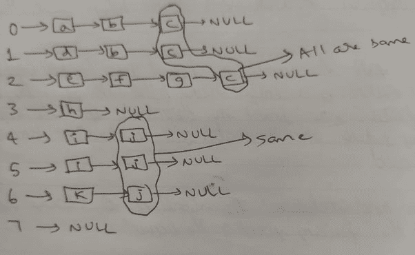

# 一个棘手且相当有趣的链表问题

> 原文：<https://levelup.gitconnected.com/a-tricky-and-interesting-linked-list-problem-2330d9086102>

## 在一家顶级产品公司的最后一轮编码面试中，我被要求解决这个问题。


萨法尔·萨法罗夫在 [Unsplash](https://unsplash.com?utm_source=medium&utm_medium=referral) 上拍摄的照片

我是一名本科生，在苏拉塔的[NITK](https://www.nitk.ac.in/)攻读计算机科学的 BTech。在 2019 年初的校园安置活动中，我设法在印度电子商务巨头 [Flipkart](https://www.flipkart.com/) 获得了一份暑期实习。

[](https://medium.com/datadriveninvestor/how-i-landed-a-summer-internship-at-flipkart-df6e509a5751) [## 我是如何在 Flipkart 得到一份暑期实习的。

### 我是在 NITK 大学攻读 CSE 生物技术的四年级本科生。我最近完成了在 Flipkart 的暑期实习…

medium.com](https://medium.com/datadriveninvestor/how-i-landed-a-summer-internship-at-flipkart-df6e509a5751) 

我不得不经历 4 轮解决问题的面试，第四轮是相当令人难忘的一轮——短短 20 分钟，我面对一个基于链表的问题，我发现这个问题相当棘手和有趣。

让我们沿着记忆的小路走一走。

现在是晚上 10 点左右。采访从晚上 6 点开始。我们中的三个人通过了前两轮。

其中一个马上就被选中了，剩下我们两个——等待着，疲惫着，筋疲力尽着，相互露出微弱的微笑。

第三轮看到另一个候选人离开了，我被告知要等待，所以我就在这里——坐着，疯狂地用手指敲打着椅子的把手，同时幻想着当我被选中时会是什么样。

HR 呼唤我的名字，把我从幻想中惊醒。我被示意进入一个房间，我的面试官起身迎接我。

**面试官:***挺漫长的一天吧？你一定累了。”*

***我:***是的先生。我很累，但也为面试感到兴奋。”**

**我可能没那么说，但还是算了吧。**

**面试官:那我们快点结束吧。让我们只看一个问题，并尝试提出一个有效的解决方案。**

**听到只有一个问题，我一部分松了口气，一部分变得超级焦虑。**

****面试官:** *抓起纸笔，潦草地写了些什么，着手给我解释问题陈述。***

# ****问题****

**有一个链表头的数组，它们可能相互交叉，也可能不交叉。目标是对数组条目进行分组，使得如果两个链表彼此相交，那么它们属于同一个组。**

**当我看着这个问题并草草写下一个例子时，这个问题对我来说是有意义的。以防有人没有理解这个问题，这里有一个例子来说明这个问题。**

****示例:**这里是一个大小为 8 的数组，每个条目包含一个指向链表头的指针。**

****

**作者图片**

**我们可以看到， **0，1** 和 **2** 相互交叉，形成一组。由于 **3** 和 **7** 不与任何其他列表相交，它们属于自己的组。 **4、5** 和 **6** 相互交叉形成另一组。**

****

**作者图片**

# **现在回到话题上来**

****面试官:**希望问题明确。**

****我:**是的，除了少数怀疑。**

**我继续提问，让我的疑问得到澄清。**

**这个问题乍一看似乎极其困难。**

**当我试图从每一个可能的方面着手解决这个问题，希望找到解决问题的方法时，我的头脑开始飞速运转。**

**我从用一些字母命名链表指针开始。**

****

**作者图片**

**然后分别列出每个列表。**

****

**作者图片**

**当我保持镇静并与面试官交谈时，我的大脑开足了马力。前十分钟，事情是这样的:**

```
**While True:Me: *Comes up with a new approach to the problem*Me: *Explains the approach to the interviewer*Interviewer: *Shakes his head in disapproval and drops hints*Me: *Goes back to brainstorming and thinking out loud***
```

**当我愤怒地咬牙切齿盯着那张纸时，我注意到了什么，兴奋地睁大了眼睛。感觉就像被闪电击中一样！**

> **任何相交链表的最后一个指针必须相同！**

****

**作者图片**

****我:*** *陈述我的观察****

****面试官:*** *看着卷子，淡淡一笑，让我继续写伪代码。****

**做了这个观察之后，制定算法和编写伪代码是小菜一碟。**

# ****算法****

1.  **初始化一个空的 hashmap。这个散列表将用于存储**指针:索引的**键:值**对。****
2.  **初始化一组数组，每个数组存储一个组。称之为 *arrg。***
3.  **对于每个数组索引，从该索引开始遍历链表，直到结束，并尝试将尾指针添加到 hashmap。**
4.  **如果指针已经存在于散列表中，那么将当前索引添加到相应的集合中。**
5.  **否则将指针添加到 hashmap，并将索引添加到 arrg 中的新数组。**
6.  ***arrg* 中的数组数量对应于组的数量，每个数组代表一个组。**

# ****Python 代码****

**面试官:看起来很正确，也很有效率。时间复杂度是多少？**

****Me:** 如果最长链表的大小是 M，数组的大小是 N 那么就是 O(MN)。**

**然后我们开始谈论公司，他在公司的职位，工作与生活的平衡，工作的种类等等。**

****结果:**选中。**

****感谢阅读****

# **分级编码**

**感谢您成为我们社区的一员！ [**订阅我们的 YouTube 频道**](https://www.youtube.com/channel/UC3v9kBR_ab4UHXXdknz8Fbg?sub_confirmation=1) 或者加入 [**Skilled.dev 编码面试课程**](https://skilled.dev/) 。**

**[](https://skilled.dev) [## 编写面试问题+获得开发工作

### 掌握编码面试的过程

技术开发](https://skilled.dev)**