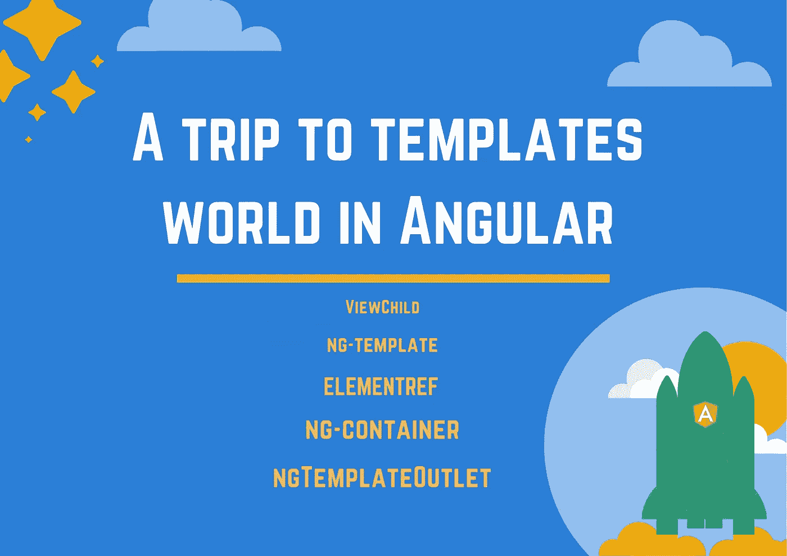
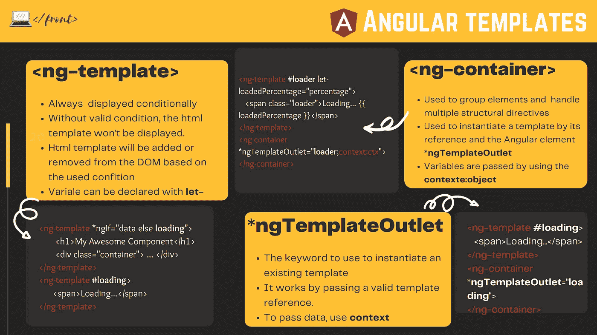

# Angular 中的模板世界之旅🚀

> 原文：<https://levelup.gitconnected.com/a-trip-to-templates-world-in-angular-b3d40b4f0d8a>

## 什么是 ng-template，ng-container，ngTemplateOutlet？+(附赠小抄)



用`*ngFor`或者`*ngSwitch`的时候有没有碰到过`**ng-template**`？你是否想知道它是如何工作的，以及`**ng-template**`和`**ng-container**`或`**ngTemplateOutlet**`有什么不同？这个问题在面试问题中经常被问到。

这些指令非常强大，当你有高级用例时，可以帮助你写一个干净的代码，了解它们以及何时使用它们，肯定会改变你在 Angular 中编写模板的方式。

以下是我在这篇文章中涉及的内容:

*   **什么是** `**ng-template**` **+用例**
*   **什么是** `**ng-container**` **+用例**
*   **什么是** `**ngTemplateOutlet**` **+用例**
*   **外卖**

准备好了，我们走吧

# 什么是 ng-template？

ng-template 是一个角度元素，用于呈现 HTML 模板。就这些吗？好吧，不！ng 模板的强大之处在于它是一个虚拟元素。它是有条件显示的。

这是与传统 HTML 模板的对比？

*   ng-templates 有条件地显示并从 DOM 中删除。
*   它可以根据角度指令使结构动态化。
*   它可以定义自己的一组变量。
*   可以在组件类中访问它。

要做所有这些事情，我们需要使用角度指令和为模板设计的元素，如 ng-template、ng-container、ngTemplateOutlet 等。

先从`**<ng-template>**`开始吧

# 角 ng 模板

正如我之前提到的，`**ng-template**`它只是一个模板，但是比我们目前所知的普通 HTML 模板灵活得多。

该指令的一个典型用例是在加载应用程序时。这将需要一些时间来创建所需的组件，并可能获取一些数据。你不希望你的用户看到一个空白页而感到厌烦。一个装载机或者一个漂亮的旋转器会告诉用户一切正常。我们只是在加载一些必要的东西，你很快就会看到我们的 app。

以下是使用案例示例:

我们刚刚创建了一个`**ng-template**`,因为它是有条件显示的，我们需要调用它以便它可以被显示。注意，我们通过使用引用要显示的模板的语法`#templateref`来使用 ***引用*** (加载)。

我们可以使用其他角度指令，如`*ngSwitch`和`*ngFor`。`**ng-template**`总是以一个条件来显示其内容。

这里需要注意的一点是，在模板中，同一个元素的指令的多重结构用法是不可能的。就像这样，不行不行:

这时候`**ng-container**`来到现场！

# 角形 ng 容器

因为我们不能在同一个元素中编写多个结构化指令，所以想到的第一个快速解决方案是创建 2 个 div，对吗？大概是这样的:

但通常情况下，第一种解决方案不是最好的，而是最容易的。Angular 拥有`**ng-container**` witch，非常适合在这个用例中使用；以下是方法:

这还不是`**ng-container**`所拥有的一切。哦是的，相信我。我们可以这样做:

嗯，这里的`**ngTemplateOutlet**`指令要做什么？让我们更深入。

# 角度 ngTemplateOutlet

让我们一起想象一下，一个加载器或一个旋转器，当我们启动应用程序时，当我们检索一些数据时，当用户提交一个表单时，当他等待一个一切正常的成功消息时，我们都需要它…有许多用例，当你需要一个旋转器来告诉用户一切都好，没有错误。

怎么办？每次创建一个加载程序？嗯，太简单了，太难看了，不是吧！这就是`**ngTemplateOutlet**`从重复的不可维护的代码中拯救出来的力量。

**如何做到这一点？**

**步骤#1:** 为加载程序创建一个且只有一个模板(记得我们用前缀为`#`的`**<ng-template>**` + reference 做的)

**步骤 2:** 实例化我们的加载程序

这与做以下事情是一样的:

```
// With JavaScript
var person = {firstName:"John", lastName:"Doe", age:50, eyeColor:"black"}; // Javascript// With Java
Person person = new Person();
```

我们用`***ngTemplateOutlet**`的魔力尽可能多地实例化我们的加载程序。我们所需要的是**一个有效参考**。

这样做的一大优势是代码的同质性和可维护性，因为我们确保在应用程序中的任何地方都使用相同风格的加载器。即使您需要不同的样式，如 red loader，来显示数据加载时间过长或其他情况，我们也可以想象创建两个引用:

就是这样。我们所需要的就是用`***ngTemplateOutlet**`实例化我们需要的那个。任何地方，我们希望在整个模板。

到目前为止，如果你从一开始就遵循了，你可能会想，哪里是:

*   它可以定义自己的一组变量。
*   可以在组件类中访问它。

对吗？嗯，我没忘记。

## 下面是我们如何声明模板的变量:

下面是组件类:

*   在上面的模板中，我们刚刚声明了一个前缀为`**let-**`的输入变量，它是`**loadedPercentage**` ，它的作用域在模板内。
*   我们使用属性`**context**`将对象传递给模板。我们想要多少就有多少。

## 从组件类访问模板

这是一个用例的例子。假设您有一个导入 CSV 数据的按钮。当用户点击按钮时，你要调用模态服务，告诉他打开哪个模态。我们如何访问我们想要打开的模式？下面是实现这一点的代码:

*   在下面的模板中，我们使用一个 ng 模板，记住，它是有条件显示的。要打开模态，我们需要访问它的引用，即`#importFile`。

现在，用户点击了按钮(导入 CSV 文件)。我们需要在组件中打开模态。对于这个例子，我使用 ng-bootstrap 的[NGB model](https://ng-bootstrap.github.io/#/components/modal/api):

正如您在这里看到的，我们通过`**@**[**viewChild**](https://angular.io/api/core/ViewChild)` [](https://angular.io/api/core/ViewChild)装饰器访问引用，因为它是一个引用，所以它的类型是`ElementRef`。

# 承诺的奖金😉



角度模板的备忘单

以下是 pdf 版本的链接:👉[角度模板备忘单](https://gofile.io/d/KfgUUg)

# 💼外卖:

*   Angular 通过其元素赋予模板更多的功能和灵活性
*   `**<ng-template>**`是从 DOM 中有条件显示和移除的虚拟模板。
*   `**<ng-container>**`用于分组兄弟元素，也用于多个结构指令使用或者用`***ngTemplateOutlet**`指令**实例化一个模板。**
*   通过将模板引用传递给`***ngTemplateOutlet**` 指令来选择要实例化的模板。
*   通过使用`**let-**`并将上下文对象传递给`**ngTemplateOutlet**` 指令，可以将变量传递给模板。
*   上下文对象是包含通过前缀传递给模板的变量的对象。`**let-**`。
*   使用`**ngTemplateOutlet**`在`**ng-container**`占位符内实例化一个模板。
*   通过使用`**@ViewChild('referenceName')**`，decorator 来访问模板。
*   存在其他角度元素来访问模板，例如也可以使用元素，例如 [ViewContainerRef](https://angular.io/api/core/ViewContainerRef) 、 [ViewRef](https://angular.io/api/core/ViewRef) 、 [TemplateRef](https://angular.io/api/core/TemplateRef) …

亲爱的读者朋友们，感谢你们的支持和宝贵时间。我希望这对你有用和有帮助。

**关注我上** [**中**](https://medium.com/@famzil/) **、**[**Linkedin**](https://www.linkedin.com/in/fatima-amzil-9031ba95/)**、**[**Twitter**](https://twitter.com/FatimaAMZIL9)**了解更多文章。**

**后会有期(ﾉ◕ヮ◕)ﾉ*:･ﾟ✧**

**FAM**