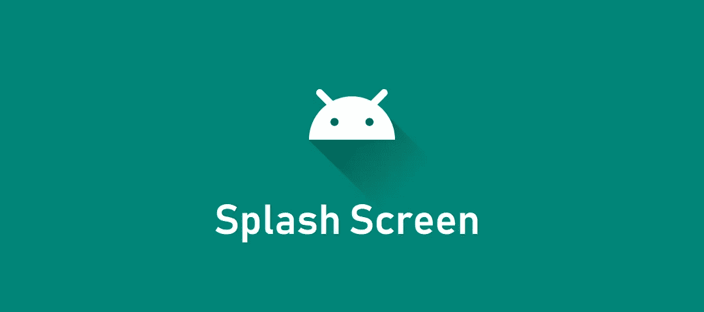
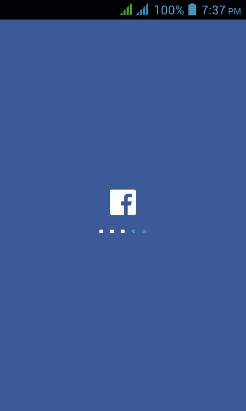
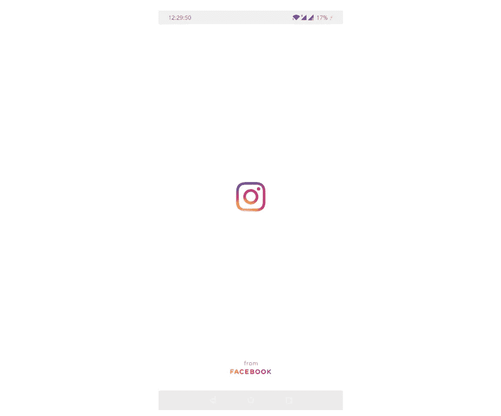
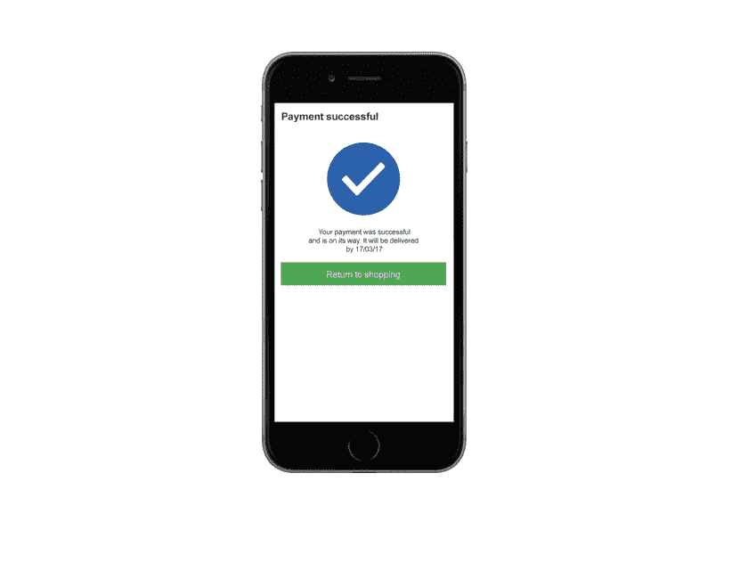
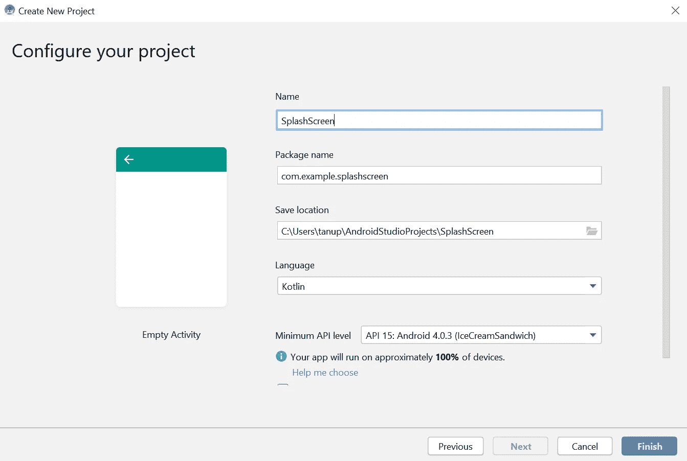
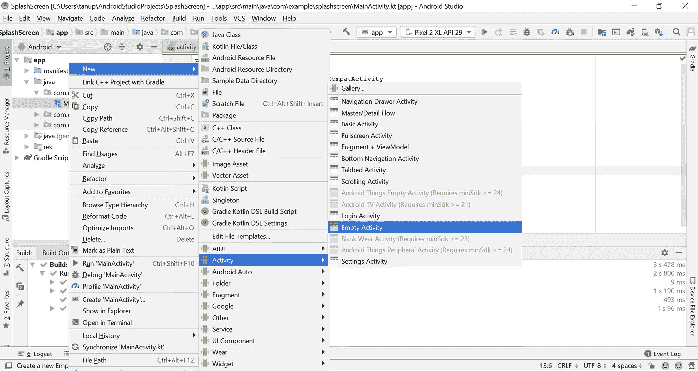
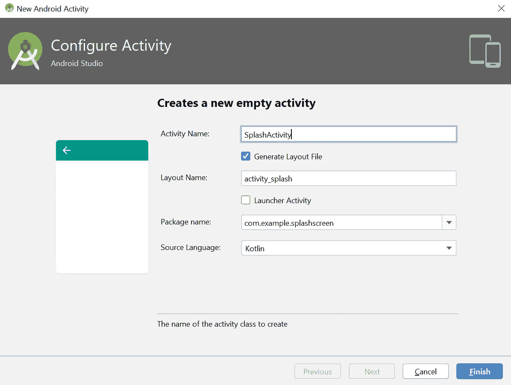
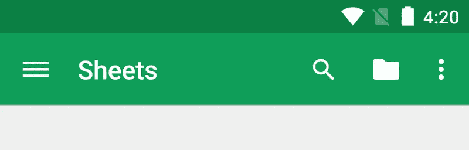
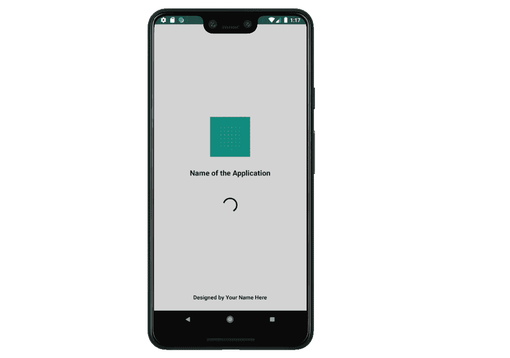

# 在 Android Studio 中使用 Kotlin 构建闪屏的教程

> 原文：<https://levelup.gitconnected.com/a-tutorial-on-building-a-splash-screen-with-kotlin-in-android-studio-dc647cd52f9b>

本教程向您展示了如何使用 Kotlin 在 Android studio 中从头开始实现闪屏。



图片来源:[中等](https://medium.com/@nontachai.j123456789/%E0%B8%A1%E0%B8%B2%E0%B8%97%E0%B8%B3-splash-screen-%E0%B8%9A%E0%B8%99-android-%E0%B8%81%E0%B8%B1%E0%B8%99-ec6aef72e7f2)

在 Kotlin 中开始实现闪屏之前，让我们先了解一下闪屏的基本原理及其背后的理论。

# 什么是闪屏？

闪屏是包含图像、名称、徽标和应用程序版本的屏幕或页面(窗口)。优选地，闪屏具有图形控制元素，例如我们在各种应用、网站或游戏中经常看到的进度条或加载屏幕条。基本上，闪屏是应用程序的介绍页面。在闪屏的帮助下，最终用户可以理解或了解应用程序。

**例如，在过去，脸书有一个闪屏，上面有图标和进度条，如下所示:**



图片来源:[编剧](https://www.thecrazyprogrammer.com/2015/11/android-splash-screen-example.html)

同样，Instagram 最近修改了它的闪屏，现在它的标志下面包含了来自脸书的“*”。显然不要惊慌，因为脸书是 Instagram 的所有者。*

**

*我想现在你们对闪屏和它的外观有了很强的感觉和理解。闪屏应该有进度条或某种加载条并不是强制性的，这只是个人喜好。*设计页面是设计师的事情*。*

# *为什么我们需要闪屏，闪屏有什么好处？*

*闪屏通常会改善应用程序或网站的 ***外观*** 和 ***感觉*** ，这也是它们如此具有视觉吸引力的原因。有时当一个大的进程需要更多的时间来运行时，我们经常可以使用闪屏来通知用户程序正在加载中。同样在闪屏的帮助下，用户不用给出任何提示就可以很容易地理解应用程序的概况。*

## *闪屏的优点是:*

1.  ***它赋予了更多的品牌价值，向用户展示了应用程序的魅力:**假设你构建的应用程序更多地关注某个特定品牌的衣服、汽车、游戏等等，而不仅仅是一个闪屏增加了品牌的价值。人们可能会喜欢这个品牌。创建一个令人敬畏的闪屏会诱使用户喜欢这个应用程序并增加可用性。*
2.  *第一印象总是最好的印象:假设你的应用程序有一个好的闪屏，那么它会给用户留下好印象。他们倾向于更多地使用应用程序。如果应用程序没有任何介绍屏幕，那么大多数用户可能不会喜欢使用这个应用程序(我可能也不会喜欢)。*
3.  ***让用户了解正在发生的事情:**并没有规定只有当用户打开应用程序时才会出现飞溅。市场上通常有许多应用程序，其中的大部分页面都有闪屏。这有助于用户了解系统的状态。这通常会让用户了解应用程序内部正在发生的事情。例如，参见下面给出的截图:*

**

*图片来源:【tolamobile.com *

*上面是一个随机电子商务应用程序的屏幕截图(支付成功屏幕)。在这里您可以看到，当用户输入卡的详细信息，然后点击提交按钮或结帐按钮，用户将会看到一个关于成功付款的闪屏提示。在这种情况下，用户将很容易知道他们的支付是成功的。*

*4.**吸引用户:**有时用一些图形和机智的想法吸引用户是吸引大量用户使用你的应用程序的好主意。比如看下面的截图:*

**

*图片来源:[Pintrest.com](https://in.pinterest.com/pinkymooncake/game-loading/)*

*这里，加载屏幕栏是完全动画的，背景也有图片(这张图片不是 gif，所以想象它是动画)。*

# *如何在 Android Studio 上使用 Kotlin 从头实现闪屏？*

*在阅读本教程之前，我希望你对 Kotlin 编程和使用 Android Studio 有一个非常基本的了解。*

## *1.在 Android Studio 上开始一个新项目。*

*如果你不知道怎么做。只需进入 ***文件→新建→新建项目。*** 然后选择一个 ***空项目*** 并填写以下您选择的详细信息或遵循我的一致。*

**

*用上面的细节创建一个**空活动***

## *2.创建一个名为“SplashActivity”的“空活动”*

*现在让我们创建一个新的" ***空活动*** "命名为" ***溅活动*** "。此外，您不需要为设计手动创建 XML 文件。当你创建一个新的活动时，Android Studio 会自动创建一个 XML 文件。创建一个新的空活动的原因是因为我不想打扰或更新主活动文件。相反，创建新文件或新活动通常是一个好习惯。因为主 kot Lin(***main activity . kt***)就像是应用加载时首先调用的主蓝图。因此，创建一个新的活动更有可能。要创建一个新的" ***空活动*** "只需导航到***app→Java→com . example . your name(第一个)→main Activity→右键→New→Activity→Empty Activity***或参考下面的截图*

**

*创建一个**空活动，名为***

*然后确保将空活动命名为“***splash activity***”。更多详情请参考下文。*

**

*使用相同的属性以保持一致性*

## *3.让我们首先通过 XML 编码来设计闪屏*

*我们不需要把自己复杂化，这意味着没有核心设计策略被用来设计闪屏。闪屏意味着简约。打开 XML 文件“***activity _ splash . XML***”，添加以下代码。要导航到布局文件夹，只需展开“***app→RES→layout***”。*

```
**<?***xml version="1.0" encoding="utf-8"***?>

<!-- This a "Splash Screen" XML file, here all the text view, Image view are laid in a linearly fashion inside the Linear layout. The reason of linear layout is for accurately placing the logo and the progress bar without happen to use the constraints -->* <**LinearLayout xmlns:android="http://schemas.android.com/apk/res/android"
    xmlns:app="http://schemas.android.com/apk/res-auto"
    android:orientation="vertical"
    android:layout_width="match_parent"
    android:layout_height="match_parent"
    android:background="@color/grey"**>

    *<!-- Don't worry about the id names I have named the id's with reference to the file name for consistency -->* <**ImageView
        android:id="@+id/imageView"
        android:layout_width="match_parent"
        android:layout_height="wrap_content"
        android:layout_marginTop="250dp"
        android:src="@drawable/ic_launcher_background"
        app:srcCompat="@android:drawable/sym_def_app_icon"** />

    <**TextView
        android:id="@+id/textView"
        android:layout_width="match_parent"
        android:layout_height="wrap_content"
        android:text="Name of the Application"
        android:textSize="20dp"
        android:textStyle="bold"
        android:gravity="center"
        android:textColor="@color/black"
        android:layout_below="@id/imageView"
        android:padding="30dp"**/>

    <**ProgressBar
        android:id="@+id/progressBar"
        android:layout_width="match_parent"
        android:layout_height="wrap_content"
        android:layout_below="@id/textView"
        android:layout_centerHorizontal="true"
        android:layout_marginTop="20dp"
        android:indeterminateTint="@color/black"**/>

    <**TextView
        android:id="@+id/textView1"
        android:layout_width="match_parent"
        android:layout_height="wrap_content"
        android:layout_below="@id/progressBar"
        android:gravity="center"
        android:layout_marginTop="200dp"
        android:padding="15dp"
        android:text="Designed by Your Name Here"
        android:textColor="@color/black"
        android:textSize="15dp"
        android:textStyle="bold"
        android:textAlignment="center"**/>

</**LinearLayout**>*
```

*代码的快速解释:大部分代码都是不言自明的。不过，我已经去掉了 [***约束布局***](https://developer.android.com/training/constraint-layout) ，用了一个 [***线性布局***](https://developer.android.com/reference/android/widget/LinearLayout) 代替。当谈到垂直放置视图时，线性布局是最好的，它适合智能手机的所有方面。我刚刚使用了 android 的默认图像作为飞溅的标志，也只是随机文本。重点是理解概念和实现的方式。您可以使用这个框架来构建自己喜欢的惊人的闪屏。另外，下面可以找到 ***color.xml*** 文件。要导航到 colors.xml，请使用***app→RES→values→colors . XML .****

```
**<?***xml version="1.0" encoding="utf-8"***?>

<!-- All the colors used in the application -->* <**resources**>
    <**color name="colorPrimary"**>#008577</**color**>
    <**color name="colorPrimaryDark"**>#00574B</**color**>
    <**color name="colorAccent"**>#D81B60</**color**>
    <**color name="grey"**>#d3d3d3</**color**>
    <**color name="white"**>#ffffff</**color**>
    <**color name="black"**>#000000</**color**>
</**resources**>*
```

## *4.修改“styles.xml”值文件*

*样式资源文件描述了应用程序的配置和外观。在样式资源文件的帮助下，我们可以声明应用程序的主题和更多使用相同 XML 元素的样式。更多关于样式资源文件的文档可以在 [***这里***](https://developer.android.com/guide/topics/resources/style-resource) 找到。要导航到资源文件***app→RES→values→styles.xml .***只需在 styles . XML 文件中添加以下代码。*

```
**<!-- This style is for the splash screen -->* <**style name="AppTheme.NoActionBar"**>
    <**item name="windowActionBar"**>false</**item**>
    <**item name="windowNoTitle"**>true</**item**>
</**style**>*
```

*这里我们不需要闪屏上的动作栏。动作栏是 Android 最重要的设计元素之一。它通常位于顶部，通常包括应用程序的名称，有时还包括扩展、共享和搜索等选项，如下例所示。*

**

*图片来源:[动作栏](https://developer.android.com/training/appbar)*

*所以我们不需要闪屏上的操作栏，所以我们使用了“ ***”。*NoActionBar**为属性。此外，我们正在确认，我们不需要在闪屏应用程序的标题。下面是 styles.xml 的完整代码。*

```
*<**resources**>

    *<!-- Base application theme. -->* <**style name="AppTheme" parent="Theme.AppCompat.Light.DarkActionBar"**>
        *<!-- Customize your theme here. -->* <**item name="colorPrimary"**>@color/colorPrimary</**item**>
        <**item name="colorPrimaryDark"**>@color/colorPrimaryDark</**item**>
        <**item name="colorAccent"**>@color/colorAccent</**item**>
    </**style**>

    *<!-- This style is for the splash screen -->* <**style name="AppTheme.NoActionBar"**>
        <**item name="windowActionBar"**>false</**item**>
        <**item name="windowNoTitle"**>true</**item**>
    </**style**>

</**resources**>*
```

## *5.初始屏幕的 Kotlin 代码*

*女士们先生们，男孩女孩们，你们都在等待的时刻到了，现在是时候使用 Kotlin 编程进行编码了。Kotlin 代码非常简单(感谢上帝)。这里我们使用一个 [***处理程序***](https://medium.com/@ankit.sinhal/handler-in-android-d138c1f4980e) (它允许从其他后台线程与 UI 线程通信回来)来做一个小的延迟。您可以在 Handler 的 ***postDelayed*** 方法中实现数据抓取或任何功能。*

```
***import** android.content.Intent
**import** androidx.appcompat.app.AppCompatActivity
**import** android.os.Bundle
**import** android.os.Handler

**class** SplashActivity : AppCompatActivity() {

    *// This is the loading time of the splash screen* **private val SPLASH_TIME_OUT**:Long = 3000 *// 1 sec* **override fun** onCreate(savedInstanceState: Bundle?) {
        **super**.onCreate(savedInstanceState)
        setContentView(R.layout.*activity_splash*)

        Handler().postDelayed(**{** *// This method will be executed once the timer is over
            // Start your app main activity* startActivity(Intent(**this**,MainActivity::**class**.*java*))

            *// close this activity* finish()
        **}**, **SPLASH_TIME_OUT**)
    }
}*
```

*现在闪屏的延迟是 **3** 秒。我认为最大延迟(3-4 秒)是可以的，但不要超过它。通常不建议有更大的延迟，因为用户有时可能会感到沮丧，容易被激怒。但是，您可以根据自己的喜好更改延迟。*

> ***越小越好→说到延迟***

***注意:**请勿触摸***Main activity . kt***(主 Kotlin 文件)以及***activity _ Main . XML***文件。因为我们没有修改这些文件。当启动屏幕加载后，简单的“ ***Hello World*** ”文本显示出来，因此我保留了这两个文件。*

## *6.将 SplashActivity 作为启动页面添加到清单文件中*

*如果我们需要在应用程序启动时启动闪屏，那么我们需要将它添加到 manifest.xml 文件中。导航到清单文件***app→manifests→androidmanifests . XML .***在清单文件中添加以下代码。*

```
**<!-- The below is for the splash screen and we need no action bar and the default theme -->* <**activity android:name=".SplashActivity"
    android:theme="@style/AppTheme.NoActionBar"**>
    <**intent-filter**>
        <**action android:name="android.intent.action.MAIN"** />
        <**category android:name="android.intent.category.LAUNCHER"** />
    </**intent-filter**>
</**activity**>*
```

*不要太担心 XML 编码，你在这里所做的只是确保在启动时调用了***Splash Activity . kt***(Splash Activity 是我们用 Koltin 编码的闪屏文件)。清单的完整代码可以在下面找到:*

```
**<?***xml version="1.0" encoding="utf-8"***?>* <**manifest xmlns:android="http://schemas.android.com/apk/res/android"
    package="com.example.splashscreen"**>

    <**application
        android:allowBackup="true"
        android:icon="@mipmap/ic_launcher"
        android:label="@string/app_name"
        android:roundIcon="@mipmap/ic_launcher_round"
        android:supportsRtl="true"
        android:theme="@style/AppTheme"**>

        *<!-- The below is for the splash screen and we need no action bar and the default theme -->* <**activity android:name=".SplashActivity"
            android:theme="@style/AppTheme.NoActionBar"**>
            <**intent-filter**>
                <**action android:name="android.intent.action.MAIN"** />
                <**category android:name="android.intent.category.LAUNCHER"** />
            </**intent-filter**>
        </**activity**>

        <**activity android:name=".MainActivity"**>
            <**intent-filter**>
                <**action android:name="android.intent.action.MAIN"** />
                <**category android:name="android.intent.category.LAUNCHER"** />
            </**intent-filter**>
        </**activity**>

    </**application**>

</**manifest**>*
```

## *7.在模拟器或智能手机上运行应用程序*

*现在是时候看看我们努力工作的成果了。当配置清单文件时，添加样式和颜色资源的工作就完成了。此外，布局和 Kotlin 文件在这一阶段已经完成。唯一悬而未决的是在模拟器或智能手机上运行应用程序。如果你不知道如何使用或配置模拟器。这里 **推荐你看 YouTube [**。**下面是我的模拟器截图。显然进度条是动画的，但是你在下面的截图中看不到(值得一试)。](https://www.youtube.com/watch?v=LgRRmgfrFQM&t=391s)***

**

*如果您在运行程序时遇到任何问题或错误，请仔细检查代码或通过评论部分告诉我。我一定会满足你的问题。*

*恭喜您已经成功完成使用 Kotlin 在 Android Studio 上实现 ***闪屏的教程。我希望你喜欢它，并且今天学到了一些新的东西。使用这个平台和框架来构建将改变世界的惊人的闪屏。谢谢你们花时间阅读我的教程。敬请关注更多更新。直到那时再见。祝你有愉快的一天。****