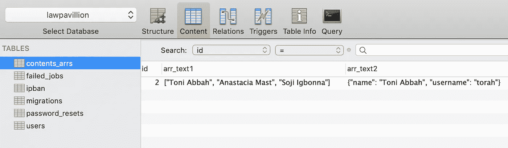
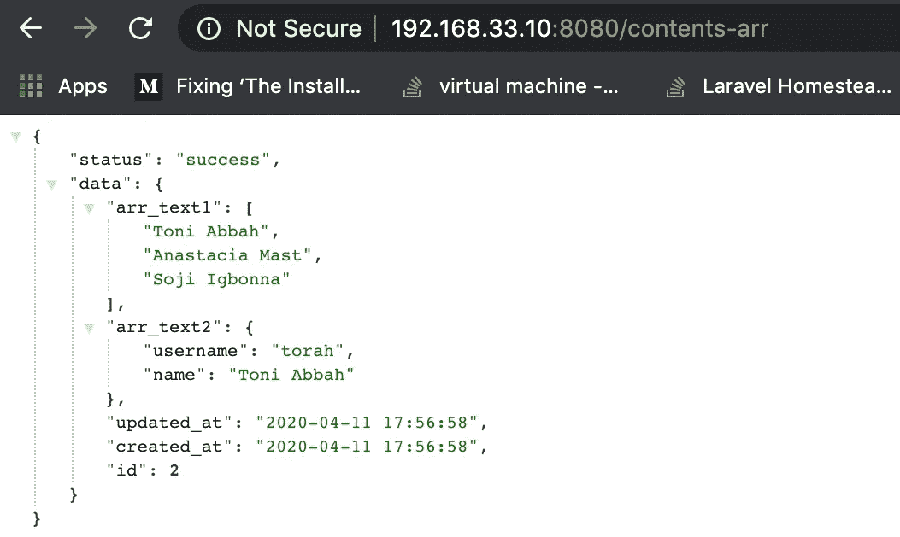

# 关于如何在 Laravel 中使用 JSON 和 CASTS 将数组存储到 SQL 数据库的教程

> 原文：<https://levelup.gitconnected.com/a-tutorial-on-how-to-store-arrays-to-sql-databases-using-json-and-casts-in-laravel-9b97e28af05a>


在本文中，我们将研究如何使用 json 数据类型和 cast 属性在 Laravel 或 Lumen 应用程序中存储数组。

这是我上一篇文章“[用 PHP](https://medium.com/swlh/an-awesome-way-to-store-arrays-to-sql-database-in-php-c1e33c5c2e44) 将数组存储到 SQL 数据库的绝妙方法”的分支。查看它，全面了解如何在 sql 数据库中存储和检索数组。

## 第一步

在我们的 Laravel 应用程序中，我们将从终端进行建模和迁移

—>在您的终端中创建一个 contents_arr 模型并进行迁移

```
php artisan make:model ContentsArr -m
```

## 第二步

我们编辑迁移文件，并将数组列设置为 json

—>按如下方式编辑迁移(create_contents_arrs_table):

```
<?phpuse Illuminate\Database\Migrations\Migration;use Illuminate\Database\Schema\Blueprint;use Illuminate\Support\Facades\Schema;class CreateContentsArrsTable extends Migration{/*** Run the migrations.** @return void*/public function up(){Schema::create('contents_arrs', function (Blueprint $table) {$table->increments('id');$table->json('arr_text1');$table->json('arr_text2');$table->timestamps();});}/*** Reverse the migrations.** @return void*/public function down(){Schema::dropIfExists('contents_arrs');}}
```

## 第三步

让我们也编辑我们的模型类，并使用 Laravel 的 awesome `$cast`属性从数据库返回数组值。此外，我们将“arr_text1”和“arr_text2”列设置为可批量赋值。

—>按如下方式编辑模型(内容)

```
<?phpnamespace App;use Illuminate\Database\Eloquent\Model;class ContentsArr extends Model{protected $fillable = ['arr_text1', 'arr_text2'];//Tell laravel to fetch text values and set them as arraysprotected $casts = ['arr_text1' => 'array','arr_text2' => 'array'];}
```

## 第四步

现在是时候制作一个将我们的数据传递给数据库的控制器了。

—>在终端中创建内容控制器

```
php artisan make:controller ContentsArrController
```

## 第五步

在这里，我们创建希望传递给 concertive 的数组数据，以便存储到数据库中，如果数组存储成功，则返回 contents_arr 记录的成功响应，如果不成功，则返回错误响应

—>按如下方式编辑控制器(ContentsArrController)

```
<?phpnamespace App\Http\Controllers;use Illuminate\Http\Request;class ContentsArrController extends Controller{// Create a new contents_arr entry.public function createContents(){$contents_arr = \App\ContentsArr::create(['arr_text1' => ['Toni Abbah','Anastacia Mast','Soji Igbonna'],'arr_text2' => ['username'=>'torah','name'=>'Toni Abbah']]);if($contents_arr) {return response()->json(['status' => 'success','data' => $contents_arr]);}return response()->json(['status' => 'fail','message' => 'failed to create content_arr record']);}}
```

## 第六步

最后，我们通过 get 请求将应用程序路由到控制器中的 createContents 方法。这样，我们可以通过浏览器简单地测试我们的实现。

—>现在让我们设定路线

```
<?php/*|--------------------------------------------------------------------------| Web Routes|--------------------------------------------------------------------------|| Here is where you can register web routes for your application. These| routes are loaded by the RouteServiceProvider within a group which| contains the "web" middleware group. Now create something great!|*/Route::get('/contents-arr', 'ContentsArrController@createContents');
```

> **我们开始了…在浏览器中我们使用点击端点:http://yourbaseurl/contents-arr**

结果在图片里！



contents_arrs 数据库表



json 格式的浏览器响应

## Suweeeet！！！

我们已经成功地实现了如何分别使用 json 和 casts 来存储和检索数组！

我希望它是有趣的，简单明了的。

***一如既往的感谢吊！***