# 改变 Linux 环境变量和 Docker 容器环境变量的十七种方法

> 原文：<https://levelup.gitconnected.com/a-tutorial-on-the-behavior-of-linux-environment-variables-and-docker-containers-environment-29218a982220>

Docker 容器从它们的主机继承环境变量，在启动时在外部设置，或者在 docker 文件中内部设置。还展示了如何修补正在运行的 Docker 容器。


虚拟环境托管在父环境中。约瑟夫·阿克布鲁德在 [Unsplash](https://unsplash.com/s/photos/virtual-world?utm_source=unsplash&utm_medium=referral&utm_content=creditCopyText) 上的照片

一个软件工程师需要知道大量的 Linux 命令。为什么？

*   Linux 变种是免费和开源的。
*   Linux 变体实际上是所有云中虚拟机(节点)的裸机操作系统基础。
*   Linux 变种实际上是企业服务器的标准。
*   Linux 变种是 Docker 和其他虚拟环境创建工具事实上的操作系统基础。
*   值得重申的是，Linux 的变体，如 Redhat、Ubuntu、Alpine 等都是免费和开源的。

这篇博客文章:

1.  简要讨论启动*终端会话；*
2.  显示和改变*终端会话的*外壳*；*
3.  讨论用于显示、定义、设置环境变量的值以及更改环境变量的值的 Linux 命令；
4.  如何修补正在运行的 Docker 容器；
5.  如何显示、定义、设置和改变 *Docker 容器*的环境变量的值。

如果你想温习 Linux 和/或 Docker，请阅读以下博客:

[](https://medium.com/linuxforeveryone/the-real-reason-linux-users-love-the-command-line-e8043f583028) [## Linux 用户喜欢命令行的真正原因

### 当我开始我的 Linux 之旅时，我坚决不碰终端窗口。然后我意识到了真正的吸引力…

medium.com](https://medium.com/linuxforeveryone/the-real-reason-linux-users-love-the-command-line-e8043f583028) [](https://medium.com/100-days-of-linux/20-basic-linux-commands-for-beginners-78516ab936d6) [## 初学者的 20 个基本 Linux 命令！

### 对初学者有帮助的基本 Linux 命令示例！

medium.com](https://medium.com/100-days-of-linux/20-basic-linux-commands-for-beginners-78516ab936d6) [](https://medium.com/codingthesmartway-com-blog/docker-beginners-guide-part-1-images-containers-6f3507fffc98) [## Docker —初学者指南—第 1 部分:图像和容器

### 这篇文章首先在 CodingTheSmartWay.com 上发表。

medium.com](https://medium.com/codingthesmartway-com-blog/docker-beginners-guide-part-1-images-containers-6f3507fffc98) [](/our-enterprise-docker-solution-for-migration-to-the-cloud-d7bb9d1a796b) [## 我们面向云迁移的企业 Docker 解决方案

### 这是一个关于我们第一次推出 Docker 的故事，它发生在我以前作为承包商工作过的一家公司。代码，作为…

levelup.gitconnected.com](/our-enterprise-docker-solution-for-migration-to-the-cloud-d7bb9d1a796b) [](https://towardsdatascience.com/twenty-one-techniques-and-five-concepts-for-better-docker-usage-9ee135dccdc9) [## 更好地使用 Docker 的 21 个技巧和 5 个概念

### Docker 是为你的非智能手机电脑设计的应用软件。

towardsdatascience.com](https://towardsdatascience.com/twenty-one-techniques-and-five-concepts-for-better-docker-usage-9ee135dccdc9) 

在过去的五年里，我一直使用码头集装箱。它使我能够处于 Ubuntu 20.04-Python 3.8 环境中，无论是由我的 MacOS 还是我的 Ubuntu 18.0-Python 3.6-Nivida 机器托管。

您可以自由使用这篇博客文章中展示的 Linux 和 Docker 命令。

准备好了吗？让我们开始吧！

# 1.启动终端会话

每个 Linux 操作系统都有一个不活动的图形用户界面(GUI)。顶层窗格通常称为桌面。由施乐公司命名，由苹果公司和微软公司商业化。

几乎所有的 Linux 变种都有一个 GUI 终端会话应用程序。示例桌面 GUI 终端会话有:`**gnome-terminal**`、`**konsole**`、`**xterm**`、`**rxvt**`、`**kvt**`、`**nxterm**`和`**eterm**`。

实际上，以前，终端应用程序被称为“终端仿真器”大约四十年前，回到过去的美好时光，一个“真正的”终端有 80 个字符宽，在黑屏上以白色(或绿色)字符的线性流显示数据。

***IMHO*** *:“终端仿真器”应该有不同的名称。作为一个例子，“鱼模拟器”被称为蜥蜴。“终端会话”怎么样*

在 MacOS Big Sur(版本 11.x)上，GUI 终端会话启动图标显示为:

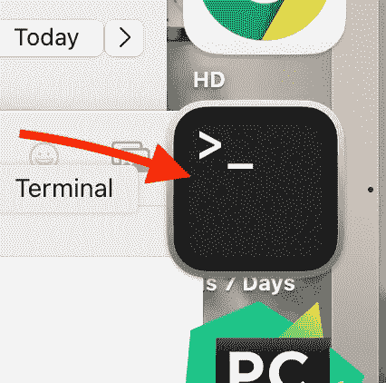

图一。来源:作者桌面快照。

在“启动栏”上通过双击图标启动终端会话。

# 2.确定终端会话启动哪个 Shell

当您启动终端会话时，您通过“命令行”进行交互在终端会话中执行的“命令行”解析器应用程序被称为“shell”

有不同的 shell 可以使用，比如:`**sh**`(通天 shell)**`**bash**`(bash 或者再次通天 shell)`**ksh**`(Korn shell)`**tcsh**`(TC shell)`**zsh**`。**

**每个 shell 都有细微的语法差异，这种语法差异足以让一个 shell 脚本在不同的 shell 中以非常不酷的方式失败。**

*****注*** *:可能存在语义差异，附加功能。***

**我推荐你挑个壳，比如`**bash.**`至少五年不变？五年给你的智力投资带来了足够的回报。**

*****浅见*** *:大家都用* `***bash***` *。为什么苹果改用* `***zsh***` *大苏尔发布？我确信他们有充分的理由——不是。***

*****注*** *:如果一个苹果开发者对于 MacOS 或者 iX 设备，那么，唉，把* `***tcsh***`换成*。Xcode 要求您切换。***

**您可以看到正在使用的 shell:**

```
echo "$SHELL"
# or
echo $0"
# or my favorite
# ps -p "$$"
```

**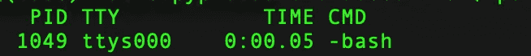**

**`ps -p "$$" output,.` 来源:作者桌面快照。**

# **3.更改在终端会话中启动的 Shell**

**在终端会话中，使用命令`$ chsh -s <path>`切换到不同的 shell，其中的路径是/etc/shell 中列出的 shell 路径之一。**

**在 MacOS Big Sur 上，炮弹的清单是:**

```
$ /bin/zsh, /bin/bash, /bin/csh, /bin/dash, /bin/ksh, /bin/sh, or /bin/tcsh
```

**例如，改为 bash。**

```
$ chsh -s /bin/bash
```

# **4.指定获取脚本时要使用的 Shell**

**下面是我的`.bash_profile`文件的前 15 行:**

```
#!/bin/bash
#
# v 1.5.1 # I always version to make sure I am not overwriting files.
# 2015-09-12 # This is the last date I edited a file.
export PATH="/usr/local/sbin:$PATH"
#
#export PYTHONSTARTUP=/Users/brucecottman/Documents/DB/Programming/PYSPARK/InitPySpark.py# edit 5-14-2017
export JAVA_HOME=/Library/Java/JavaVirtualMachines/jdk1.8.0_162.jdk/Contents/Home/test.in
export SPARK_HOME=/usr/local/Cellar/apache-spark/2.4.3/libexec
export PYTHONPATH=/usr/local/Cellar/apache-spark/2.0.1/libexec/python/:$PYTHONP$export PATH=$JAVA_HOME/bin:$SBT_HOME/bin:$SBT_HOME/lib:$SCALA_HOME/bin:$SCALA_HOME/lib:$PATH
export PATH=$JAVA_HOME/bin:$SPARK_HOME:$SPARK_HOME/bin:$SPARK_HOME/sbin:$PATH
export PYSPARK_PYTHON=python3#
```

**关键的一点是，这个脚本有指令`#!/bin/bash`来用 bash shell 执行脚本`.bash_profile`。您用 Linux 命令`source:`执行一个 shell 脚本**

```
$ source <shell-path>
# example
$ source .bash_profile
```

**Github 存储库中有丰富的开源登录配置文件。**

*****注*** *:你从这些脚本中学习 shell 编程。***

# **5.Shell 脚本是在您启动终端会话时获得的**

**当您启动一个新的终端会话时，找出自动运行的 shell 脚本是非常困难的。**

*****注意*** *:记住，我在 MacOS 上使用的是终端会话。MacOS 拥有大多数 Linux shell 命令。但是，如果您使用的是 Linux 版本，那么在可用的 shell 命令方面会有一些小的不同。***

**我使用的方法是在我的`$HOME` l 目录中列出`.<files>`:**

```
$ cd $HOME;ls -al .*
```

**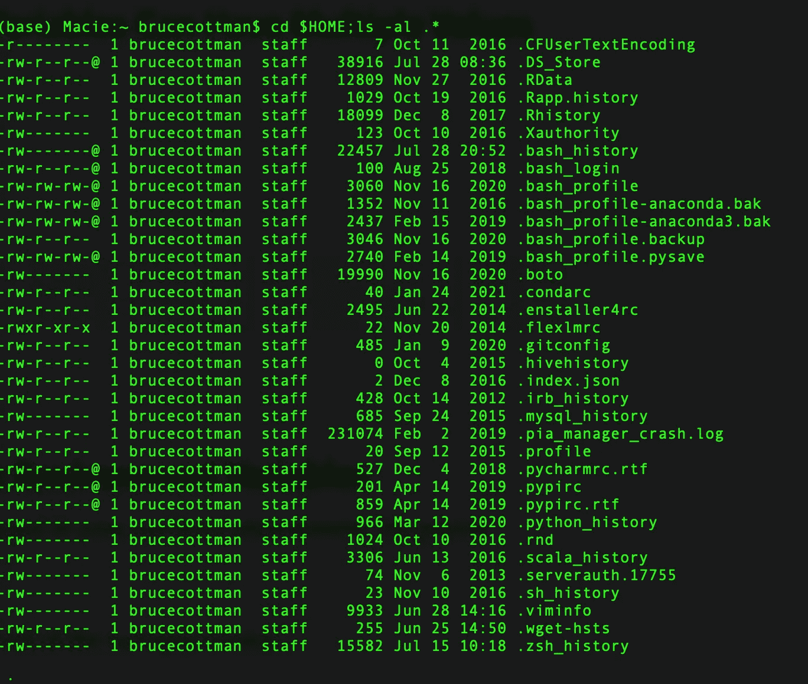**

**`The command cd $HOME;ls -al .* output.` 来源:作者桌面快照。**

# **6.常见的 Linux 环境变量**

**在顶级环境(父环境)中创建的默认变量通常是:**

*   **`SHELL` : Value 是终端会话的外壳；**
*   **`TERM` : Value 指定运行 shell 时要模拟的终端类型；**
*   **`USER`:值指定登录用户。**
*   **`PWD`:指定工作目录的值。**
*   **`OLDPWD`:值指定上一个工作目录。您可以通过运行以下命令切换回之前的目录。`cd -`。**
*   **`MAIL` : Value 指定登录用户邮箱的路径。**
*   **`PATH` : Value 指定一个目录列表，系统将按降序检查任何命令的二进制文件。**
*   **`LANG` : Value 指定计算机语言和本地化设置，包括字符编码。**
*   **`HOME` : Value 指定登录用户主目录的路径。**
*   **`_` : Value 指定之前执行的命令。**

# **7.环境变量可以有多个值**

**如果您深入研究系统核心代码，您会遇到创建和销毁多值环境变量的情况。作为一个用户，就没那么多了。但是，有一个多值环境变量您会遇到并更改— `PATH:`**

**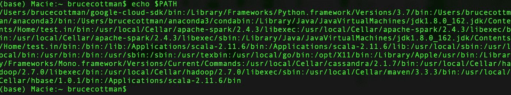**

**echo $PATH 输出。来源:作者桌面快照。**

**通常要设置一个新的`PATH,`通常要添加到`PATH:`**

```
PATH=$PATH:<path-1>:<path-2>:<path-3>...
```

**按照 Python 的说法，它被附加到一个列表中。**

# **8.在终端会话中显示环境变量**

**您在 shell 中显示所有环境变量:**

```
echo "$<environment variable>"
# for example
echo "$SHELL"
```

**或者更好的是，用命令`printenv`打印出所有的环境变量:**

```
> printenv
```

**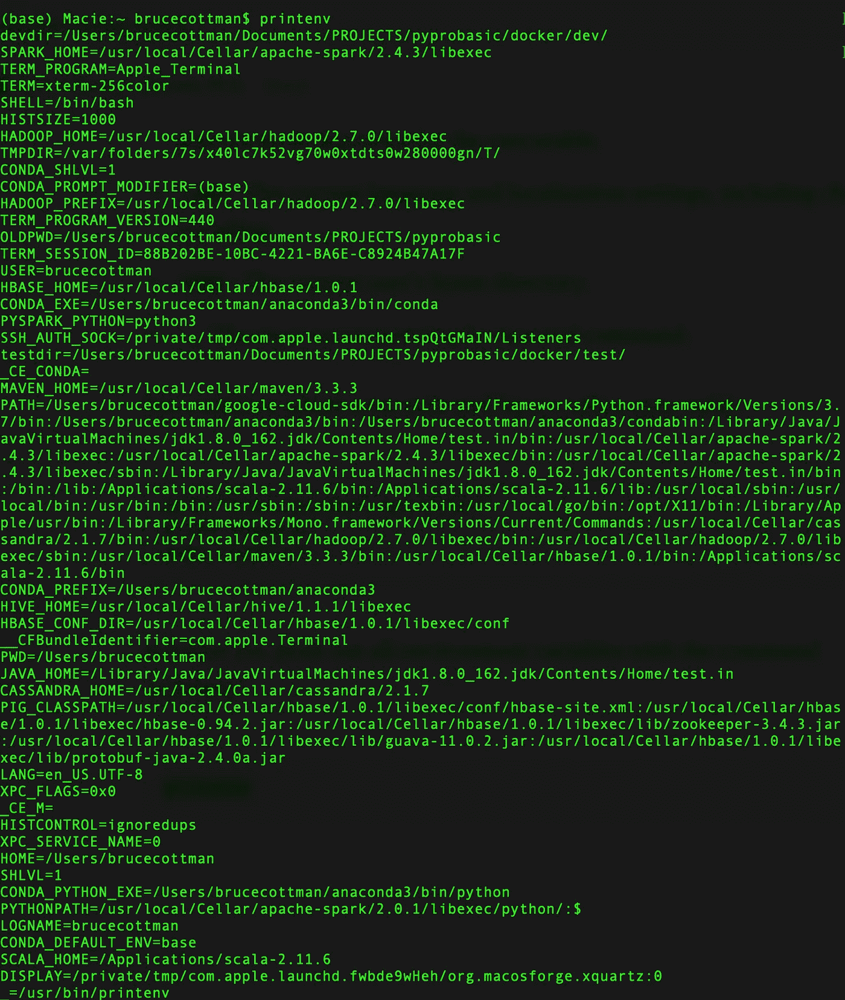**

**`printenv output.` 来源:作者桌面快照。**

# **9.在终端会话中创建环境变量**

**在几乎所有的 shells 中创建新的环境变量都很简单。在`bash:`**

```
$ NEW_VAR=123456789
$ export NEW_VAR
$ printenv; grep NEW_VAR
```

**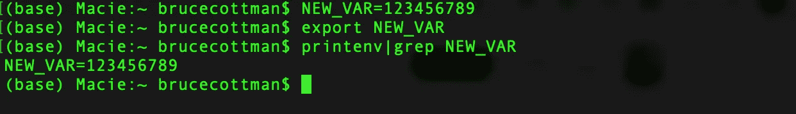**

**`printenv|grep NEW_VAR output.` 来源:作者桌面快照。**

# **10.显示 Docker 容器中的环境变量**

**我所有的 Docker 映像都有一个 Linux 基础层。当您运行 Docker 容器时，您可以附加和运行大多数 shell 命令。**

**例如，您显示所有环境变量，并在 Docker 容器外壳中分配一个值:**

```
$ docker run -d --name  <container name/ID> <image name/ID>
$ docker exec -it <container name/ID> bash -c "printenv"
```

**哪些输出:**

**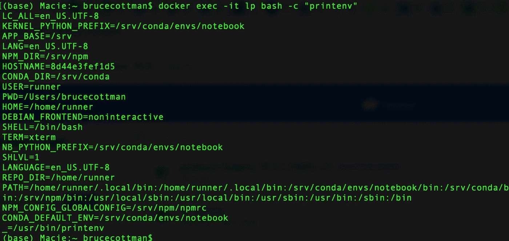**

**`printenv output of Docker container lp.` 来源:作者桌面快照。**

**第一个命令启动 Docker 映像，`<image-name>,`作为 Docker 容器运行，`<container-name>.`第二个命令，`<docker exec..>,`在 Docker 容器内运行，`<container-name>.`**

**您可以作为一个分离的进程运行，在后台 Docker 容器中，`<container-name>.`:**

```
$ docker run -d --name  <container name/ID> <image name/ID>
$ docker exec -t -d <container name/ID> bash -c "printenv"
```

**为了调试**容器**，我们启动了一个交互式会话:**

```
$ docker run -d --name  <container name/ID> <image name/ID>
$ docker exec -it <container name/ID> bash
# ps -p "$$"
# exit
$
```

**例如:**

**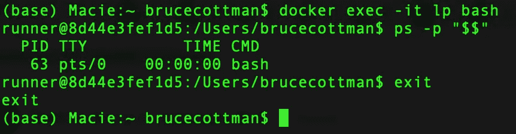**

**Shell 命令 ps -p "$$" `output of Docker container lp.` 来源:作者桌面快照。**

*****注意*** *:您可以通过输入* `*exit*` *来结束或终止您的会话。***

*****注意*** *:以上命令对于监控和您可能想要在运行的* ***容器*** *上执行的其他任务非常有用。***

# **11.确定哪个 Shell 是 Docker 容器中的默认 Shell**

**在上一个例子中，我们确定了 Docker 容器中的默认 shell。**

**以下内容也适用:**

```
$ docker run -d --name  <container name/ID> <image name/ID>
$ docker exec -it <container name/ID> bash
# echo "$SHELL"
# exit
$
```

**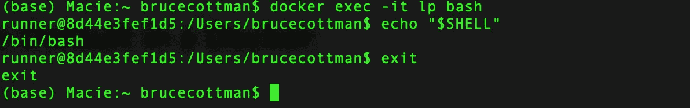**

**Shell 命令 e `cho "$SHELL" output of Docker container lp.` 来源:作者桌面快照。**

**您可以在 Docker 容器中交互式运行任何 shell。您可以在 Docker 容器的虚拟环境中执行 shell 命令。**

**我觉得太棒了！**

# **12.更改 Docker 容器中的外壳**

**对前面的命令稍加修改，我们使用以下命令切换到 Docker 容器中的`sh`:**

```
$ $ docker run -d --name  <container name/ID> <image name/ID>
$ docker exec -it <container name/ID> bash# sh
# exit
$
```

**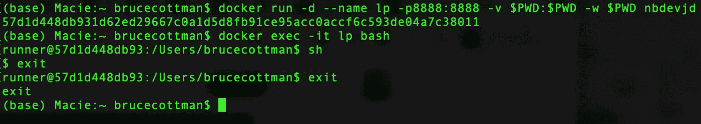**

**在 Docker 容器中改变外壳 `lp.` 来源:作者桌面快照。**

*****注意*** *:一退出外壳开关就消失了。记得你在 Docker 容器里面运行*`*bash*`*`*<docker exec..>,*`*，* `*lp.*`***

# ***13.不要在 Docker 映像中使用 root***

***创建映像并赋予其 root 权限被认为是一种不好的做法。我通过对我的 docker 文件进行以下更改来解决这个问题:***

```
*USER root.
.
bunch of dockerfile commands that need root
like apt-get
.
.USER $USER  # After commands that need root priveledges.*
```

# ***14.创建群组“docker”***

## ***马科斯***

***MacOS 使用的命令不同于 Linus 变体。***

***因为我托管的是 MacOS 终端会话，而不是 Docker 容器，所以我输入了将$USER 放入组`docker`的命令:***

```
*# add "docker"as a group
$ sudo dseditgroup -o create docker # create a group named "docker"
# add current user to group docker
$ sudo dseditgroup -o edit -a $USER -t user docker 
# List what groups $USER is in  
$ id -Gn $USER*
```

***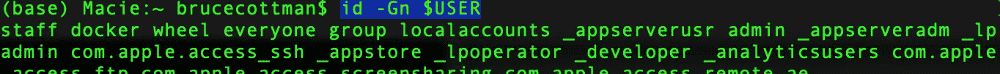***

***用户在组 docker 中。来源:作者桌面快照。***

******注*** *:以上魔法圣咏我就不解释了。通常，你使用 MacOS 的“系统偏好设置>用户组&”但是，我想保持一致，从终端会话执行所有命令。****

## ***Linux 变体***

***需要有`root`密码才能在任何 Linux 变体中执行以下命令:***

```
*$ sudo groupadd mygroupgroupadd docker
$ sudo usermod -a -G docker $USER*
```

***注意:`busybox`在我看来，是作为一个基本的 Linux 来创建的，以支持创建最小的 Docker 容器。我不认为`busybox`是我的 Linux 变种列表的一部分。***

# ***15.在启动时为 Docker 容器设置环境变量***

***你使用`--env`、`-e`选项，以`docker run.`为例:***

```
*$ $ docker run -e \ "SSL_CERT_FILE=/Users/brucecottman/github_cert.ca.txt" -d --name \<container name/ID> <image name/ID>*
```

***如果您忘记在 Docker 容器启动时指定环境变量，那么您可以执行以下操作:***

```
*$ docker run -d --name  <container name/ID> <image name/ID>
$ docker exec -it <container name/ID> bash
#SSL_CERT_FILE="/Users/brucecottman/github_cert.ca.txt"
#export SSL_CERT_FILE*
```

# ***16.在 Docker 文件中为 Docker 容器设置环境变量***

***Dockerfile 有一个独特的用于设置 Docker 镜像中的环境变量，`ENV.`例如:***

```
***FROM** python:3.7
**FROM** jupyter**/**minimal-notebook
**ENV <new_var>="<value">****.
.
.***
```

***注意:Docker 环境变量不应该是`EXPORTed.`***

# ***17.修补正在运行的 Docker 容器***

***以下对数据科学家来说很棒。然而，它可能会让你被“系统”或任何在你之后收拾残局的组织“烧死”。***

```
*$ docker run -d --name  <container name/ID> <image name/ID>
$ docker exec -it <container name/ID> bash
## look for diagrams in the Docker container# pip list | grep diagrams*
```

***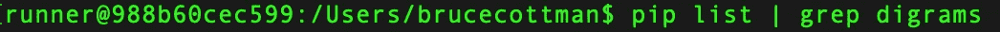***

***我在已安装软件包的列表中找不到图表。来源:作者桌面快照。***

***在 Docker 容器中安装图表:***

```
*#  pip install diagrams*
```

***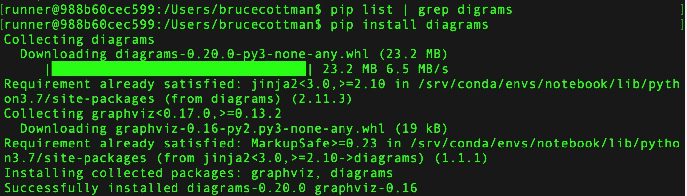***

***已安装图表。来源:作者桌面快照。***

***退出 docker 容器`bash`终端会话。创建一个新的 docker 容器`bash`终端会话。运行 docker 容器中安装了图吗？***

```
*$ docker exec -it <container name/ID> bash
## look for diagrams in the Docker container
# pip list | grep diagrams*
```

***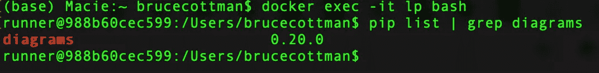***

***修补到正在运行的 Docker 容器中的图。来源:作者桌面快照。***

***快点，现在，把这个放进你的档案里。***

```
*# Dockerfile commands
.
. 
.
**RUN pip install diagrams**
.
. 
# Dockerfile commands*
```

******注意*** *: Docker 容器必须有 Python 3.5+。****

# ***摘要***

***在十七步中，我展示了:***

1.  ***发起*终端会话；****
2.  ***显示和改变*终端会话的*外壳*；****
3.  ***用于显示、定义、设置环境变量的值以及更改环境变量的值的 Linux 命令；***
4.  ***如何显示、定义、设置和更改 *Docker 容器的环境变量的值；****
5.  ***如何修补正在运行的 Docker 容器？***

***Docker 是一个丰富的工具。***

***我将在下一篇博客文章中展示如何从 Docker 容器创建微服务，并将它们放在一起创建不同的服务。***

***编码快乐！***