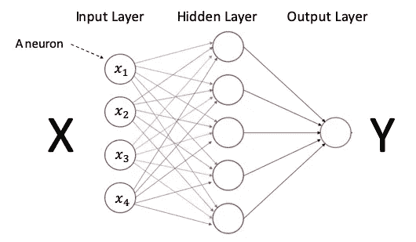

# 用回归友好的方式解释深度学习

> 原文：<https://levelup.gitconnected.com/a-tutorial-to-build-from-regression-to-deep-learning-b7354240d2d5>

(图片由作者提供)

通常深度学习或神经网络在他们的类别中以他们的行话呈现。学习者以类似大脑的解剖学为导向，以“想象”深度学习如何在大脑环境中发挥作用。学习者会看到神经元、互联性和复杂的神经网络系统。在我的讲座从回归到深度学习的过渡中，我不知何故感到有一瞬间的沉默——就像跳过一个深深的缺口。跳到深度学习需要很多准备，那些跳的成功的同学可能不会很容易的回归到回归(你可能喜欢这个双关语)。术语的差异也造成了知识差距。这篇文章试图用一种回归友好的方法来呈现深度学习。我将解释神经元、激活函数、层、优化器等等。我将向您展示如何在深度学习框架中构建逻辑回归。一旦你有了很好的理解，我将带你深入:

*   深度学习中的 L1 和 L2 正规化，以及
*   深度学习中的辍学正规化。

本文的目标不仅仅是建立一个深度学习模型来执行逻辑回归的工作。那就太夸张了。目标是非常详细地解释，以便您可以建立更复杂的深度学习模型。看完这篇帖子，你会对深度学习建模驾轻就熟。我也推荐你的姊妹文章“[RNN/LSTM/GRU 股价预测技术指南](https://dataman-ai.medium.com/a-technical-guide-on-rnn-lstm-gru-for-stock-price-prediction-bce2f7f30346?sk=fe59aa77f9a953211253ebb5fb6f8b15)”。

关于这个平台， **Keras** 和 **PyTorch** 在过去几年里已经在 MXNet 等其他平台中获得了巨大的人气。Keras 是低级库 **TensorFlow** 和 Theano 的高级 Python 包装器。本文将带您通过 Keras 来构建模型。如果你想探索 PyTorch，我推荐我以前的帖子“[用 PyTorch 进行深度学习不是折磨](https://medium.com/analytics-vidhya/not-torturing-in-learning-pytorch-b2f7f169923a)”，它温和地带你了解如何用 **PyTorch** 构建深度学习模型。另外，我写过一系列关于深度学习或者神经网络的文章。参见"[什么是图像识别？](https://towardsdatascience.com/module-6-image-recognition-for-insurance-claim-handling-part-i-a338d16c9de0)、[使用自动编码器的异常检测变得容易](https://towardsdatascience.com/anomaly-detection-with-autoencoder-b4cdce4866a6)、[用于图像降噪的卷积自动编码器](https://towardsdatascience.com/convolutional-autoencoders-for-image-noise-reduction-32fce9fc1763)。您可以将摘要文章“ [Dataman 学习之路——培养您的技能，推动您的职业发展](https://medium.com/analytics-vidhya/dataman-learning-paths-build-your-skills-drive-your-career-e1aee030ff6e)”加入书签。

整个笔记本可以在 [this Github](https://github.com/dataman-git/codes_for_articles/blob/master/From%20logistic%20to%20deep%20learning.ipynb) 下载。

**(A.1)输入数据在深度学习中被称为“张量”**

在 Y = XB + e 回归公式中，Y 是一维向量，X 是 2D 矩阵。输入数据集称为*数据框。*数据帧可以包含数值、分类或文本值。

在深度学习中，输入数据被称为*张量*。如果你知道“张量”只不过是一维向量，你会感到宽慰。为什么他们不直接叫它“向量”？我不知道。这个不常见的术语来自哪里？它来自拉丁语张量，意思是“伸展的东西”。对拉伸下材料拉伸的研究就是对*张量*的研究。一位名叫沃耳德玛·福格特的数学家(1898 年)借用这个术语来表示一个数字向量。张量是 1D 矢量。数据框是 2D 矩阵或 2D 张量。假设一个 EXCEL 电子表格有一列 Y，许多列合在一起称为 X。一列 Y 是 1D 张量，X 是 2D 张量。

(图片由作者提供)

一个重要的提醒是，深度学习模型只能解释数字数据。如果数据框包含分类数据，则需要通过一键编码或其他编码方法将其转换为数值。帖子“[一个将分类变量编码成数字的数据科学家工具包](https://towardsdatascience.com/a-data-scientists-toolkit-to-encode-categorical-variables-to-numeric-d17ad9fae03f)”提供了一个全面的编码方法列表。

图像数据也需要转换成 n 维张量。这篇文章不打算讨论图像数据。对图像数据转换感兴趣的读者，建议参考“[深度学习用 PyTorch](http://Deep Learning with PyTorch Is Not Torturing) ”、“[什么是图像识别？](https://towardsdatascience.com/module-6-image-recognition-for-insurance-claim-handling-part-i-a338d16c9de0)、[自动编码器异常检测变得简单](https://towardsdatascience.com/anomaly-detection-with-autoencoder-b4cdce4866a6)、[卷积自动编码器用于图像降噪](https://towardsdatascience.com/convolutional-autoencoders-for-image-noise-reduction-32fce9fc1763)。

**(A.2)输入层中的神经元是输入变量**

对于回归学习者来说，神经网络中的术语*神经元*是陌生的，术语*层*令人望而生畏。然而，你可能见过许多类似下图(A)的神经网络图。所以让我一步步介绍这个网络。该图是一个*模型*。我们如何理解一个模型？回归是模拟 X 和 y 之间关系的框架。决策树是模拟 X 和 y 之间关系的框架。因此图(A)是模拟 X 和 y 之间关系的神经网络图。神经网络模型有一个输入层、一个输出层和隐藏层。将预测值 X 分配给输入图层，将目标值 Y 分配给输出图层来训练模型。如果没有隐藏层，神经网络只有输入层和输出层。这种最简单的形式变成了逻辑回归，我将在后面的部分向您展示。

图(A):(图片由作者提供)

网络中的节点怎么样？它们被称为*神经元*。输入层的神经元是最容易理解的。输入层中的神经元是一个变量。图(A)中的 X 矩阵有 4 个变量，所以它有 4 个神经元(或 4 列/向量/张量)。如果有 100 个输入变量，输入层就有 100 个神经元。此外，请记住神经网络模型只能接受数值。如果有 80 个数值变量和 20 个分类变量，每个变量有 10 个类别，则输入层中的神经元数量将是 80+20×10 = 280 个神经元(或 280 列/向量/张量)。

**(A.3)隐藏层中的神经元**

一个神经元接收来自前一层神经元的输入。每个神经元是前一层中所有数据值的加权和，或者说，每个神经元是前一层中值的线性组合。*权重*是待训练模型的参数，如下图(B)中的 *w1-w4* 。就像 Y= XB + e 中的参数向量 B 是一个回归模型的解一样，这些权重 *w1-w4* 就是模型的秘方。

图(B):(图片由作者提供)

**(A.4)激活功能**

我们就要使用神经网络框架建立逻辑回归了。但是还有一个组件叫做*激活功能*。它的工作方式类似于逻辑回归中的 logit 函数。为什么逻辑回归需要 logit 函数？在线性回归 Y = XB + e 中，自变量 X 和预测值 Y 可以取从负到正无穷大的任何值。因为逻辑回归是关于概率的，所以不可能用线性回归模型获得这样的输出，我们需要将输出转换为 0 到 1 之间的值。

**Sigmoid 函数:**所以类似的想法也适用于神经网络。输出值的范围将扩大到负无穷大或正无穷大。为了防止这种情况发生，神经网络应用了如下左图所示的 sigmoid 函数，将输出转换为 0 和 1 之间的值。

图(A.4)

**ReLU 功能:**另一个常用的激活功能是 ReLU(整流线性单元)，显示在右侧面板中。它将任何负值转换为零。我将在文章的最后更详细地描述这一点。

**(B.1)加载波士顿住房数据**

我选择了一个流行的数据集[波士顿住房数据](https://www.kaggle.com/c/boston-housing)。该数据集记录了具有多个属性的中值房价。房价 *medv* 是*以千美元为单位的自有住房的中值*。如果房价高于中值，我创建一个二元目标变量“Y”= 1，否则为 0。该数据帧有 506 行和 14 列。为了便于说明，我随意选择了以下六个预测值:

*   各城镇人均犯罪率。
*   *ZN:* 面积超过 25，000 平方英尺的住宅用地比例。制成
*   *RM:* 每个住宅的平均房间数。
*   *楼龄:*1940 年前建成的自住单位比例。
*   *DIS:* 到波士顿五个就业中心的加权平均距离。
*   *LSAT:* 人口的下层地位(百分比)。

**标准化:**上面的代码也缩放输入变量。请注意，只有训练数据用于拟合缩放器变换，然后缩放器用于变换测试输入数据。新手学习者常犯的一个错误是独立地衡量 x_train 和 x_test。这是你想要避免的致命的罪。在文章“[避免这些可能让你失去职业生涯的致命建模错误](https://towardsdatascience.com/avoid-these-deadly-modeling-mistakes-that-may-cost-you-a-career-b9b686d89f2c)中，我记录了数据科学中的常见错误。有兴趣的话，看看吧。

**深度学习不做正态性假设。为了运行一个标准的线性回归，人们做出以下假设:**

*   X 和 Y 之间的关系是线性的
*   误差呈正态分布
*   误差的同方差(或者，线周围的等方差)。

深度学习模型中不需要这些假设。

**(B.2)让我们建立一个标准的逻辑回归**

均方误差为 0.1068。供您参考，这些系数是

**(C)让我们建立深度学习:**

神经网络比逻辑回归更通用，因此它可以覆盖逻辑回归。我们可以认为逻辑回归是神经网络的一个特例。

神经网络中有三个核心思想:(1)层按顺序堆叠，(2)神经元进行计算，以及(3)在每层中使用激活函数来绑定结果。这三个过程对应于 Keras 类别`Sequential`、`Dense`和`Activation`，如图(C)所示。

(图片由作者提供)

*   `Sequential`声明一个我们将要堆叠层的空模型。请参见下面代码中的第 3 行。
*   `add()`添加一层。
*   `Dense(1,input_dim=6)`密集层是计算发生的地方。它执行矩阵乘法(点积)*加上噪声向量*。它被称为“密集”层，因为它压缩了前一层和当前层神经元之间的每一个可能的连接。矩阵中使用的值是可以在反向传播(稍后解释)的帮助下训练和更新的*权重*。在本例中，当前层有一个神经元，前一层有 6 个输入神经元。所以语法比较密集( **1** ，input_dim= **6** )。见第 4 行。

*   `Activation(activation='sigmoid'))`:这将应用 sigmoid 函数来产生 y。注意，第 4 行和第 5 行可以合并成一行代码，如第 8 行所示。

我们已经完成了深度学习模型的模型规范，以执行逻辑回归所做的事情。该模型将使用优化器`compile()`和`fit()`进行训练。模型结果为['loss '，' mean_squared_error'] = [0.1031，0.1031]。MSE 与逻辑回归的 MSE 相同。

**(E)优化器**

什么是损失函数，什么是优化器？损失函数是测量实际值和预测值之间的误差的度量。优化器是一种改变神经元权重以追求最小误差的算法。一个流行的优化器是随机梯度下降(SGD)。文章《[我的随机森林、梯度推进、正则化、H2O.ai](https://medium.com/analytics-vidhya/a-lecture-note-on-random-forest-gradient-boosting-and-regularization-834fc9a7fa52) 讲义》对 SGD 进行了详细的描述。上面的代码指定`RMSprop`，均方根传播，作为优化器。

你可能会问一个基本问题:“为什么回归不使用 SGD 这样的优化器来寻找最优参数，而机器学习技术需要它？”原因是回归可以通过解析或封闭形式的方程得出其最优解。损失函数是可微的。然而，并不是所有的损失函数都是可微的，以获得可跟踪的解决方案。因此，数值方法，如 SGD 或牛顿法被用来获得最优解。

上面几行代码是一个基本神经网络的核心行。这些基本代码行可以扩展成非常复杂的形式。我将使用下面的例子来试验这个模型。

**(F)给深度学习模型增加更多层**

您可以在上述基本神经网络中添加任意数量的层和神经元。下面我用两个隐藏层做实验:

*   第 4 行:第一个隐藏层有 4 个神经元。
*   第 5 行:第二个隐藏层，有两个神经元。请注意，附加层不要求您指定前面层中神经元的数量。
*   第 6 行:输出层。

['loss '，'均方误差'] = [0.1121，0.1121]。当您添加更多层时，模型可能会产生更好的结果，甚至会过度拟合数据。在广义线性模型(GLM)中，我们可以应用 L1 或 L2 正则化来控制过拟合。我们如何调整神经网络模型以减轻过度拟合？简而言之，有两种方法。首先，神经网络可以使用`regularizers.l1()`或`regularizers.l2()`进行 L1 和 L2 正则化。第二，神经网络可以用`dropout()`正则化。如果你不熟悉 L1 或 L2 正则化，请查看“[我的随机森林、梯度提升、正则化和 H2O.ai](https://medium.com/analytics-vidhya/a-lecture-note-on-random-forest-gradient-boosting-and-regularization-834fc9a7fa52) 讲义”。

**(G)标准化数据以获得更好的模型性能**

对于分类建模问题，在建模之前对数据进行标准化是一个很好的实践。这通常会产生模型性能。下面的代码和上面的一样，只是它是建立在标准化数据的基础上。结果似乎比上面的结果更好:['loss '，' mean_squared_error'] = [0.0981，0.0981]。

**(H)攻击过拟合**

过度拟合是机器学习中的一大罪过。当您根据定型数据定型模型并将其应用于测试数据时，测试数据的准确性通常低于定型数据的准确性。我们知道这是因为模型与训练数据拟合得太好，包括训练数据中的噪声。然而，如果过度拟合只是让你对测试数据的预测不那么有效，那又有什么大不了的呢？为什么学术界和从业者要投入几十年的工作来防止过度拟合？

真正的问题是，过度拟合不仅会让你的模型效率低下，还会让你的预测非常错误。假设你的最终模型有十个变量，其中八个捕捉真实模式，另外两个变量是噪音。换句话说，这两个变量过度拟合噪声，是无用的。假设您要用十变量模型预测新数据，并且假设两个变量的新值很大。猜猜会发生什么？由于两个变量和新数据中的大值，您的预测将非常错误。所以过度拟合不仅会使你的模型无效，还会使你的预测非常错误。这就是为什么我们如此关注攻击过度拟合。如果您熟悉这些技术，您在数据科学方面的技术能力将会大大提高。

**(一)L1，L2 转正&退学转正**

正则化将惩罚项添加到损失函数中，以惩罚大量的权重(参数)或大量的权重。深度学习提供了拉索(L1)和里奇(L2):

除了 L1 和 L2，深度学习也有辍学正规化。建议您在深度学习模型中测试 L1、L2 和辍学正规化。

**(I.1) L1**

上面的代码设置𝜆 = 0.01。结果是:['loss '，' mean_squared_error'] = [0.09434，0.09434]。

**(一. 2) L2**

上面的代码设置𝜆 = 0.01。结果是:['loss '，' mean_squared_error'] = [0.09841，0.09841]。

**(I.3)辍学正规化**

丢弃技术在每次迭代期间随机丢弃或停用一层的一些神经元。这就像一些权重被设置为零。因此，在每次迭代中，模型会查看自身稍微不同的结构来优化模型。

上面的代码将退出率设置为 0.25，这意味着 25%的神经元将被退出。结果是:['loss '，' mean_squared_error'] = [0.0974，0.0974]。

**(J)如何理解神经网络模型的复杂性？**

如果回归有许多参数，则被认为是复杂的。同样，如果深度学习有许多权重参数要训练，它就很复杂。

我给你看两个模型，看看哪个模型更复杂(加权参数更多)。假设一个二进制分类问题有 200 列/变量和 10 亿行。这 200 个变量指的是 150 个数字变量和 50 个分类变量。50 个分类变量中的每一个都有 400 个级别。有两种型号:

*   模型 1: 3 个隐藏层，每个层有 300 个神经元。
*   模型 2:具有 500 个神经元的 1 个隐藏层

让我们计算每个模型的权重数并进行比较。通常，我们将相邻层中的神经元数量相乘，然后将所有对相加。在这个问题中，分类变量必须是一个独立的神经元。因此，50 个分类将被转换为 50 x 400 = 2，000 个虚拟变量。我们总共有 150+2000 = 2150 个输入神经元。输出有 1 个神经元。

*   型号 1:2150 x 300+300 x 300+300 x 300+300 x 1 = 825，300
*   型号 2: 2150 x 500 + 500 x 1 = 1，075，500

所以模型 2 更复杂。