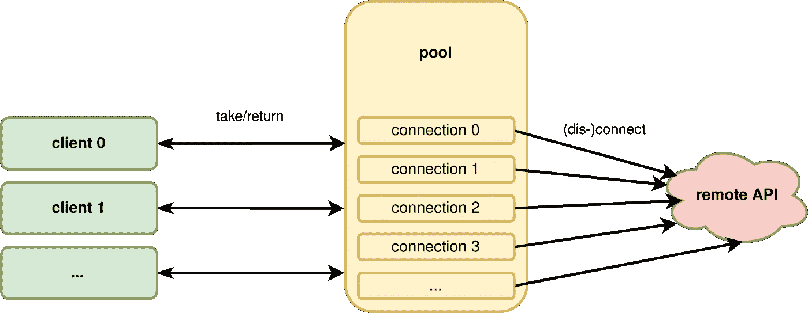

# 一个用 C++写的通用连接池

> 原文：<https://levelup.gitconnected.com/a-universal-connection-pool-written-in-c-6f4f14a98a9e>

能有多难？我只是想要一个到远程服务的简单连接。

照片由[克里斯蒂安·保罗·德尔·罗萨里奥](https://www.pexels.com/de-de/@christian-paul-del-rosario-230539?utm_content=attributionCopyText&utm_medium=referral&utm_source=pexels)通过[派克斯](https://www.pexels.com/de-de/foto/badeort-batanen-baume-entspannung-732499/?utm_content=attributionCopyText&utm_medium=referral&utm_source=pexels)拍摄

几周前，这是我最初的想法。当时，我手头的问题需要一个到 PostgreSQL 数据库的可靠连接，以及到一个代理 API 和几个其他金融数据提供者的稳定连接。很快，我想出了一些相当明显的要求，这些要求更好地定义了“无脑”:

*   该池必须保持一定数量的随时可用的连接
*   该池的用途应该是通用的
*   不知何故，我想利用 RAII，因为编译器可以生成比我更好的代码

## 人脉就是一切

通常连接池有一个非常相似的使用流程。存在池的实例，例如作为类的成员。实际使用连接的代码从该池中获取一个连接，完成后，它会将该连接返回到该池。该池向使用代码保证，在连接安全返回之前，它不会向任何其他调用方提供相同的连接。这就叫**移动语义**。
还有两个对池的调用，即获取和返回连接，允许池快速检查连接。如果连接以某种方式中断，这将使池能够重新连接。

连接池通常所在的上下文

如果连接在一定时间内没有被使用，许多远程 API 就会断开连接。这要求客户端向远程 API 发送心跳，例如虚拟请求，以维持正常的连接。最后，如果不再需要某个连接，就需要将其断开。这足以定义通用连接的接口。

连接抽象基类

在这里，我选择了继承而不是模板方法，因为对这些方法的调用可能会等待网络响应，因此无论如何比虚拟方法解析花费的时间要长得多。这样，我们可以明确地指定所有需要实现的方法。任何特定的连接，例如到 PostgreSQL 数据库的连接，都将从该类继承并实现所有纯虚函数。

## 它是你的还是我的

连接池在创建后拥有所有连接的唯一所有权。我们是否应该允许使用代码在使用连接时接管唯一或共享的所有权？来决定让我们收集几个选项。

*   将唯一所有权移动到使用代码(std::unique_ptr)
*   使用代码(std::weak_ptr 或 std::shared_ptr)共享所有权
*   不要转移所有权(原始指针或引用)

RAII 要求给出了一个提示，做什么。更重要的是，如果当池返回的连接访问对象超出范围时，连接自动返回，这不是很好吗？

> R.1:使用资源句柄和 RAII 自动管理资源(资源获取是初始化)[ [C++核心指南](https://github.com/isocpp/CppCoreGuidelines/blob/master/CppCoreGuidelines.md#r1-manage-resources-automatically-using-resource-handles-and-raii-resource-acquisition-is-initialization) ]

如果我们希望这样，我们必须删除原始指针或引用选项。std::*_ptr 类提供了定义自定义删除器的方法，从理论上讲，它可以返回到池的连接。但为此，它至少需要一个对池的引用。这是可能做到的，但也许有另一个选择，有一个更简单的吸引力。更简单，因为它没有给众所周知的 STL 结构添加状态和副作用，这可能会使用户感到困惑。

认识一下 ConnectionProxy。该池保持对其所有连接的唯一所有权，并向使用代码分发代理对象。那些代理对象应该是短暂的。因为它们不拥有任何连接，所以它们不能延长连接的生存期。这意味着池的寿命必须比任何连接代理都长。这反过来意味着，它们应该**而不是**存储在本地直接使用范围之外的任何地方。这实际上看起来更像是引用语义，我们之前已经排除了。

连接在其用法上是排他的。这意味着我们需要在代理类中反映这一点。表达排他性的一个好工具是使用可移动的实例，在某种意义上，这就是 std::unique_ptr 所做的。在如下所示的代码中。

ConnectionProxy

请注意，从代理对象移动后，它将保持默认状态，即成为一个空引用。

> C.64:一个移动操作应该移动并让它的源处于有效状态[ [C++核心指南](https://github.com/isocpp/CppCoreGuidelines/blob/master/CppCoreGuidelines.md#c64-a-move-operation-should-move-and-leave-its-source-in-a-valid-state) ]

## 学习游泳

大多数重要的决定都是由。现在我们可以开始设计实际的连接池了。连接池的哪种行为最小化了用户的认知负荷？为了理解这一点，让我们想出一些用户可能遇到的情况。

*   当前连接开始使一些甚至所有查询失败
*   池已耗尽，无法向用户提供连接

如果一个连接开始失败，我不想亲自尝试修复这个连接。池应该这样做，也就是说，使用代码应该将连接返回到池，并建立一个新的连接。使用代码有两种通信方式，即没有可用的连接。要么阻塞直到有空闲连接，要么立即返回，但不传递连接。我决定选择后者，因为我运行了一个主循环，可以在同时做一些其他工作后重试。您可以很容易地将重试循环移到池中，并使连接阻塞。

连接池

由于非阻塞行为，get_connection 可能会返回无效的代理对象。使用代码必须检查代理是否有效。如果连接以任何特定于实现的方式抛出或失败，它需要被返回到池中。除此之外，记住不要存储连接代理，总是用一个新的来代替。
作为回报，连接池自动执行(重新)连接、断开连接、健康检查和广播心跳。

正如您在连接池声明中看到的，有一个方法调用所有连接的健康检查，另一个方法向所有空闲连接广播心跳。当前的实现不定期调用 heart beat 方法，相反，如果连接实现需要，用户可以从主循环或计时器中调用 heart beat 方法。

> R.13:在单个表达式语句中最多执行一次显式资源分配[ [C++核心指南](https://github.com/isocpp/CppCoreGuidelines/blob/master/CppCoreGuidelines.md#r13-perform-at-most-one-explicit-resource-allocation-in-a-single-expression-statement) ]

因为连接池不知道连接实现，所以它的构造函数接受一组连接实例。连接池的填充是由连接池工厂根据连接实现自动完成的。友好工厂类的模板专门化允许隐藏池的构造函数。

## 学会飞翔

这个连接池很简单，我目前使用它可靠地连接到 PostgreSQL、几个有状态 REST 式 API 和一个相当老式的代理遗留 API。有相当大的改进空间，例如，池可以具有不同于所有连接的最大数量的空闲连接的最大数量。另一个角度是均衡所有连接的负载，因为可能存在某种连接配额。

如果您对完整的代码感兴趣，可以在 GitHub 上查看！

 [## malikkirchner/连接池

### 通用连接池。在 GitHub 上创建一个帐户，为 malikkirchner/连接池的开发做出贡献。

github.com](https://github.com/malikkirchner/connection-pool)