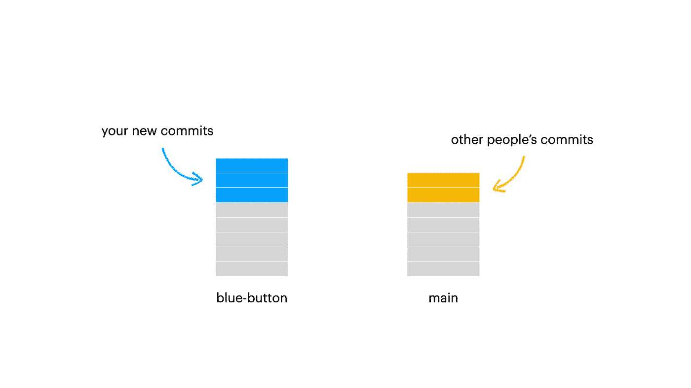
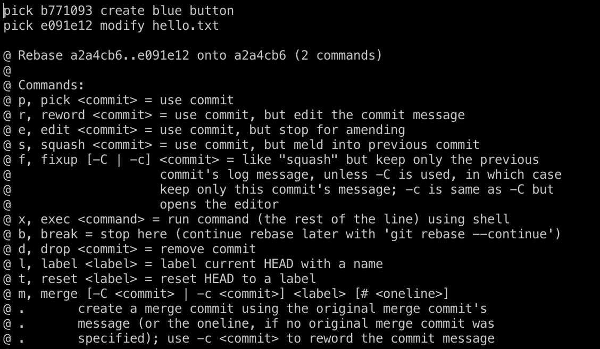
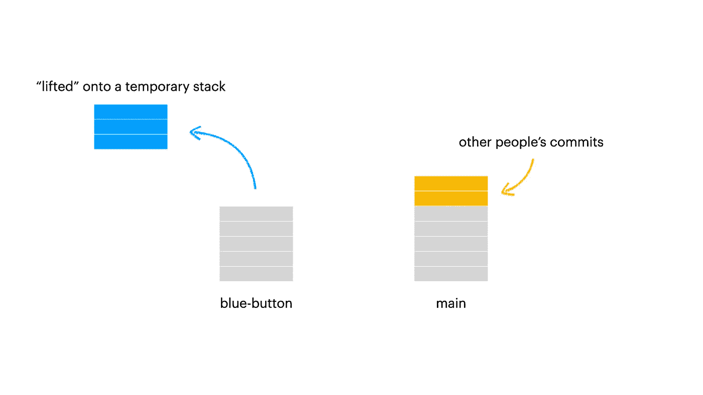
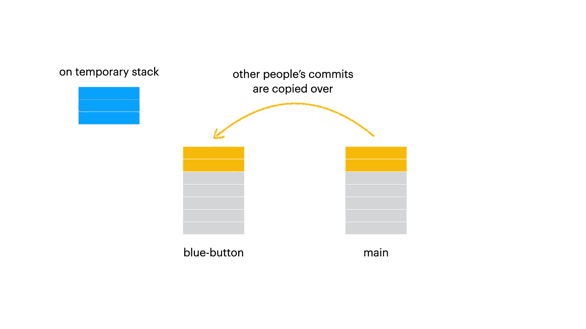
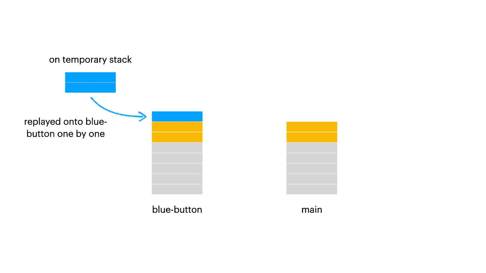
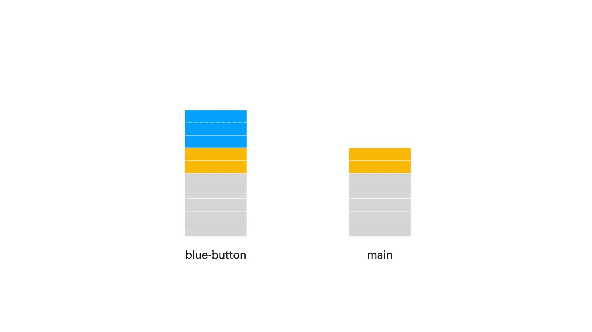
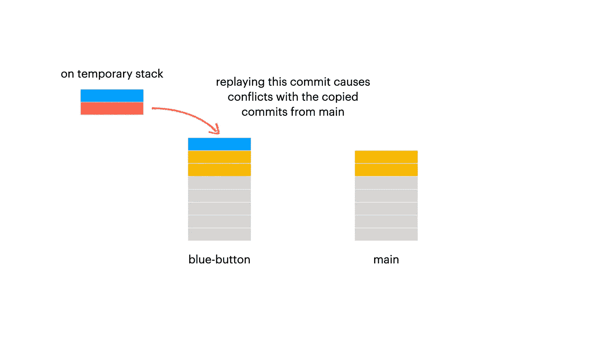
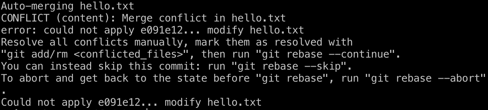

# 一个减少解决合并冲突的痛苦的可测试的 Git 实用程序

> 原文：<https://levelup.gitconnected.com/a-verstatile-git-utility-that-reduces-the-pain-of-resolving-merge-conflicts-340289e75bd1>

软件开发人员每天都在使用版本控制，Git 是最常用的工具。事实上，对 Git 的掌握已经成为业内人士的必备培训。然而，我发现许多计算机科学学生(尤其是我学校的学生)缺乏这种基本技能，因为他们的课程没有让他们接触到行业级的软件协作，即使有各种项目要求他们在小组中编写代码。

我观察到的最大的 Git 错误之一是，许多学生抱怨在不同的 Git 分支上工作是困难和耗时的。他们害怕将提交合并在一起，因为他们经常遇到难以解决的合并冲突。如果他们真的需要合并分支，他们通常会使用一种“笨拙”且不太可持续的方法，即强制合并，然后手动修复代码冲突，最后进行`fix merge conflict`提交。这是非常低效的，并且通常不是一个愉快的过程。另一个问题是，团队中的其他每个人都必须尝试与合并的分支合并，这样他们就会重复这个循环。

我想介绍的是一个强大的 Git 实用程序，它经常被这些学生忽略。它被称为 Git rebase。

> 掌握 Git rebase 是释放版本控制真正潜力的关键。

Git rebase 能够做很多奇妙的事情。但我相信它的核心功能是能够倒带一组提交，根据程序员的喜好对每个提交进行更改，然后将它们放回一起。

为了说明 Git rebase 是如何工作的，我将用一个例子来展示它。

假设您正在为 react 应用程序构建一个新的“蓝色按钮”。您通过从`main`分支创建一个名为`blue-button`的新 Git 分支来开始您的工作。在构建该特性几天后，您对`blue-button`进行了新的提交。在那几天里，从事该项目的其他人创建了其他新特性，并将这些特性合并到`main`分支。意识到您的`blue-button`分支现在位于`main`分支之后，您想要同步`blue-button`和`main`之间的变化。如果你尝试做一个`git merge`，你可能会遇到冲突，因为你可能修改了其他人也修改过的代码库的某些部分。



插图 1(作者的作品)

所以你不用 Git merge，而是使用 Git rebase。在`blue-button`分支中，您调用针对`main`的 Git rebase。

```
git rebase -i main
```



截图 1(作者作品)

这是交互式 rebase 控制台，每个提交都有许多可用的选项。因为你想保留所有新的`blue-button`提交，你可以*选择*所有的提交。这也是每次提交的默认选项。

在这个过程的开始，Git rebase 会临时“提升”你在`blue-button`中的所有新提交，以对抗`blue-button`和`main`之间的最后一个公共提交，并将它们放在一个临时堆栈中。



插图 2(作者的作品)

然后，Git rebase 复制其他人创建的所有新的`main`提交，并将它们粘贴到`blue-button`上。所以现在`blue-button`和`main`共享一个*相同的提交历史*。



插图 3(作者的作品)

之后，您要求 Git 将临时堆栈中的所有提交重新存储到`pick`中，以便将它们一个接一个地回放到`blue-button`中。这意味着，每个这样的提交都将在分支上重新创建，从而产生全新的提交。您可能会注意到重放的提交有新的*提交 sha* 标记。但是现在`blue-button`分支不再位于`main`分支之后，因此后续的合并不会导致任何冲突。



插图 4(作者的作品)

结果简单而优雅，因为不需要创建额外的`merge`提交。



插图 5(作者的作品)

但是如果你仔细观察，你可能会开始怀疑，如果新的`main`提交确实对代码做了一些修改，新的`blue-button`提交也做了，合并冲突仍然应该被观察到。没错！当新的`blue-button`提交被重放到分支上时，将会看到这样的冲突。



在这种情况下，当在某个`blue-button`提交上观察到冲突时。Git rebase 过程暂停，Git 会要求您在继续之前解决冲突。



截图 2(作者作品)

您将不得不进入那些特定的代码片段来修复问题(如果您和您的团队遵循良好的软件工程实践，希望不需要太多的努力)。

冲突解决后，您可以要求 Git 继续 rebase 过程。

```
git rebase --continue
```

原始提交被修改，并被重新创建为一个新提交，该新提交现在与来自`main`的新提交没有冲突。这里的结果也很漂亮，因为您不需要进行任何意外的`fix merge conflict`提交。

或者，如果您认为 rebase 过程出错了，您可以告诉 Git rebase 完全中止它。

```
git rebase --abort
```

然后您的`blue-button`分支将恢复到 Git rebase 之前的状态。

> P ro 提示:您可以在冲突解决暂停期间运行`git status`来检查您在提交历史中的位置。它还会给你一些关于下一步做什么的选项。

如果你学会了如何使用 Git rebase，你可能很快就会发现它不仅仅是一个保持分支同步的工具(就像我刚刚展示的)。它允许你更好地控制每一次提交，比如修改提交消息(`reword`)和完全删除提交(`drop`)。您还可以为特定的提交计划暂停重放过程(`break`)，这样您就可以检查提交历史中该点的代码基础。

Git rebase 是我解决版本化代码库问题的首选解决方案。例如，我经常提交到`main`分支上，但后来才意识到提交应该是在一个新的分支上。因此，我将从那里创建一个新的分支，然后签出到`main`分支，并根据之前的提交对其进行重新设置。在交互式 rebase 控制台中，我将`drop`该特定提交，将其从`main`分支的提交历史中删除。我知道在这种情况下你可以只做一个`git reset --hard <previous commit sha>`，但是我只是想说明 Git rebase 也可以实现相同的提交删除功能。

总之，Git rebase 是一个功能强大的工具，在您的软件工程工具箱中拥有它肯定会让您受益。

# 分级编码

感谢您成为我们社区的一员！更多内容见[级编码出版物](https://levelup.gitconnected.com/)。
跟随:[推特](https://twitter.com/gitconnected)，[领英](https://www.linkedin.com/company/gitconnected)，[通迅](https://newsletter.levelup.dev/)
**升一级正在改造理工大招聘➡️** [**加入我们的人才集体**](https://jobs.levelup.dev/talent/welcome?referral=true)