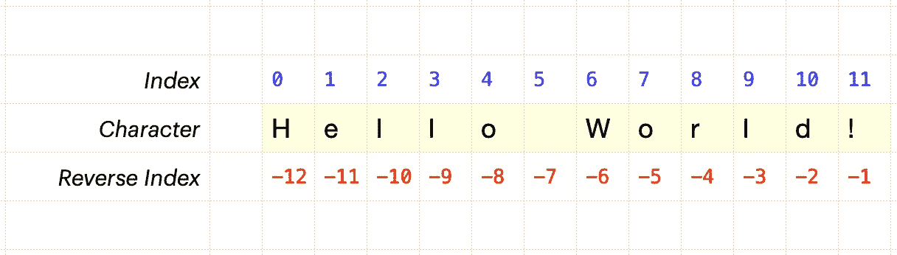
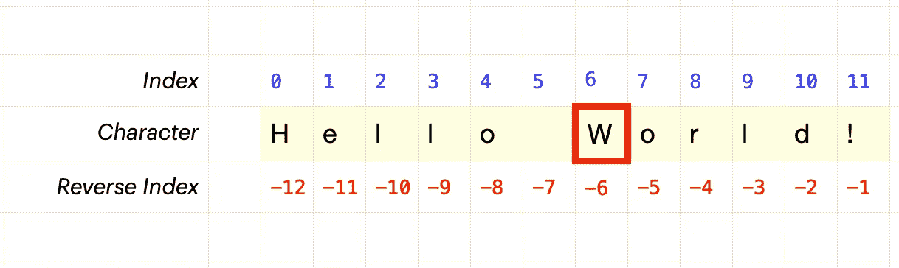
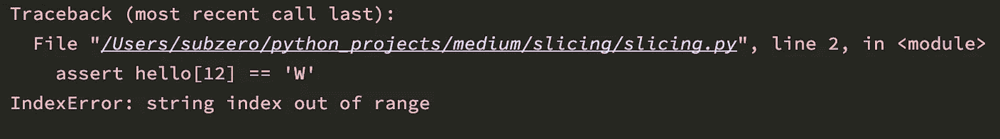
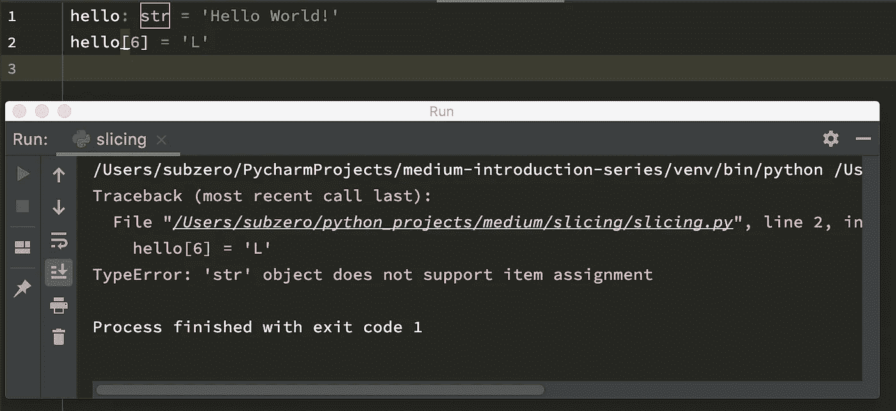
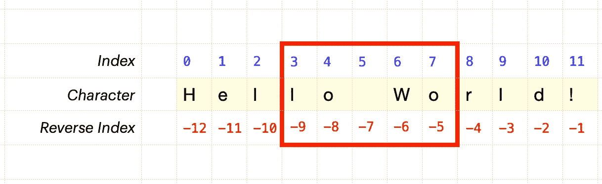
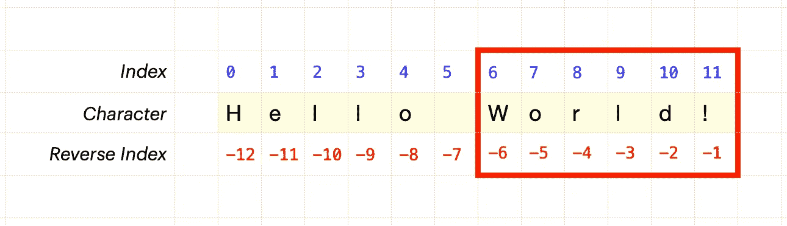
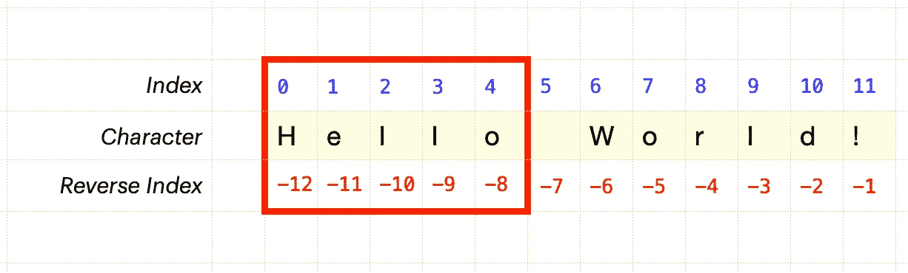
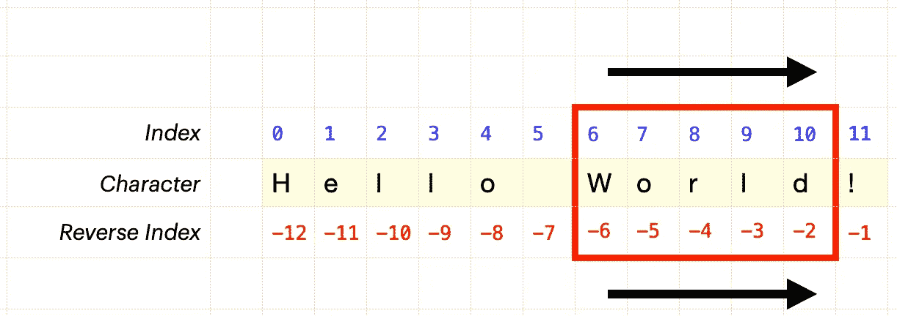
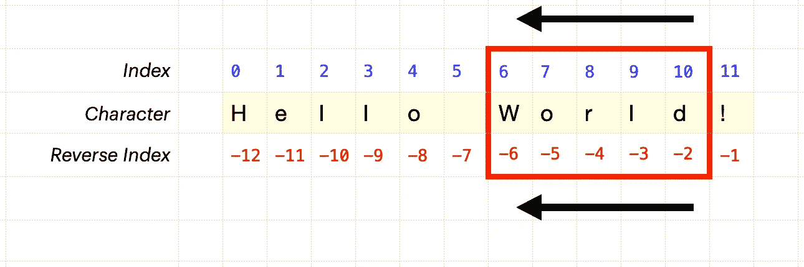

# Python 切片和索引的可视化指南

> 原文：<https://levelup.gitconnected.com/a-visual-guide-to-python-slices-and-indexes-507af00b0c45>


[https://www.pexels.com/photo/cheese-pizza-2762942/](https://www.pexels.com/photo/cheese-pizza-2762942/)感谢[https://www.pexels.com/@bananamade](https://www.pexels.com/@bananamade)

理解 Python 切片对象的初学者指南。

如果您不确定 Python 如何索引和切片字符串，那么这篇文章就是为您准备的！首先，让我们探索索引。(*索引*为语法正确！).

这是我的初学者系列的姊妹篇:

[](https://medium.com/swlh/learn-programming-with-python-introduction-to-data-types-strings-c5c1f6295940) [## 学习 Python 编程—数据类型简介:字符串

### 让我们探讨一下数据类型的概念，以及 Python 如何将文本数据表示为字符串。

medium.com](https://medium.com/swlh/learn-programming-with-python-introduction-to-data-types-strings-c5c1f6295940) 

## Python 使用从零开始的索引

序列中的第一个元素的索引为 0。不是 1。这通常是混淆的来源！



尽管第一个字符的索引为 0，最后一个字符的索引为 11，但实际上该字符串中有 12 个字符。

## 使用方括号访问索引



索引位置 6 的字符是`‘W’`。

## 使用负指数

从 0 向前，`W`位于索引位置 6。
从-1 向后，`W`在索引位置-6。

负指数从`-1`开始，不是零。为什么？零已经用于前向索引的第一个字符！

## 枚举字符序列

Python 有一个非常方便的`enumerate()`方法。它给出了字符序列的每个元素，以及从 0 开始的索引。

这将在我的终端中打印出以下内容:

```
[(0, ‘H’), (1, ‘e’), (2, ‘l’), (3, ‘l’), (4, ‘o’), (5, ‘ ‘), (6, ‘W’), (7, ‘o’), (8, ‘r’), (9, ‘l’), (10, ‘d’), (11, ‘!’)]
```

这非常符合上面的第一张图片。

## Python 的索引错误

索引位置 12 的字符…根本不在那里！



试图访问超出界限的索引位置会引发错误:

```
IndexError: string index out of range
```

## 字符串是不可变的

你可能想换一个字母。说把这里的`W`改成一个`L`。Python 里没有！字符串是不可变的——它不能被改变。



相反，我们得到一个`TypeError`错误:

```
TypeError: 'str' object does not support item assignment
```

## 一片馅饼

我们可以通过使用*切片*符号得到字符串序列的切片。该切片由方括号内的值给出:

```
[ ***start_at*** : ***stop_before*** : ***step*** ]
```

`step`值是可选的，可以省去。

要使用上述信息检索文本“lo Wo ”,我们需要:

```
start_at = 3
stop_before = 8
step = *nothing*
```



让我们用 Python 试试这个:

## “剩余的所有馅饼”切片

假设我们有派。真正的馅饼。我想让你吃前 5 片。我想要所有剩下的切片，6 到*剩下的其他的*。

```
start_at = 6
stop_before = :
step = *nothing*
```

符号是:

```
[6:]
```

这意味着:从 6 点开始，持续到结束。



## 只是馅饼的开始！

让我们不要那么贪婪！姑且就拿*第一张*第五张馅饼来说吧:



这意味着我们在索引 5 之前*停止！记住，索引 0 处的切片也是切片！*

符号是:

```
[:5]
```

## 所有的馅饼！

关于切片语法，还有最后一点需要注意，即 ***everything*** 构造:

```
[:]
```

这个切片捕获了序列中的所有东西！

## 在切片中使用负索引

为了得到`World`(没有最后的`!`)，我们可以前进:



```
[6:11]
```

或者我们也可以使用负指数值:

```
[-6:-1]
```

## 向后退一步

假设我们想倒着吃我们的馅饼片`World`，就像这样:`dlroW`。我们可以使用正的索引值，并使用-1 的步长。记住切片语法:

```
[ ***start_at*** : ***stop_before*** : ***step*** ]start_at = *index value*
stop_before = *index value*
step = *step value*
```



我们需要使用:

```
[10:5:-1]
```

这给了我们:

```
'dlroW'
```

## 混合搭配正负指标值

现在事情越来越复杂了！而且相当疯狂！


我们仍然对检索字符串`dlroW`感兴趣。

```
[ ***start_at*** : ***stop_before*** : ***step*** ]start_at = *index value*
stop_before = *index value*
step = *step value*
```

之前我们使用了:

```
[10:5:-1]
```

但是当然，我们可以在`10`或`-2`开始，这是同一个位置`d`！

```
[-2:5:-1]
```

当然，我们可以选择在正索引值`5`或负索引值`-7`之前停止。

## Python3 中的切片对象

到目前为止，我们一直使用文字值。实际上把它们打出来，就像`[-2:5:-1]`。但是！Python 有我们可以使用的切片对象。

这导致:

```
Start: -2
Stop: 5
Step: -1
Slice: slice(-2, 5, -1)
dlroW
```

我希望你喜欢这个！查看我的文章，其中也谈到了中级字符串技巧和窍门:)

[](https://medium.com/python-in-plain-english/22-pythonic-tricks-for-working-with-strings-8b893776743c) [## 使用字符串的 22 个 Pythonic 技巧

### 字符串操作是我们 Pythonistas 经常做的事情。这里有 20 个你可能会觉得有用的提示和技巧！

medium.com](https://medium.com/python-in-plain-english/22-pythonic-tricks-for-working-with-strings-8b893776743c) 

# 分级编码

感谢您成为我们社区的一员！ [**订阅我们的 YouTube 频道**](https://www.youtube.com/channel/UC3v9kBR_ab4UHXXdknz8Fbg?sub_confirmation=1) 或者加入 [**Skilled.dev 编码面试课程**](https://skilled.dev/) 。

[](https://skilled.dev) [## 编写面试问题

### 掌握编码面试的过程

技术开发](https://skilled.dev)