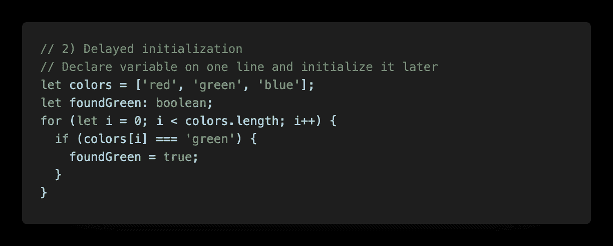

# 在 Typescript 中设置类型的演练:注释与推理

> 原文：<https://levelup.gitconnected.com/a-walk-through-setting-the-types-in-typescript-annotations-vs-inference-1da62e7492ae>


照片由[Zoltan·塔西](https://unsplash.com/@zoltantasi?utm_source=medium&utm_medium=referral)在 [Unsplash](https://unsplash.com?utm_source=medium&utm_medium=referral) 上拍摄

在本文中，我们将讨论:

*   什么是类型
*   在 typescript 中设置类型的两个系统:注释与推理
*   基元值的类型用法
*   带函数的类型:箭头函数、`function`关键字、匿名函数
*   为什么我们应该总是使用注释来设置返回类型
*   对象类型:对象析构，嵌套对象

在 typescript 中，任何值——任何可以保存到变量中的值——都有类型。

简单地说，我们可以把类型看作是一种容易引用一个值的不同属性和功能的方式。当我们想到一个有方法的值时，首先想到的是一个有自定义方法的类或对象。但是请记住，即使是基本类型也有许多与该类型相关联的内置方法。例如，`number`的类型有`toString()`方法，`string`的类型有`charAt()`方法。当我们为值使用正确的类型时，typescript 还会检查这种内置方法在特定类型上的可用性。

typescript 使用两个不同的系统来计算值的类型，*类型* *注释*和*类型* *推理*，它们并肩工作。

本质上，当我们使用类型注释时，这意味着开发人员明确地告诉了 typescript 类型是什么。另一方面，类型推断意味着 typescript“猜测”了类型(从值周围的代码中派生出来)。

## 使用具有基元值的类型

在大多数情况下，依靠推理系统来处理*原语*类型是完全没问题的。例如，以下代码在两种情况下都会导致完全相同的错误:

```
let apples: number = 5;let count = 7;// Type '"plenty"' is not assignable to type 'number'
// Type '"a lot"' is not assignable to type 'number'apples = 'a lot';count = 'plenty';
```

然而，在三种情况下，我们最好使用类型注释并显式设置类型。让我们一个一个来看:


函数返回“任意”类型

第一种情况是当函数返回类型`any`时，我们想要澄清它。在这种情况下`JSON.parse`从字符串中返回有效的 JS。它可以是任意数量的东西，这取决于传递的字符串。这里我们使用类型注释来明确地设置我们期望`coords`值是一个具有`x`和`y`属性的对象；两个都是`number`。



延迟变量初始化

诚然，这是一个有点奇怪的例子；实际上，我们可能会将`foundGreen`初始化为`false`，或者更好的是，使用`includes()`数组方法。然而，如果出于某种原因，我们需要在初始化变量之前声明它，我们必须使用类型注释来指定类型。


无法合理推断类型

在这个例子中，我们希望有一个正数或`false`的变量。如果我们想让一个变量改变类型，我们必须提前指定所有可能的类型。

总而言之，对于原始值，我们将尽可能依赖类型推断，并对上述三种情况使用类型注释。

## 将类型与函数一起使用

对于基本类型来说非常简单，但是对于函数来说就有点复杂了。对于函数，我们不仅要为参数指定类型，还要为返回值指定类型。除了常规的数字和字符串，一个函数可以隐式返回`undefined`或者根本没有返回值，而是抛出一个错误。

对于箭头函数、用`function`关键字声明的常规函数和匿名函数，类型注释将完全相同。


函数的类型注释

我想特别指出的一点是，我们应该总是显式地设置返回类型，即使它与推断类型完美地一起工作。这样做的原因是，否则，如果开发人员错误地忘记从函数返回值，typescript 只会推断返回类型为`void`，而不会将其标记为错误。


对于没有返回值的函数，有一个特殊的返回类型叫做`void`。Void 表示函数没有返回值。我们知道，JavaScript 中没有`return`关键字的函数隐式返回`undefined`。所以拥有`return undefined`或`return null`仍然会算作`void`返回类型。

下面是一个如何在 typescript 中对函数使用参数析构的示例。


具有析构函数参数的类型

在这种情况下，sintax 需要一点时间来适应，所以让我们一步一步地回顾一下正在发生的事情。

函数接收一个对象作为参数，我们使用看起来与 JavaScript 中的对象文字几乎相同的类型注释。注意，我们在这里使用*分号*而不是逗号来分隔属性。在这个例子中，我们说`logWeather`接收一个对象，该对象具有类型为`Date`的属性`date`和类型为`string`的属性`weather`，并返回`void`

在使用`consoleWeather`函数的情况下，我们更进一步，使用 ES6 参数析构。注意，我们并不试图在析构对象本身中指定类型。相反，语法是在析构之后有一个冒号分隔的类型注释。我们使用分号来分隔类型注释中的属性。

总而言之，对于函数，我们将在所有情况下使用注释。

## 具有对象文字的类型

最后，让我们看看如何对对象和嵌套对象使用类型注释。


使用对象键入注释

在这个例子中，当析构`{ age, name }`时，我们看到了与析构函数的参数时使用的相同的熟悉语法。当我们必须处理嵌套对象的析构时，这种语法背后的思想变得更加清晰。语法看起来很难，但实际上我们做的和普通 JavaScript 一样，然后加上一个冒号并定义一个“类型对象”来描述析构参数的结构。同样，记住在对象的类型注释中用分号而不是普通的逗号来分隔属性。

这就是在 typescript 中设置简单类型的快速指南。typescript 是对 JavaScript 世界的一个强大补充，并且越来越受欢迎。当然，除了设置我们在这里讨论的类型之外，还有很多事情要做。有接口、联合和许多其他情况，但一次只能做一件事。

在本文中，我们研究了:

*   typescript 中类型批注和推断类型的区别
*   何时依赖推断的类型系统，何时使用注释
*   箭头、常规和匿名函数的类型
*   具有对象文本和处于对象析构中的类型

感谢您的阅读，我希望它能为您进一步澄清类型的概念！

用 typescript 构建可读和可伸缩的应用程序，享受乐趣，一如既往地快乐编码！