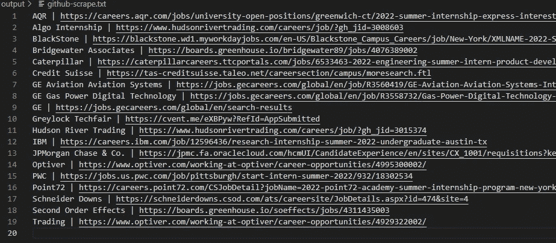
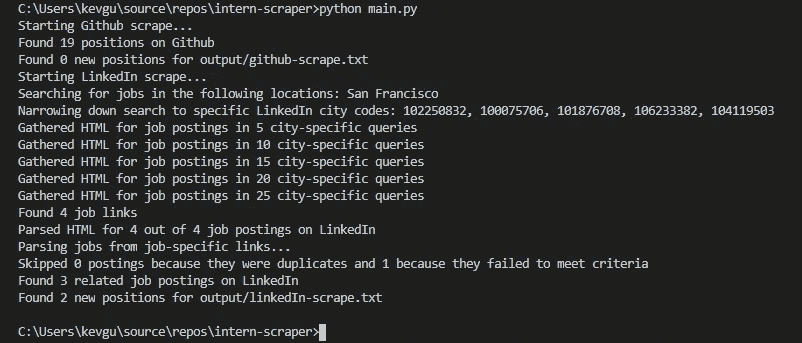

# 实习用的网络刮刀

> 原文：<https://levelup.gitconnected.com/a-web-scraper-for-internships-880861a05f58>

 [## 2018 郭/实习-网络刮刀

### 因为搜索新帖子是一件苦差事。要运行，编辑 config.yaml 中的配置，安装依赖项…

github.com](https://github.com/2018kguo/Internship-Web-Scraper) 

如果你是一名申请暑期实习的学生，这可能是一件苦差事——不仅要填写申请，还要找到申请。从 7 月到 1 月，每天都有新的机会发布，尽快申请以最大限度地获得回应是很重要的，但查看新发布的信息是一件痛苦的事情。考虑到这一点，我写了一些我希望在去年年底申请实习时就拥有的东西:一个从 LinkedIn 和 GitHub 知识库(如 [**、https://github.com/pittcsc/Summer2022-Internships**](https://github.com/pittcsc/Summer2022-Internships))中抓取信息的网页抓取器。

web scraper 用 Python 编写，利用 [**aiohttp**](https://docs.python.org/3/library/asyncio.html) 和[**asyncio**](https://docs.python.org/3/library/asyncio.html)**同时发出多个 http 请求，利用[**Beautiful Soup**](https://pypi.org/project/beautifulsoup4/)实现抓取功能。不幸的是，LinkedIn 的速率限制大大减慢了这个过程，并阻止我们充分利用 asyncio 的潜力，但这是获得用 Python 编写异步代码的经验的好机会。目前，输出被写到一个文件中，您可以在项目存储库中查看文本文件，例如找到的实习列表。**

****

**输出是什么样的**

**用户能够指定多个 LinkedIn 搜索字符串来使用，例如“软件工程师实习生”和“项目管理实习生”，以及多个位置，例如“旧金山”和“纽约市”。他们还能够专门查询最近一天、一周或一个月发布的职位，并指定我们希望在职位名称/描述中要求/列入黑名单的子字符串。当然，这些搜索选项也让我们可以搜索任何类型的全职工作。所有配置都存在于项目目录下的 YAML 配置文件中。**

**同时发出请求的 aiohttp 示例**

**配置看起来像什么**

**刮 LinkedIn 的好处是浏览工作不需要授权。糟糕的是，LinkedIn 很难通过各种方法勉强通过，如前面提到的速率限制、分页和通过请求参数阻止访问不同的页面(当你通过向下滚动加载新的工作时，你可以看到已经用参数**"&start = {下一个工作的开始索引}"** 发出了一个请求，但将这个放入你的请求将导致它被重定向到 **" & start=0"** 。用 Selenium 这样的 web 驱动程序抓取额外的结果应该是可行的，然而*和挑剔的位置过滤。***

***分页的困难意味着当你进行一次搜索时，你只能得到 25 个左右的结果，所以获得大量结果的唯一方法是通过搜索字符串和位置进行大量缩小范围的搜索。按位置搜索有障碍，因为当你通常在搜索栏的位置字段中搜索一个城市，如“圣马特奥”，只有一半左右的结果实际上是在圣马特奥，其余的只是来自附近的湾区位置。将结果半径设置为最低值 10 英里也没有什么帮助。将结果缩小到特定城市的唯一方法是在请求中添加一个类似这样的字段: **" & f_PP=102571732"** ，其中 102571732 是 LinkedIn 在该城市的 ID。***

***考虑到这些限制，清理 LinkedIn 有一个多步骤的过程。首先，我们查询类似“San Mateo”的位置字符串，以获得 San Mateo 以及附近城市的 id。当我们遍历所有位置字符串时，我们会跟踪我们看到的唯一的城市 ID。然后，我们请求城市 ID 和搜索字符串的每种排列，并跟踪我们找到的唯一的职位发布(通过比较公司和职位名称)。最后，我们对每个职位发布请求访问完整的职位描述，以便我们可以根据它进行筛选(例如，通过将“无薪”添加到描述中的黑名单中，忽略所有无薪实习)。***

***我希望你觉得这有用或有趣。我个人打算用这个刮刀来帮助申请来年的实习/全职机会。一定要检查项目回购以及！***