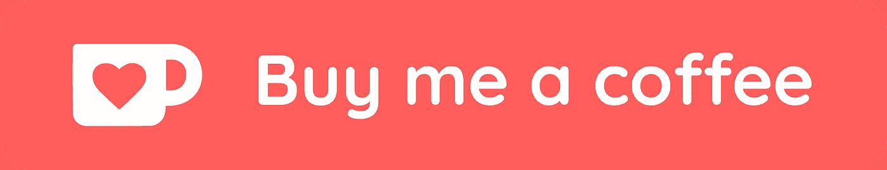

# 一个自定义域名的网站，一年的费用不到 1 美元

> 原文：<https://levelup.gitconnected.com/a-website-with-a-custom-domain-for-less-then-1-for-a-year-fb1fff6f7759>

你刚刚编写了有史以来最好的网站，但是你如何在考虑成本的同时发布带有自定义域名的网站呢？

# 介绍

我想每个程序员都会认识到下面这种情况。你刚刚开始你的编码冒险，突然你得到了有史以来最好的网站创意！你开始编码，经过几天紧张的编程，你意识到是时候向世界展示你的网站了。但是，你如何做到这一点，而且，你如何确保成本保持有限？在这篇博客中，我将解释如何以低于 1 美元的价格发布一个拥有自己域名的网站。在这篇博客中，我将使用 NuxtJS，当然，这也可以用于任何其他静态网站。

# 这个计划

要托管一个网站，有几件事你需要注意:

*   购买域名
*   定义您希望在哪里托管您的网站
*   将网站上传到主机提供商

所有这些部分都将在后面的章节中讨论。

# 购买域名

有几十个域名注册网站，你可以注册一个域名。想想像[戈达迪](https://nl.godaddy.com/domains/domain-name-search)和[domain.com](https://www.domain.com/domains)这样的大型国际公司。当然，也有可能加入一些小公司，比如来自你自己国家的公司。因为我住在荷兰，两个最大的竞争对手是 [TransIP](https://www.transip.eu/domain-name/) 和 [Mijndomein](https://www.mijndomein.nl/producten/domeinnaam) 。

与此同时，我对上述大多数域名注册商有足够的经验，对他们有一定的了解。GoDaddy 是迄今为止最便宜的——第一年只需 0.99 美元——但我个人更喜欢 TransIP，因为你可以完全按照你想要的方式改变一切，而且我正在支持一家本地公司。

通过您选择的[域名注册商](https://www.godaddy.com/domains/domain-name-search)搜索页面，您可以检查您的域名是否仍然可用。GoDaddy 的域名第一年只要 0.99 美元。

但是当然，购买域名只是一个开始！我们现在需要配置它，但是在我解释如何配置这个域之前，我们首先必须确定我们将在哪里托管新创建的网站。

# 确定托管提供商

就像购买域名，有各种各样的选择来托管你的网站。例如，可以选择由 TransIP 或 GoDaddy 处理托管。在 TransIP 上托管一个静态网站每月花费 5.99 美元。如果你想在 GoDaddy 托管一个静态网站，这将花费你每月 3.99 美元。但是正如引言中所概述的，你想限制你的新想法的成本，因为你还不确定人们是否会喜欢它。

所以，如果我告诉你，托管一个网站可能是免费的——我真的是说免费！

# 网络生活

在获得 GoDaddy 和 TransIP 的经验后，我开始寻找其他选择。我想知道是否有可能在其他地方建立一个比之前提到的公司更便宜的网站。这就是我在 Netlify 的结局。Netlify 为用户提供了免费托管静态网站的选项。但这可能吗？一定有什么猫腻，对吧？

# 问题是

当一家公司免费提供一些东西时，他们通常会有一个潜在的想法。例如，他们现在给你一些免费的东西，这样你在以后的某个阶段，从他们那里购买另一个你必须付费的产品。这当然也是 Netlify 的情况，但值得注意的是他们为免费用户提供的功能。也就是说，你可以用它们创建无限数量的网站，每月有 300 分钟的构建时间通过 GitHub 自动发布你的网站，每月有 100 份免费的表单提交。

然而，[的各种功能](https://www.netlify.com/pricing/)都是有限制的。因为你每月只能使用 100GB 的带宽，而且你一次只能运行一个版本。总而言之，Netlify 为爱好程序员提供了你需要的一切。

创建帐户后几分钟内，您就可以开始将网站上传到平台。

# 上传您的网站

在 Netlify 门户网站中上传网站非常容易。但是要注意！在你上传网站之前，重要的是不要上传开发环境，而是上传生产环境，因为这可能会向你的用户显示你不想要的信息。

在使用 [NuxtJS 博客](https://www.koenvanzeijl.nl/blog/blog-with-vue-nuxt)(荷兰语)的情况下，您需要在项目文件夹`npm run generate`中运行以下命令。这将创建一个`dist`文件夹，您的生产网站将放在其中。

你是缺少一个 NuxtJS 网站还是另一个静态网站？没问题，你也可以通过[free-css.com](https://www.free-css.com/free-css-templates)下载一个示例网站。

剩下要做的唯一的事情就是点击并拖动文件夹到 Netlify 网站，然后你就可以了！祝贺你的第一个免费网络生活网站。

Netlify 为您创建了一个`x.netlify.app`网站，您可以轻松地将网站设置更改为`yourwebsitename.netlify.app`。然而，这还不是我们刚买的域名。我将在下一章解释如何设置它。

# 配置

购买域名和创建网站后，这两个服务只需要连接在一起。在 Netlify 中，转到“域设置”并按“添加自定义域”。您可以在这里输入您之前购买的域，并表明您想要添加该域。然后按“DNS 配置”来查看您新购买的域名应该指向哪个 IP 地址，在这里您也可以找到域名服务器。

现在你只需要在你选择的域名注册机构填写这些细节。下面我以 [koenvanzeijl.nl](https://www.koenvanzeijl.nl) 为例。填写名称服务器并创建一个 A 型 DNS 记录，通过 Netlify 指向给定的 IP 地址。

请注意，正确设置 DNS 可能需要 24 小时。

# 结论

因此，用你的自定义域名托管一个网站，花费不到 1 美元是完全可能的。你只需要找出最好的方法来做这件事。我希望我已经能够帮助有这个故事的人向世界公布他或她的爱好项目，因为谁知道它会变成什么！

你有没有用这种方式创建网站或者有什么其他的小技巧？请在评论中告诉我。

【https://ko-fi.com/koenvanzeijl 

*最初发布于*[*https://www . koenvanzeijl . nl*](https://www.koenvanzeijl.nl/blog/personalized-cheap-website)*。*