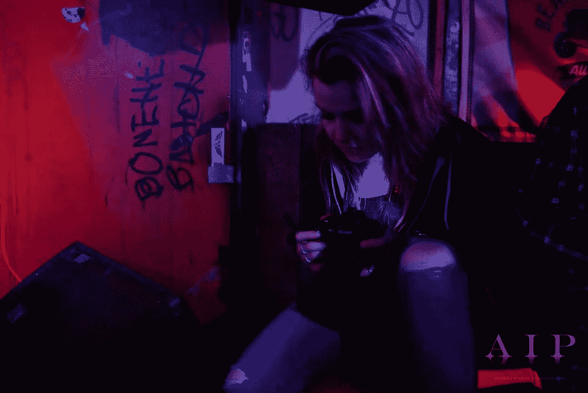
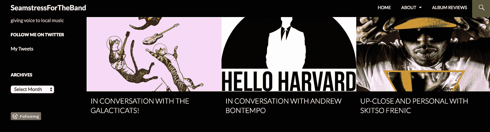
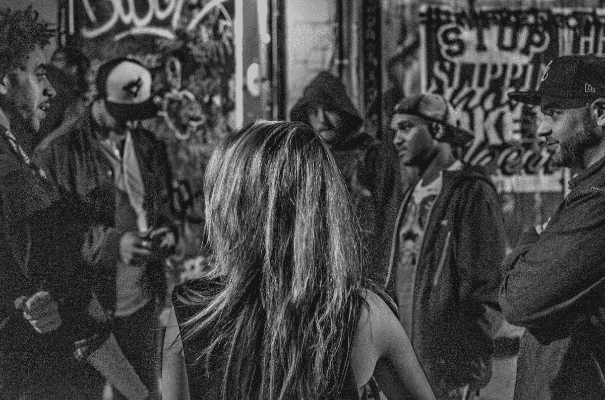

# 一个作家的编程之旅

> 原文：<https://levelup.gitconnected.com/a-writers-journey-into-programming-eb16198773a1>

去年这个时候，我被解雇了。我一直在一家地方电台担任内容撰稿人——这是我大学毕业后的第一份真正的工作。我毕业时主修英语，目标是从事写作，所以当我得到电视台的工作时，我想我已经准备好了。事实是，我非常感谢在电视台给我的机会。我可以花时间为多伦多写内容，采访当地的人才，会见我欣赏的音乐家，甚至学习一两件关于为商业广告配音的事情。这一切都很棒，一路上我交了一些很棒的朋友。但是，当我有一天走进工作，没有工作就离开时，我被迫反思我为自己做出的选择和我尚未为未来做出的选择。

如果你在一年前告诉我，我会成为一名程序员，我可能会(绝对)大笑。在我生命的大部分时间里，我坚持我所知道的:创造性写作。高中时，我擅长任何写作强化课程，这让我选择了英语专业。实际上，我本科时有一个非常严格的计划要成为一名英语教师，但我很快就改变了主意。

我第一次真正接触编程是在大学二年级的时候。我大部分时间都在志愿为圭尔夫大学的学生报纸《T2 日报》撰写文章。除了阅读名著，音乐是我的最爱。我父母的共同点是他们对音乐的热爱——这无疑影响了我和我的兄弟姐妹的成长。当我发现我可以用一篇 500 字的文章来换取免费音乐会时，我开始追逐我的新梦想，成为一名音乐记者。*差点出名*可能也与此有关。无论如何，能够将两种激情合二为一的感觉太棒了。

这是我的一张照片——一个年轻的、21 岁的威廉·米勒的崇拜者——在 Sneaky Dee's 为一场平底船展览拍照。你可以在这里 阅读我为这个节目 [**写的原文。照片由**](http://www.musicvice.com/reviews/live/the-flatliners-at-sneaky-dees-toronto-130514)**[安德雷·伊万诺夫](http://andrejiphotography.com/)拍摄。**

伙计，我还记得我第一次在报纸上署名的那一天。我站在大学中心，读着我自己发表的一篇名为 [*的文章，黑胶唱片正在卷土重来吗？这是超现实的。*](https://www.theontarion.com/2014/01/are-vinyl-records-making-a-comeback/)

音乐写作让我开始了自己的博客——一个我称之为 *SeamstressForTheBand* 的 WordPress 博客(事后看来，这可能会导致严重的版权问题)。信不信由你，这个博客仍然开通着——如果你好奇，你可以在这里 查看 [**。**](https://seamstressforthebandblog.wordpress.com/)

下面是标题的截图。尽量不要嘲笑我的设计技巧。

在创建了一个帐户并选择了主题后，我决定学习一些 HTML(超文本标记语言)和 CSS(级联样式表)以便定制网站。对于那些不熟悉的人来说，HTML 是一种用于创建网页和应用程序的标记语言(如果你曾经见过一个

或

，那就是 HTML)。CSS 是一种样式表语言，用于添加样式(如颜色、字体等)。

*专业提示:如果你用的是 Chrome，按 command + option + i(电脑按 Control + Shift + i)。这将在您的浏览器中打开开发工具。点击顶部的“元素”标签，你会看到一大堆 HTML 和 CSS——组成你现在正在看的页面的所有东西。*

我跑题了。这里的重点是当我开始 *SeamstressForTheBand* 的时候，我第一次接触到了编程。它很小，我没有想太多，因为我的主要动机是建立和运行我的博客，这样我就可以开始采访城市周围的当地艺术家并发表我的作品。

另一张我在后台采访一个叫 Stolenowners 的乐队的照片。我为此而生。照片由[埃里克·班威尔](https://mwcphoto.com/)拍摄。

几个月后，安大略的一个网站编辑职位空缺，我欣然接受。得到这份工作意味着我作为作家的第一份有报酬的工作——这是我非常想要的。我知道 Ontarion 的网站是托管在 WordPress 上的，所有的招聘信息都要求有一点 HTML 和 CSS 的经验，我可以用我的博客证明这一点。

我在大学的剩余时间里一直呆在安大略省，2015 年毕业，又呆了一年，担任艺术文化编辑。我很快就要从圭尔夫搬到多伦多，在一家当地电台做全职内容作家。

这些都很棒也很有趣，但是为什么要学习编码呢？这不就是你开始读这篇文章的原因吗？事实是，我做编码的决定并不是来自一个稳定的决策过程。其中有一点权衡利弊，但我决定参加 brain station——一个提供各种项目的数字训练营，包括 web 开发——是强迫性、一些不稳定的思维过程和一些偶然事件的结果。

在我被解雇前的那个夏天，我知道我没有在我应该在的地方——我觉得我没有发挥出我的潜力。我陷入了这样一个陷阱，你把你的激情变成了工作，而工作不再是激情。我的创造力一落千丈，我没有太多的方向。简单地说，我感到停滞不前。我也有很长一段时间深受抑郁困扰——大学毕业后的一年，我被诊断患有重度抑郁障碍(MDD)(这是我未来想写得更多的事情)，这成为我决定转行的主导因素。有许多事情需要考虑。

我是通过和一个朋友重新联系才知道 BrainStation 的(她是我认识的最鼓舞人心的人之一，你可以查看她的博客[这里 T3)。我注意到她在职业生涯中做了很多变动，我问她这一切是从哪里开始的——她告诉我她毕业于 BrainStation 的用户体验设计项目。她还告诉了我他们的编码程序，当我听到这个的时候，我的大脑里有什么东西亮了起来。在那之前，我没有考虑过我对 web 开发的感受。我想起了我写博客的过去——回想起来，我真的很喜欢它。代码部分是我凭直觉想到的。](https://instagram.com/morgseliz?utm_source=ig_profile_share&igshid=16v9j88k0wchu)

这个谜题缺少了一块，那就是我妈妈。我是被程序员养大的。在我会做其他事情之前，我学会了如何使用电脑。从小到大，我的房子是朋友们在蓝屏死机后带来电脑的地方，希望我妈妈能修好它(她总是能)。我清晰地记得，在我和我的兄弟们用 LimeWire 和点击 eBaum 的世界上的弹出窗口，让我们的家庭电脑历经磨难后，她让它起死回生。

是我！这是我在 BrainStation 演示我的最终项目的照片。无论你在哪里，大声喊出来给丹尼·沃伊库拍照。

我参加了 BrainStation 的 2018 年冬季队列，这意味着我差不多从 2018 年的第一周开始。该计划为期 10 周，周一至周五全天上课。天啊，这太难了。太难了。JavaScript 周被证明是我一生中最具挑战性的一周。我想重申一个事实，我从来都不擅长数学——我是英语专业的，因为我右脑严重。所以当学习一门真正的编程语言时，我必须训练我的大脑以一种我不习惯的方式思考。我必须解决问题并进行逻辑思考。我花了 72 个小时自言自语，才弄明白“for 循环”是干什么的。面向对象编程？酷毙了。我不知道那是什么意思。我喜欢想象在那之前，我的左脑被蜘蛛网覆盖，突然被召唤去工作。这非常非常困难，有无数次我认真考虑过放弃。

但是该死的，我很高兴我没有。

我经常告诉 web dev 学生，学习编码的大部分工作都涉及到与自己的心理斗争。当我第一次看到一行 JavaScript 时，它看起来就像是这样；一门外语。有变量，奇怪的符号和数学。我很震惊。所有我在学校害怕的事情。然而，我有伟大的老师。在那个项目中，我得到了难以置信的支持，我想这正是我成长过程中所错过的。说白了，我高中没有好的数学老师。我们的教育体系是为了迎合某种类型的学习者而设计的，任何不符合这个非常严格的标准的人都将很难取得成功。

在学习编程的同时，我也对自己有了更多的了解，特别是关于我是如何学习的。每个人的学习方式不同。例如，我是一个视觉学习者——我喜欢画出事物，我喜欢想象。就像你在写之前计划一篇文章一样，在我写代码之前，我把我的思考过程写在一张老式的纸上。我在白板上画出了我的整个最终项目——一个 React 原生应用。

我也通过隐喻来学习——我最喜欢解释 HTML、CSS 和 JavaScript 协同工作的方式之一是将 HTML 视为名词，将 CSS 视为形容词，将 JavaScript 视为动词。这只是我一路走来学到的许多比较中的一个例子，当我作为助教回到 BrainStation 时，我用这些技术教代码。

另一张我充满科技感的照片——如果你仔细看，你可以在电脑屏幕上看到我的脸，我觉得这很搞笑。

不用说，我已经爱上了一些我从未想过会爱上的东西。编程的世界就像走进一家唱片店——有那么多可以选择的，那么多可以发现的，那么多你还没有听说过的。很美，同时也很震撼。这是我融入的一个社区，这是我在 *Ontarion* 写作以来从未感受过的。一个由志同道合的人组成的社区，他们对技术充满热情，只是想相互交流想法，启动新项目，并尝试一下。很狂野。我一路上结交的朋友是我整个经历中最大也是最重要的收获。

这就是我的故事。这是一个正在进行的过程，我想继续写下去。我已经在这个行业呆了 10 个月了，所以还有很多东西需要我去学习(和写)。但如果说我在过去三年里学到了什么，那就是，就像这篇博文一样，生活不是线性的——事情会发生，机会会出现，人会变，你也会变，你永远不知道一年后你会在哪里，更不用说五年后了。

欢迎在 [LinkedIn](https://www.linkedin.com/in/danielle-subject/) 上加我或者查看我的[网站](https://daniellesubject.com/)。