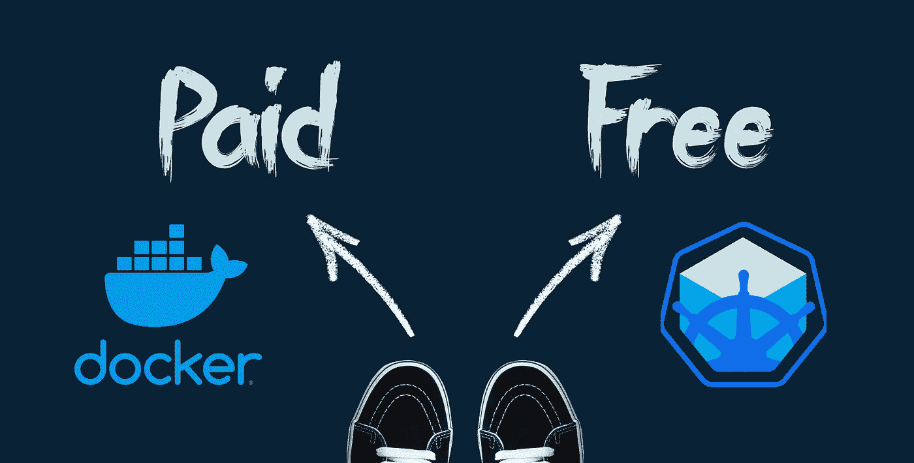
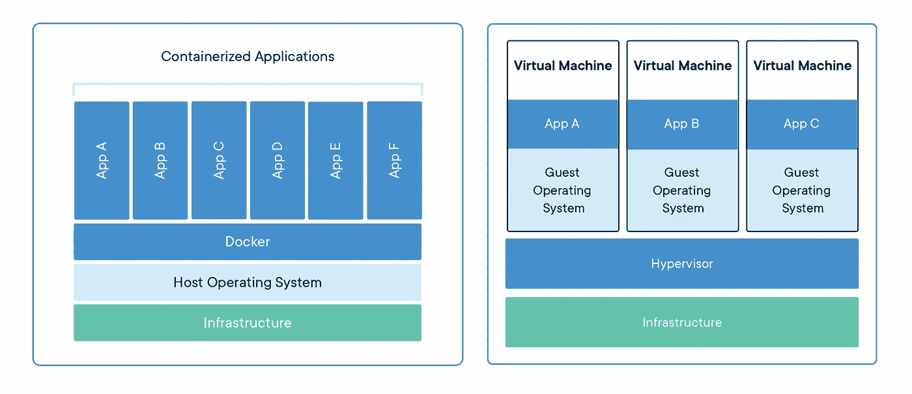
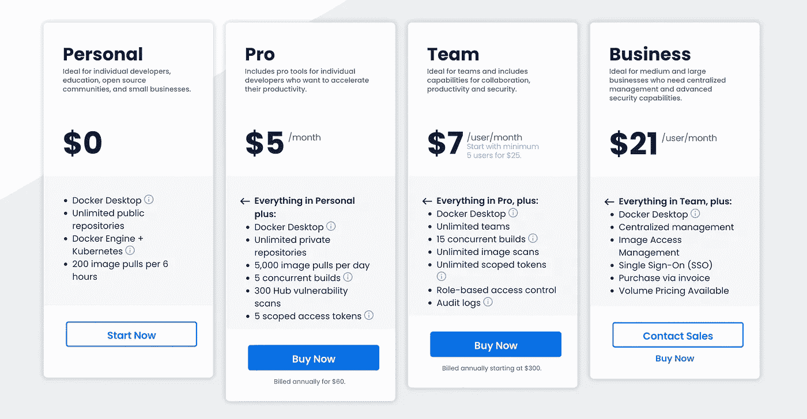

# 关于 Docker 财务困境和如何切换到免费替代品

> 原文：<https://levelup.gitconnected.com/about-docker-financial-troubles-and-how-to-switch-to-free-alternatives-673bfeb57047>

## Minikube + Docker CLI =大公司的免费 Docker 桌面替代方案



这家公司创造了开发者中最著名的工具之一，正在经历一场金融危机。在 2019 年出售部分 Docker 资产后，情况没有改善。所以公司取消了企业免费计划。它是如何发生的，如何迁移到免费的替代品？下面我们来回顾一下。

Docker 容器已经改变了应用程序的开发、测试和部署，尽管它们并没有发明 Linux 容器。因为 Linux 已经有了 LXC 和 OpenVZ。在 BSD/Solaris，监狱/区域已经存在很长时间了。

但是 Docker 将容器作为一种方便直接的大众产品。然而，他们并没有以获利了结此案。

我们现在知道的 Docker 公司成立于 2008 年，当时名为 DotCloud。它开发了云平台即服务(PaaS)。但五年后，该公司改变了商业模式，推出了将 DotCloud 作为独立产品运行的底层结构。尽管如此，用户一直在询问这个引擎，并希望单独获得它。Docker 容器就是这样诞生的。



截图自 docker.com

这个想法是将所有必要的应用程序、库、脚本、测试和设置打包到一个可移植的“容器”中，开发人员可以将其安装在任何 Linux 机器上，并且非常容易运行。它在任何地方都是一样的，因为它在进程级是隔离的，并且有自己的文件系统。

这在当时是绝对的奇迹。一切都做得如此简单和自动化。容器根据给定的条件被提升和关闭，依次，在执行链中一个接一个地或成组地，如你所愿。这允许你设置非常复杂的过程，而不需要太多的 DevOps 技能。您可以从目录中下载一个现成的配置好的容器，并在本地运行它。

随着 2016 年 Docker Desktop for Windows 和 macOS 的发布，Docker 获得了更多的关注，尽管 Linux 仍然是最受欢迎的容器利用平台。

Docker 开发了 Swarm 管弦乐工具。作为 Docker 企业版的一部分，该公司对这一工具的货币化寄予厚望。但它没能与谷歌的 Kubernetes 竞争。

因此，由于日益严重的资金问题，该公司不得不在 2019 年将 Docker 企业版出售给 Mirantis。

2021 年 8 月，Docker 将免费订阅更名为 Docker 个人。因此，Docker 桌面应用程序开始对企业收费。



Docker 定价和订阅

时至今日，Docker 依然健在，但公司并不成功，出售了一部分盈利的业务。结果，Docker Swarm support 在没有公告的情况下悄然停止。

与此同时，开发者和用户已经开始寻找 Docker 的替代品。

## Minikube + Docker CLI

Minikube 是一个开源工具，可以帮助您在本地机器(或虚拟机)上设置一个单节点 Kubernetes 集群。

有适用于 Linux、macOS 和 Windows 的 Minikube 版本。像 Docker Desktop 一样，Minikube CLI 提供了使用集群的基本操作，如启动、停止、状态和删除。

## 放弃

> 在写这篇文章时，我发现了一个 HyperV 驱动程序使用的问题。端口转发没有按预期工作。测试容器工作良好，为试运行容器编写的基于 selenium 的 UI 测试也是如此。但是简单地运行一个带有转发端口的 docker 容器在本地网络上是不可见的。

## Windows 的安装过程

1.  以管理员身份打开 PowerShell 控制台，运行以下命令`Enable-WindowsOptionalFeature -Online -FeatureName Microsoft-Hyper-V -All`。如果 Hyper-V 之前没有处于活动状态，则需要在完成后重新启动
2.  安装 Minikube，按照说明执行步骤 1:[https://minikube.sigs.k8s.io/docs/start/](https://minikube.sigs.k8s.io/docs/start/)
3.  使 HyperV 成为默认驱动
    `minikube config set driver hyperv`
    并启动 Minikube
    `minikube start`
4.  使用管理员权限从 PowerShell 为 Docker 设置环境变量:
    [https://gist . github . com/Golosay/b 47833 b 784 bb 238020 a 6260 ebf 2 C1 ADF](https://gist.github.com/Golosay/b47833b784bb238020a6260ebf2c1adf)
5.  从[https://download.docker.com/win/static/stable/x86_64/](https://download.docker.com/win/static/stable/x86_64/)下载并解压最新版本的 docker CLI，然后将其添加到 Path 环境变量中
6.  检查 Docker 是否正确配置
    `docker container ls`

## macOS 的安装过程

1.  安装迷你库`brew install minikube`
2.  安装 VirtualBox 驱动程序`brew install — cask virtualbox`
3.  安装 Docker 本身`brew install docker`
4.  进入系统首选项->安全与隐私->允许->然后允许软件公司(在本例中为 Oracle)。然后重启。
5.  将 VirtualBox 设为默认驱动程序。`minikube config set driver virtualbox`。
    并启动 Minikube `minikube start`。
6.  更新环境变量的任何一种方式:
    编写所需的变量输出到您的终端配置(对于 zsh: `minikube docker-env >> ~/.zshrc`)或手动注入到系统变量，抓取来自 Minikube docker-env 输出的真实值。[要诀举例](https://gist.github.com/Golosay/6013bb2e0998efbace701eb3be3dd1fb)。
7.  重启终端
8.  检查 Docker 是否正确配置`docker container ls`。

## 已知问题

有时，k8s 会破坏 API 服务器来释放集群资源，或者整个集群会在工作站重启后停止运行。返回`API server: Stopped`的 minikube 状态命令可用于识别这种情况。
k8s 集群需要重新启动来解决这个问题。但不幸的是，它有了新的宿主。因此，环境变量也需要更新。

对于 **Windows，**以管理员身份运行 PowerShell 命令:

```
minikube stop;`
minikube start;`
minikube -p minikube docker-env | Select-String "DOCKER_HOST" | Invoke-Expression;`
[Environment]::SetEnvironmentVariable('DOCKER_HOST', $Env:DOCKER_HOST, [System.EnvironmentVariableTarget]::
Machine)
```

对于 **macOS** 执行`minikube stop && minikube start`，然后更新环境变量(重复步骤#6)。

这个修复可能是自动的😅。但我相信以后会修好的。

## 结论

Docker 是一个很棒的产品，要取代它需要你付出很多努力。如果你需要节省时间和金钱，通过订阅来支持他们。如果没有，有很多替代方案，如 Minikube、Containerd、lxc/lxd、podman、freebsd jail、systemd-nspawn，但所有这些都需要时间和人力资源来正确设置。

**感谢阅读！**请随意分享您在项目中使用了什么或您的迁移经历😇。

如果你喜欢我的帖子，出于某种原因，你还不是一个媒体会员，你可以支持我，并通过这个链接获得会员资格。