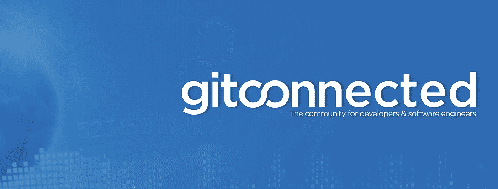

# 关于 gitconnected 出版物

> 原文：<https://levelup.gitconnected.com/about-gitconnected-the-developer-learning-community-3583c0a6dd67>

[**gitconnected**](https://gitconnected.com) 的创建有一个简单的目标:为开发者和软件工程师提供一个平台**分享知识**，**连接**，**协作，学习**。

作为软件工程师，我们很幸运，因为我们可以花时间去做一些很酷的事情，让人们的生活变得更好。这个令人兴奋的机会让人们放下了一切(包括我)，去追求他们成为一名开发人员的梦想。当人们转向软件工程的生活时，这给他们留下了开放性的问题，试图找出他们适合在哪里以及如何成长。gitconnected 是为所有开发人员创建的社区，使我们能够一起学习。

我们提供资源来教授编程、推广开源软件、与其他开发人员联系以及促进职业发展。

# 平台

gitconnected 的主要平台是[https://gitconnected.com](https://gitconnected.com)，在这里你可以创建个人资料来分享你的开发者之旅和兴趣。它让你有机会集中所有关于你的重要信息。我们鼓励您建立您的个人资料，并提供您的项目截图，以便它可以帮助您与其他软件工程师联系。此外，这是一个很好的资源，可以在求职或添加到你的个人网站时与招聘人员分享。我们导入你的 GitHub 项目，所以这个过程非常简单。

该平台还提供了一个 feed 来分享从网络上找到的文章和故事。这有助于我们共同成长，汇集最好的学习材料。讨论用户界面直观简单。[查找编码教程>](https://gitconnected.com/learn)

## 即将推出的功能:

*   工作和职业资源
*   公共 API
*   移动应用程序

# 出版

我们的团队正在积极地从我们在[https://levelup.gitconnected.com](https://levelup.gitconnected.com)举办的网络上编写和获取学习资源。该出版物由 Medium 提供支持，因此如果您发现内容有帮助，我们鼓励您关注并分享。

我们也喜欢社区提交的内容。如果你有什么很酷的学习经历，欢迎投稿。不要害怕接触，因为我们出版任何东西，从绝对初学者到高级。[了解如何为 gitconnected 编写代码](/how-to-get-published-on-gitconnected-dac547ef556b)。

如果您有兴趣了解更多信息，请查看[目录中的热门类别列表](/navigate-gitconnected-table-of-contents-c960e5e30e2b)或[阅读我们的最新文章](https://levelup.gitconnected.com/latest)。

# 重要链接

*   [加入我们的社区 Slack](https://community.gitconnected.com)
*   [在 Twitter 上关注我们](https://twitter.com/gitconnected)
*   [喜欢我们的脸书页面](https://www.facebook.com/gitconnectednetwork/)
*   [加入我们脸书的编码小组](https://www.facebook.com/groups/gitconnected/)
*   [在 LinkedIn 上关注我们](https://www.linkedin.com/company/gitconnected/)
*   [查看我们的 GitHub](https://github.com/gitconnected)

 [## gitconnected -开发者社区

### 分享文章和参与讨论——git connected 让你与其他开发者和一切保持联系…

gitconnected.com](https://gitconnected.com)