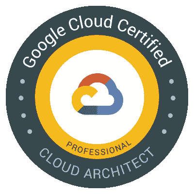
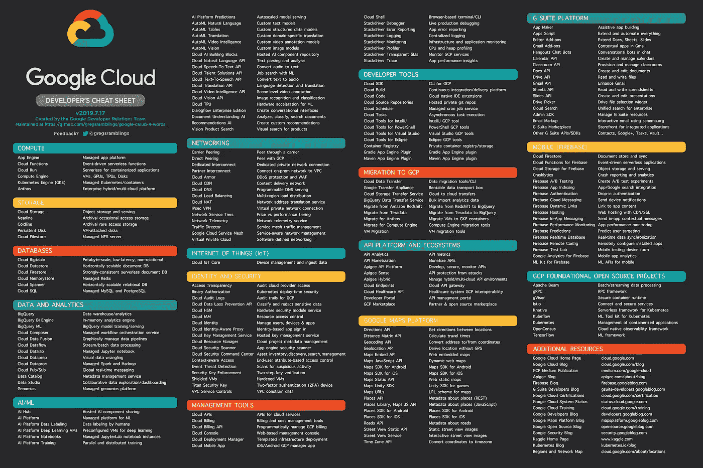

# 关于谷歌云架构师专业认证

> 原文：<https://levelup.gitconnected.com/about-google-cloud-architect-professional-certification-5096bca3134a>

我在 2019 年 12 月通过了谷歌云架构师专业认证。我现在是[谷歌云架构师](https://www.credential.net/71c7ee52-cdab-4957-849f-79c096569f11):)。我只在 12 月的最后一周达到了我的目标，那时工作量较少，我正在埋头准备考试。

过去两年半以来，我一直在谷歌云平台上工作，在此之前，我在 AWS 上工作了大约一年。所以我对云技术有很好的实践经验。通过了来自不同供应商的多种认证后，我很好奇谷歌是如何组织考试的。我在 2019 年底开始准备考试，培训、课程、考试模式实践、不同的服务/资源和真实世界的企业场景真的帮助我了解了云技术的不同方面，特别是 GCP。我非常喜欢整个过程。

如果你渴望成为谷歌云架构师，这里有一些建议给你。这些都是根据我备考的经验和实际考试的观察得来的。

# 建筑师证书

这个考试的好处是它不检查你作为工具专家。你必须作为云架构师来思考。本次考试的范围不仅仅是 GCP 产品，您还应该了解其他概念，如 GDPR、HIPPA、PCI、DevOps 和测试等。

谷歌云架构师认证的范围很广。IaaS、PaaS、SaaS、网络、存储、安全、测试、监控等。

# 阅读 GCP 的产品

确保您全面了解 [GCP 服务及其提供的](https://cloud.google.com/products/)。这是基本要求。

来源:https://github.com/gregsramblings/google-cloud-4-words

1.  理解谷歌文档中服务的**“如何做”和“概念”部分**。
2.  动手做
3.  使用 GCP 控制台进行配置
4.  使用 API 配置
5.  使用库、部署管理器进行配置
6.  了解产品如何与其他服务、所需的 IAM 角色、负载平衡器等集成。阅读产品/服务的最佳实践。
7.  如何对其进行监控。
8.  如何对其进行配置以使其高度可用。
9.  配额、限制
10.  计费是如何制定的，如何降低成本。

# 亲自动手

练习，练习，练习。你练习得越多，你就会越了解 GCP 的资源。我强烈推荐做多个 Qwiklabs。

谷歌提供 12 个月免费 300 美元。使用您的 gmail 创建您的 Google Cloud 帐户，并尽可能多地练习。

# 情景和案例研究

谷歌云架构师认证的好处在于，考试是基于场景的。这意味着，大多数问题就像现实世界中的问题陈述，你需要找到问题的最佳解决方案

谷歌已经公布了他们的考试案例。

([芒特柯克](https://cloud.google.com/certification/guides/cloud-architect/casestudy-mountkirkgames-rev2)、[德雷斯 4 温](https://cloud.google.com/certification/guides/cloud-architect/casestudy-dress4win-rev2)和[特拉米尔思](https://cloud.google.com/certification/guides/cloud-architect/casestudy-terramearth-rev2))。他们每个人都介绍了一个虚构的公司、他们的解决方案、他们的目标和挑战。强烈建议在考试前花时间学习这些文档，我也鼓励人们为每个案例研究考虑一个目标 GCP 建筑。在考试中，案例分析的问题数量很大(可能占> 20%)。但大多数其他问题也是基于情景的事件，如果它们与案例研究没有直接关系的话。

确保你了解 GCP 的建筑，并设计一个问题陈述。欲了解更多信息，请查看[这个](http://gcp.solutions/)

# 课程和学习材料

有许多课程可供选择，但并不是所有课程都足以通过考试。

我从 [Coursera 的谷歌云认证](https://www.coursera.org/specializations/gcp-architecture)架构开始，但这还不够。[准备 Google Cloud 专业云架构师考试](https://www.coursera.org/learn/preparing-cloud-professional-cloud-architect-exam?utm_source=googlecloud&utm_medium=institutions&utm_campaign=GoogleCloud_Cert_Prep_PCA)更符合真实的考试内容。

我还学习了面向云架构师的 Linux Academy 课程，这有助于我理解核心概念及其更多面向考试的内容。我不得不走出我的舒适区，我不擅长交际

# 其他参考文献

除了课程和文档，我还阅读了很多博客和解决方案。以下是一些参考资料

*   [决策树，](https://grumpygrace.dev/posts/gcp-flowcharts/) Google 喜欢决策树，链接是所有决策树和流程图的集合。
*   教程:谷歌提供的[教程](https://cloud.google.com/docs/tutorials)和社区提供的[教程](https://cloud.google.com/community/tutorials/)。这些是解决特定用例的逐步示例。
*   https://www.gcppodcast.com/,[订阅 GCP 播客](https://www.gcppodcast.com/)和 youtube 频道[T7。](https://www.youtube.com/user/googlecloudplatform)
*   GCP 博客，这有助于你与 GCP 保持同步。
*   [媒体博客](https://medium.com/google-cloud)
*   [GCP 解决方案，](https://gcp.solutions/)我总是通过这些链接来了解不同用例的 GCP 架构
*   [Codelabs，](https://codelabs.developers.google.com/)这对于学习不同的用例也很有用。

# 考试

如前所述，考试是基于场景而非工具的。请记住，作为 GCP 的专业人士，你还应该了解 GCP 以外的解决方案、产品和项目流程。并非所有的最佳答案都是 GCP 产品。例如，您需要知道何时虚拟机是解决特定使用情形的最佳选项，而不是在 GCP 环境中有哪些选项可用于调配虚拟机。

以下是一些在考试中有用的提示

*   120 分钟内有 50 个问题，所以每个问题 2.4 分钟，有些问题很长，答案也很长。跳过这些问题，你可以以后再复习。
*   **在参加认证之前，下载使用案例并熟悉它们。**
*   并非所有的最佳答案都是 GCP 产品。
*   在寻找答案之前，先思考一下有问题的架构。
*   尝试应用排除规则。
*   [在尝试实际考试之前练习考试](https://cloud.google.com/certification/practice-exam/cloud-architect)。我还尝试了 Linux 学院的实践考试。

我通过了第一次尝试。尽管如此，当它在屏幕上闪现“通过”或“失败”之前的那个可怕时刻，当我看到传球时，我屏住呼吸，松了一口气！

我已经获得了许多认证，我真的认为*谷歌专业云架构师*是我最喜欢的认证之一。不仅因为它测试你解决商业问题的能力，还因为如果你想成功，它迫使你大量练习。

祝你在 GCP 认证中一切顺利。你可以通过 [LinkedIn](https://www.linkedin.com/in/vikrampshinde/) 和 [Twitter](https://twitter.com/vikshinde) 联系我，特别是关于 GCP 的短期咨询:)