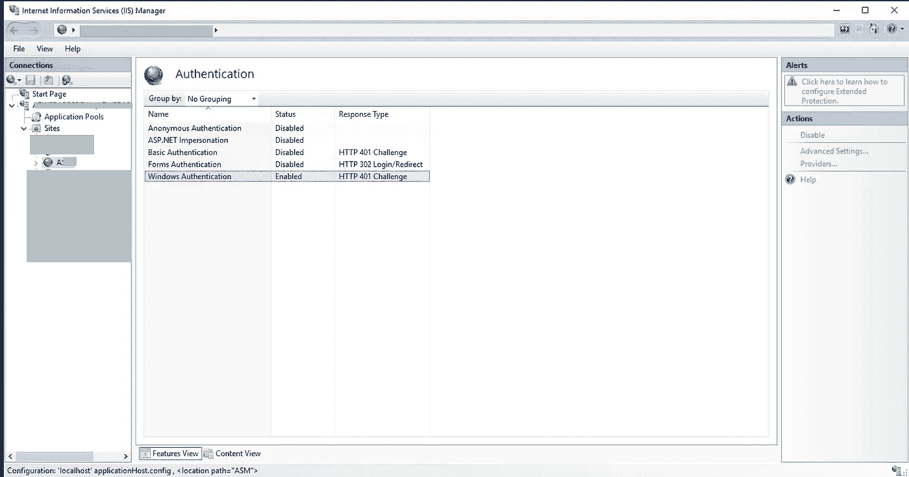

# 关于集成 windows 认证以及如何在运行于 IIS 上的 ASP.NET 核心中实现。

> 原文：<https://levelup.gitconnected.com/about-integrated-windows-authentication-and-how-to-implement-it-in-asp-net-core-running-on-iis-369177dff798>


詹·西奥多在 [Unsplash](https://unsplash.com/s/photos/multiple-keys?utm_source=unsplash&utm_medium=referral&utm_content=creditCopyText) 上的照片

在这篇文章中，我分享了我对集成 windows 身份验证的了解，以及如何在一个由 angular 前端和 ASP.NET core 3 后端组成的 web 应用程序中启用它。

# 什么是集成 windows 身份验证？

我举个例子解释一下。在工作中，我的计算机连接到一个域控制器，它基本上是一个运行 active directory 的服务器。加入域控制器意味着域控制器管理我的凭据，而不是我的电脑。当我使用我的 windows 凭据登录时，我的计算机与域控制器通信以验证我的凭据并允许访问。

我们有。NET 应用程序运行在一组加入域控制器的服务器上的 IIS 上。IIS 可以检查域控制器，以确保在授予访问权限之前我已经通过了身份验证。此外，它可以与浏览器无缝配合，无需我输入凭据，因为它内置了集成的 windows 身份验证。这是可能的，因为运行 IIS 的服务器和我机器上的浏览器都加入了同一个域控制器，并且浏览器支持协商身份验证方案。从[文档](https://docs.microsoft.com/en-us/aspnet/web-api/overview/security/integrated-windows-authentication)来看，这是集成 windows 认证的一个优势。

> 内置于 IIS 中。—不在请求中发送用户凭据。—如果客户端计算机属于域(例如，intranet 应用程序)，用户不需要输入凭据

希望您现在对集成 windows 身份验证有了一些了解。接下来，我们来看看它是如何工作的。

# 集成 windows 身份验证是如何工作的？

根据[文档](https://docs.microsoft.com/en-us/aspnet/web-api/overview/security/integrated-windows-authentication)，集成 windows 身份验证

> 适用于任何支持协商身份验证方案的浏览器，包括大多数主流浏览器。

协商身份验证方案是微软的身份验证机制，它使用 Kerberos，Kerberos 是一种基于共享机密验证用户身份并通过签发票证提供访问的系统。

这是它的工作原理。

要访问受保护的资源，客户端必须向服务器提供有效的票证。为了获得票，客户端向密钥分发中心(KDC)发送请求。客户端使用用户的凭据对请求进行加密。收到加密请求后，KDC 会根据用户名从 active directory 中检索用户的密码，并使用该密码对请求进行解密。

通过使用 KDC 可以从数据库获得的用户密码对请求进行加密和解密，KDC 可以验证用户的身份，而无需客户端发送密码。客户端收到票证后，KDC 使用与资源服务器共享的密钥对票证进行加密，客户端将票证发送到资源服务器，资源服务器使用共享密钥根据 KDC 验证票证。一旦所有的验证都完成了，服务器就把资源返回给客户机。

以上只是一个高层次的总结。如果你想了解更多关于 Kerberos 的知识并查看示例，我建议你观看这个简短的[视频](https://www.youtube.com/watch?v=_44CHD3Vx-0)，阅读这个[博客](https://support.citrix.com/article/CTX221693#:~:text=Negotiate%20is%20a%20Microsoft%20Windows,as%20its%20underlying%20authentication%20provider.&text=When%20the%20client%20tries%20to,to%20use%20the%20Negotiate%20protocol.)和 IETF [文章](https://www.ietf.org/rfc/rfc4559.txt)。

希望您现在对集成 windows 身份验证的工作原理有所了解，让我们讨论一下您应该何时使用它。

# 何时应该使用集成 windows 身份验证

总而言之，在以下情况下，您应该考虑使用集成 windows 身份验证:

*   服务器和客户机都使用 Windows，并加入到相同的域控制器中。
*   该应用程序仅供内部使用。显然，如果公众可以访问它，它将无法工作，因为客户端计算机可能不使用 Windows 和加入域控制器。
*   浏览器支持协商机制(大多数主流浏览器都支持)。
*   服务器支持集成的 windows 身份验证。正如文档中提到的，IIS 内置了对集成 windows 身份验证的支持。

[文档](https://docs.microsoft.com/en-us/aspnet/web-api/overview/security/integrated-windows-authentication)提到集成 windows 身份验证容易受到[跨站点请求伪造](https://www.taithienbo.com/cross-site-request-forgery-csrf/)的影响，所以请记住这一点。

现在您已经了解了集成 windows 身份验证及其工作原理，让我们看看如何在您的 ASP.NET 核心应用程序中实现它。

在我的例子中，配置我的应用程序和 IIS 来使用集成的 windows 身份验证并不困难。我只需要在应用程序中做一些更改，并在 IIS 中启用 Windows 身份验证。

# applicationhost.config 中的更改

设置< 【 > to true in applicationhost.config, which is under . **vs->{项目名称} - > config** 目录。的。默认情况下，vs 目录是隐藏的，所以我启用了显示隐藏文件夹的选项。

```
<windowsAuthentication enabled="true">
    <providers>
        <add value="Negotiate" />
        <add value="NTLM" />
    </providers>
</windowsAuthentication>
```

参见此[链接](https://support.microsoft.com/en-us/help/4028316/windows-view-hidden-files-and-folders-in-windows-10#:~:text=Open%20File%20Explorer%20from%20the,folders%2C%20and%20drives%20and%20OK.)了解如何在 Windows 10 中查看隐藏文件夹的说明。

# launchSettings.json 中的更改

在 ASP.NET 核心项目的 **Properties** 文件夹下的 launchSettings.json 中，启用 iisSettings 下的 WindowsAuthentication:

```
{
  "iisSettings": {
    "windowsAuthentication": true,
    "anonymousAuthentication": false,
    "iisExpress": {
      "applicationUrl": "[http://localhost:61863/](http://localhost:61863/)",
      "sslPort": 44378
    }
  }
}
```

# Startup.cs 文件中的更改

*   在`Configure(...)`方法中，添加这些中间件:

```
app.UseAuthentication(); app.UseAuthorization();
```

由于该应用程序是 ASP.NET core 3 应用程序，根据文档，我将上述中间件放在`app.UseRouting()`和`app.UseEndpoints()`之间。

> 如果应用程序使用认证/授权功能，如`AuthorizePage`或`[Authorize]`，则调用`UseAuthentication`和`UseAuthorization`:之后、`UseRouting`和`UseCors`，但在`UseEndpoints`之前
> 
> [从 ASP.NET 核心 2.2 迁移到 3.0](https://docs.microsoft.com/en-us/aspnet/core/migration/22-to-30?view=aspnetcore-3.0&tabs=visual-studio#migrate-startupconfigure)

如果你想了解更多，请查看 StackOverflow 上的这篇帖子。

在`ConfigureServices()`方法中，我添加了以下内容:

```
services.AddAuthentication(IISDefaults.AuthenticationScheme); services.AddAuthorization();
```

# 远程服务器上 IIS 站点的更改

*   在 IIS 管理器中，在站点的**功能视图**下，双击**认证**功能。
*   选择 **Windows 认证**并将状态设置为**启用**。



在 IIS 上启用 Windows 身份验证

# 角度 app 的变化

从技术上来说，您不需要对 angular 进行任何更改，集成的 windows 身份验证就可以工作。我看的一些在线教程建议在头中添加键和值:`withCredentials: true`。然而，我意识到这是不必要的，即使我删除了代码，认证仍然有效。浏览器似乎通过协商身份验证方案自动处理该过程。

# 可选:获取 windows 用户的角度信息

似乎没有办法从客户端应用程序获得 windows 用户的信息。因此，为了获得 windows 用户的用户名和状态，我调用了后端。

```
[Route("GetAuthenticatedUser")][HttpGet("[action]")] public IdentityUser GetUser() {
 return new IdentityUser() {
  Username = User.Identity ? .Name, IsAuthenticated = User.Identity != null ? User.Identity.IsAuthenticated : false, AuthenticationType = User.Identity ? .AuthenticationType
 };
}
public class IdentityUser {
 public string Username {
  get;
  set;
 }
 public bool IsAuthenticated {
  get;
  set;
 }
 public string AuthenticationType {
  get;
  set;
 }
}
[@Injectable](http://twitter.com/Injectable)() export class AuthGuardService implements CanActivate {
 constructor(public router: Router, private apiService: ApiService) {}
 canActivate(): Observable < boolean > | Promise < boolean > | boolean {
  return this.apiService.User.pipe(take(1), switchMap(currentUser => {
   if (!currentUser) {
    return this.apiService.loadUser().pipe(take(1), switchMap(user => {
     return of(user && user.isAuthenticated);
    }), catchError((err: HttpErrorResponse) => {
     if (err) {
      console.error("Failed to load user: " + JSON.stringify(err));
      if (err.status === 403) {
       this.apiService.setErrorMessage("You don't have access to use this application.");
      } else {
       this.apiService.setErrorMessage("Something went wrong! :(");
      }
     }
     return of(false);
    }));
   }
   return of(currentUser.isAuthenticated);
  }));
 }
}
```

# 参考

[集成 Windows 认证](https://stackoverflow.com/questions/57846127/what-are-the-differences-between-app-userouting-and-app-useendpoints)

[在 Web API 和 Angular App 中启用 Windows 认证](https://www.c-sharpcorner.com/article/enable-windows-authentication-in-web-api-and-angular-app/)

[协商和 NTLM 认证有什么区别？](https://support.citrix.com/article/CTX221693#:~:text=Negotiate%20is%20a%20Microsoft%20Windows,as%20its%20underlying%20authentication%20provider.&text=When%20the%20client%20tries%20to,to%20use%20the%20Negotiate%20protocol.)

[Kerberos —认证协议](https://www.youtube.com/watch?v=_44CHD3Vx-0)

[微软 Windows 中基于 SPNEGO 的 Kerberos 和 NTLM HTTP 认证](https://www.ietf.org/rfc/rfc4559.txt)

[如何为网站、Web 应用程序或 Web 服务启用 Windows 身份验证](https://docs.microsoft.com/en-us/iis/configuration/system.webServer/security/authentication/windowsAuthentication/)

*原载于 2020 年 6 月 27 日 https://www.taithienbo.com*[](https://www.taithienbo.com/about-integrated-windows-authentication-and-how-to-implement-it-in-asp-net-core-running-on-iis/)**。**