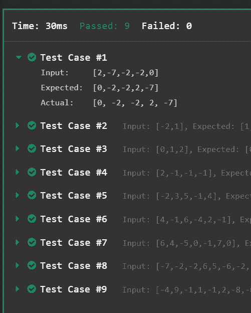
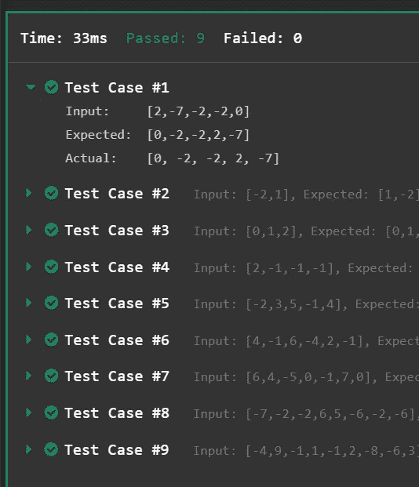

# 绝对值排序

> 原文：<https://levelup.gitconnected.com/absolute-value-sort-2cc98331f04>

## 在 Python 中从头开始实现 ***合并排序*** 和 ***快速排序***

给定一个整数数组`arr`，编写一个函数`absSort(arr)`，根据`arr`中数字的绝对值对数组进行排序。如果两个数字有相同的绝对值，按照符号排序，负数在正数之前。

**示例:**

```
input:  arr = [2, -7, -2, -2, 0]
output: [0, -2, -2, 2, -7]
```

**约束:**

*   **【时限】5000ms**
*   **【输入】array.integer** `arr`
*   0 ≤数组长度≤ 10
*   **【输出】array.integer**

# 用合并排序解决它:

```
from collections import defaultdictdef merge(A,B):
  sortedArr=[]
  i=j=0

  while i<=len(A)-1 and j<=len(B)-1:
    if A[i]<=B[j]:
      sortedArr.append(A[i])
      i=i+1
    else:
      sortedArr.append(B[j])
      j=j+1

  while i<=len(A)-1:
    sortedArr.append(A[i])
    i=i+1

  while j<=len(B)-1:
    sortedArr.append(B[j])
    j=j+1

  return sortedArrdef mergeSort(anArr):
  if len(anArr)<=1: return anArr
  midPt=len(anArr)//2
  leftHalf=anArr[:midPt]
  rightHalf=anArr[midPt:]
  leftHalf=mergeSort(leftHalf)
  rightHalf=mergeSort(rightHalf)
  return merge(leftHalf,rightHalf)def absSort(arr):
  arrAbs=[abs(x) for x in arr]
  arrAbsSorted = mergeSort(arrAbs)

  negCounts=defaultdict(int)
  for x in arr:
    if x<0:
      negCounts[abs(x)]+=1

  output=[]
  for x in arrAbsSorted:
    if negCounts.get(x,0)>0:
      output.append(-x)
      negCounts[x]-=1
    else:
      output.append(x)
  return output
```



**时间复杂度:** `O(N log N)`

**空间复杂度:**

# 用快速排序解决它:

```
from collections import defaultdictdef quickSort(anArr):
  if len(anArr)<=1: return anArr
  pivot=anArr[len(anArr)//2]
  lessThan=[x for x in anArr if x<pivot]
  equalTo=[x for x in anArr if x==pivot]
  greaterThan=[x for x in anArr if x>pivot]

  return quickSort(lessThan)+equalTo+quickSort(greaterThan)

def absSort(arr):
  arrAbs=[abs(x) for x in arr]
  arrAbsSorted = quickSort(arrAbs)

  negCounts=defaultdict(int)
  for x in arr:
    if x<0:
      negCounts[abs(x)]+=1

  output=[]
  for x in arrAbsSorted:
    if negCounts.get(x,0)>0:
      output.append(-x)
      negCounts[x]-=1
    else:
      output.append(x)
  return output
```



**时间复杂度:** `O(N log N)`

**空间复杂度:** `O(N)`

想支持我成为灵媒吗？点击[这里](https://machinelearningabc.medium.com/membership)。