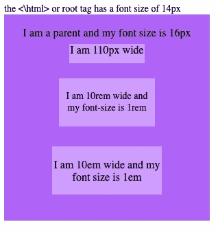
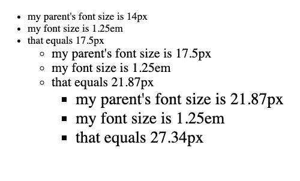
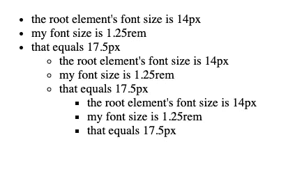
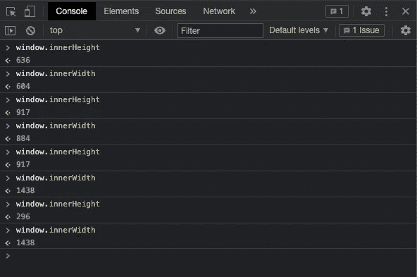
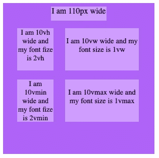
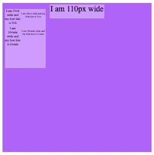

# 绝对相对 CSS 长度单位

> 原文：<https://levelup.gitconnected.com/absolutely-relative-css-length-units-fd990575ddb2>

潘卡杰·帕特尔在 [Unsplash](https://unsplash.com?utm_source=medium&utm_medium=referral) 上的照片

我只是最近才开始在我自己的独立学习中学习如何用 CSS 编码，这真的很有趣。我最初不清楚的一件事是为什么有这么多不同的单位，它们之间有什么区别。我想借此机会让你快速浏览一下我在阅读 [MDN 网络文档](https://developer.mozilla.org/en-US/docs/Learn/CSS/Building_blocks/Values_and_units)和 [W3 学校](https://www.w3schools.com/cssref/css_units.asp)时学到的一些更有用的长度单位。

# 绝对单位

当谈到绝对单位时，最重要的是要记住它们不会改变。他们的价值观是预先确定的，大部分都是一成不变的。也就是说在 CSS 中有很多绝对单位可以使用，比如公制单位，英制单位等等。不过我只打算说一下 **px(像素)**。

[杰里米·泽罗](https://unsplash.com/@jeremy0?utm_source=medium&utm_medium=referral)在 [Unsplash](https://unsplash.com?utm_source=medium&utm_medium=referral) 上拍摄的照片

在所有的绝对单位中， **px** 是最广为人知的，理由也很充分。这通常是每个人被介绍的第一个单元。一个 **px** 就像它听起来的那样，是你显示器上一个像素的大小。如果每个用户的显示器都是相同的尺寸和分辨率，这就不是问题了。

不幸的是，几乎从来没有这样的情况。当使用任何绝对单位时，你必须始终意识到网页/应用程序在你的显示器上出现的方式。在其他显示器中可能不一样。这可能会导致一些奇怪的意想不到的结果。正因为如此，除非必要，否则不要使用绝对单位，这通常对你最有利。

# 相对单位

相对单位的伟大之处在于它们有扩展的能力。仅凭这一点，我们现在就能够创建更灵活的代码，更好地适应用户的显示。但是这些单位的规模到底有多大呢？简而言之，要么是指定的字体，要么是显示器的视口。就像绝对单位一样，也有许多相对单位。所以我只打算介绍我喜欢使用的那些。

## 字体相对

顾名思义，这些相对单位与某些字体或字体属性的大小成比例。有四种不同的字体亲戚，但我将只讨论其中两种， **em** & **rem** 。

请注意 **em** 和 **rem** 的大小是如何不同的

简而言之, **em** 是一个相对于父元素字体大小的单位。这意味着，如果您有一个字体大小为 14 **px** 的父元素，并且它有一个属性设置为值 1.25 **em** 。由于 1.25 **em** = 1.25 * 14(父元素的字体大小)，子元素的属性将被设置为 17.5 **px** 的值。使用 em 最大的好处是你孩子的属性会随着父标签的字体大小而缩放。

字体大小设置为 1.25em 的嵌套 ul 标签

使用 **em** 的唯一缺点是，如果需要在一组嵌套的元素标签中使用不同的大小，那么检查和手动调整值可能会很麻烦。

接下来我们有**快速眼动。rem** 相对于根元素的字体大小。这意味着如果你的 html 字体大小为 14 px，一个元素的属性设置为 1.25 rem。由于 1.25 **rem** = 1.25 * 14(根元素的字体大小)，该元素的属性将被设置为 17.5 **px** 的值。

字体大小设置为 1.25 雷姆的嵌套 ul 标签

正如你所看到的 **rem** 的工作方式和 **em** 完全一样，唯一的区别就是它的缩放比例。另一件要注意的事。因为 **rem** 缩放到我们的根元素，所以当在嵌套标签中使用 **em** 时，我们不会遇到同样的问题。

## 相对视口

与字体相对单位不同，视口相对不依赖于标签或任何特定标签的属性。相反，这些单位是相对于视窗尺寸和显示器分辨率而言的。

那么什么是视口呢？简而言之，视窗是浏览器的一部分，当你访问你最喜欢的 web 应用程序时，它会完成所有的渲染工作。从左到右，从上到下，您的视口当前被文本和浅灰色背景填充。这整个区域就是你的视窗。调整浏览器的大小会调整窗口的 innerheight(视区高度)和 innerwidth(视区宽度)的值。

各种形状和大小的我的视窗高度和宽度。

在上图中，你可以看到每次我调整浏览器大小时这些值是如何变化的。打开浏览器的内置开发工具，将相同的命令输入控制台，你就可以看到这一点。那么这些单位如何精确地缩放到视口呢？

1 **vw** (视口宽度)是你的视口宽度长度的 1%。

1 **vh** (视口高度)是你视口高度长度的 1%。

1 **vmin** (视窗最小值)是视窗最短尺寸长度的 1%。

1 **vmax** (视窗最大值)是视窗最长尺寸的 1%。

拍摄此截图时，视口已最大化，因此高度是较短的尺寸。

需要知道的一件重要的事情是，我们的视口的高度和宽度都是以像素为单位的，这就是我们的分辨率的来源。假设您的视口宽度是当前最长的尺寸，值为 1680 **px** ，这意味着 1 **vw** 和 **1vmax** 将等于 16.8 **px。因为我们的宽度是目前我们最长的尺寸，这意味着如果我们的视口的高度是 971 px**。1 **vh** 和 1 **vmin** 都等于 9.71 **px** 。

拍摄此截图时，视窗已最小化。高度仍然是较短的尺寸。

我知道你可能已经厌倦了我不停地谈论关于视窗亲属的话题，所以我来总结一下。正如你在上面的照片中看到的，我们的盒子和字体与之前的照片尺寸完全不同。唯一改变的是我们的视窗大小。

**总结**

简而言之，绝对单位永远不会改变，相对单位根据它们所涉及的内容而改变。字体相对单位按预先确定的字体大小缩放。视口相对单位随视口的尺寸而缩放。你可能已经猜到了，紫色是我最喜欢的颜色。

我希望这些信息对你的帮助和对我的帮助一样多，下次你发现自己在设计网页/应用程序时，可以考虑尝试一下这些单元。