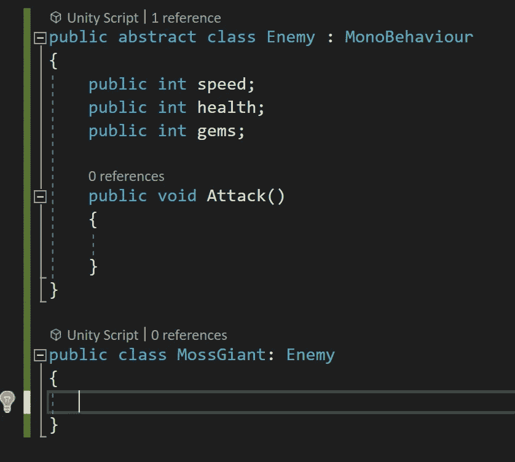
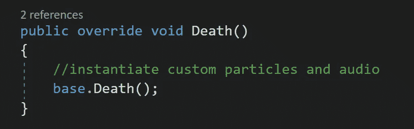

# 抽象类和方法

> 原文：<https://levelup.gitconnected.com/abstract-classes-and-methods-e40693594b01>

与典型的类继承不同，抽象类将类继承强制到从基类继承的类上。基类用于创建局部蓝图，然后继承的类可以根据自己的独特需求完成它。抽象类是创建可管理和可维护代码的好方法。

**抽象敌人类**

*抽象敌人*职业将作为所有其他敌人继承的基础职业。所有敌对类型共享的属性和方法可以在抽象类中声明。正如这里看到的，所有的敌人都有*速度*和*生命*变量，以及他们掉落的*宝石*。他们也都有攻击方法。*基类*是*抽象*，将强制继承类也有相应的*攻击*方法。还要注意的是，在声明类时使用了关键字 *Abstract* 。

**规则和限制**

抽象类不能被*实例化*，所以需要注意的一点是，抽象类不能*而不是*被附加到*游戏对象*上。如下图所示，当我试图将敌方脚本拖到敌方游戏对象上时，弹出一个*错误*告诉我脚本不能是抽象的。

**继承**

从*敌人*继承而来的一个新职业被创建并命名为*苔藓巨人*。

通常情况下，*摩斯巨人*级可以调用*敌人*级中的*攻击*方法，并且如果攻击方法是*虚拟*的话，还会有*覆盖*的能力。更多关于*虚方法*和*类继承*在这里[*https://medium . com/@ jaredamlin/classes-in-c-using-unity-4325 f 2080353*](https://medium.com/@jaredamlin/classes-in-c-using-unity-4325f2080353)。

一旦我将*抽象*关键字添加到攻击方法中，我会在*苔藓巨人*类中得到一个*错误*。这是因为现在方法是*抽象*，继承类*必须*实现相应的攻击方法。对于普通的类继承，继承类有*选项*来决定是否包含攻击方法。

悬停在错误上方会告诉我，*“摩斯巨人没有实现继承了抽象成员* ***的‘敌人’。()’***

**

*给*苔藓巨人*职业增加一个*覆盖*攻击方法，会满足这个错误，但是也会在*抽象*职业的*攻击*方法中产生一个新的。*

**

*悬停在错误上告诉我*抽象方法*可以*而不是*声明主体。抽象方法不能使用*实现*，只能用于*初始化*方法。*

**

*一旦花括号从抽象方法中移除，所有的错误都会消失。*‘扔新系统’。NotImplementedException'* '被自动添加并作为一个临时占位符，直到您正确实现了*覆盖*方法的行为。*

**

*如果您想要一个具有*共享行为*的方法用于继承类，您可以添加一个*虚拟*方法，就像这里看到的死亡方法一样。因为它不是抽象的，所以虚方法可以声明一个体。在这种情况下，它调用 *destroy* 方法并引用脚本附加到的*游戏对象*。*

**

*因为*摩斯巨人*职业和*敌人职业*在*相同的*脚本上，也就是*抽象*，我可以*而不是*把这个拖到一个*游戏对象*上。不过我可以创建一个*新的苔藓巨人*脚本，并将所需代码从*敌人*脚本移到新的*苔藓巨人*职业中。因为*敌人*继承了*的单声道行为*，而*青苔巨人*继承了*敌人*，我现在可以将*青苔巨人*脚本放到*游戏对象*上。*

**

*好了，回到*苔藓巨人*剧本。给*摩斯巨人*职业增加一个*覆盖*死亡方法会调用*基地。死亡*方法来自基地*敌人*职业，*消灭*本*游戏对象*时调用。*

**

*这里的优点是，虽然所有继承类的*都将从*基*方法中销毁，但是您可以在调用*基*方法之前将*自定义*行为添加到继承*类的*中。这些行为可以是任何东西，从实例化宝石到掉落，播放音频剪辑，或者在死亡粒子动画上创建自定义。**

**

***挑战:** *员工体验**

*作为一个挑战，我需要创建一个*抽象* *雇员*类，作为*兼职*和*全职*类的*基础*类。每个员工可以在*检查器*中输入他们的*公司名称*，以及他们自己的*员工名称*。还有一个*抽象*方法用于*计算月薪*，必须由继承类实现。*

**

**全职*类继承自*雇员*，并且有一个名为*薪水*的 *int* 变量来表示年薪总额。在*覆盖*计算月薪的方法中，年薪除以一年中的 12 个月，然后存储在一个*月薪*局部变量中。一条*调试*消息被发送到*控制台*，控制台读出员工*姓名*，然后告诉用户他们的月薪是多少。*

**

**兼职*类也继承自*雇员*，并且有两个 *int* 变量，一个用于*工作小时数*，另一个用于它们的*小时工资率*。兼职员工*的方法是将他们的*小时工资*乘以*工作时间*，并将其存储在*月薪*变量中。另一个*调试*消息被发送到这里，告诉控制台兼职员工的计算月薪。**

**

*这里是检验员中的*兼职*员工。*

**

*这里是检查员中的*全职*员工。*

**

*如图所示，蒂莫西每月总共工作 40 个小时，得到 10000 美元，而索菲娅得到 6666 美元。索菲娅可能想带蒂莫西出去吃饭！*

**

*抽象类和方法就是这样！我希望你能在我的下一篇文章中加入我，在那里我将讨论如何使用*接口*。感谢阅读！*