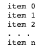
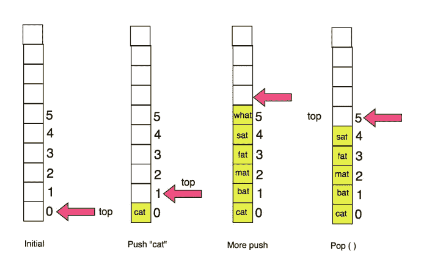
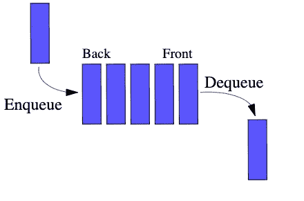

# 抽象数据类型简介

> 原文：<https://levelup.gitconnected.com/abstract-data-types-ece216eab728>

在我们深入抽象数据类型(ADT)之前，让我们考虑一下抽象的含义。抽象是处理想法而不是事件的品质。这不仅对编程有用，而且它发生在我们的日常生活中，我们甚至没有意识到这一点。

为了客观地看待事物，让我们考虑日常生活中抽象发生的一个常见场景，比如在餐馆吃饭。在餐馆用餐时，我们并不太关心订单是如何准备的，我们主要关心的是结果。我们点的菜的复杂性被厨房抽象化了，我们通过厨师和服务员与厨房互动。我们没有把太多精力放在厨房里发生的事情上，因为我们关心的只是收到我们下的订单。

抽象数据类型与餐馆就餐场景没有太大区别，因为它们用于描述数据必须遵循的接口。接口只是一个抽象类，它的行为是由一组规则或操作定义的，而不是它的实现。ADT 的用户不需要知道数据类型是如何实现的，只需要从与实现无关的角度了解数据类型可以做什么。

下面是 ADT 的一些例子，对于每一个例子，我都包括了一些相应的数据结构(DS)或实现，以供那些可能对该主题有所了解或可能想了解具体细节的人使用:

## **列表 ADT**

列表 ADT 是没有特定顺序的项目的有序集合。列表中的每一项都有一个位置，从零开始。列表的简单表示如下所示:

请记住，这是一个列表的基本表示。数据通常存储在由头部结构组成的关键字序列中，头部结构由计数、指针和用于比较列表中数据的函数地址组成。List ADT 的 DS 实现可以是动态数组或链表。

**堆栈 ADT**

栈类似于现实生活中的一堆物体:书、饼干、盘子；其中堆栈中的对象直接从顶部放置或移除，而不是中间或末端。这就是所谓的后进先出排序法。因此，堆栈 ADT 是一个线性数据结构，支持从堆栈顶部插入或删除。

您可能已经知道，栈的两个主要操作是 Push 和 Pop。这在浏览器的导航栈中很常见。当显示新网页时，当前页面的地址被压入堆栈。可以从堆栈中弹出前一页的地址。

给定一个堆栈，我们可以将一个值推到当前堆栈的顶部。我们也可以弹出一个值，将它从栈顶移除。

**队列调整**

队列 ADT 类似于堆栈 ADT，因为它们都是线性数据结构。但是，与 Stack ADT 不同，队列支持从序列的任意一端插入或删除。因此，这里的关键要点是，运营发生在两端。

您可能认为队列类似于现实生活中的队列或线:将项目从前面入队，将项目从后面出队。这个想法是服务前面的人，而不是服务后面的人。这就是所谓的先进先出，或者说“先来先服务”

队列 ADT 的 DS 实现可以是基于链表的队列、基于数组的队列或基于堆栈的队列。

**地图 ADT**

Map ADT 对一个可搜索的键-值映射集合进行建模，其中一个唯一的键被映射到一个值。地图的主要操作有:插入、查找、删除。

由于其界面的“形状”,地图通常被称为字典，我们可能会认为这是现实生活中的字典。一个单词被作为“键”来寻找，相应的定义作为它的“值”。

因为每个值都映射到一个唯一的键，所以需要一个键和值来插入新的映射。然而，我们只需要这个键来查找或删除映射。

Map ADT 的 DS 实现可以是树形图、散列图/散列表。

**结论**

本文的目标是简要描述数据类型的抽象和实现。在提供 ADT 的例子之前，我提到了在计算机科学中处理抽象与在日常生活中处理抽象没有太大的不同。我想再举一个使用 ATM 的例子，这样我们就有了另一个参考点。

当我们访问 ATM 时，我们正在与一个具有某种输入形式的屏幕进行交互，例如触摸屏或 TTS 服务。作为 ATM 的用户，我们并不高度重视 ATM 的实际实现和设计。我们只是依靠前端来指导我们完成基本的银行功能，如查看银行数据和进行存款或取款。前端为自动柜员机创建接口，自动柜员机将流程抽象化。你能想到日常生活中抽象的例子吗？请在评论中告诉我。

我希望你喜欢阅读，并且我可以帮助一些人理解抽象，哪怕是一点点。特别感谢我在这篇文章中使用的参考资料。这些参考资料也是我在这篇文章中使用的所有图片的来源。我计划在接下来的文章中通过编码示例对每个数据结构进行更深入的研究。干杯！

**参考文献**

1.  [抽象数据类型 Wiki](https://en.wikipedia.org/wiki/Abstract_data_type)
2.  [FreeCodeCamp Youtube 视频](https://www.youtube.com/watch?v=RBSGKlAvoiM&list=PLtS7XdlvrF98qcPUa8Oxy6eZUZWYLqRve&index=2)
3.  [爱荷华大学](http://homepage.divms.uiowa.edu/~ghosh/2116.61.pdf)
4.  [亚利桑那大学](https://www2.cs.arizona.edu/~mercer/Presentations/MapADTandHashTables.pdf)
5.  [GeeksforGeeks](https://www.geeksforgeeks.org/abstract-data-types/)
6.  [威斯康星大学麦迪逊分校](http://pages.cs.wisc.edu/~hasti/cs367-1/readings/Lists/)
7.  [队列(抽象数据类型)Wiki](http://Queue (abstract data type))
8.  [威廉·费塞特的 Github 回购](https://github.com/williamfiset/data-structures)
9.  [Jeff Zhang 的 GitHub 回购](https://github.com/jeffzh4ng/algorithms-and-data-structures)