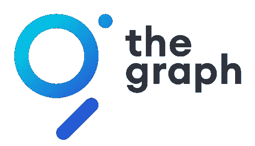
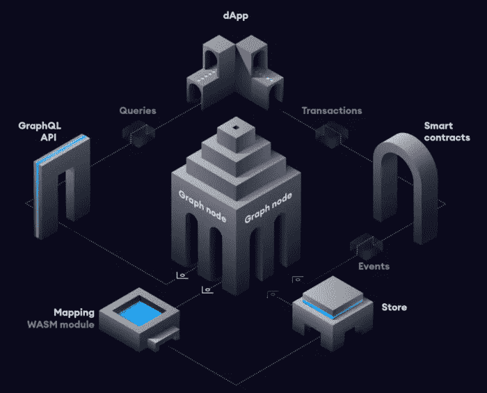
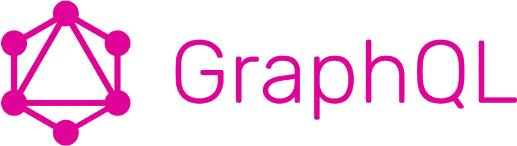
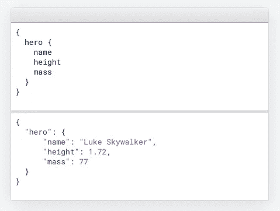
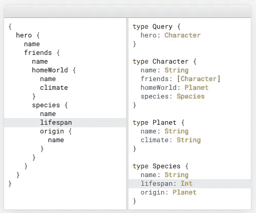
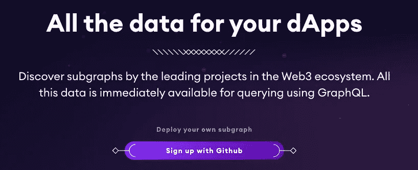
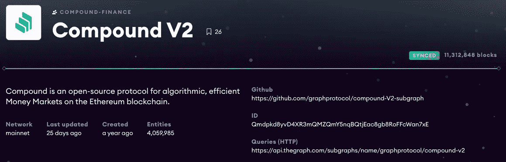
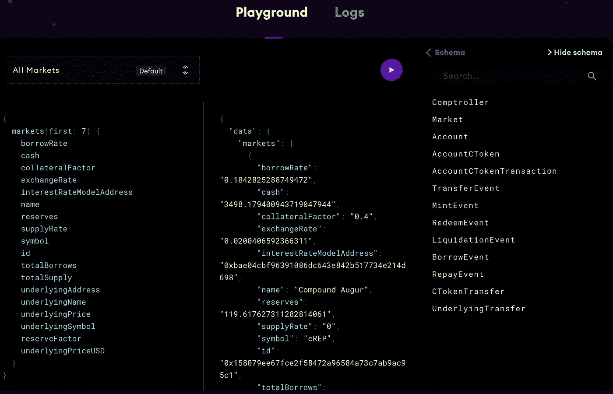

# 用图表加速 Web 3.0

> 原文：<https://levelup.gitconnected.com/accelerating-web-3-0-with-the-graph-afb29aa078ee>

## 他们的基本查询基础设施的运行状况

去中心化应用和 Web 3 的未来将由支持它的基础设施层决定。以前，dapp 必须构建自己的查询逻辑，并为输出(在区块链上)找到存储，而我们已经阻止了 dapp 可能的创新。

[www.thegraph.com](http://www.thegraph.com)

[图表](http://www.thegraph.com)为 dApp 的建设者提供了加速上市和早期创新的加速器

虽然有些数据很容易从像[以太坊](http://www.ethereum.org)这样的区块链中查询到，但随着查询变得更加具体/细化，这变得更加具有挑战性。在某些情况下，被请求的数据可能需要一定程度的转换/聚合，这可能是耗时且昂贵的构建，经常是一遍又一遍地进行(由多个独立的团队进行)。

该图及其子图提供了这个问题的解决方案。

他们解决方案的核心是“图形节点”。

# 图形节点

[https://thegraph.com/docs/introduction#what-the-graph-is](https://thegraph.com/docs/introduction#what-the-graph-is)

图节点与区块链节点(即 Geth，以太坊上下文中的奇偶校验),并通过使用“子图”准确地提供在每个块中提取的信息。

同样，Google 会对给定查询的最相关的搜索结果进行管理，因此图表协议上的管理将允许索引器(运行图表节点的个人)只对最相关的子图表进行索引。然而，与谷歌不同的是，Graph 的目标是去中心化，而不是由一个中心实体来执行监管，而是由许多监管者来执行，这些监管者(像他们的索引器兄弟一样)将因他们的角色而获得报酬。

子图定义了图将从以太坊索引哪些数据，以及如何存储这些数据。可以为每个项目或应用程序创建子图(即 uni WAP/Compound)都运行在以太坊上。

Graph 已经发布了一套全面的文档标准，可以从他们的网站上获得(例如[子图清单](https://thegraph.com/docs/define-a-subgraph#the-subgraph-manifest)、[映射](https://thegraph.com/docs/define-a-subgraph#writing-mappings))。

可以使用节点的 GraphQL 端点来查询图形节点。

# GraphQL

[www.graphql.com](http://www.graphql.com)

GraphQL 是一种开源的数据查询和操作语言。自 2012 年以来，脸书的移动应用程序一直由 GraphQL 提供支持。

GraphQL 规范在 2015 年开源，现在可以在许多环境中使用，并被各种规模的团队使用。

Graph 节点将 GraphQL 命令翻译成对其底层数据存储的查询，以获取数据。GraphQL 是语言不可知的，你可以使用任何编程语言。它存在于您的客户机和数据源之间，这使得它非常灵活。

GraphQL 有一个基于浏览器的开发环境，用于研究 GraphQL 查询，这对于编写提取和转换数据的查询非常有用。语言语法不同于 SQL，因为它们看起来更像 JavaScript 对象。

GraphQL 查询快速/稳定，并且总是返回可预测的结果

GraphQL APIs 按照类型和字段进行组织，您可以从单个端点访问数据的全部功能。GraphQL 使用类型来确保 dApps 只询问什么是可能的，并提供清晰和有用的错误。

应用程序可以使用类型来避免编写手动解析代码。

GraphQL 为您的整个 dApp 创建了一个统一的 API，不受特定存储引擎的限制，为您提供了一个简单明了的流程:

> 描述您的数据
> 
> 要求你想要的
> 
> 获得可预测的结果

利用 GraphQL，图协议引入了“子图”。

# [数]子图

由于在查询之前对原始区块链数据进行计算，子图提供了快速响应时间；允许根据需要快速提供索引数据。由于预先计算和强大的基础设施，子图可以执行复杂的粒度查询(允许根据需要索引特定的合同、方法和事件)。它们还提供了在任何给定块高度开始索引的自由，这有助于减少同步和索引子图所需的时间。

公开的子图允许任何应用程序/用户查询它们包含的索引数据。因此，多个应用程序可以利用同一组子图，从而减少复制和重复/冗余的开发时间。

开发人员可以确保他们正在访问的子图将通过图的冗余分散网络保持在线，该网络不依赖于任何单个索引器。

子图由三个主要部分组成，它们包括:

> **清单** —定义智能合约、事件、块和调用的文件(YAML)。此外，它还将事件数据映射到实体和那些包含数据的对象

清单是评估子图有效性的好地方，通过确保正确引用合同、正确的事件/调用处理程序和使用最新的 ABI 文件。它还提供了关于原始数据如何映射到已定义的实体集合的视图，以及这样的命名约定是否易于理解。

> **模式** —一个文件(GraphQL ),它组织存储在实体中的数据，并支持如何表示数据的规范

该模式提供了关于子图有多完整和有用的视图。对模式的评估可以确定缺失的数据集，尽管这应该总是在子图要实现的目标的上下文中来看待。

> **Mappings** —一个将低级以太坊数据转换成 GraphQL 模式文件中指定的所需实体的文件

映射文件为那些熟悉 AssemblyScript 语言的人提供了一个视图，一个基于原始数据的子图的复杂性和有用性的视图，以及它是如何被转换的。

现在，一个“子图”可能看起来像什么，你会去哪里找到它…

# 在野外寻找子图

从参观 https://thegraph.com/explorer/[开始](https://thegraph.com/explorer/)

在浏览器中，从提供的列表中选择一个子图，在本例中，我们选择复合协议子图。

[https://the graph . com/explorer/subgraph/graph protocol/compound-v2](https://thegraph.com/explorer/subgraph/graphprotocol/compound-v2)

现在让我们浏览一下子图，以提高您对其组件的熟悉程度。

子图页面的亮点包括:

*   它所在的以太坊网络(即。Mainnet)
*   上次更新时间
*   原始创建日期
*   实体的数量(即包含数据的对象)
*   是否与最新的以太坊块高度完全同步
*   Github URL
*   IPFS 身份证
*   查询(HTTP)地址

从上图中，你可以看到子图中不同的实体，并测试简单的查询。通常已经有一些示例查询可用。这使您能够对数据、其功能和局限性有所了解。此外，您可以从模式(数据模型)中找出哪些实体具有哪些属性。

现在就交给你去探索“子图游乐场”了…

# 结论

我希望这个简短的指南已经为你提供了一个高层次的视图，展示了图形的可能性，以及它强大的工具包，为 dApps 和他们的用户提供了一个去中心化的 Web 3 世界。