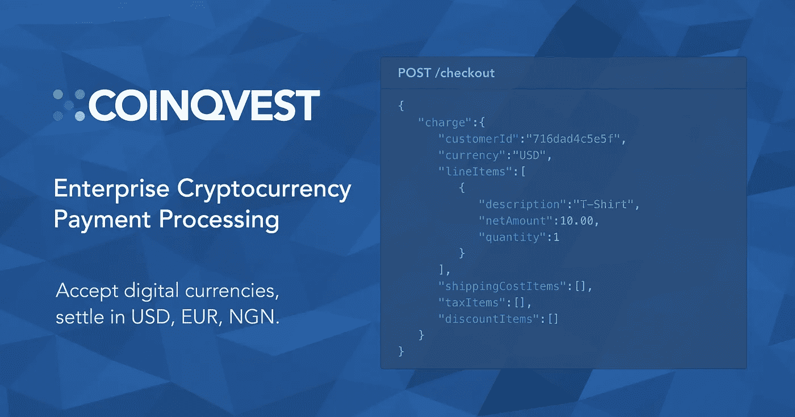
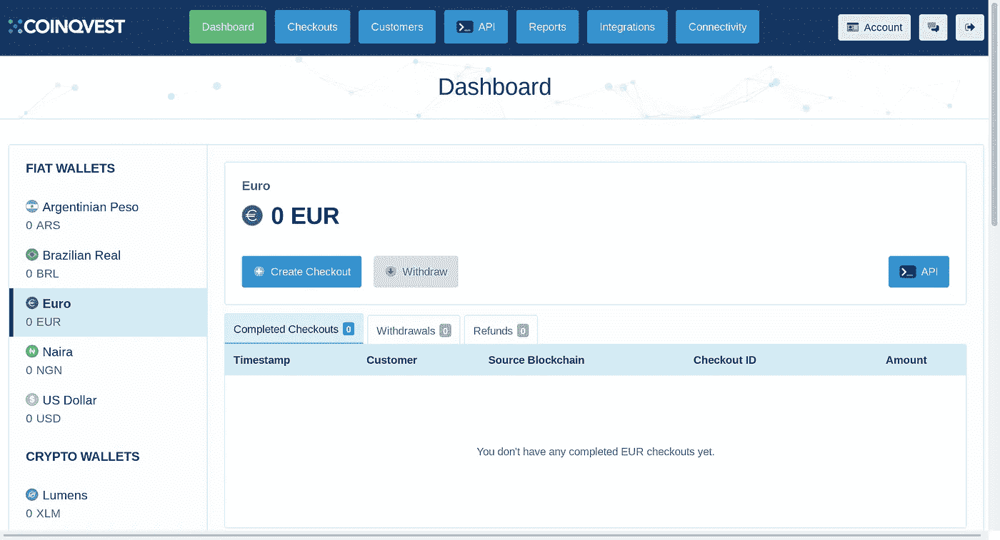
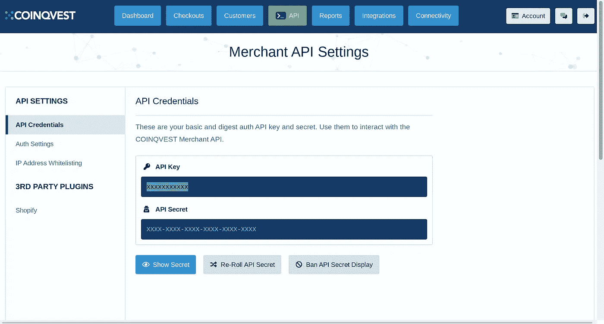
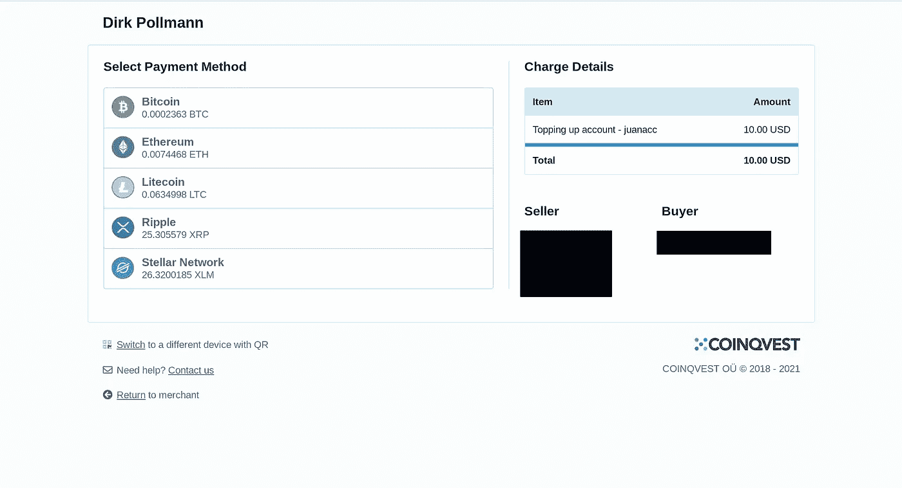

# 使用 Coinqvest for NodeJS 接受加密货币支付

> 原文：<https://levelup.gitconnected.com/accept-cryptocurrency-payments-with-coinqvest-for-nodejs-c6b42aec4d78>

加密货币的多种支付方式之一



硬币投资

我最近参与的大多数 web 项目都以某种方式包含了加密货币，尤其是接受比特币、以太坊和其他硬币作为支付的支付网关。它们中的大多数都包含了托管结帐的特性，在这里生成一个链接显示给用户。这个链接有一个 QR 支付，有电子邮件和回拨通知。有了回拨通知，我们可以处理支付或失败，双方(管理员和最终用户)的支付状态通知。

Coinqvest 拥有不同的 SDK(尽管我们可以通过 REST 与之交互)，目前有 PHP、Ruby 和 NodeJS([https://www.coinqvest.com/en/api-docs#sdks](https://www.coinqvest.com/en/api-docs#sdks))。在本教程中，我们将使用 NodeJS 库设置一个简单的签出。

# 开始前

在开始编码之前，我们需要建立一个帐户。我们将去他们的网站(【https://www.coinqvest.com/】T2)注册一个新用户。之后，我们应该会看到仪表板屏幕



Coinqvest 仪表板

现在我们将获得 API 密匙来使用这个库。我们将进入顶部菜单 API -> API 设置。我们还会发现我们的 API 秘密:



我们已经完成了 Coinqvest 的设置，现在我们可以切换到 Node.js。

# 结账编码

如上所述，我们将使用 NodeJS 库(【https://github.com/COINQVEST/nodejs-merchant-sdk】T4)。我写这篇文章的时候使用这个库的要求是:
—NodeJS≥10 . 14 . 0
—axios≥0 . 19 . 2

Coinqvest 是如何工作的？

和许多支付网关一样，Coinqvest 使用一个**客户**对象和一个**收费项目列表**。

客户的一个例子如下:

```
 customer: {
            email: 'john@doe.com',
            firstname: 'John',
            lastname: 'Doe',
            company: 'ACME Inc.',
            adr1: '810 Beach St',
            adr2: 'Finance Department',
            zip: 'CA 94133',
            city: 'San Francisco',
            countrycode: 'US'
        }
```

还有一个收费的例子:

```
charge:{
            customerId: customerId,
            currency: 'USD', // specifies the billing currency
            lineItems: [{ // a list of line items included in this charge
                description: 'T-Shirt',
                netAmount: 10,
                quantity: 1
            }],
            discountItems: [{ // an optional list of discounts
                description: 'Loyalty Discount',
                netAmount: 0.5
            }],
            shippingCostItems: [{ // an optional list of shipping and handling costs
                description: 'Shipping and Handling',
                netAmount: 3.99,
                taxable: false // sometimes shipping costs are taxable
            }],
            taxItems: [{
                name: 'CA Sales Tax',
                percent: 0.0825 // 8.25% CA sales tax
            }]
        }
```

因此，根据我们平台的架构，我们将必须进行两次调用，第一次调用创建客户(或者我们可以创建一次并在数据库表中保存 customerId)，然后处理结帐并生成发送给用户的链接。

## 安装 NPM:

```
npm install coinqvest-merchant-sdk
```

## 创建客户

记住 Coinqvest 创建客户所需的参数，我们可以在我们的平台中注册帐户时轻松地创建它(当用户注册时，想象一个 Saas 项目)，并将 customerId 与 accounts 表相关联。这样，每次用户想要使用 Coinqvest 平台进行转账/充值时，我们只需执行 1 次请求(创建结账)而不是 2 次请求(创建客户)。

我们从导入 CoinqvestClient 库开始:

```
const CoinqvestClient = require(‘coinqvest-merchant-sdk’);
```

然后我们需要创建客户机对象。请记住，构造函数有两个参数: **API 密钥**和 **API 秘密**。强烈建议将这些值存储在. env 隐藏文件或类似文件中:

```
const client = new CoinqvestClient(
 process.env.COINQVEST_SECRET,
 process.env.COINQVEST_KEY
);
```

客户必须填写的唯一必填字段是电子邮件地址。和往常一样，建议填写完整的帐单细节，但为了本教程的缘故，我们将只使用电子邮件地址。

```
client.post('/customer', {
    customer: {
      email: req.body.email
    }
  }, (r) => {
    if(r.status !== 200) {
      console.log('Could not create customer');
      return;
    }
    let customerId = r.data['customerId'];
    console.log(`Customer created with id ${customerId}`);
    console.log(r.data);
  })
```

如果一切顺利，我们应该会看到结果:

```
{ customerId: '6d3921af2a38' }
```

## 生成结帐

现在我们有了 customerId，我们可以继续生成 checkout 链接。我们将有主要货币来表示项目的成本，在我的例子中是美元。为了更改我们将在 Coinqvest 帐户中收到的加密货币，我们需要设置 settlementCurrency 参数。有关充值操作，请参见以下示例:

```
const client = new CoinqvestClient(
        process.env.COINQVEST_SECRET,
        process.env.COINQVEST_KEY
    );const r = client.post('/checkout/hosted', {
        charge: {
            customerId: req.account.customerId,
            currency: 'USD',
            lineItems: [
                {
                    description: `Topping up account`,
                    netAmount: req.body.amount
                }
            ]
        },
        settlementCurrency: 'BTC',
        links: {
            cancelUrl: '[https://www.merchant.com/path/to/cancel/checkout'](https://www.merchant.com/path/to/cancel/checkout'),
            returnUrl: '[https://www.merchant.com/path/to/complete/checkout'](https://www.merchant.com/path/to/complete/checkout')
        }
    }, (r) => {
        if(r.status !== 200) {
                console.log('Could not create checkout');
                return;
        }
        const url = r.data['url']; console.log(url);
   });
```

返回的 URL 是 checkout，如下所示:



# 结论

这样你就可以接受任何你想要的加密货币支付。本教程是一个**基本方法**，并没有展示 Coinqvest 必须提供的所有功能。例如，使用 cancelUrl 和 returnUrl，我们可以跟踪事务的状态，而不必被迫进行轮询。我将在 NodeJS 上上传更多关于加密货币的教程，以及如何使用类似的库。它们都有优点和缺点，这真的取决于选择它的人和他的计划/潜在需求。