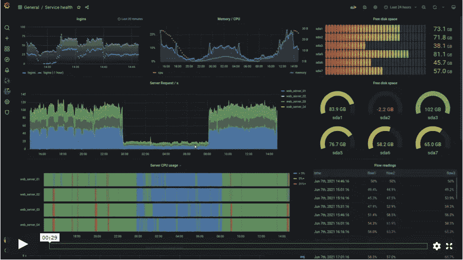
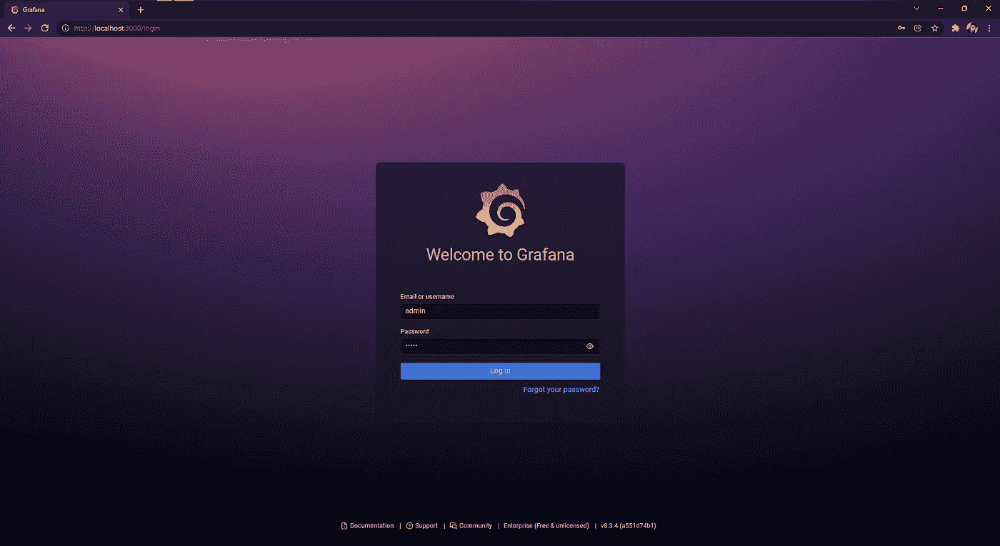
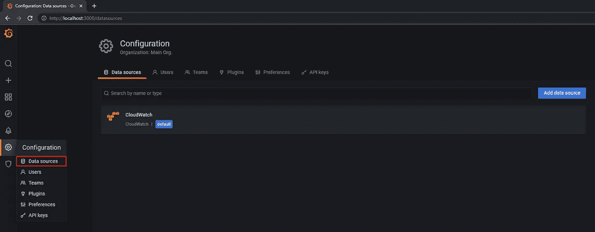
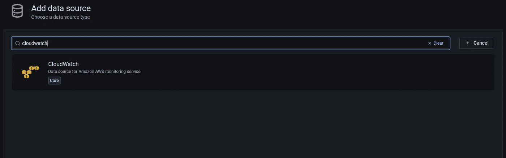
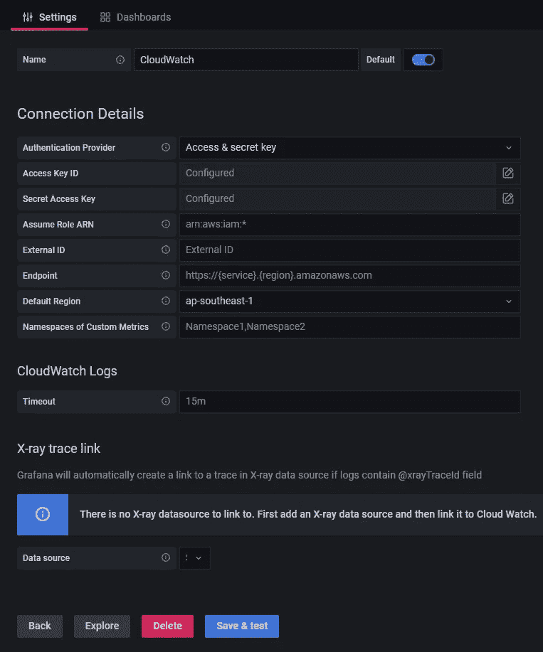
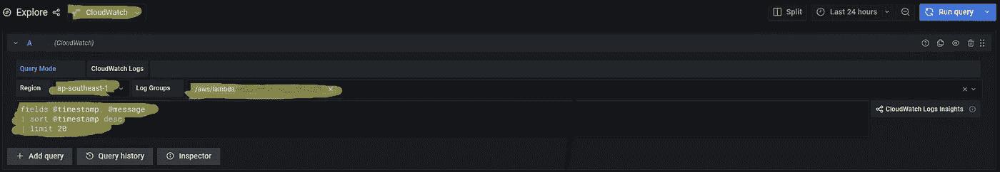
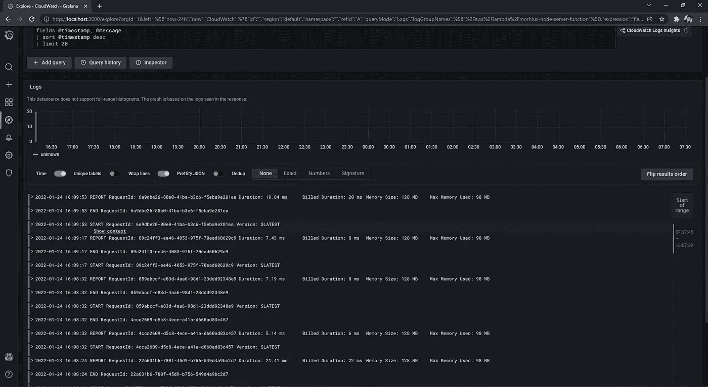

# 使用 Grafana 访问您的 AWS Lambda 日志

> 原文：<https://levelup.gitconnected.com/access-aws-cloudwatch-logs-with-grafana-2d75bfe25e4f>

## 在本地主机上查看 AWS 日志再简单不过了。



图片来自[Grafana.com](https://grafana.com/grafana/)

**背景**

我和我的团队大量使用 AWS Lambda 来托管我们的后端 API。一切都很顺利，直到我们在生产中测试它。然后，我们需要通过 AWS CloudWatch 访问 API 的日志，我发现用起来不太友好。所以我开始四处寻找，看看我们是否有更容易访问日志的方法。原来我已经找到了格拉夫纳。

[格拉法纳 ](https://grafana.com/oss/grafana/)

> Grafana 允许您查询、可视化、提醒和了解您的指标，无论它们存储在哪里。与您的团队一起创建、探索和共享漂亮的仪表板，培养数据驱动的文化。

它是付费云服务附带的开源工具。它是一个工具，使我们能够创建衡量指标的仪表板，而不管数据存储在哪里。它可以在你托管的 Kubernetes，AWS，GCP，Azure，Elastic 等。

我是一个简单的人，我不是 DevOps 的专家。我使用 Grafana 的主要原因是为了使我的生产测试流程更加顺畅，并且能够更容易地访问我的 AWS 日志。



Grafana 登录页面

按照简单的说明在这里安装 Grafana。之后，您将能够通过以下本地主机 URL 使用您最喜欢的浏览器访问 Grafana。默认用户名和密码都是 **admins** :

```
[http://localhost:3000](http://localhost:3000)
```



(图片-1)配置->数据源



(图片-2)搜索云观察



(图 3)填写 AWS 凭证

现在，您可以看到带有左侧面板的仪表板(图 1)。前往面板，寻找添加数据源的配置。它将引导您到搜索面板；继续搜索 CloudWatch(图片-2)。您将继续填写您的 AWS 详细信息(图 3)。我正在使用 accessKey 和 secretKey 对。其余的都是可选的，现在可以让它为空。现在我们可以保存和测试。如果您的凭据有效，将弹出一个窗口，指示数据源正在工作。

我的日志在哪里？！



(图片-4)设置云观察

冷静点，我们开始吧。现在，再次转到您的左侧面板，并寻找探索。我们需要填写四个关键的东西来检索我们的日志(图 4)。

1.  确保您选择了正确的数据源。
2.  设置您的地区，尽管这是一个可选字段。
3.  选择您的日志组，您可以选择多个日志组。
4.  日志的查询。最简单查询如下所示:

```
fields [@timestamp](http://twitter.com/timestamp), [@message](http://twitter.com/message)
| sort [@timestamp](http://twitter.com/timestamp) desc
| limit 20
```



(图 5)显示日志

最后，点击运行查询按钮，您将能够查看您的所有日志。

**最终关键外卖**

Grafana 能做的不仅仅是查看 AWS Lambda 的日志。本教程只是一个简单的例子，说明 Grafana 是如何工作的，以及我如何利用它来为自己谋利。给 Grafana 更多的时间来探索它是值得的。

我写了关于智能工具来简化和帮助我们的日常工作，请看这里:

[](/tools-that-you-dont-know-you-need-for-development-a73bf699a0d4) [## 您不知道开发需要的工具

### 使用正确的工具，聪明地工作

levelup.gitconnected.com](/tools-that-you-dont-know-you-need-for-development-a73bf699a0d4) 

如果你希望支持我并阅读更多来自 Medium 和我的优秀内容创作者的文章，你可以在这里加入 Medium 会员。