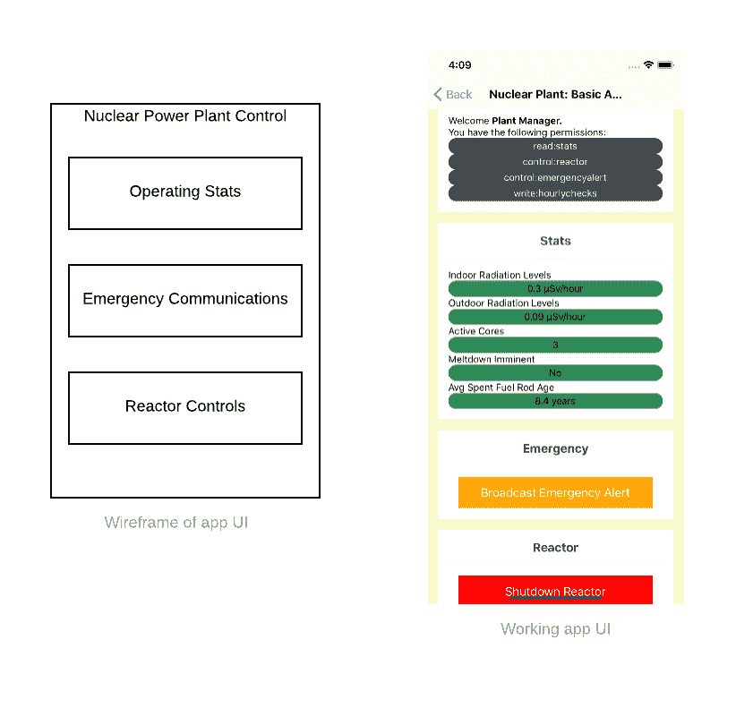
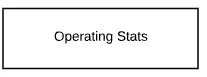
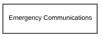
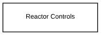
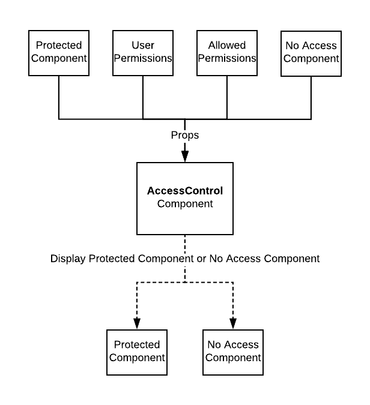
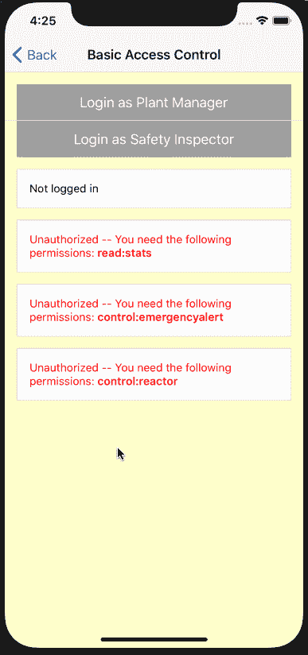
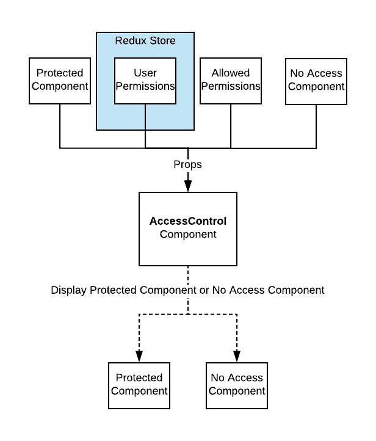
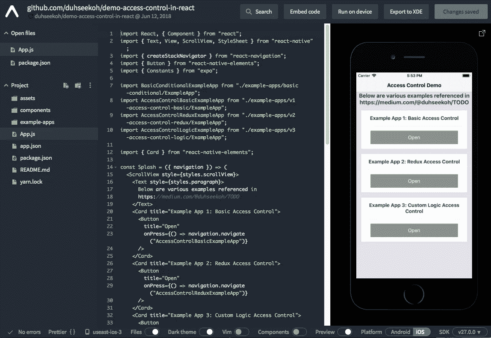

# 在 React 应用程序中管理访问控制

> 原文：<https://levelup.gitconnected.com/access-control-in-a-react-ui-71f1df60f354>


假设您正在构建一个 React.js 应用程序。想象一下这个应用程序的目的是管理一个核反应堆。现在…想象这个应用程序只存在，所以我可以写一篇关于在 React 中实现访问控制的中等帖子。太好了，我们开始吧。(*注意:本文中的所有例子都是在 React Native 的环境中构建的，但也可以很容易地应用于 React for web)。*



核电厂控制应用程序的线框和应用程序 UI

**是什么决定了什么用户可以*在 app 中看到*(访问)？我知道我只希望一些用户控制反应堆，其他用户读取反应堆当前状态的统计数据，另外一些用户可以激活应急电源，一些用户将记录他们每小时的安全检查，一些用户可以触发紧急警报，一些用户可以在发电厂内部发出警报，等等。显然我对核反应堆很了解。**

# 基础 React 中的条件句

在我们谈论控制核电站之前，我们如何在 React 中得到一些基本的逻辑？在 React 中定义 UI 的声明性使得添加条件显示逻辑变得简单明了。有一个组件，我们希望在某些情况下显示，而在其他情况下隐藏。嗯，这很容易反应。

```
// Conditionally display a LoginScreen if there's no user
const App = ({ user }) => (
  <View>
    {!user && <LoginScreen />}
    {user && <WelcomeScreen user={user} />}
  </View>
);
```

如果我们的`<App>`传递了一个用户，那么我们可以显示`WelcomeScreen`，否则，我们将显示`LoginScreen`。这是最基本的访问控制形式，一个简单的条件。

我们如何围绕这个建立一个模式？我不仅需要知道用户是否登录，还需要实时确定用户在应用程序中拥有哪些特定的能力。

# 获得粒度—基于权限的访问控制

维基百科有一个关于“[基于角色的访问控制](https://en.wikipedia.org/wiki/Role-based_access_control)”的漂亮页面。

> 在一个组织内，为各种工作职能创建[角色](https://en.wikipedia.org/wiki/Role_(computer_science))。执行某些操作的**权限被分配给特定的角色**。成员或职员(或其他系统用户)被分配特定的角色，并通过这些角色分配获得执行特定系统功能所需的权限。

在前端，我们不太关心角色，只关心这些角色映射到的权限。

如果你正在创建一个销售点系统，你可能会给一个商店经理以折扣价来覆盖特定商品的价格的能力，而其他员工没有这种能力。您甚至可以在 UI 中对那些不能执行该操作的用户完全隐藏该功能。这可以通过为每个用户分配一组权限来实现。

在我们的核电站 app 里呢？让我们想出一些可以分配给应用程序用户的权限。为了简单起见，这将是一个有限的集合，其中每个权限对应一个 UI 面板。



**读取:统计**权限



**控制:紧急预警**权限



**控制:反应器**许可

几个应用程序用户会是什么样子？

```
User: Plant Manager
Permissions: read:stats, control:emergencyalert, control:reactorUser: Safety Inspector
Permissions: read:stats
```

*工厂经理*可以做任何事情，而*安全检查员*只能查看工厂的运行状况。

我们已经定义了 UI 布局、几个用户、一组权限，以及这些权限如何与 UI 中可以访问的内容相对应。

# **编入 React 组件**

既然已经定义了 UI、权限和用户之间的关系，就可以构建一个 React 组件来模拟这种关系。

它将提供一个定义良好的接口来接收一组变量，这些变量用于确定组件的可见性，然后显示或不显示受保护的组件。

**道具:**

*   `children`—如果用户有权限，将显示“受保护组件”
*   `userPermissions` —分配给登录用户的权限
*   `allowedPermissions` —权限列表，如果登录用户拥有其中之一，那么他们可以看到`children`。
*   `renderNoAccess` —一个[渲染属性](https://reactjs.org/docs/render-props.html)，当用户不能访问受保护的组件时运行/显示

**组件的名称:**`<AccessControl>`怎么样

**一张漂亮的图片:**



AccessControl 组件

**样本用法:**

```
<AccessControl
  userPermissions={userPermissions}
  allowedPermissions={["read:stats"]}
  renderNoAccess={() => <NoAccess permissionsNeeded="read:stats" />}
>
  <StatsPanel />
</AccessControl>
```

这里的`AccessControl`组件包装了一个`StatsPanel`组件。在这个特定的实例中，用户拥有对`read:stats`的权限，其中一个`allowedPermissions`是`read:stats`，因此用户可以看到 StatsPanel。

**实施:**

```
// v1 AccessControl.js...const AccessControl = ({
  userPermissions,
  allowedPermissions,
  children,
  renderNoAccess,
}) => {
  // checkPermissions function verifies that one of the userPermissions is in the set of allowedPermissions
  const permitted = checkPermissions(userPermissions, allowedPermissions);

  **if (permitted) {
    return children;
  }
  return renderNoAccess();**
};...*//full link* [*https://github.com/duhseekoh/demo-access-control-in-react/blob/master/example-apps/v1-access-control-basic/AccessControl.js*](https://github.com/duhseekoh/demo-access-control-in-react/blob/master/example-apps/v1-access-control-basic/AccessControl.js)
```

# 构建核电站应用程序

组件已经构建好了，所以让我们使用它并构建电厂应用程序。

这是本文开始时的同一个用户界面，但是是动态的。



**以及为其提供动力的代码块:**

```
// ExampleApp.js...<ScrollView style={styles.container}>
  ... <UserDetails user={loggedInUser} /> <**AccessControl**
    userPermissions={userPermissions}
    allowedPermissions={["read:stats"]}
    renderNoAccess={() => <NoAccess permissionsNeeded="read:stats" />}
  >
    <StatsPanel />
  </AccessControl> <**AccessControl**
    userPermissions={userPermissions}
    allowedPermissions={["control:emergencyalert"]}
    renderNoAccess={() => (
      <NoAccess permissionsNeeded="control:emergencyalert" />
    )}
  >
    <EmergencyAlertPanel />
  </AccessControl> <**AccessControl**
    userPermissions={userPermissions}
    allowedPermissions={["control:reactor"]}
    renderNoAccess={() => (
      <NoAccess permissionsNeeded="control:reactor" />
    )}
  >
    <ShutdownPanel />
  </AccessControl>
</ScrollView>...*//full link:*[*https://github.com/duhseekoh/demo-access-control-in-react/blob/master/example-apps/v1-access-control-basic/ExampleApp.js*](https://github.com/duhseekoh/demo-access-control-in-react/blob/master/example-apps/v1-access-control-basic/ExampleApp.js)
```

上面您将看到三个 AccessControl 组件的用法，每个组件都有自己的受保护组件和允许访问这些受保护组件的权限集。假设`userPermissions`是一个作为道具进入的数组，由存储登录用户信息的位置提供。

# 更简洁的组件接口——通过 Redux

任何与权限控制的应用内条件用户界面相关的应用都已经足够复杂，这些条件访问控制的情况会经常出现。以至于你可能在一个屏幕上有几十个这样的`AccessControl`组件。不断地让用户的权限在当前范围内可用，并将它们作为道具传递给每个`AccessControl`实例，这将变得很乏味。与其这样，不如让我们把`AccessControl`挂在 Redux 上，在那里它总是可以访问用户的权限。

**更新漂亮图片:**



v2 AccessControl 组件(redux 集成)

**实施:**

```
// v2 AccessControl.js
...const AccessControl = ({
  userPermissions,
  allowedPermissions,
  children,
  renderNoAccess,
}) => {
  const permitted = checkPermissions(userPermissions, allowedPermissions);if (permitted) {
    return children;
  }
  return renderNoAccess();
};...// Compose AccessControl component with redux**export default connect(state => ({
  userPermissions: state.auth.user && state.auth.user.permissions,
}))(AccessControl);***//full link* [*https://github.com/duhseekoh/demo-access-control-in-react/blob/master/example-apps/v2-access-control-redux/AccessControl.js*](https://github.com/duhseekoh/demo-access-control-in-react/blob/master/example-apps/v2-access-control-redux/AccessControl.js)
```

通过将 AccessControl 连接到 redux，无论在哪里使用组件，组件都会自动获得提供给它的`userPermissions` prop。

**部件用途变更:**

```
***// ----------------------------------------------
// without redux
// ----------------------------------------------***<AccessControl
   ** userPermissions={userPermissions}**
    allowedPermissions={["read:stats"]}
    renderNoAccess={() => <NoAccess permissionsNeeded="read:stats" />}
  >
    <StatsPanel />
  </AccessControl>***// ----------------------------------------------
// with redux - no need to supply userPermissions
// ----------------------------------------------***<AccessControl
  allowedPermissions={["read:stats"]}
  renderNoAccess={() => <NoAccess permissionsNeeded="read:stats" />}
>
  <StatsPanel />
</AccessControl>
```

*带 redux 的示例 app:*[*https://github . com/duhseekoh/demo-access-control-in-react/blob/master/Example-apps/v2-access-control-redux/Example app . js*](https://github.com/duhseekoh/demo-access-control-in-react/blob/master/example-apps/v2-access-control-redux/ExampleApp.js)

*注意:Redux 可以替换为您正在使用的任何状态管理解决方案(MobX、Apollo、Realm、localstorage 等)*

# 不是所有的事情都可以用权限解决的

有些情况下，静态权限分配不能提供足够的信息来决定是否允许用户做某件事。关于该用户或关于他们与某个其他实体的关系的其他变量可以最终确定该用户是否具有许可。

让我们考虑一个更复杂的例子。原来我们的电厂应用程序现在是 SaaS 的产品，来自世界各地的操作员可以登录并控制他们自己的电厂。我们不希望朝鲜的发电厂经理控制美国的发电厂，即使他们有必要的权限来控制这种全球可用的 SaaS 产品。这个更具体的限制可以通过在我们的组件中再添加一个属性来实现**，这个函数**可以嵌入到访问逻辑中，因为访问逻辑太复杂而无法用权限来处理。

**实现:**

```
// v3 AccessControl.js
...
const AccessControl = ({
  user,
  userPermissions,
  allowedPermissions,
  children,
  renderNoAccess,
  **accessCheck**,
  **extraAccessData**,
}) => {
  let permitted;
  // when an accessCheck function is provided, ensure that passes as well as the permissions
  **if (accessCheck) {
    permitted =
      accessCheck(extraAccessData, user) &&
      checkPermissions(userPermissions, allowedPermissions);**
  **}** else {
    // otherwise only check permissions
    permitted = checkPermissions(userPermissions, allowedPermissions);
  } if (permitted) {
    return children;
  }
  return renderNoAccess();
};...export default connect(state => ({
  userPermissions: state.auth.user && state.auth.user.permissions,
  **user: state.auth.user,**
}))(AccessControl);
```

**增加了三个新道具:**

*   `accessCheck` —具有定制逻辑的函数，如果提供了该函数，则该函数必须返回 true，以便用户能够访问受保护的组件
*   `extraAccessData` —在定义`accessCheck`方法时，使数据可用于访问`accessCheck`方法而不需要用[关闭](https://developer.mozilla.org/en-US/docs/Web/JavaScript/Closures)该数据的一种便捷方式
*   `user` —通常，运行自定义访问检查所需的数据存储在用户上，所以这里我们让 AccessControl 组件可以使用存储在 redux 中的用户，并在运行 access check 函数时将其传递给它

**您可以使用该组件来屏蔽朝鲜工厂操作员:**

```
...
<AccessControl
  **extraAccessData={{ allowedNationality: "USA" }}**
  **accessCheck={(extraAccessData, user) =>
    user && user.nationality === extraAccessData.allowedNationality
  }**
  renderNoAccess={() => (
    <View style={styles.countryWarning}>
      <Text style={styles.noAccessText}>
        Only Nuclear engineers from the USA 🇺🇸 can access this system.
      </Text>
    </View>
  )}
>
... // protected content
</AccessControl>
...
```

# 大概就是这样

这不是在 React 中编写访问控制逻辑的唯一方法，但是我喜欢它，因为它非常适合 React 的声明性。它遵循经过实践检验的真正的基于角色/权限的访问控制模型，您的后端系统可以围绕该模型构建访问逻辑。从这个基本的 AccessControl 定义开始，可以围绕它构建很多东西。添加 redux 集成，创建封装逻辑的 HOC，创建封装附加逻辑的包装器组件。

# 在浏览器中运行不同版本的本地电厂应用程序



[https://snack . Expo . io/@ git/github . com/duhseekoh/demo-access-control-in-react](https://snack.expo.io/@git/github.com/duhseekoh/demo-access-control-in-react)

# 或者在 GitHub 上查看相同的来源

[https://github.com/duhseekoh/demo-access-control-in-react](https://github.com/duhseekoh/demo-access-control-in-react)