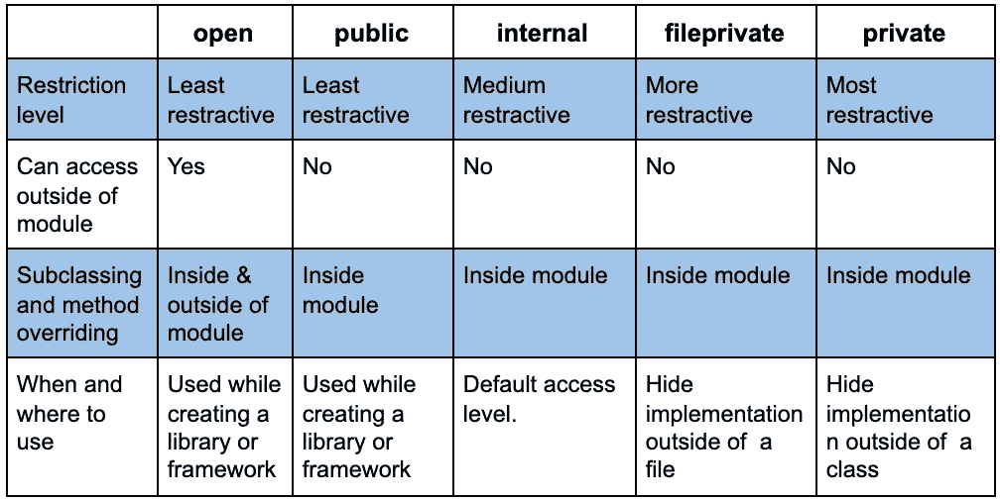

# Swift 中的访问控制

> 原文：<https://levelup.gitconnected.com/access-control-in-swift-98ad5901a358>

浅谈 Swift 编程语言中的不同访问控制。


图片由[马库斯·斯皮斯克](https://unsplash.com/@markusspiske)通过 [Unsplash](https://unsplash.com/) 拍摄

# 概观

根据 swift 官方文件

"*访问控制限制从其他源文件和模块中的代码访问您的部分代码。此功能使您能够隐藏代码的实现细节，并指定可以通过其访问和使用代码的首选接口。*

Swift 5 有五个访问控制。它们是开放的、公共的、内部的、文件私有的和私有的。这些访问控制是根据模块和源文件中的用途定义的。在本教程中，我们将学习在 swift 中使用访问控制的内容、位置和方式。

# 1.开放(限制较少)

用 open 定义的任何内容都可以在模块内部或外部访问。可以从任何地方访问开放访问级别的实体。这意味着一个开放的变量可以访问，一个开放的函数可以覆盖，一个开放的类可以是一个模块内部的子类，也可以是一个模块外部的子类。

一个例子是 UIKit 框架中的“ **UITableViewCell** ”类。通过导入 UIKit 模块，我们可以将任何类子类化为 UITableViewCell 类。如果你看到**“UITableViewCell”**的定义，你会在 UIKit 模块内部的类定义之前看到 open access control。这就是为什么我们可以通过导入 UIKit 将任何类子类化为 UITableViewCell 类。

```
@available(iOS 2.0, *)open class UITableViewCell : UIView, NSCoding, UIGestureRecognizerDelegate { }
```

# 2.公开(比公开更严格)

像开放访问一样，公共实体也可以在模块内部或外部访问。但是开放和公开之间有一个主要的区别。

> 公共类不能被子类化，公共方法不能在定义的模块之外被覆盖。必须在它们定义的模块内子类化或重写。

查看下面的例子

```
//module 1open class X{}
open func bar(){}public class Y{}
public func foo(){}//module 2class A: X{} // success
override func bar(){} // successclass B: Y{} //error
override func foo(){} // error
```

# 3.内部(模块级访问控制)

“内部”允许在已定义模块内的任何地方使用实体。**“内部”是默认的访问级别。**通常一个模块就是一个可以作为一个单元使用的框架或者 app。

在目标(模块)内部，所有的实体默认都是内部的(如果没有明确定义任何访问控制)。它被定义为模块内的任何东西都可以被模块内任何地方的任何人访问。

# 4.fileprivate(文件级访问控制)

文件私有实体只能在 swift 文件中访问。swift 文件可以有几个类或结构。swift 文件中的所有文件私有实体都可以被该文件中的所有类或结构访问。没有它们，该文件之外的任何其他类都不能访问它们。它通常对模块的其他源文件隐藏实现。

```
//**  ViewController.swift **//class ViewController: UIViewController {
    override func viewDidLoad() {
    super.viewDidLoad() let a = A()
    a.x()
    a.z() //errorlet b = B()
    b.Y() // error
  }
}class A {fileprivate func x(){
    print("Inside ViewController file")
  }
} //**  SecondViewController.swift **//class B{fileprivate func Y(){
    print("Outside ViewController file")
  }
}extension A{
    fileprivate func Z(){
    print("Outside ViewController file, extension of A")
  }
}
```

# 5.私有(类级访问控制)

private 是使用最多也最受限制的访问控制。私有实体只能在它们声明的类(包括扩展)中访问。它通常用于隐藏特定类之外的内部实现或功能。

```
// **  ViewController.swift **//class ViewController: UIViewController {
    override func viewDidLoad() {
    super.viewDidLoad()
    x()
    let a = A()
    a.Y() // error
  }
}extension ViewController{
    private func x(){
    print("Inside x")
  }
}class A {
    private func Y(){
    print("Inside Y")
  }
}
```

# swift 访问控制之间的差异

现在我们将以表格的形式看到基于不同参数的访问修饰符之间的区别



祝贺🎉 🎉 🎉我想现在您对 swift 编程语言中的访问控制有了一些了解。您可以在 swift 官方文档中找到关于它们的简短讨论。

**如果你觉得这篇文章有用，请分享并鼓掌**👏👏👏
在[媒体](https://medium.com/@arifulislam14)上查看我的其他文章，在 [LinkedIn](https://www.linkedin.com/in/arifparvez14/) 上联系我。

感谢您阅读&快乐编码🙂