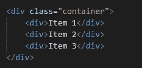
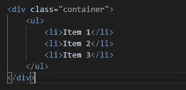

# 可访问性和语义 HTML

> 原文：<https://levelup.gitconnected.com/accessibility-and-semantic-html-9bd51d4517ec>

照片由[西格蒙德](https://unsplash.com/@sigmund?utm_source=medium&utm_medium=referral)在 [Unsplash](https://unsplash.com?utm_source=medium&utm_medium=referral) 拍摄

在这篇文章中，我们将探讨语义 HTML，它与可访问性的关系，以及它为什么重要。首先，我们从大问题开始。

# 什么是语义 HTML？

Springboardseo.com 将语义 HTML 或语义标记定义为“正确使用 HTML 来强化网页内容的意义，而不仅仅是定义其外观”。

Lifewire.com 给出了一个更简单的定义，语义 HTML 给网页引入了意义，而不仅仅是表现。

例如，`<h1>`表示包含的文本是一个标题。这是一个语义 HTML 标签的完美例子，因为它对人们有意义(任何听到单词 header 的人都知道它的意思)，浏览器也理解并知道如何呈现它。

语义 HTML 的其他例子包括:

*   —段落

*   —导航
*   —页脚
*   —文章
*   —表格

**非语义** HTML 的例子包括:

# 语义 HTML 和可访问性

它们是如何连接的？

首先，web 开发中的可访问性意味着为每个用户提供访问、导航和与您的网站交互的良好方式。这意味着它应该支持屏幕阅读器或任何种类的辅助设备。

这就是语义 HTML 的用武之地。语义 HTML 的使用使得这些辅助设备可以访问您的网站。像 JAWS 和 NVDA 这样的屏幕阅读器软件不仅能把文本转换成语音，还能使用你的 HTML 标签读出页面中的标题、列表中的项目，甚至为数据表提供导航控制。

# 为什么重要？

语义 HTML 的两个主要好处是可访问性和 SEO。其他包括维护、清晰度等。

## **SEO**

确保你的网页内容到达目标受众，这就是你需要 SEO 的原因。搜索引擎利用网络爬虫来索引网站的内容，以便这些网站可以出现在搜索结果中。现在，这些搜索引擎根据它们的 HTML 等级来评定关键词的重要性。这意味着标题标签中的关键字比段落标签中的关键字更重要。当内容被附加到正确的标签上时，它会保持清晰的体系结构和层次结构，并告诉这些爬虫网页中包含的信息类型。

当在搜索引擎上进行搜索时，搜索中的关键词与来自网络爬虫的结果交叉引用。然后，搜索引擎基于搜索中的关键字和 HTML 标签的层次结构中的重要性顺序来呈现网页。

## 易接近

这就是语义 HTML 的主要重要性。开发者有义务实践包容性，让每个潜在用户都能访问他们的网页。语义正确的 HTML 在用于访问该网页的任何技术上保留其含义，并允许辅助技术将页面信息翻译成可听语音或盲文。

## 清楚

这与维护密切相关。

语义 HTML 帮助我们写出清晰的代码。以使用

代替

*   标签为例。

这是非语义的

非语义的

这是语义上的

语义的

从这些你可以看到，在第一眼看到语义 HTML 的时候，它已经对你来说是清晰易懂的了。这就是维护的用武之地。

## 维护

清晰的代码更容易维护。尤其是在团队中工作或者从事将由另一个开发人员处理或维护的项目时。理解非语义的 HTML 代码要困难得多，这反过来增加了维护和缺陷跟踪的难度。

想了解更多关于语义 HTML 和可访问性的知识吗？查看 W3C(万维网联盟)关于可访问性、可用性和包容性的内容，W3C 是一个为 Web 开发开发开放标准的国际社区。

 [## 可访问性、可用性和包容性

### 在创建一个适合所有人的网站时，可访问性、可用性和包容性是密切相关的方面。他们的…

www.w3.org](https://www.w3.org/WAI/fundamentals/accessibility-usability-inclusion/) 

干杯。