# React 本地应用中的可访问性

> 原文：<https://levelup.gitconnected.com/accessibility-in-react-native-apps-f06d5469a453>

使用智能手机和笔记本电脑的开发人员

# 什么是可访问性？

首先，让我们看一下 MDN 关于 web 可访问性的定义:

> 当有人将一个网站描述为“可访问”时，他们的意思是任何用户都可以使用它的所有功能和内容，不管用户是如何访问 web 的——甚至特别是有身体或精神障碍的用户。

上面的定义可以很容易地推广到移动世界，我们可以这样认为:可访问的应用程序是以大多数用户能够使用的方式开发的，考虑到:盲人，没有受过教育，色盲和其他残疾。

> Accessibility 通常缩写为 a11y，这是因为在这个单词的首字母 a 和最后一个 y 之间有大量的字母。

我们来分析两种不同类型的 a11y。

# 适合视力正常的人

它是指开发一个可供视力正常的人使用的应用程序，并考虑以下方面:

*   应用程序内容不得溢出设备屏幕和/或被其剪切。
*   如果从操作系统增加或减少字体大小，应用程序应该仍然是可访问和可读的。

# 盲人专用 A11y

这是我从现在开始在这篇文章中要关注的问题。

它指的是需要一个**语音助手**才能使用该应用程序的视力残疾用户。在这种情况下，应用程序应该开发为指示用户点击的内容，并告诉他们有用的信息，例如，如果按钮被禁用，或者如果他们点击复选框或滑块。

统治移动世界的有两个语音助手:

**iOS** :其语音助手名为**画外音**，默认安装在操作系统中。

**Android** :这款语音工具名为 **TalkBack** ，默认安装在大多数搭载这款操作系统的设备上，但也有一些情况，比如老设备和 Android Emulator for developers，缺少助手。对于后者，在 Play Store 中搜索[“Android Accessibility Suite”](https://play.google.com/store/apps/details?id=com.google.android.marvin.talkback&hl=en&gl=US)即可轻松安装语音工具。

# 如何让一个 React 原生 app 对盲人无障碍？

为了实现这一点，有了官方 [**React 原生可访问 API**](https://reactnative.dev/docs/accessibility) 。

这个 API 为开发人员提供了不同的属性，使应用程序具有可访问性。一些最重要的例子如下:

## 易访问标签

分配给这个道具的字符串是当用户点击一个组件，如文本、按钮或视图时，语音助手将读取的字符串。

如果该属性未定义，其默认值将是组件子级中存在的每个字符串的串联。

**例 1**

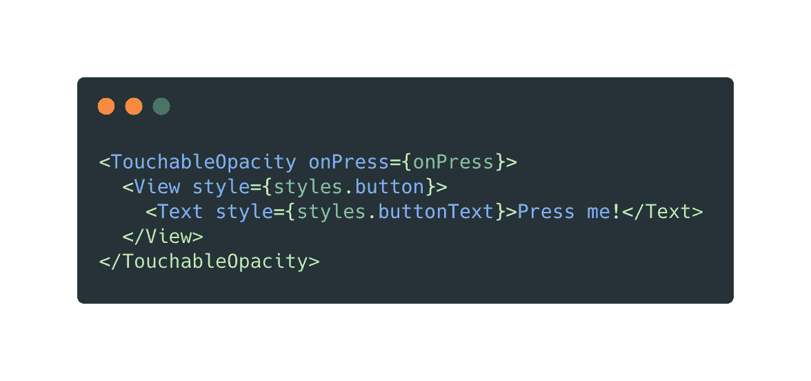

具有未定义的辅助功能标签和一个文本子级的按钮组件

在前面的例子中，当用户点击**<touchable opacity>**组件时，语音助手会读出**“按我！”**由于 **accessibilityLabel** 未定义，它唯一的子元素是 **<文本>** 组件，其值为**“按我！”**。

**重要提示:**当像**<touchable opacity>**这样的组件没有至少一个 **< Text >** 子项时，语音助手将不知道用户点击该按钮时要读什么，并且不会向用户再现任何声音。

**例 2**

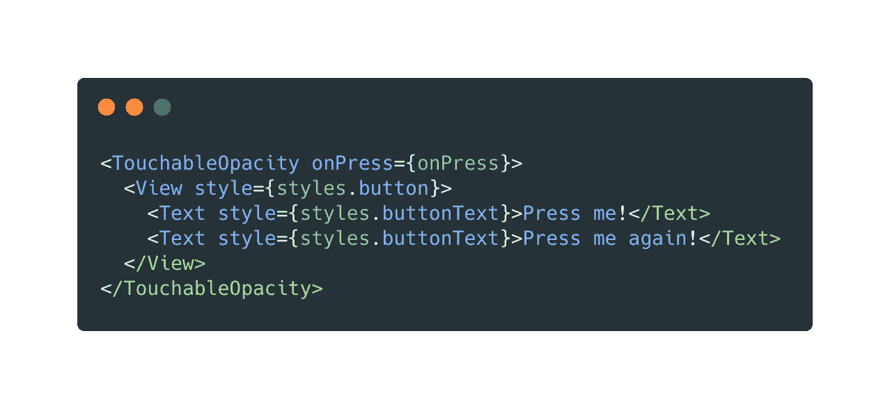

具有未定义的辅助功能标签和两个文本子级的按钮组件

当用户轻敲一个带有两个 **<文本>** 子的**<touchable opacity>**时，也会发生类似的情况:语音助手会读出**“按我！再压我！”**由于 **a11yLabel** 未定义。在这种情况下，React Native 所做的是连接它在父节点的子节点中找到的每个字符串，并将这个新值设置为组件 **a11yLabel** 。

**例 3**

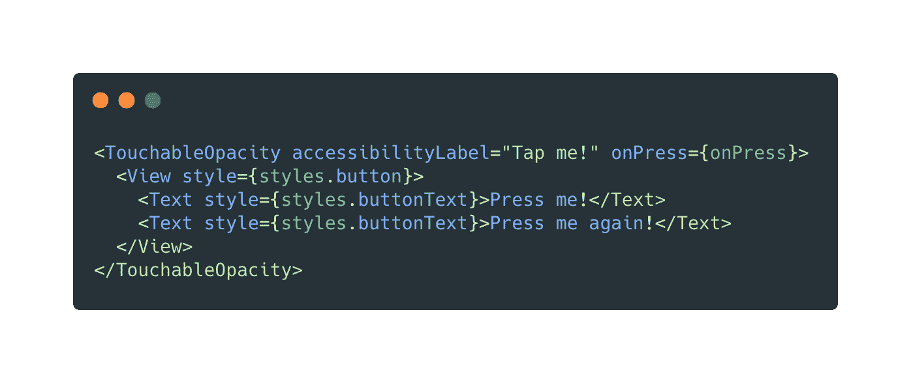

具有已定义的辅助功能标签和两个文本子级的按钮组件

在最后一个例子中，语音助手将读出**“点击我！”**当用户点击按钮时，因为 **a11yLabel** 被定义并以该字符串为其值。React Native 不会连接 **<文本>** 子代的值，因为其父代的 **a11yLabel** 没有被定义。

## 无障碍角色

这个道具告诉语音助手一个组件的用途(或角色)。默认情况下，没有设置这个属性，所以将正确的角色分配给需要的组件是开发人员的责任。

在我看来，需要定义角色的组件之一是按钮，以便语音助手可以告诉用户他们正在点击内容，双击可能会产生一个动作。

React Native API 提供的各种角色包括(查看其官方页面中的完整列表):

*   可调节的
*   警报
*   检验盒
*   按钮
*   环
*   页眉
*   搜索
*   文本

## 易访问性提示

这个属性提供了额外的信息来帮助用户理解当他们点击一个组件时会发生什么。a11yHint 通常用于按钮和链接，建议在非常特殊的情况下使用，在这种情况下，附加信息会给用户带来额外的价值。

TalkBack 和 VoiceOver 将始终按照以下顺序朗读 a11y props:

1.  易访问标签
2.  无障碍角色
3.  易访问性提示

例如，在下一个示例中，助手将读取“**赞。按钮。喜欢歌曲**:

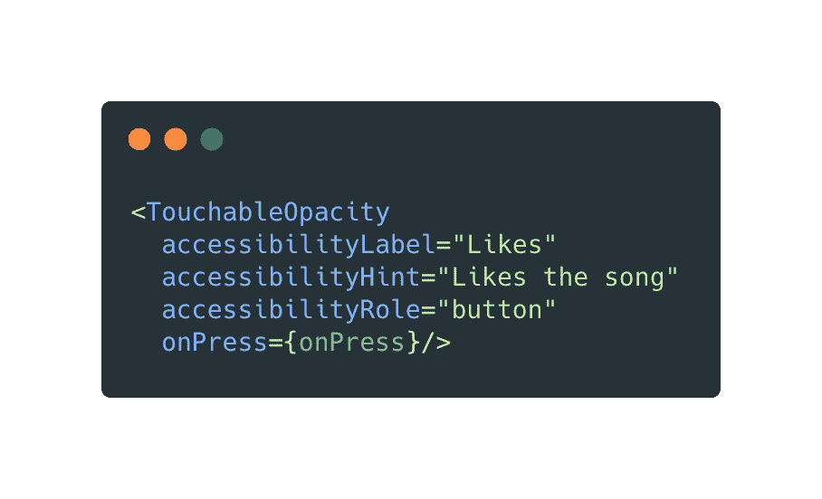

具有定义的可访问性标签、提示和角色的按钮组件

## 可访问性状态

这个属性有助于告诉助手组件的状态，可能是:

*   有缺陷的
*   挑选
*   检查
*   忙碌的
*   扩大

该属性需要一个带有前几个键的对象，这些键的值类型都是布尔值。

以我的经验来看，我发现这个道具在 iOS 设备上并不好用。在我需要告诉助手哪个州有组件的情况下，实现的变通方法是使用 a11yHint。

例如，对于禁用的按钮:

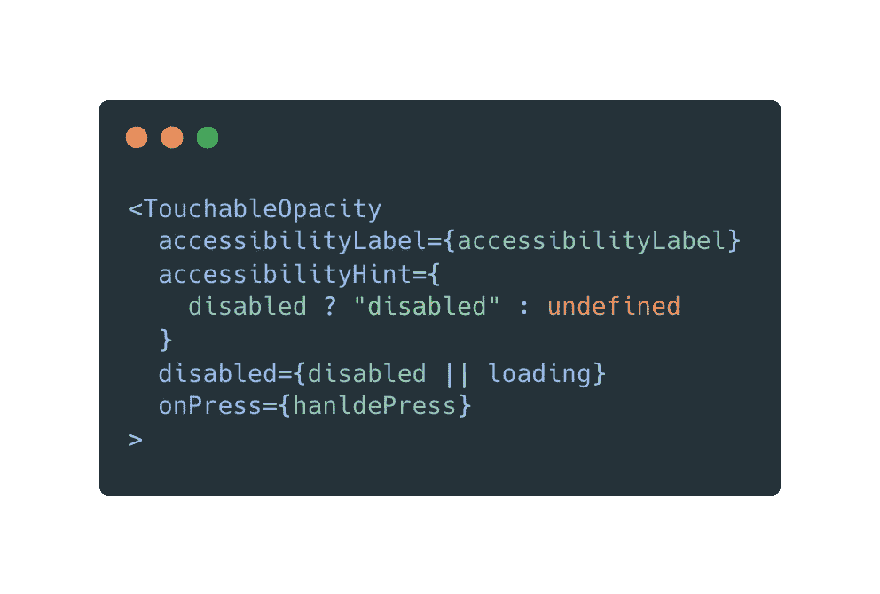

使用 a11yHint 代替 a11yState 的解决方法

当按钮收到值为 true 的属性 **disabled** 时，这段代码所做的是将字符串**“disabled”**赋给它的 a11yHint，以便告诉用户按钮的状态。

现在我们已经了解了什么是可访问性，查看了官方 React Native API 提供的一些属性和一些示例来理解它的用法，让我们深入了解如何在 iOS 和 Android 设备上测试 a11y。

# 在 iOS 设备上测试 a11y

## 物理设备

要在 iOS 设备上打开 VoiceOver，请前往**设置—辅助功能— VoiceOver** 。

一开始，要习惯 VoiceOver 的工作方式有点困难，因为手势与设备标准使用的手势截然不同。强烈推荐阅读 [**苹果官方指南**](https://support.apple.com/guide/iphone/learn-voiceover-gestures-iph3e2e2281/ios) 了解如何在开启 VoiceOver 的情况下使用你的设备。

## 模拟器设备

要测试 React 原生应用的可访问性，请打开 Xcode 并转到**打开开发者工具—可访问性检查器**。

这个工具真的很好用。打开辅助功能检查器后，单击目标图标，如下所示:

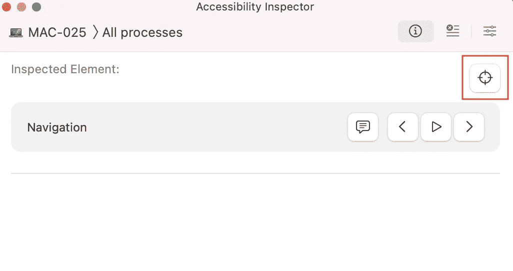

辅助功能检查器—目标图标

单击图标后，搜索仿真程序窗口，并选择所需的组件来检查其辅助功能属性。

让我们看一个带有可访问性标签、角色和提示集的组件示例:

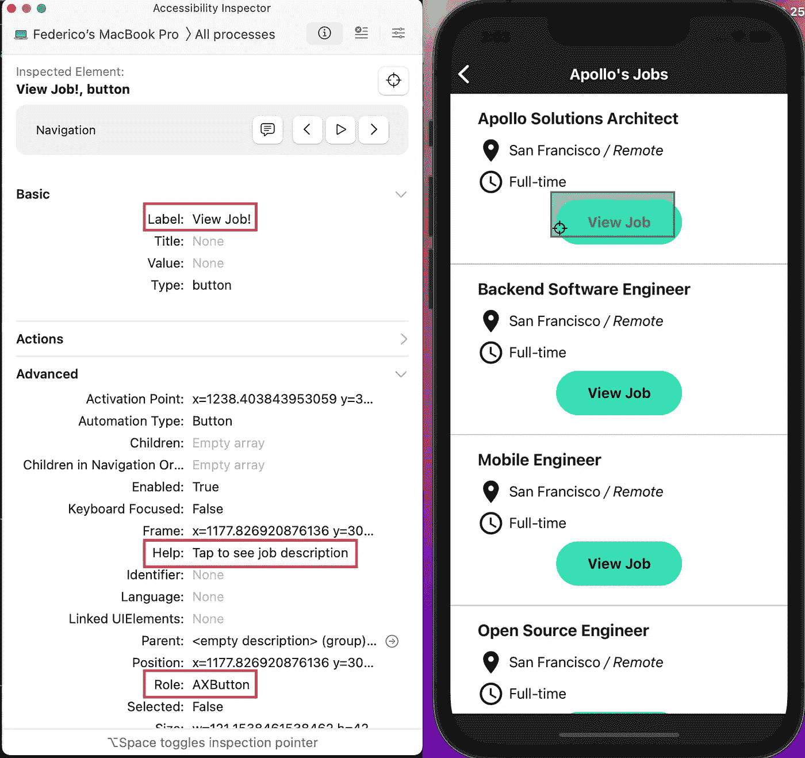

辅助功能标签、角色和提示(帮助)—辅助功能检查器

***注:*** *此选项仅在您有 Mac 电脑或笔记本电脑时才可用，因为 Xcode 不适用于 Linux 或 Windows 操作系统*

# 在 Android 设备上测试 a11y

## 物理设备

要在 android 物理设备上激活语音助手，请进入**设置—辅助功能—对讲—使用服务**。

考虑到对讲开启时手势会发生变化，建议在激活前阅读 [**安卓官方指南**](https://support.google.com/accessibility/android/answer/6283677?hl=en) 。

对于没有安装 Talkback 的设备，可以在 Play Store 搜索**“Android Accessibility Suite”**轻松下载。

## 模拟器设备

为了在 Android 模拟器上测试可访问性，有两种可能性:

*   通过应用程序 [**下载 talk back Android Accessibility Suite**](https://play.google.com/store/apps/details?id=com.google.android.marvin.talkback&hl=en&gl=US)(记住，你必须首先登录 gmail 用户)
*   从 Play Store 下载 app [**无障碍扫描仪**](https://play.google.com/store/apps/details?id=com.google.android.apps.accessibility.auditor&hl=en&gl=US) 。这个选项也适用于在 Android 物理设备上测试 a11y。

让我们简单看一下后者:

下载辅助功能扫描仪后，模拟器屏幕上将出现一个带有白色勾号的蓝色按钮:

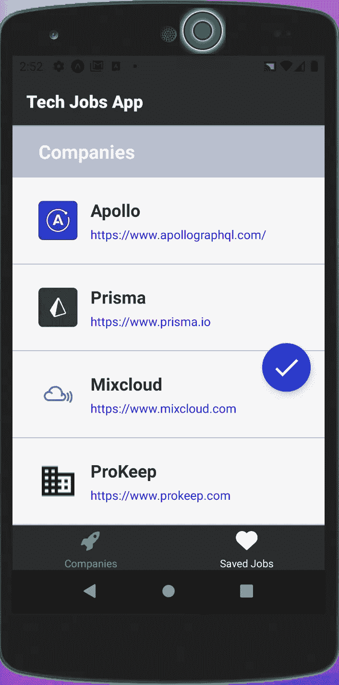

辅助功能扫描仪图标

如果你点击它:

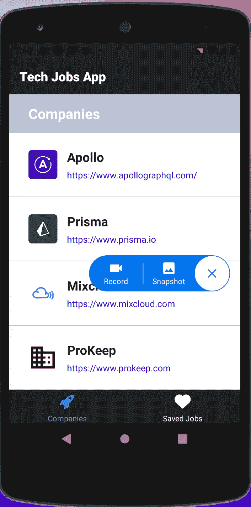

单击了辅助功能扫描仪图标

出现一个小菜单，可以:

*   对聚焦的屏幕应用程序拍摄一张**快照**。在这种情况下，会生成一个可访问性报告。
*   **记录**设备屏幕，以便您可以与您的应用程序进行交互，同时该工具会生成一份完整的报告，报告您浏览过的所有屏幕。

在这两种情况下，报告都会提出不同类型的建议，例如:

*   **项目标签:** accessibilityLabel 未定义
*   触摸目标:可点击的项目非常小
*   文本对比度:你应该提高文本和背景之间的对比度

让我们看一个快照报告的示例:

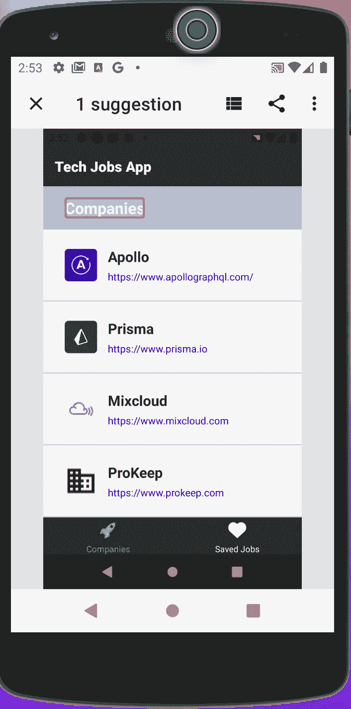

快照报告示例

本例中的报告告诉我们，我们可以应用一个建议来提高可访问性。

我们可以点击标有橙色矩形的字符串“公司”来打开建议:

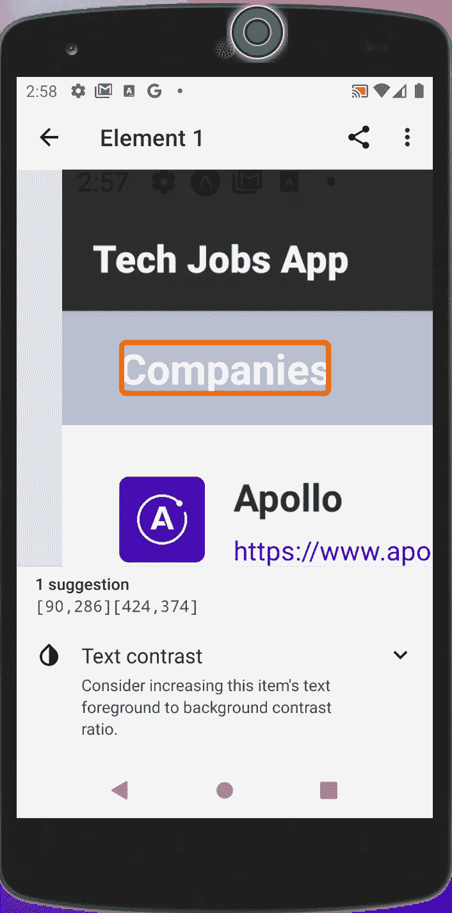

文本对比示例

在前面的例子中，应用程序建议更改应用于文本公司及其背景的颜色，以获得更好的对比度。

如果我们的应用程序中有小的可触摸图像或图标，但没有相应的 a11yLabel，测试扫描仪应用程序也会为我们提供改进这类事情的建议。

# 结论

得益于 React 原生可访问性 API，使 React 原生应用变得容易😁。

有不同的方法来测试一个应用程序是否可以从物理设备和模拟器上访问。

最后但同样重要的是，我认为**可访问性是我们的应用**的一个非常重要的方面**，如果我们不想排除有特定残疾的用户**，所以我鼓励你们开发者开始考虑这一点，让这个世界对每个人都更容易访问💪。

# 文献学

*   [MDN —可访问性](https://developer.mozilla.org/en-US/docs/Learn/Accessibility)
*   [React 原生可访问性 API](https://reactnative.dev/docs/accessibility)
*   [苹果 VoiceOver 官方指南](https://support.apple.com/guide/iphone/learn-voiceover-gestures-iph3e2e2281/ios)
*   [安卓无障碍套件](https://play.google.com/store/apps/details?id=com.google.android.marvin.talkback&hl=en&gl=US)
*   [安卓无障碍扫描仪](https://play.google.com/store/apps/details?id=com.google.android.apps.accessibility.auditor&hl=en&gl=US)